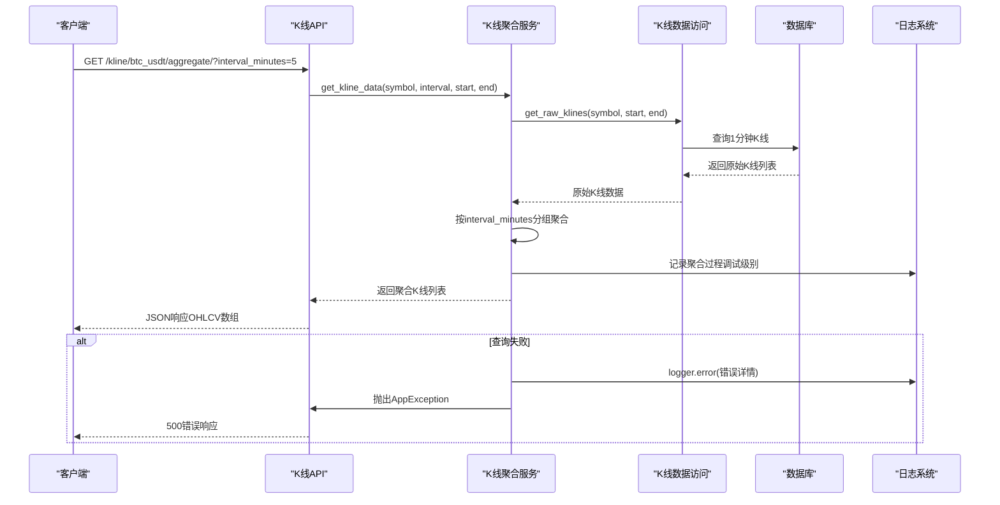
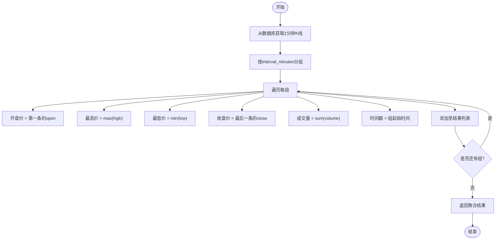
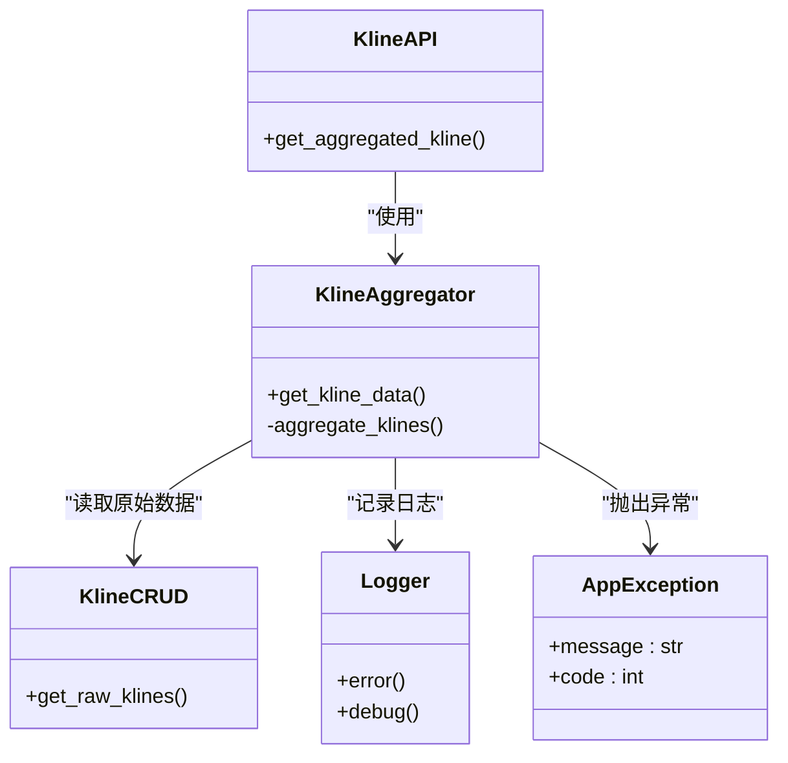

# 聚合K线API

<cite>
**本文档引用文件**  
- [kline.py](file://app/api/v1/endpoints/kline.py)
- [kline_aggregator.py](file://app/services/kline_aggregator.py)
- [kline.py](file://app/crud/kline.py)
- [kline.py](file://app/schemas/kline.py)
- [exceptions.py](file://app/core/exceptions.py)
- [logger.py](file://app/core/logger.py)
</cite>

## 目录
1. [简介](#简介)
2. [项目结构](#项目结构)
3. [核心组件](#核心组件)
4. [架构概览](#架构概览)
5. [详细组件分析](#详细组件分析)
6. [依赖分析](#依赖分析)
7. [性能考量](#性能考量)
8. [故障排查指南](#故障排查指南)
9. [结论](#结论)

## 简介
聚合K线API端点 `/kline/btc_usdt/aggregate/` 提供了灵活的K线数据聚合功能，支持任意分钟级粒度（1-1440分钟）的K线生成。该接口基于原始1分钟K线数据，通过服务层逻辑重新聚合为指定周期的K线，满足不同交易策略对时间分辨率的需求。本文档深入解析其参数设计、计算逻辑、数据结构、调用示例及性能优化建议。

## 项目结构
系统采用分层架构设计，API端点位于 `app/api/v1/endpoints/kline.py`，业务逻辑由 `app/services/kline_aggregator.py` 实现，数据访问通过 `app/crud/kline.py` 完成，数据模型定义于 `app/models/kline.py`，请求响应结构由 `app/schemas/kline.py` 规范。异常处理和日志记录分别由 `app/core/exceptions.py` 和 `app/core/logger.py` 统一管理。

```mermaid
graph TB
A["/kline/btc_usdt/aggregate/"] --> B[kline.py]
B --> C[kline_aggregator.py]
C --> D[kline.py (CRUD)]
D --> E[(数据库)]
C --> F[logger.py]
C --> G[exceptions.py]
```

**Diagram sources**  
- [kline.py](file://app/api/v1/endpoints/kline.py)
- [kline_aggregator.py](file://app/services/kline_aggregator.py)
- [kline.py](file://app/crud/kline.py)

**Section sources**  
- [kline.py](file://app/api/v1/endpoints/kline.py)
- [kline_aggregator.py](file://app/services/kline_aggregator.py)

## 核心组件
聚合K线功能的核心在于 `get_kline_data` 服务方法，该方法接收基础参数并协调数据读取与聚合流程。`interval_minutes` 参数控制聚合粒度，`start_time` 与 `end_time` 以毫秒级时间戳定义查询范围，默认返回最近24小时数据。响应体包含聚合后的开盘价、最高价、最低价、收盘价及成交量。

**Section sources**  
- [kline_aggregator.py](file://app/services/kline_aggregator.py#L15-L80)
- [kline.py](file://app/schemas/kline.py#L10-L40)

## 架构概览
整个数据处理链路由API路由触发，经由依赖注入获取服务实例，调用 `get_kline_data` 方法执行聚合逻辑。该方法首先从数据库读取原始1分钟K线，然后按 `interval_minutes` 分组重新计算各聚合段的OHLCV值。错误情况下抛出 `AppException` 并由全局异常处理器捕获，同时记录详细日志用于调试。



**Diagram sources**  
- [kline.py](file://app/api/v1/endpoints/kline.py#L20-L60)
- [kline_aggregator.py](file://app/services/kline_aggregator.py#L30-L120)
- [kline.py](file://app/crud/kline.py#L15-L50)
- [logger.py](file://app/core/logger.py#L5-L20)
- [exceptions.py](file://app/core/exceptions.py#L10-L30)

## 详细组件分析

### 聚合算法实现逻辑
聚合过程分为两步：首先通过 `crud.kline.get_raw_klines` 从数据库读取指定时间范围内的1分钟K线数据；随后在 `services.kline_aggregator` 中按 `interval_minutes` 将连续的分钟数据分组，每组生成一条新的K线。开盘价取组内第一条记录的开盘价，最高价为组内最大值，最低价为最小值，收盘价为组内最后一条记录的收盘价，成交量为组内所有记录成交量之和。

#### 聚合逻辑流程图


**Diagram sources**  
- [kline_aggregator.py](file://app/services/kline_aggregator.py#L45-L110)
- [kline.py](file://app/crud/kline.py#L20-L40)

**Section sources**  
- [kline_aggregator.py](file://app/services/kline_aggregator.py#L1-L150)
- [kline.py](file://app/crud/kline.py#L1-L60)

### 响应数据结构
响应为K线对象数组，每个对象包含以下字段：
- `timestamp`: 聚合周期起始时间（毫秒级时间戳）
- `open`: 开盘价（float）
- `high`: 最高价（float）
- `low`: 最低价（float）
- `close`: 收盘价（float）
- `volume`: 成交量（float）

该结构由 `schemas.kline.KlineResponse` 定义，确保前后端数据一致性。

**Section sources**  
- [kline.py](file://app/schemas/kline.py#L5-L35)

## 依赖分析
聚合K线功能依赖多个核心模块：API层依赖服务层 `kline_aggregator`，服务层依赖数据访问层 `crud.kline`，所有异常统一通过 `AppException` 封装并由 `logger.error` 记录。数据库查询性能直接影响接口响应速度，因此合理控制时间范围至关重要。



**Diagram sources**  
- [kline.py](file://app/api/v1/endpoints/kline.py#L10-L50)
- [kline_aggregator.py](file://app/services/kline_aggregator.py#L10-L20)
- [kline.py](file://app/crud/kline.py#L10-L20)
- [exceptions.py](file://app/core/exceptions.py#L1-L15)
- [logger.py](file://app/core/logger.py#L1-L10)

**Section sources**  
- [kline.py](file://app/api/v1/endpoints/kline.py#L1-L100)
- [kline_aggregator.py](file://app/services/kline_aggregator.py#L1-L150)

## 性能考量
由于聚合操作需加载大量原始K线数据，过长的时间范围可能导致内存占用过高和响应延迟。建议单次请求时间跨度不超过7天，对于长期数据需求，应采用分页或分段查询。数据库层面已对时间戳字段建立索引以加速查询，但仍需避免全表扫描。

**Section sources**  
- [performance_recommendations.md](file://performance_recommendations.md#L1-L20)
- [database_optimization.sql](file://database_optimization.sql#L5-L15)

## 故障排查指南
当接口返回500错误时，应检查服务日志中 `logger.error` 输出的堆栈信息。常见问题包括数据库连接失败、时间参数格式错误或聚合逻辑异常。`AppException` 的封装确保了错误信息的结构化输出，便于前端解析和用户提示。调试时可启用详细日志查看每一步执行情况。

**Section sources**  
- [exceptions.py](file://app/core/exceptions.py#L10-L50)
- [logger.py](file://app/core/logger.py#L15-L40)
- [kline_aggregator.py](file://app/services/kline_aggregator.py#L100-L130)

## 结论
`/kline/btc_usdt/aggregate/` 端点提供了高度灵活的K线聚合能力，通过清晰的分层架构和稳健的错误处理机制保障了服务的可靠性。合理使用该接口可有效支持多时间框架分析，但需注意时间范围控制以维持系统性能。未来可考虑引入缓存机制进一步提升高频访问场景下的响应速度。