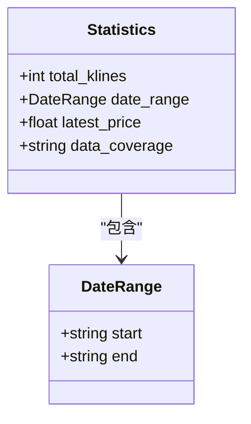
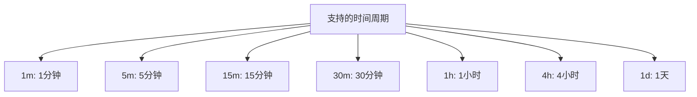
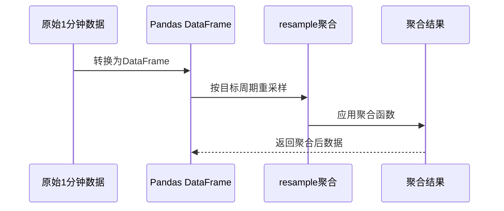
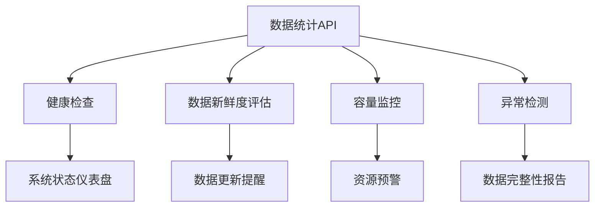

# 数据统计信息查询

<cite>
**本文档引用文件**  
- [kline_simple.py](file://app/api/v1/endpoints/kline_simple.py)
- [kline_aggregator.py](file://app/services/kline_aggregator.py)
- [kline.py](file://app/schemas/kline.py)
- [README.md](file://README.md)
</cite>

## 目录
1. [简介](#简介)
2. [端点功能说明](#端点功能说明)
3. [响应结构详解](#响应结构详解)
4. [statistics对象分析](#statistics对象分析)
5. [supported_timeframes字段说明](#supported_timeframes字段说明)
6. [aggregation_info技术细节](#aggregation_info技术细节)
7. [实际响应示例](#实际响应示例)
8. [应用场景](#应用场景)
9. [系统监控用途](#系统监控用途)

## 简介
`/simple/stats` 是交易系统中的核心数据统计API端点，用于获取数据库中K线数据的完整统计摘要。该接口为系统监控、数据完整性验证和容量规划提供关键信息，帮助用户了解当前数据状态并做出相应决策。

**Section sources**
- [README.md](file://README.md#L184-L206)
- [kline_simple.py](file://app/api/v1/endpoints/kline_simple.py#L205-L240)

## 端点功能说明
`GET /api/v1/simple/stats` 接口返回数据库中BTC/USDT交易对K线数据的统计信息。该端点的主要功能包括：

- 统计数据库中存储的K线数据总量
- 提供数据的时间覆盖范围（最早和最晚时间）
- 显示最新收盘价
- 列出系统支持的所有时间周期
- 描述数据聚合方法和技术细节

此接口是系统健康检查的重要组成部分，常与 `/health` 端点配合使用来评估系统状态。

**Section sources**
- [kline_simple.py](file://app/api/v1/endpoints/kline_simple.py#L205-L240)

## 响应结构详解
该API返回标准化的成功响应格式，包含以下主要字段：

```json
{
  "code": 200,
  "message": "success",
  "data": {
    "statistics": { /* 统计信息 */ },
    "supported_timeframes": [ /* 支持的时间周期 */ ],
    "aggregation_info": { /* 聚合信息 */ }
  }
}
```

其中 `data` 对象包含三个核心部分：`statistics`（统计摘要）、`supported_timeframes`（支持的时间周期列表）和 `aggregation_info`（聚合方法详情）。

**Section sources**
- [kline_simple.py](file://app/api/v1/endpoints/kline_simple.py#L205-L240)

## statistics对象分析
`statistics` 对象提供数据库中K线数据的详细统计信息，其结构如下：



**Diagram sources**
- [kline_aggregator.py](file://app/services/kline_aggregator.py#L232-L250)

### 字段说明
- **total_klines**: 数据库中1分钟K线记录的总数
- **date_range**: 数据的时间范围，包含 `start`（最早数据时间）和 `end`（最新数据时间）
- **latest_price**: 最新K线的收盘价
- **data_coverage**: 数据覆盖时长的人性化描述（如"7.5天"）

当数据库为空时，`total_klines` 为0，`date_range` 为null，`latest_price` 为null。

**Section sources**
- [kline_aggregator.py](file://app/services/kline_aggregator.py#L232-L250)

## supported_timeframes字段说明
`supported_timeframes` 字段返回系统支持的所有时间周期列表，当前支持以下周期：



这些时间周期均基于1分钟原始K线数据通过聚合生成。系统通过 `KlineAggregator.get_available_timeframes()` 方法动态获取支持的周期列表。

**Section sources**
- [kline_simple.py](file://app/api/v1/endpoints/kline_simple.py#L175-L207)
- [kline_aggregator.py](file://app/services/kline_aggregator.py#L198-L236)

## aggregation_info技术细节
`aggregation_info` 对象详细描述了数据聚合的技术实现：

```json
{
  "source": "1分钟K线数据",
  "method": "pandas.resample聚合",
  "supported_operations": [
    "开盘价(first)",
    "最高价(max)",
    "最低价(min)",
    "收盘价(last)",
    "成交量(sum)"
  ]
}
```

### 聚合方法
系统使用 `pandas.resample` 方法将1分钟K线数据聚合为更长周期。具体操作如下：



**Diagram sources**
- [kline_aggregator.py](file://app/services/kline_aggregator.py#L198-L236)

### 聚合规则
| 字段 | 聚合方法 | 说明 |
|------|----------|------|
| 开盘价 | first | 使用周期内第一条K线的开盘价 |
| 最高价 | max | 取周期内所有K线最高价的最大值 |
| 最低价 | min | 取周期内所有K线最低价的最小值 |
| 收盘价 | last | 使用周期内最后一条K线的收盘价 |
| 成交量 | sum | 对周期内所有K线的成交量求和 |

**Section sources**
- [kline_aggregator.py](file://app/services/kline_aggregator.py#L198-L236)

## 实际响应示例
```json
{
  "code": 200,
  "message": "success",
  "data": {
    "statistics": {
      "total_klines": 10800,
      "date_range": {
        "start": "2024-01-01T00:00:00",
        "end": "2024-01-08T00:00:00"
      },
      "latest_price": 43520.5,
      "data_coverage": "7.5 天"
    },
    "supported_timeframes": ["1m", "5m", "15m", "30m", "1h", "4h", "1d"],
    "aggregation_info": {
      "source": "1分钟K线数据",
      "method": "pandas.resample聚合",
      "supported_operations": [
        "开盘价(first)",
        "最高价(max)",
        "最低价(min)",
        "收盘价(last)",
        "成交量(sum)"
      ]
    }
  }
}
```

**Section sources**
- [kline_simple.py](file://app/api/v1/endpoints/kline_simple.py#L205-L240)

## 应用场景
### 数据完整性评估
通过 `total_klines` 和 `data_coverage` 字段，可以评估数据完整性：
- 计算理论应有数据量（如7.5天应有10800条1分钟K线）
- 与实际 `total_klines` 比较，判断是否存在数据缺失
- 监控数据采集的连续性

### 容量规划


基于当前数据量和覆盖时间，可以进行：
- 存储容量规划
- 数据库性能优化
- 备份策略制定
- 查询性能预估

**Section sources**
- [kline_aggregator.py](file://app/services/kline_aggregator.py#L232-L250)

## 系统监控用途
该API在系统监控中扮演重要角色：



**Diagram sources**
- [kline_simple.py](file://app/api/v1/endpoints/kline_simple.py#L237-L259)

结合 `/health` 端点，可以实现：
- 自动化健康检查
- 数据新鲜度评估（通过 `latest_price` 时间戳）
- 容量预警
- 数据完整性监控

**Section sources**
- [kline_simple.py](file://app/api/v1/endpoints/kline_simple.py#L237-L259)