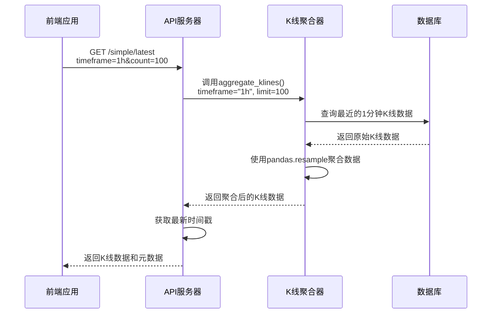
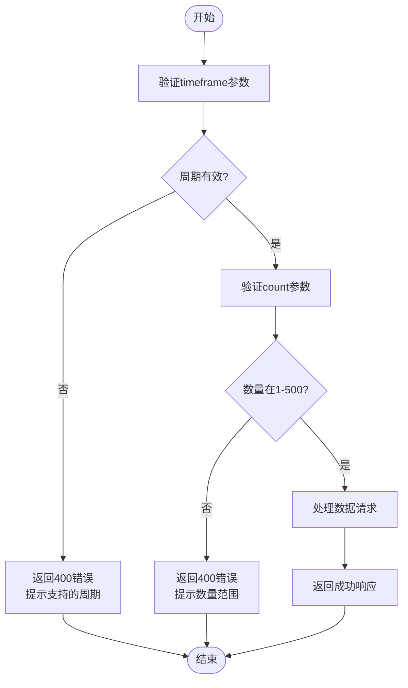
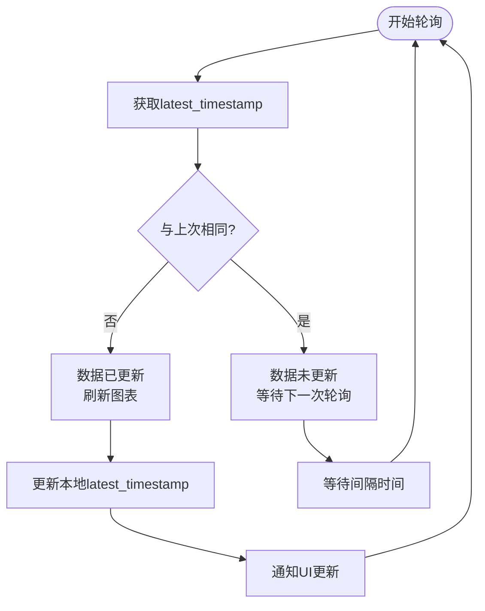

# 最新K线数据获取

<cite>
**本文档引用的文件**
- [kline_simple.py](file://app/api/v1/endpoints/kline_simple.py)
- [kline_aggregator.py](file://app/services/kline_aggregator.py)
- [api.js](file://frontend/src/lib/api.js)
</cite>

## 目录
1. [简介](#简介)
2. [API端点说明](#api端点说明)
3. [参数验证规则](#参数验证规则)
4. [响应数据结构](#响应数据结构)
5. [实时性判断机制](#实时性判断机制)
6. [前端轮询实现示例](#前端轮询实现示例)

## 简介
本API端点`/simple/latest`专用于获取指定周期的最新K线数据，适用于实时行情展示场景。系统通过聚合1分钟原始K线数据生成不同时间周期的K线，并提供完整的元数据信息来支持实时性判断和数据更新。

**Section sources**
- [kline_simple.py](file://app/api/v1/endpoints/kline_simple.py#L105-L145)

## API端点说明
`/simple/latest`端点提供了一种高效获取最新K线数据的方式，特别适合用于实时图表展示和行情监控。

### 基本信息
- **HTTP方法**: GET
- **路径**: `/api/v1/simple/latest`
- **用途**: 获取指定周期的最新K线数据
- **适用场景**: 实时行情展示、动态图表更新、交易监控

### 功能特点
- 自动将1分钟原始K线聚合为目标时间周期
- 支持多种时间周期选择
- 提供完整的元数据信息用于实时性判断
- 优化的查询性能，适合高频轮询



**Diagram sources**
- [kline_simple.py](file://app/api/v1/endpoints/kline_simple.py#L105-L145)
- [kline_aggregator.py](file://app/services/kline_aggregator.py#L232-L250)

**Section sources**
- [kline_simple.py](file://app/api/v1/endpoints/kline_simple.py#L105-L145)
- [kline_aggregator.py](file://app/services/kline_aggregator.py#L232-L250)

## 参数验证规则
该API端点对输入参数进行严格的验证，确保数据请求的合法性和安全性。

### timeframe参数验证
- **支持的周期**: 1m, 5m, 15m, 30m, 1h, 4h, 1d
- **验证逻辑**: 
  - 检查时间周期是否在支持列表中
  - 如果不支持，返回400错误并提示可用周期
- **默认值**: 1h

### count参数限制
- **范围**: 1-500
- **最小值**: 1（必须至少请求1条数据）
- **最大值**: 500（防止过度请求影响性能）
- **默认值**: 100



**Diagram sources**
- [kline_simple.py](file://app/api/v1/endpoints/kline_simple.py#L105-L145)

**Section sources**
- [kline_simple.py](file://app/api/v1/endpoints/kline_simple.py#L105-L145)

## 响应数据结构
API返回标准化的响应格式，包含K线数据和详细的元数据信息。

### 响应格式
```json
{
  "success": true,
  "data": {
    "klines": [...],
    "metadata": {
      "count": 100,
      "timeframe": "1h",
      "is_latest": true,
      "latest_timestamp": 1700000000000,
      "last_update": "2023-11-15T10:00:00"
    }
  }
}
```

### 元数据字段说明
| 字段名 | 类型 | 说明 |
|-------|------|------|
| count | 整数 | 返回的K线数据条数 |
| timeframe | 字符串 | 请求的时间周期 |
| is_latest | 布尔值 | 是否为最新数据（始终为true） |
| latest_timestamp | 整数 | 数据库中最新的K线时间戳（毫秒） |
| last_update | 字符串 | 最新数据的更新时间（ISO格式） |

**Section sources**
- [kline_simple.py](file://app/api/v1/endpoints/kline_simple.py#L142-L176)

## 实时性判断机制
通过响应中的特定字段，客户端可以准确判断数据的实时性和新鲜度。

### 关键字段用途
- **is_latest**: 标识这是最新数据查询端点，结果始终为`true`
- **latest_timestamp**: 数据库中最新的K线记录时间戳，用于判断数据是否已更新
- **last_update**: 可读的更新时间，便于调试和日志记录

### 实时性判断流程
1. 记录上次请求的`latest_timestamp`
2. 下次请求后比较新的`latest_timestamp`
3. 如果时间戳更新，说明有新数据
4. 如果时间戳未变，说明数据未更新



**Diagram sources**
- [kline_simple.py](file://app/api/v1/endpoints/kline_simple.py#L142-L176)
- [kline_aggregator.py](file://app/services/kline_aggregator.py#L198-L236)

**Section sources**
- [kline_simple.py](file://app/api/v1/endpoints/kline_simple.py#L142-L176)
- [kline_aggregator.py](file://app/services/kline_aggregator.py#L198-L236)

## 前端轮询实现示例
以下是在前端实现动态更新的代码示例，展示如何使用该API端点进行轮询。

### JavaScript实现
```javascript
// 获取最新K线数据
export async function getLatestKlines(timeframe = '1h', count = 100) {
    return await get('/simple/latest', {
        timeframe,
        count
    });
}

// 轮询管理器
class KlinePoller {
    constructor(timeframe = '1h', interval = 30000) {
        this.timeframe = timeframe;
        this.interval = interval;
        this.lastTimestamp = null;
        this.polling = false;
        this.callbacks = [];
    }

    async start() {
        this.polling = true;
        while (this.polling) {
            try {
                const data = await getLatestKlines(this.timeframe);
                const currentTimestamp = data.data.metadata.latest_timestamp;

                // 检查数据是否更新
                if (currentTimestamp !== this.lastTimestamp) {
                    this.lastTimestamp = currentTimestamp;
                    this.notifyUpdate(data);
                }
            } catch (error) {
                console.error('轮询失败:', error);
            }

            // 等待指定间隔
            await this.delay(this.interval);
        }
    }

    stop() {
        this.polling = false;
    }

    onUpdate(callback) {
        this.callbacks.push(callback);
    }

    notifyUpdate(data) {
        this.callbacks.forEach(cb => cb(data));
    }

    delay(ms) {
        return new Promise(resolve => setTimeout(resolve, ms));
    }
}
```

### 使用示例
```javascript
// 创建轮询器实例
const poller = new KlinePoller('1h', 30000); // 每30秒轮询一次

// 注册更新回调
poller.onUpdate(data => {
    console.log('收到新数据:', data.data.metadata.last_update);
    // 更新图表
    updateChart(data.data.klines);
});

// 开始轮询
poller.start();

// 停止轮询（在组件销毁时）
// poller.stop();
```

### 缓存策略
前端实现中采用了智能缓存策略：
- **实时数据缓存**: 30秒（用于最新数据轮询）
- **历史数据缓存**: 5分钟（用于时间范围查询）
- **静态数据缓存**: 30分钟（用于支持的时间周期等）

**Section sources**
- [api.js](file://frontend/src/lib/api.js#L132-L176)
- [api.js](file://frontend/src/lib/api.js#L472-L517)