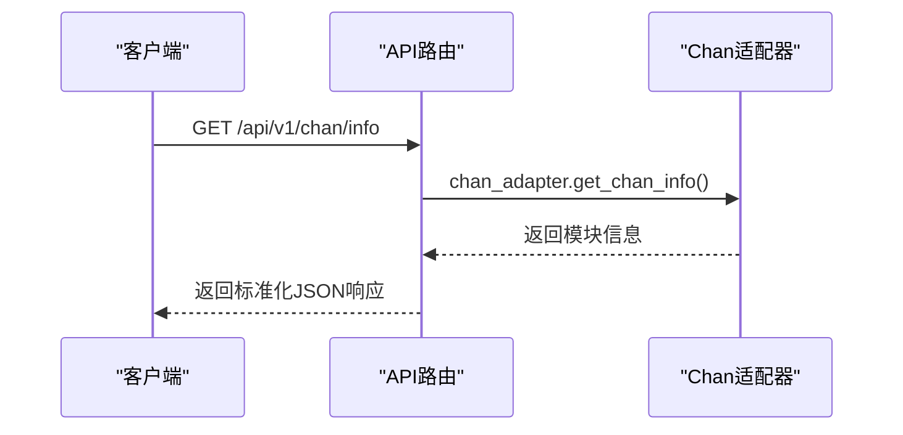
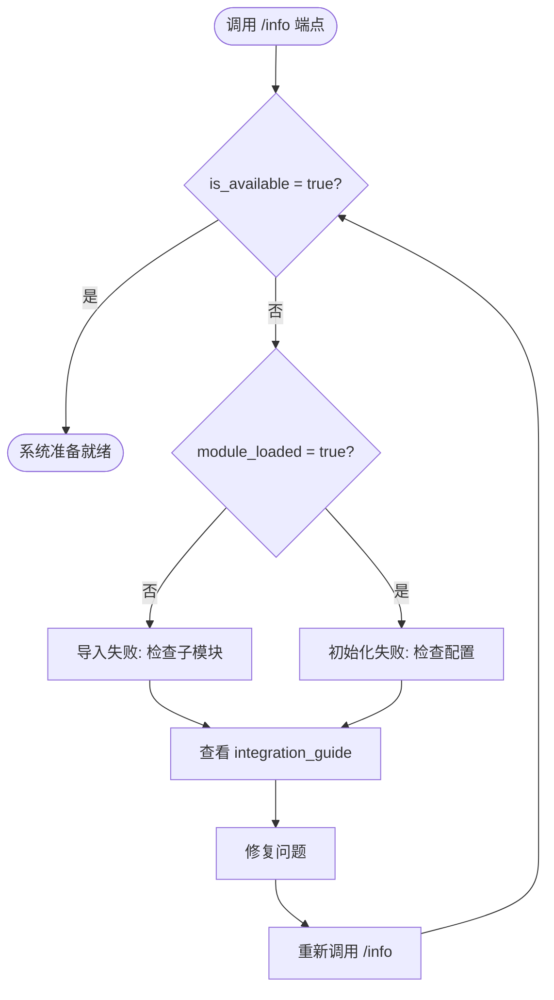

# 模块信息端点 (/info)

<cite>
**本文档中引用的文件**  
- [chan_analysis.py](file://app/api/v1/endpoints/chan_analysis.py)
- [chan_adapter.py](file://app/services/chan_adapter.py)
- [exceptions.py](file://app/core/exceptions.py)
- [test_chan_integration.py](file://test_chan_integration.py)
</cite>

## 目录
1. [简介](#简介)
2. [端点详情](#端点详情)
3. [响应结构](#响应结构)
4. [数据流与功能说明](#数据流与功能说明)
5. [使用场景与诊断价值](#使用场景与诊断价值)
6. [请求示例](#请求示例)
7. [Python解析示例](#python解析示例)
8. [故障排查指南](#故障排查指南)

## 简介
`/api/v1/chan/info` 是缠论分析系统的核心诊断端点，用于获取 **Chan模块** 的运行状态、集成配置和功能支持列表。该端点为开发者提供系统健康检查和调试能力，帮助确认缠论模块是否正确加载、可用，并了解其当前分析能力。

此端点不依赖实时市场数据，主要用于系统部署、集成验证和运维监控，是确保缠论分析服务正常工作的第一步。

**Section sources**
- [chan_analysis.py](file://app/api/v1/endpoints/chan_analysis.py#L0-L38)
- [test_chan_integration.py](file://test_chan_integration.py#L250-L275)

## 端点详情
- **HTTP方法**: `GET`
- **完整URL路径**: `/api/v1/chan/info`
- **功能**: 获取Chan模块的详细信息和系统集成状态。
- **认证**: 无需认证（用于系统诊断）
- **超时**: 建议设置5秒超时

该端点通过 `chan_adapter` 服务获取模块状态，并返回一个包含模块可用性、版本、支持功能和系统集成流程的丰富JSON响应。



**Diagram sources**
- [chan_analysis.py](file://app/api/v1/endpoints/chan_analysis.py#L0-L38)
- [chan_adapter.py](file://app/services/chan_adapter.py#L488-L516)

## 响应结构
响应遵循统一的成功响应格式，包含 `success`、`code`、`message` 和 `data` 字段。

### JSON Schema 示例
```json
{
  "success": true,
  "code": 0,
  "message": "success",
  "data": {
    "chan_module": {
      "is_available": true,
      "module_loaded": true,
      "version": "1.0.0",
      "supported_features": ["fenxing", "bi", "xianduan"],
      "status": "ready",
      "integration_guide": {
        "step1": "确保chan.py子模块已初始化: git submodule update --init",
        "step2": "检查chan.py模块的API接口",
        "step3": "根据实际API调整chan_adapter.py中的导入和调用",
        "step4": "运行test_chan_integration.py测试集成"
      }
    },
    "system_info": {
      "integration_status": "ready",
      "data_flow": [
        "1. 获取K线数据 (kline_aggregator)",
        "2. 调用Chan模块分析 (chan_adapter)",
        "3. 标准化结果格式",
        "4. 返回缠论分析结果"
      ],
      "supported_analysis": [
        "分型识别 (顶分型、底分型)",
        "笔的构建 (上涨笔、下跌笔)",
        "线段分析",
        "买卖点识别",
        "趋势方向判断"
      ]
    }
  }
}
```

**Section sources**
- [exceptions.py](file://app/core/exceptions.py#L100-L110)
- [chan_analysis.py](file://app/api/v1/endpoints/chan_analysis.py#L0-L38)

## 数据流与功能说明
`/info` 端点返回的信息揭示了系统从数据获取到分析输出的完整流程。

### 系统数据流
`system_info.data_flow` 数组描述了缠论分析的四个核心步骤：
1. **获取K线数据**: 由 `kline_aggregator` 服务从数据库聚合指定周期的K线。
2. **调用Chan模块分析**: `chan_adapter` 调用外部 `chan.py` 模块执行缠论算法。
3. **标准化结果格式**: 将 `chan.py` 的原始输出转换为系统内部统一的数据结构。
4. **返回缠论分析结果**: 通过API将标准化结果返回给前端或调用方。

### 支持的分析功能
`system_info.supported_analysis` 列出了系统当前能够执行的所有缠论分析类型，包括：
- **分型识别**: 自动检测顶分型和底分型。
- **笔的构建**: 基于分型连接形成上涨笔和下跌笔。
- **线段分析**: 识别由多笔构成的线段，判断趋势延续。
- **买卖点识别**: 根据缠论理论识别潜在的买卖信号。
- **趋势方向判断**: 综合分析结果判断当前市场趋势。

**Section sources**
- [chan_analysis.py](file://app/api/v1/endpoints/chan_analysis.py#L0-L38)
- [chan_adapter.py](file://app/services/chan_adapter.py#L488-L516)

## 使用场景与诊断价值
该端点主要用于以下场景：

### 部署与集成验证
在系统部署后，首先调用此端点，检查 `chan_module.is_available` 是否为 `true`。如果为 `false`，则需根据 `integration_guide` 的步骤进行排查。

### 运维健康检查
可作为 `/health` 端点的补充，提供更详细的模块级健康信息。自动化脚本可定期调用此端点，监控 `chan.py` 模块的加载状态。

### 开发者调试
当缠论分析功能异常时，开发者可通过此端点快速判断问题是出在模块集成（`is_available=false`）还是数据处理流程。



**Diagram sources**
- [chan_analysis.py](file://app/api/v1/endpoints/chan_analysis.py#L0-L38)
- [test_chan_integration.py](file://test_chan_integration.py#L81-L116)

## 请求示例
使用 `curl` 命令调用该端点：

```bash
curl -X GET "http://localhost:8000/api/v1/chan/info" \
     -H "accept: application/json"
```

**Section sources**
- [test_chan_integration.py](file://test_chan_integration.py#L250-L275)

## Python解析示例
以下Python代码展示了如何请求并解析 `/info` 端点的响应，可用于部署脚本或管理界面：

```python
import requests

def check_chan_module_status():
    url = "http://localhost:8000/api/v1/chan/info"
    try:
        response = requests.get(url, timeout=5)
        response.raise_for_status()
        data = response.json()

        if data.get("success"):
            chan_info = data["data"]["chan_module"]
            system_info = data["data"]["system_info"]

            print(f"✅ Chan模块状态: {chan_info['status']}")
            print(f"   可用性: {chan_info['is_available']}")
            print(f"   版本: {chan_info.get('version', '未知')}")
            print(f"   集成状态: {system_info['integration_status']}")

            if not chan_info['is_available']:
                print("❌ 模块不可用，请检查集成指南:")
                for step, desc in chan_info['integration_guide'].items():
                    print(f"   {step}: {desc}")
            else:
                print("✅ 模块已就绪，支持以下分析:")
                for analysis in system_info['supported_analysis']:
                    print(f"   - {analysis}")
        else:
            print(f"❌ 请求失败: {data.get('message')}")
    except requests.exceptions.RequestException as e:
        print(f"❌ 网络请求失败: {e}")

# 调用函数
check_chan_module_status()
```

**Section sources**
- [test_chan_integration.py](file://test_chan_integration.py#L250-L275)

## 故障排查指南
当 `is_available` 为 `false` 时，按以下步骤排查：

1. **检查子模块**: 确认 `chan.py` 子模块已通过 `git submodule update --init` 正确初始化。
2. **验证导入**: 检查 `app/services/chan_adapter.py` 中的导入语句是否与 `chan.py` 的实际结构匹配。
3. **查看日志**: 检查应用日志中是否有 `❌ Chan模块初始化失败` 或 `⚠️ 无法导入Chan模块` 的错误信息。
4. **运行测试**: 执行 `python test_chan_integration.py` 运行完整的集成测试套件。

**Section sources**
- [chan_adapter.py](file://app/services/chan_adapter.py#L0-L77)
- [test_chan_integration.py](file://test_chan_integration.py#L45-L83)