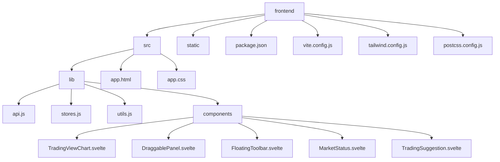
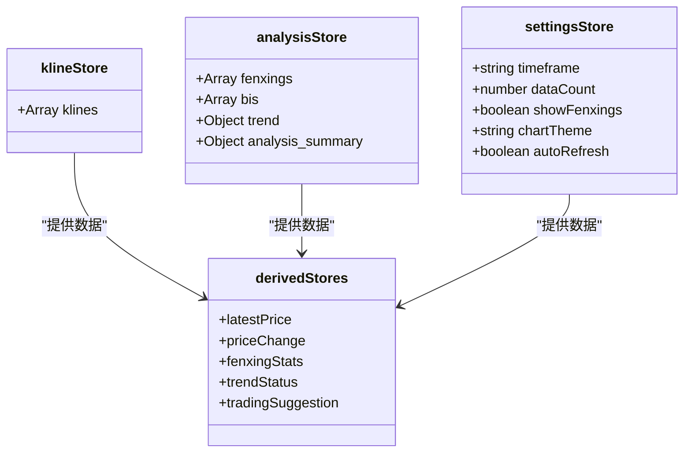
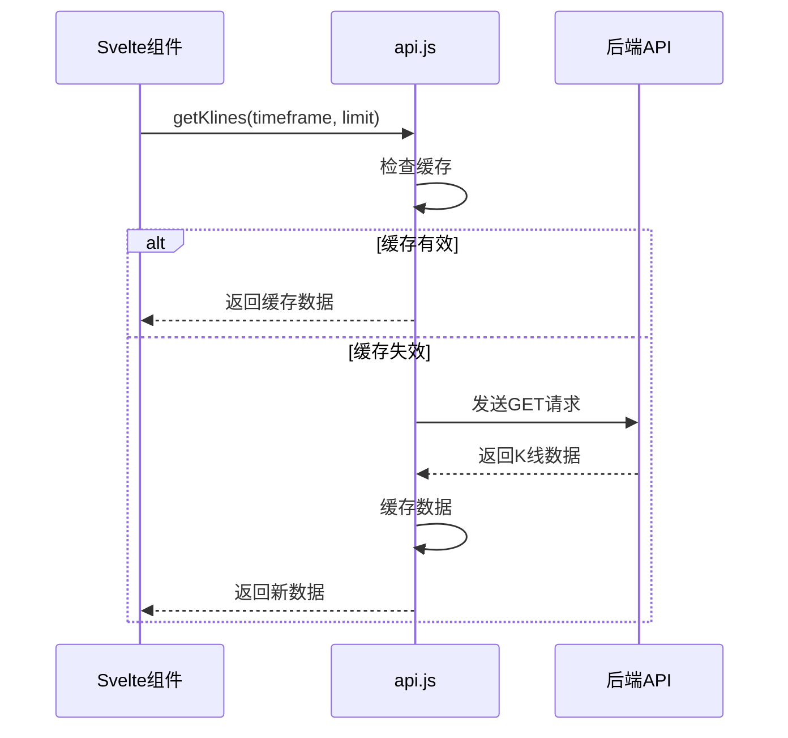
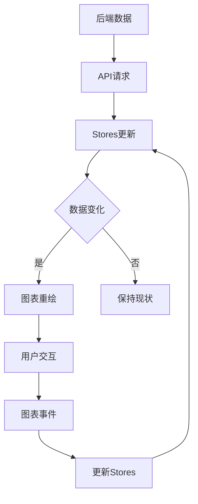
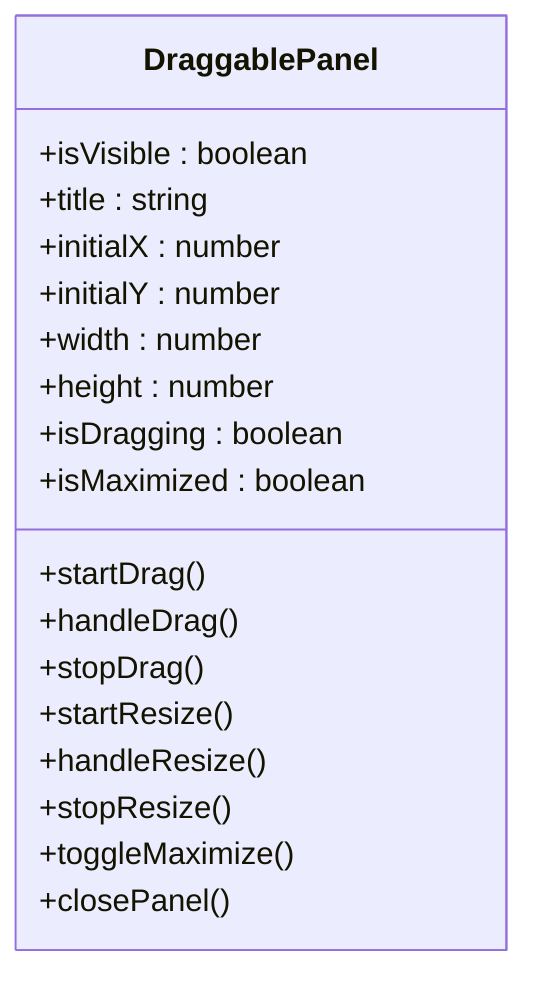
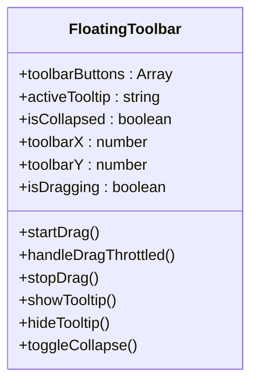

# 前端架构

<cite>
**本文档引用的文件**  
- [api.js](file://frontend/src/lib/api.js)
- [stores.js](file://frontend/src/lib/stores.js)
- [utils.js](file://frontend/src/lib/utils.js)
- [vite.config.js](file://frontend/vite.config.js)
- [tailwind.config.js](file://frontend/tailwind.config.js)
- [postcss.config.js](file://frontend/postcss.config.js)
- [svelte.config.js](file://frontend/svelte.config.js)
- [package.json](file://frontend/package.json)
- [TradingViewChart.svelte](file://frontend/src/lib/components/TradingViewChart.svelte)
- [+page.svelte](file://frontend/src/routes/+page.svelte)
- [DraggablePanel.svelte](file://frontend/src/lib/components/DraggablePanel.svelte)
- [FloatingToolbar.svelte](file://frontend/src/lib/components/FloatingToolbar.svelte)
- [MarketStatus.svelte](file://frontend/src/lib/components/MarketStatus.svelte)
- [TradingSuggestion.svelte](file://frontend/src/lib/components/TradingSuggestion.svelte)
</cite>

## 更新摘要
**变更内容**  
- 更新了“Svelte组件与状态管理”和“TradingView图表集成”部分，以反映最新的UI重构
- 新增了“可拖拽面板与浮动工具栏”章节，介绍新引入的模块化UI组件
- 更新了“开发环境搭建与部署”中的页面结构描述
- 修正了图表数据流和状态管理的描述，以匹配最新的组件交互逻辑

## 目录
1. [项目结构](#项目结构)
2. [Svelte组件与状态管理](#svelte组件与状态管理)
3. [API通信机制](#api通信机制)
4. [构建工具链配置](#构建工具链配置)
5. [TradingView图表集成](#tradingview图表集成)
6. [可拖拽面板与浮动工具栏](#可拖拽面板与浮动工具栏)
7. [开发环境搭建与部署](#开发环境搭建与部署)
8. [性能优化建议](#性能优化建议)

## 项目结构

前端项目位于 `frontend` 目录下，采用标准的 SvelteKit 项目结构。核心源码位于 `src` 目录，其中 `lib` 子目录存放了核心的工具库、状态存储和API接口。



**图表来源**  
- [package.json](file://frontend/package.json#L1-L10)

## Svelte组件与状态管理

前端采用 Svelte 框架，利用其响应式特性构建高性能的用户界面。全局状态通过 Svelte Stores 进行集中管理，实现了组件间的数据共享和状态同步。

### 状态存储设计

系统定义了多个可写存储（writable stores）来管理不同类型的数据，包括K线数据、分析结果、用户设置和UI状态。同时，使用派生存储（derived stores）从基础数据中计算出衍生状态，如最新价格、价格变化和趋势状态。



**图表来源**  
- [stores.js](file://frontend/src/lib/stores.js#L15-L100)

**本节来源**  
- [stores.js](file://frontend/src/lib/stores.js#L1-L442)

## API通信机制

前端通过 `api.js` 文件封装了与后端服务的通信逻辑，提供了统一的API访问接口。

### API客户端实现

API客户端基于 `fetch` API 构建，实现了请求超时控制、错误处理、缓存管理和重试机制。通过 `getCached` 函数实现了不同数据类型的差异化缓存策略，有效减少了网络请求。



**图表来源**  
- [api.js](file://frontend/src/lib/api.js#L1-L100)

### WebSocket实时通信

系统实现了 `WebSocketManager` 类来管理实时数据连接，支持自动重连和事件监听，确保了实时数据的稳定传输。

**本节来源**  
- [api.js](file://frontend/src/lib/api.js#L1-L554)

## 构建工具链配置

项目采用现代化的前端构建工具链，包括 Vite、PostCSS、TailwindCSS 等，提供了高效的开发体验和优化的生产构建。

### Vite配置

Vite 配置文件 `vite.config.js` 中定义了开发服务器、构建优化和依赖预构建等设置。通过代理配置将API请求转发到后端服务，解决了开发环境下的跨域问题。

```mermaid
graph TB
subgraph 开发服务器
A[Vite Dev Server]
B[端口3000]
C[热更新]
end
subgraph 代理配置
D[/api → http://localhost:8000]
E[请求转发]
end
subgraph 构建优化
F[代码分割]
G[手动分块]
H[轻量图表 → charts]
I[图标 → icons]
end
A --> D
D --> E
A --> F
F --> G
G --> H
G --> I
```

**图表来源**  
- [vite.config.js](file://frontend/vite.config.js#L1-L94)

### TailwindCSS主题配置

TailwindCSS 配置文件 `tailwind.config.js` 中定义了金融交易专用的颜色方案、字体和动画效果。特别为缠论分析系统定制了"缠论色"、"牛市色"和"熊市色"等专业配色。

**本节来源**  
- [tailwind.config.js](file://frontend/tailwind.config.js#L1-L206)
- [postcss.config.js](file://frontend/postcss.config.js#L1-L6)
- [vite.config.js](file://frontend/vite.config.js#L1-L94)

## TradingView图表集成

系统集成了 Lightweight Charts 库，实现了专业的金融图表展示功能。

### 图表数据流

图表组件通过订阅 Svelte Stores 中的数据变化，实时更新图表显示。当K线数据或分析结果更新时，图表会自动重新渲染。



**图表来源**  
- [stores.js](file://frontend/src/lib/stores.js#L15-L100)
- [api.js](file://frontend/src/lib/api.js#L1-L554)
- [TradingViewChart.svelte](file://frontend/src/lib/components/TradingViewChart.svelte#L1-L735)

## 可拖拽面板与浮动工具栏

系统重构了UI架构，引入了可拖拽面板和浮动工具栏，实现了模块化的用户界面。

### 可拖拽面板组件

`DraggablePanel.svelte` 组件提供了可移动、可调整大小和可最大化的浮动面板功能。每个面板可以独立显示或隐藏，支持硬件加速和节流优化，确保拖拽过程的流畅性。



**图表来源**  
- [DraggablePanel.svelte](file://frontend/src/lib/components/DraggablePanel.svelte#L1-L509)

### 浮动工具栏

`FloatingToolbar.svelte` 组件提供了悬浮在界面上的快捷操作入口。工具栏支持拖拽定位、展开/收缩和悬停提示，用户可以快速访问控制面板、市场状态、分型列表和交易建议等关键功能。



**图表来源**  
- [FloatingToolbar.svelte](file://frontend/src/lib/components/FloatingToolbar.svelte#L1-L449)

### 辅助信息组件

系统新增了多个辅助信息组件，包括：
- `MarketStatus.svelte`：实时显示价格、趋势和24小时统计数据
- `TradingSuggestion.svelte`：提供基于缠论分析的智能交易建议和风险管理

**本节来源**  
- [DraggablePanel.svelte](file://frontend/src/lib/components/DraggablePanel.svelte#L1-L509)
- [FloatingToolbar.svelte](file://frontend/src/lib/components/FloatingToolbar.svelte#L1-L449)
- [MarketStatus.svelte](file://frontend/src/lib/components/MarketStatus.svelte#L1-L347)
- [TradingSuggestion.svelte](file://frontend/src/lib/components/TradingSuggestion.svelte#L1-L451)
- [+page.svelte](file://frontend/src/routes/+page.svelte#L1-L468)

## 开发环境搭建与部署

### 开发环境搭建

1. 安装 Node.js 16+ 版本
2. 克隆项目仓库
3. 进入 `frontend` 目录执行 `npm install`
4. 启动开发服务器：`npm run dev`

### 部署流程

项目支持静态部署，通过 `npm run build` 命令生成优化的生产构建，输出到 `build` 目录。

**本节来源**  
- [package.json](file://frontend/package.json#L1-L53)
- [svelte.config.js](file://frontend/svelte.config.js#L1-L38)
- [+page.svelte](file://frontend/src/routes/+page.svelte#L1-L468)

## 性能优化建议

### 代码分割与懒加载

Vite 配置中通过 `manualChunks` 实现了智能的代码分割，将大型依赖库（如图表库、图标库）单独打包，减少了初始加载体积。

### 缓存策略

系统实现了多层级的缓存策略：
- **API响应缓存**：根据数据类型设置不同的缓存时长
- **本地存储**：用户设置和图表配置持久化存储
- **浏览器缓存**：通过构建配置生成带哈希的文件名

### 性能监控

通过 Vite 的构建警告阈值（chunkSizeWarningLimit）监控代码体积，确保单个代码块不超过1MB。

**本节来源**  
- [vite.config.js](file://frontend/vite.config.js#L1-L94)
- [api.js](file://frontend/src/lib/api.js#L1-L554)
- [stores.js](file://frontend/src/lib/stores.js#L1-L442)