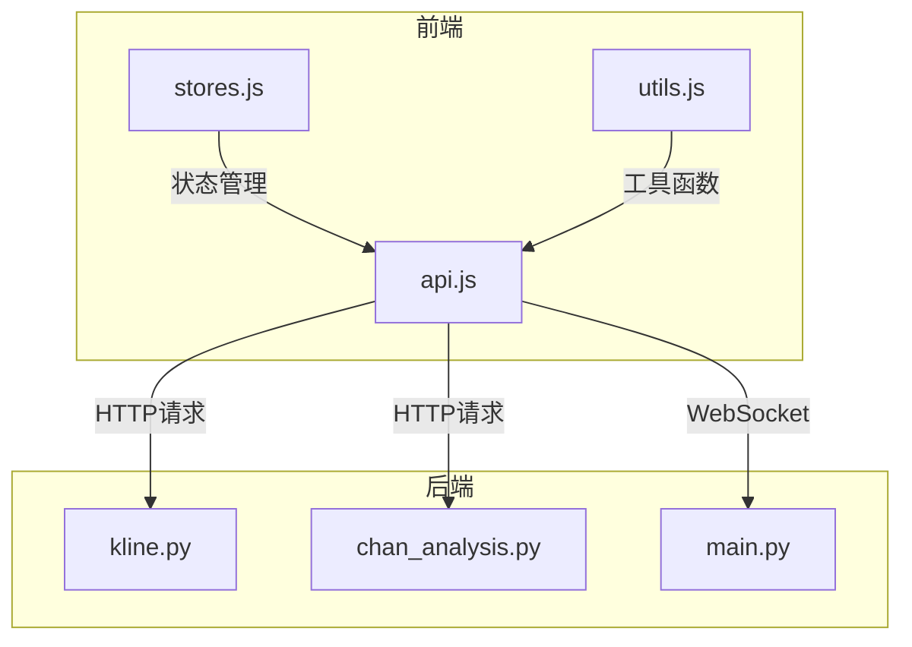
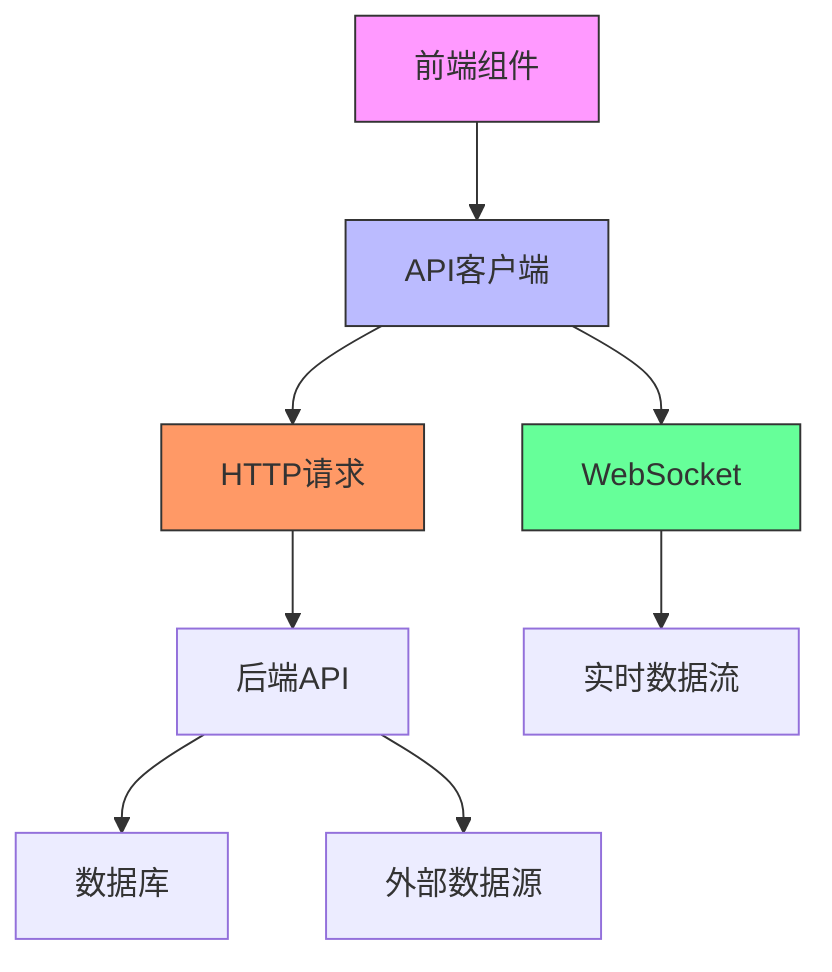
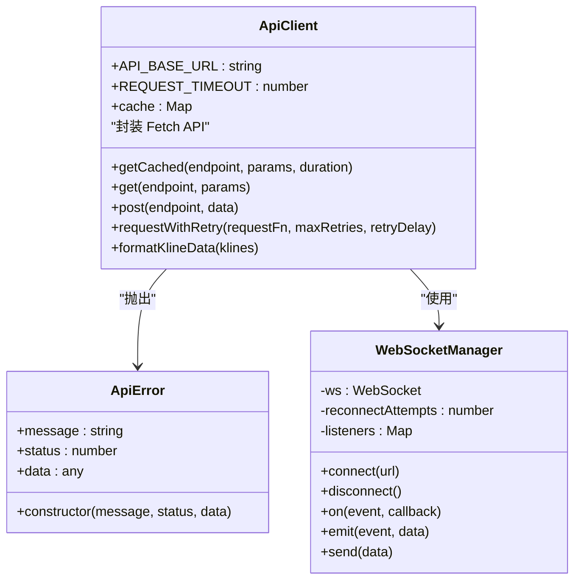
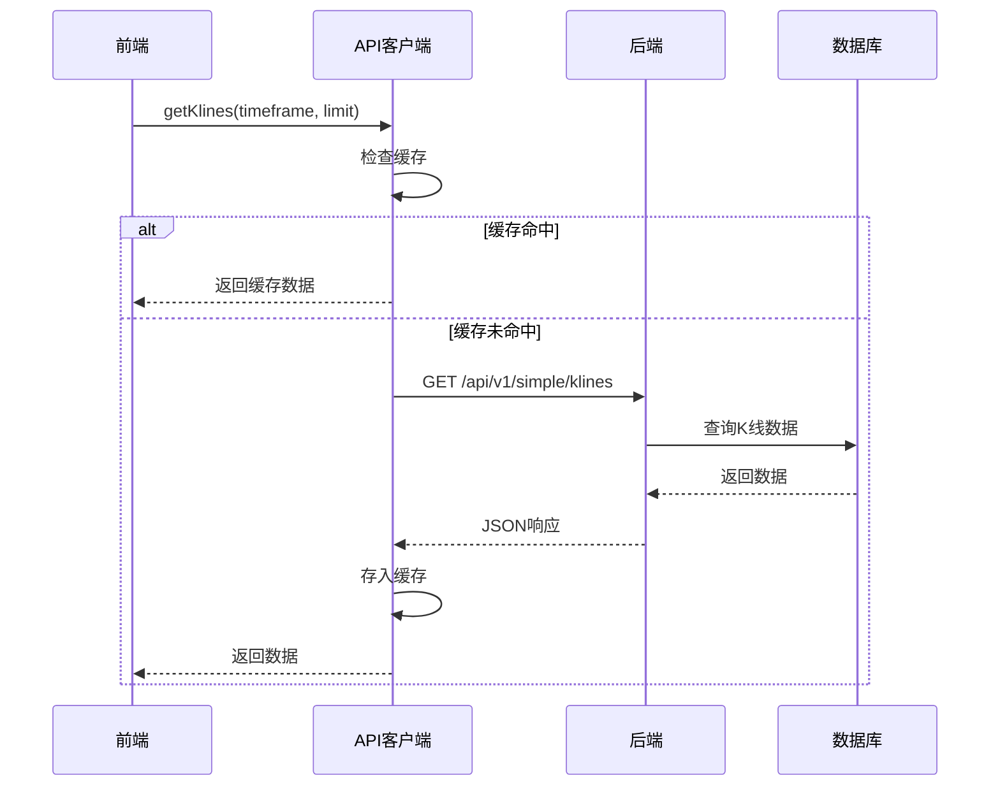
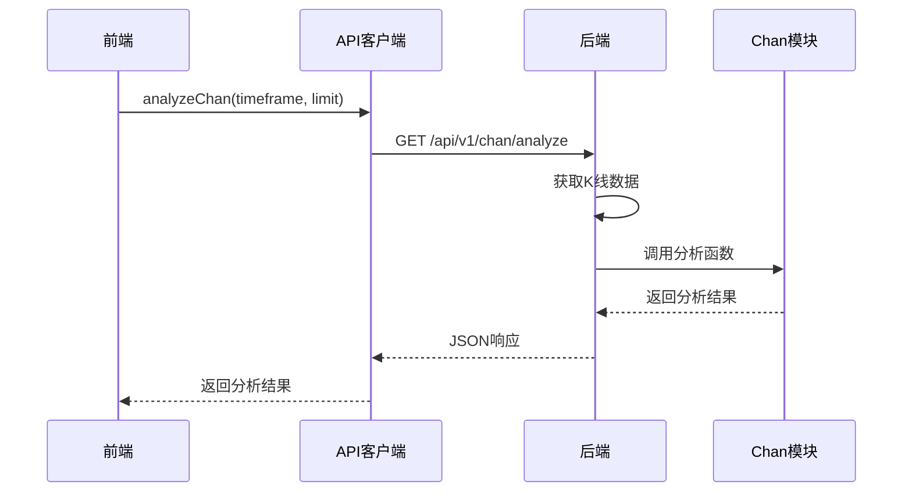
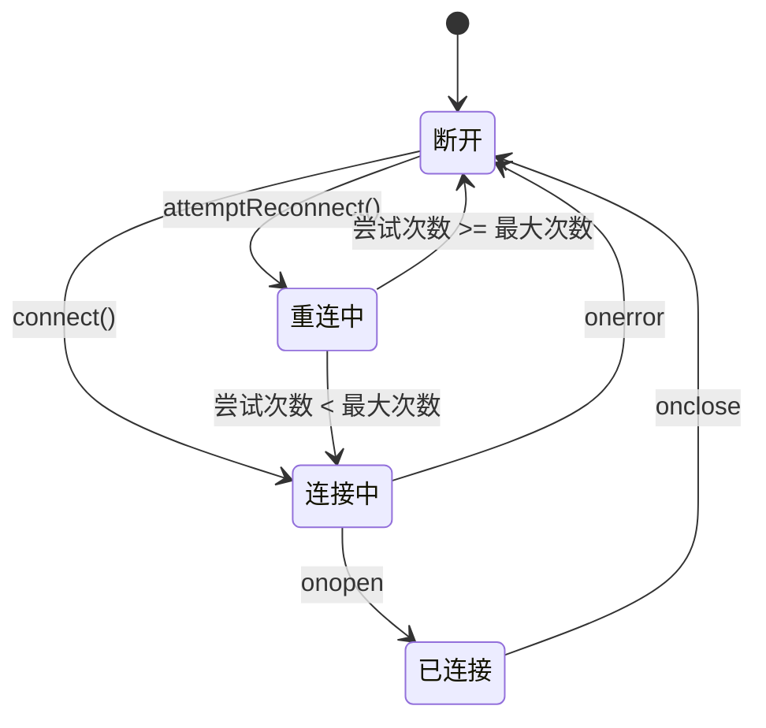
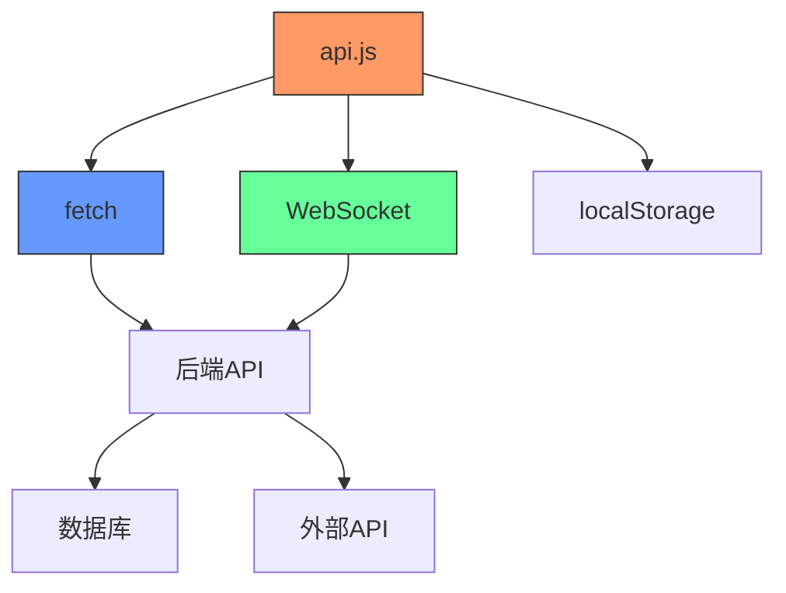

# 前端API通信

<cite>
**本文档引用文件**   
- [api.js](file://frontend/src/lib/api.js)
- [kline.py](file://app/api/v1/endpoints/kline.py)
- [chan_analysis.py](file://app/api/v1/endpoints/chan_analysis.py)
- [api.py](file://app/api/v1/api.py)
- [main.py](file://app/main.py)
</cite>

## 目录
1. [简介](#简介)
2. [项目结构](#项目结构)
3. [核心组件](#核心组件)
4. [架构概述](#架构概述)
5. [详细组件分析](#详细组件分析)
6. [依赖分析](#依赖分析)
7. [性能考虑](#性能考虑)
8. [故障排除指南](#故障排除指南)
9. [结论](#结论)

## 简介
本文档全面阐述了基于JavaScript Fetch API的前端与FastAPI后端之间的通信机制。重点介绍`api.js`中封装的HTTP客户端如何与后端进行交互，包括请求构造、错误处理、认证机制和超时控制。详细说明各API端点（如/kline/fetch-data、/chan/analyze）的调用方式、参数格式和响应结构。提供实际代码示例展示异步数据获取、加载状态管理和重试策略。解释如何处理WebSocket或长轮询等实时数据流，并讨论安全性考虑如XSRF防护和CORS配置。包含调试工具使用指南和常见网络错误的排查方法。

## 项目结构
本项目采用前后端分离架构，前端位于`frontend`目录，后端API位于`app`目录。前端使用Svelte框架，通过`api.js`封装所有与后端的通信逻辑。后端使用FastAPI框架，提供RESTful API接口和WebSocket服务。

**图示来源**
- [api.js](file://frontend/src/lib/api.js)
- [kline.py](file://app/api/v1/endpoints/kline.py)
- [chan_analysis.py](file://app/api/v1/endpoints/chan_analysis.py)
- [main.py](file://app/main.py)

**本节来源**
- [api.js](file://frontend/src/lib/api.js)
- [main.py](file://app/main.py)

## 核心组件
核心通信组件是`frontend/src/lib/api.js`中的API客户端，它封装了所有与后端的交互逻辑。该组件提供了一系列高层函数，如`getKlines`、`analyzeChan`等，简化了前端对后端API的调用。同时，它实现了缓存管理、错误处理、重试机制和WebSocket连接管理等关键功能。

**本节来源**
- [api.js](file://frontend/src/lib/api.js)

## 架构概述
系统采用分层架构，前端通过HTTP和WebSocket两种方式与后端通信。HTTP用于获取K线数据、执行缠论分析等请求-响应式操作，而WebSocket用于实时数据更新。API客户端实现了统一的错误处理、超时控制和缓存策略，确保通信的可靠性和性能。

**图示来源**
- [api.js](file://frontend/src/lib/api.js)
- [main.py](file://app/main.py)

## 详细组件分析

### API客户端分析
API客户端是前端与后端通信的核心，它封装了底层的Fetch API，提供了更易用的接口和额外的功能。

#### 类图

**图示来源**
- [api.js](file://frontend/src/lib/api.js#L15-L553)

**本节来源**
- [api.js](file://frontend/src/lib/api.js#L1-L553)

### K线数据API分析
K线数据API提供多种方式获取历史和实时K线数据，支持不同时间周期和数据量。

#### 序列图

**图示来源**
- [api.js](file://frontend/src/lib/api.js#L150-L170)
- [kline.py](file://app/api/v1/endpoints/kline.py)

**本节来源**
- [api.js](file://frontend/src/lib/api.js#L150-L170)
- [kline.py](file://app/api/v1/endpoints/kline.py)

### 缠论分析API分析
缠论分析API提供专业的技术分析功能，包括分型识别、笔的构建、线段分析和买卖点识别。

#### 序列图

**图示来源**
- [api.js](file://frontend/src/lib/api.js#L200-L220)
- [chan_analysis.py](file://app/api/v1/endpoints/chan_analysis.py)

**本节来源**
- [api.js](file://frontend/src/lib/api.js#L200-L220)
- [chan_analysis.py](file://app/api/v1/endpoints/chan_analysis.py)

### WebSocket实时数据分析
WebSocket提供实时数据更新功能，支持自动重连和事件监听。

#### 状态图

**图示来源**
- [api.js](file://frontend/src/lib/api.js#L400-L475)

**本节来源**
- [api.js](file://frontend/src/lib/api.js#L400-L475)

## 依赖分析
系统依赖关系清晰，前端通过API客户端依赖后端API，后端API依赖数据库和外部数据源。API客户端内部实现了模块化设计，各功能组件之间耦合度低。

**图示来源**
- [api.js](file://frontend/src/lib/api.js)
- [main.py](file://app/main.py)

**本节来源**
- [api.js](file://frontend/src/lib/api.js)
- [main.py](file://app/main.py)

## 性能考虑
系统实现了多层缓存策略，根据数据的更新频率设置不同的缓存时长。对于静态数据使用30分钟缓存，一般数据使用5分钟缓存，实时数据使用30秒缓存。同时，通过代码分割和资源预加载优化前端性能。

**本节来源**
- [api.js](file://frontend/src/lib/api.js#L350-L370)
- [performance_optimization.md](file://frontend/performance_optimization.md)

## 故障排除指南
常见问题包括网络连接失败、API响应超时、数据格式错误等。建议首先检查网络连接，然后查看浏览器控制台日志，最后检查API响应格式是否符合预期。对于WebSocket连接问题，检查服务器地址和端口是否正确。

**本节来源**
- [api.js](file://frontend/src/lib/api.js#L42-L88)
- [api.js](file://frontend/src/lib/api.js#L472-L517)

## 结论
本文档详细介绍了前端API通信机制，涵盖了从基础请求到高级功能的各个方面。通过合理的架构设计和功能封装，系统实现了高效、可靠的前后端通信，为用户提供流畅的交易分析体验。