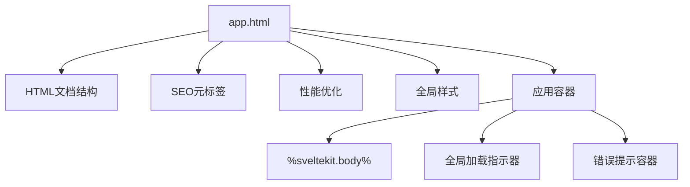
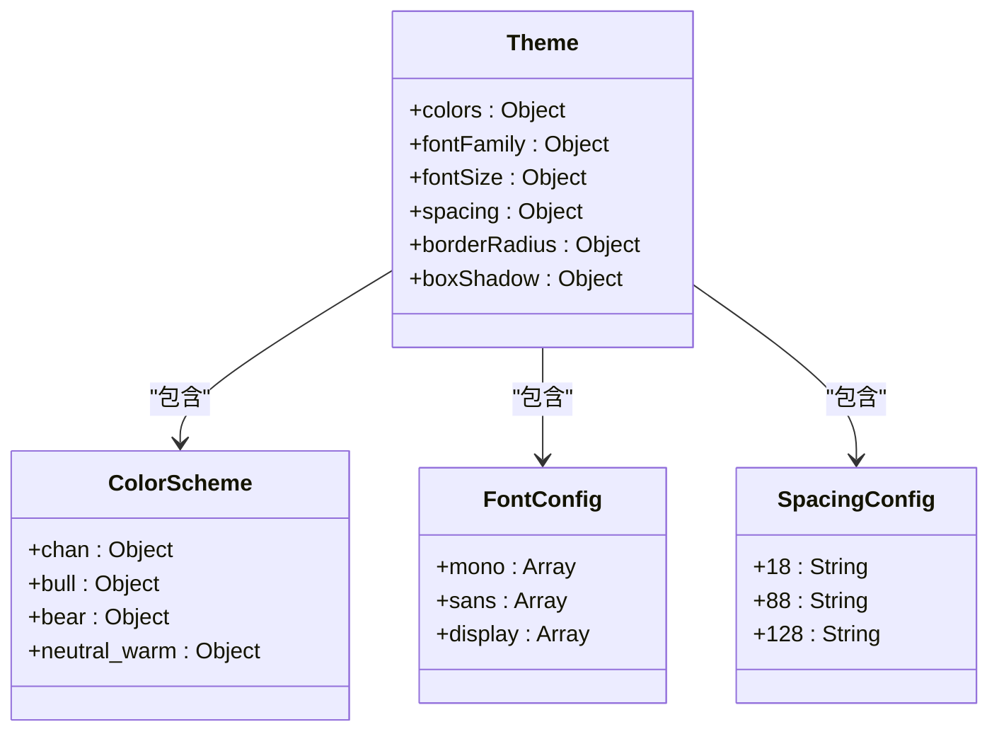
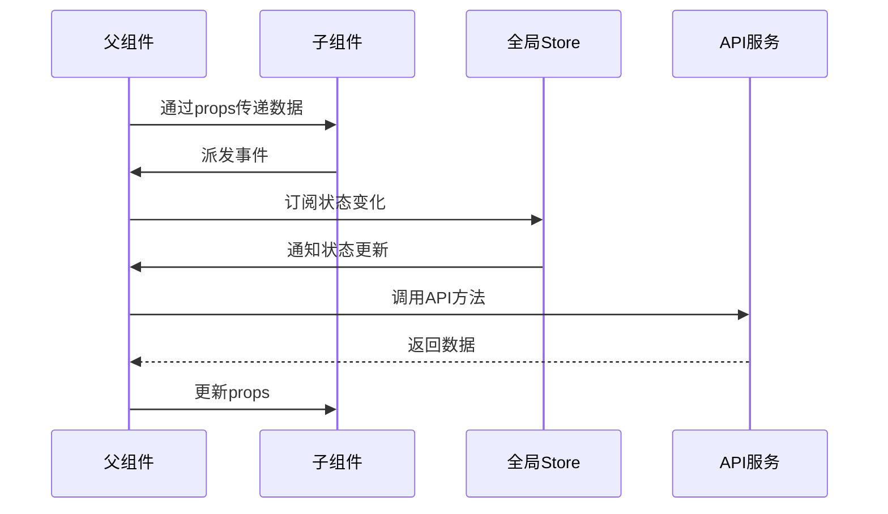
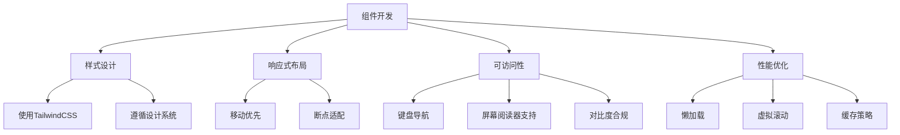
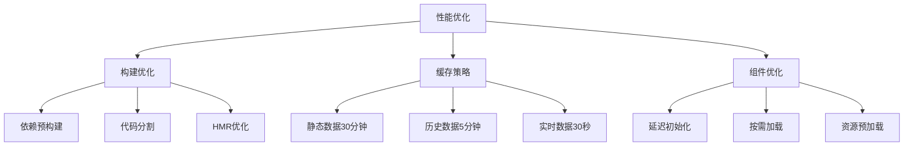
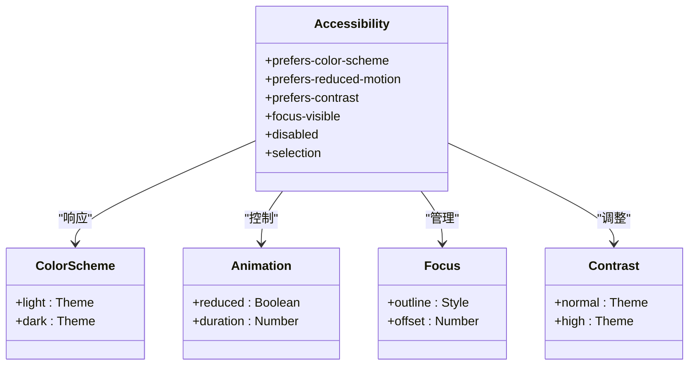

# 前端UI组件

<cite>
**本文档引用的文件**   
- [app.html](file://frontend/src/app.html)
- [tailwind.config.js](file://frontend/tailwind.config.js)
- [svelte.config.js](file://frontend/svelte.config.js)
- [vite.config.js](file://frontend/vite.config.js)
- [performance_optimization.md](file://frontend/performance_optimization.md)
- [api.js](file://frontend/src/lib/api.js)
</cite>

## 目录
1. [项目结构](#项目结构)
2. [根组件与布局](#根组件与布局)
3. [样式与主题系统](#样式与主题系统)
4. [组件通信机制](#组件通信机制)
5. [开发规范与最佳实践](#开发规范与最佳实践)
6. [性能优化策略](#性能优化策略)
7. [可访问性支持](#可访问性支持)

## 项目结构

前端项目采用SvelteKit框架构建，主要目录结构如下：

```
frontend/
├── src/
│   ├── lib/          # 公共库文件
│   │   ├── api.js    # API接口封装
│   │   ├── stores.js # Svelte状态管理
│   │   └── utils.js  # 工具函数
│   ├── app.html      # 根HTML模板
│   └── app.css       # 全局CSS样式
├── static/           # 静态资源
├── package.json      # 依赖管理
├── svelte.config.js  # Svelte配置
├── tailwind.config.js # TailwindCSS配置
└── vite.config.js    # Vite构建配置
```

**Diagram sources**
- [svelte.config.js](file://frontend/svelte.config.js#L1-L38)
- [tailwind.config.js](file://frontend/tailwind.config.js#L1-L205)

**本文档引用的文件**   
- [app.html](file://frontend/src/app.html)
- [tailwind.config.js](file://frontend/tailwind.config.js)
- [svelte.config.js](file://frontend/svelte.config.js)

## 根组件与布局

`app.html`作为Svelte应用的根组件，定义了全局HTML结构和基础布局。该文件不仅包含标准的HTML文档结构，还集成了SEO元标签、性能优化指令和全局样式定义。

根组件通过`%sveltekit.body%`占位符注入Svelte应用内容，实现了服务端渲染与客户端渲染的无缝衔接。页面布局采用响应式设计，支持移动设备和桌面端的自适应显示。



**Diagram sources**
- [app.html](file://frontend/src/app.html#L1-L251)

**本文档引用的文件**   
- [app.html](file://frontend/src/app.html)

## 样式与主题系统

项目采用TailwindCSS作为主要的CSS框架，结合自定义主题配置，实现了统一的视觉风格。通过`tailwind.config.js`文件定义了缠论分析专用的颜色体系、字体家族和尺寸规范。

主题系统支持明暗模式切换，通过CSS媒体查询`prefers-color-scheme`自动适配用户系统偏好。同时，系统还支持高对比度模式和减少动画偏好，提升了可访问性。



**Diagram sources**
- [tailwind.config.js](file://frontend/tailwind.config.js#L1-L205)

**本文档引用的文件**   
- [tailwind.config.js](file://frontend/tailwind.config.js)

## 组件通信机制

Svelte组件间通信采用多种机制，包括props传递、事件派发和context API。通过`svelte.config.js`中的别名配置，实现了模块的便捷导入。

状态管理通过Svelte的stores机制实现，`$stores`别名指向全局状态管理文件。API调用封装在`$api`模块中，提供统一的数据访问接口。



**Diagram sources**
- [svelte.config.js](file://frontend/svelte.config.js#L1-L38)
- [api.js](file://frontend/src/lib/api.js#L1-L100)

**本文档引用的文件**   
- [svelte.config.js](file://frontend/svelte.config.js)
- [api.js](file://frontend/src/lib/api.js)

## 开发规范与最佳实践

项目遵循严格的开发规范，确保代码质量和可维护性。通过Vite和SvelteKit的配置，实现了高效的开发体验。

组件开发应遵循以下最佳实践：
- 使用TailwindCSS实用类进行样式设计
- 遵循响应式设计原则
- 实现可访问性支持
- 优化图表渲染性能
- 合理使用动态组件加载



**Diagram sources**
- [tailwind.config.js](file://frontend/tailwind.config.js#L1-L205)
- [vite.config.js](file://frontend/vite.config.js#L1-L52)

**本文档引用的文件**   
- [tailwind.config.js](file://frontend/tailwind.config.js)
- [vite.config.js](file://frontend/vite.config.js)

## 性能优化策略

项目实施了多层次的性能优化策略，涵盖构建优化、缓存策略和组件加载优化。通过Vite的依赖预构建和代码分割，显著提升了首次加载速度。

API缓存采用分层机制，根据不同数据类型的更新频率设置相应的缓存时长。图表组件采用延迟初始化策略，避免阻塞主页面渲染。



**Diagram sources**
- [performance_optimization.md](file://frontend/performance_optimization.md#L1-L67)
- [vite.config.js](file://frontend/vite.config.js#L1-L52)

**本文档引用的文件**   
- [performance_optimization.md](file://frontend/performance_optimization.md)
- [vite.config.js](file://frontend/vite.config.js)

## 可访问性支持

系统全面支持Web可访问性标准，确保所有用户都能有效使用。通过CSS媒体查询`prefers-reduced-motion`检测用户对动画的偏好设置，并相应调整动画效果。

焦点管理采用`focus-visible`伪类，为键盘导航用户提供清晰的焦点指示。颜色对比度符合WCAG标准，支持高对比度模式，满足视觉障碍用户的需求。



**Diagram sources**
- [app.html](file://frontend/src/app.html#L191-L230)

**本文档引用的文件**   
- [app.html](file://frontend/src/app.html)