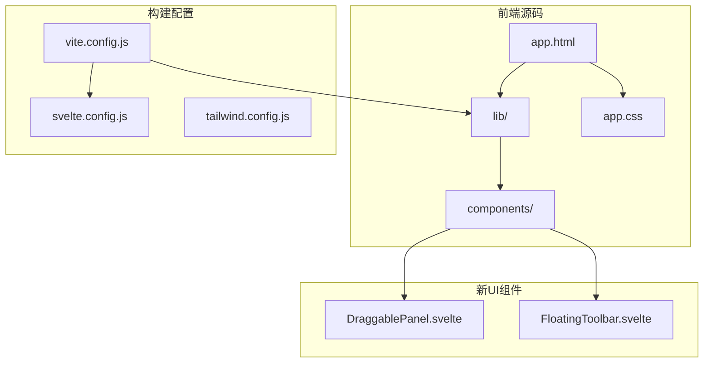
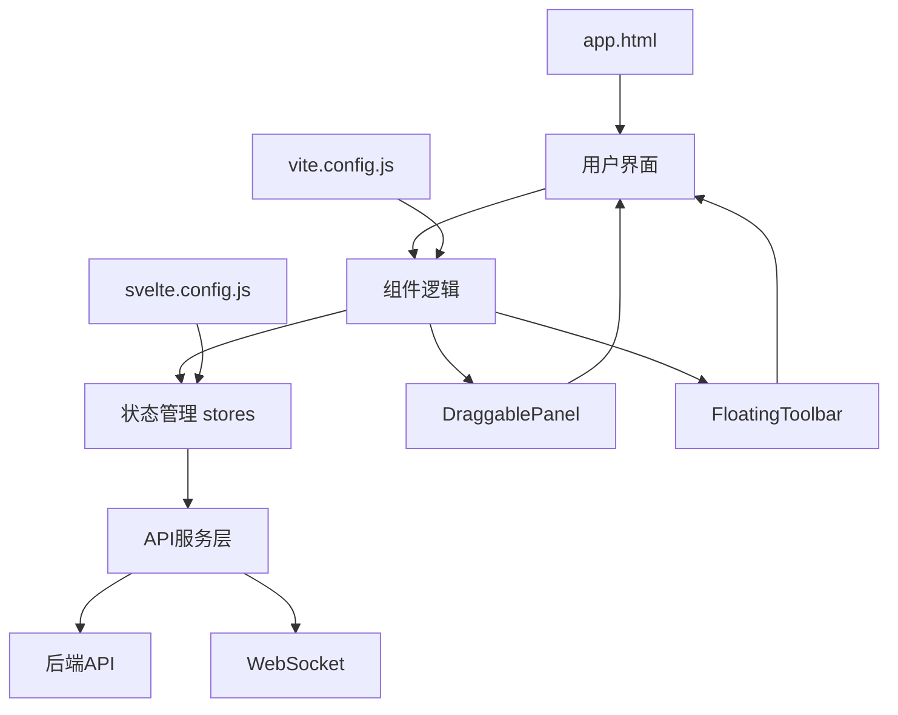
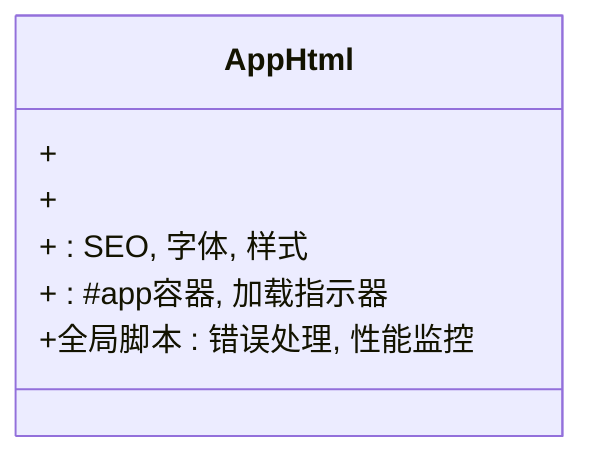
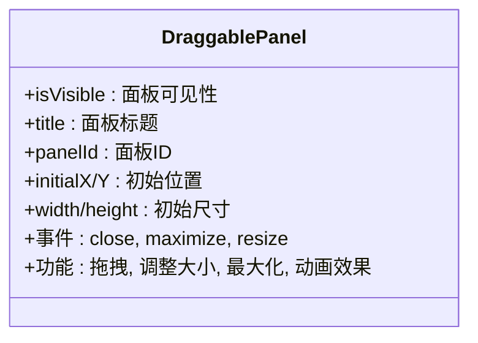
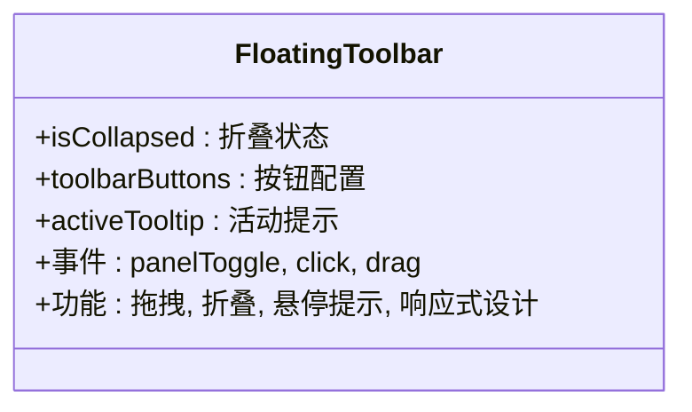
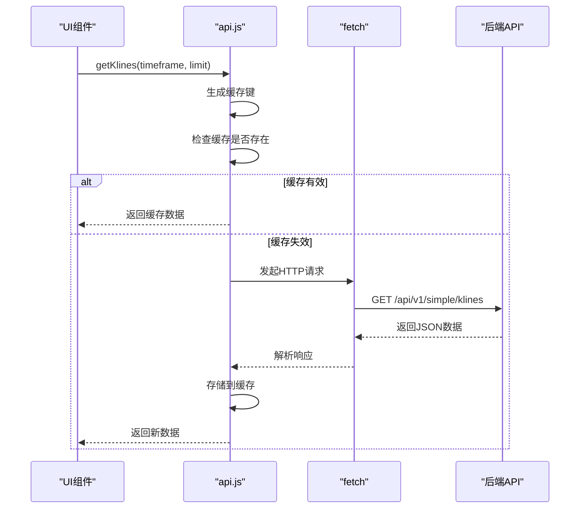
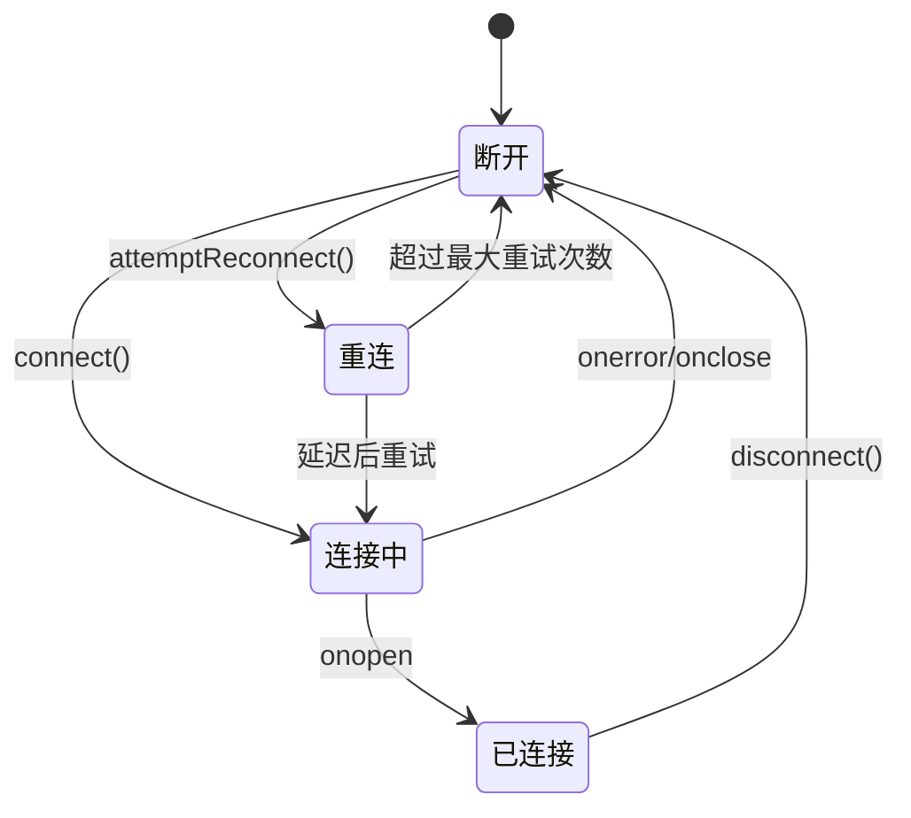
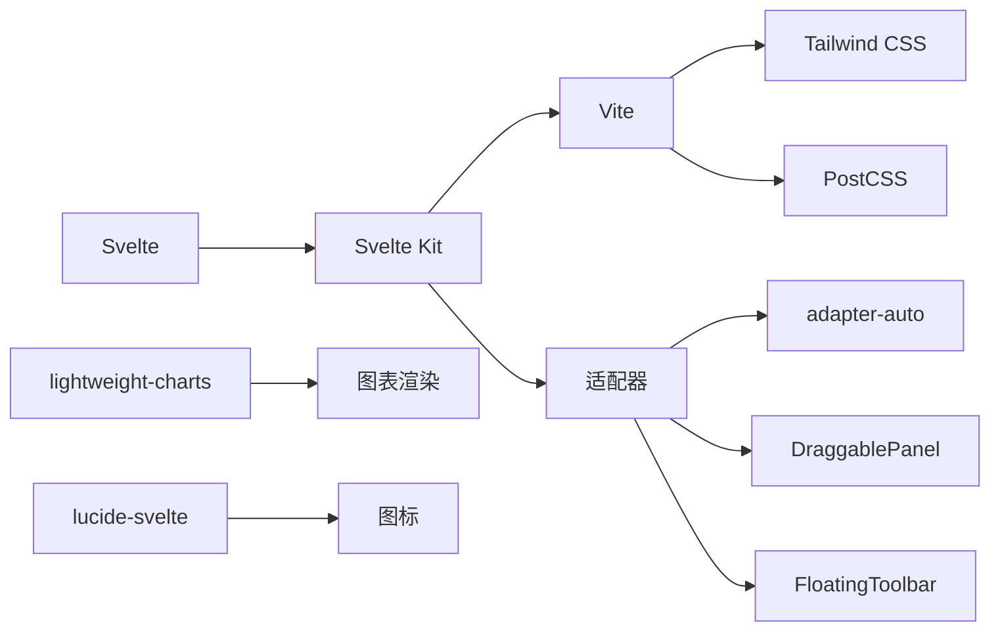

# 前端组件架构

<cite>
**本文档引用的文件**
- [app.html](file://frontend/src/app.html)
- [stores.js](file://frontend/src/lib/stores.js)
- [api.js](file://frontend/src/lib/api.js)
- [svelte.config.js](file://frontend/svelte.config.js)
- [vite.config.js](file://frontend/vite.config.js)
- [DraggablePanel.svelte](file://frontend/src/lib/components/DraggablePanel.svelte) - *新增于最近提交*
- [FloatingToolbar.svelte](file://frontend/src/lib/components/FloatingToolbar.svelte) - *新增于最近提交*
- [+page.svelte](file://frontend/src/routes/+page.svelte) - *更新以集成新组件*
</cite>

## 更新摘要
**变更内容**   
- 新增了可拖拽面板和浮动工具栏组件的详细说明
- 更新了核心组件和详细组件分析部分以反映新UI架构
- 添加了新的架构概览图展示新组件关系
- 更新了项目结构描述以包含新组件
- 增强了组件开发规范部分以包含新组件的最佳实践

## 目录
1. [简介](#简介)
2. [项目结构](#项目结构)
3. [核心组件](#核心组件)
4. [架构概览](#架构概览)
5. [详细组件分析](#详细组件分析)
6. [依赖分析](#依赖分析)
7. [性能考量](#性能考量)
8. [故障排除指南](#故障排除指南)
9. [结论](#结论)

## 简介
本文档详细解析基于Svelte的前端组件化设计，涵盖`app.html`作为应用根组件的结构与作用，阐述各UI组件（如图表容器、侧边栏、状态面板）的组织方式。文档说明组件间通信机制、事件处理流程和响应式数据绑定模式，并提供组件开发规范与最佳实践，包括命名约定、样式隔离和可访问性支持。结合代码示例展示组件生命周期管理和动态加载策略。

## 项目结构
前端项目采用标准Svelte Kit结构，核心源码位于`frontend/src`目录。`app.html`作为应用的根HTML模板，`lib`目录包含共享逻辑如API调用和状态管理。构建和开发配置通过`vite.config.js`和`svelte.config.js`进行管理。最近的重构引入了可拖拽面板和浮动工具栏组件，增强了用户界面的交互性和灵活性。



**Section sources**
- [app.html](file://frontend/src/app.html#L1-L252)
- [svelte.config.js](file://frontend/svelte.config.js#L1-L39)
- [vite.config.js](file://frontend/vite.config.js#L1-L94)
- [DraggablePanel.svelte](file://frontend/src/lib/components/DraggablePanel.svelte) - *新增于最近提交*
- [FloatingToolbar.svelte](file://frontend/src/lib/components/FloatingToolbar.svelte) - *新增于最近提交*

## 核心组件
系统核心组件包括全局状态管理（stores.js）、API通信层（api.js）、根组件（app.html）以及新引入的可拖拽面板和浮动工具栏。`stores.js`使用Svelte的`writable`和`derived`创建响应式数据流，`api.js`封装HTTP请求与WebSocket连接，`app.html`提供SEO优化和性能预加载。新增的`DraggablePanel.svelte`和`FloatingToolbar.svelte`组件提供了现代化的用户界面交互模式。

**Section sources**
- [stores.js](file://frontend/src/lib/stores.js#L1-L442)
- [api.js](file://frontend/src/lib/api.js#L1-L554)
- [app.html](file://frontend/src/app.html#L1-L252)
- [DraggablePanel.svelte](file://frontend/src/lib/components/DraggablePanel.svelte) - *新增于最近提交*
- [FloatingToolbar.svelte](file://frontend/src/lib/components/FloatingToolbar.svelte) - *新增于最近提交*

## 架构概览
系统采用分层架构，前端通过Svelte Kit构建，利用Vite实现快速开发。状态管理基于Svelte stores，API通信通过模块化封装，支持缓存和错误重试机制。WebSocket用于实时数据更新。新的UI架构引入了可拖拽面板和浮动工具栏，提升了用户体验和界面灵活性。



**Diagram sources**
- [stores.js](file://frontend/src/lib/stores.js#L1-L442)
- [api.js](file://frontend/src/lib/api.js#L1-L554)
- [app.html](file://frontend/src/app.html#L1-L252)
- [DraggablePanel.svelte](file://frontend/src/lib/components/DraggablePanel.svelte) - *新增于最近提交*
- [FloatingToolbar.svelte](file://frontend/src/lib/components/FloatingToolbar.svelte) - *新增于最近提交*

## 详细组件分析

### 根组件分析
`app.html`作为Svelte应用的入口点，定义了完整的HTML文档结构，包含SEO元标签、Open Graph信息、图标资源和性能优化预加载指令。其核心作用是为Svelte Kit应用提供渲染容器和全局样式。

#### 根组件结构


**Diagram sources**
- [app.html](file://frontend/src/app.html#L1-L252)

### 新增UI组件分析
系统新增了可拖拽面板和浮动工具栏组件，提供了现代化的用户界面交互体验。

#### 可拖拽面板组件
`DraggablePanel.svelte`组件实现了可拖拽、可调整大小和可最大化的浮动面板，用于显示各种信息和控制界面。

##### 可拖拽面板特性


**Diagram sources**
- [DraggablePanel.svelte](file://frontend/src/lib/components/DraggablePanel.svelte) - *新增于最近提交*

#### 浮动工具栏组件
`FloatingToolbar.svelte`组件实现了可拖拽、可折叠的浮动工具栏，集成了主要功能的快速访问。

##### 浮动工具栏特性


**Diagram sources**
- [FloatingToolbar.svelte](file://frontend/src/lib/components/FloatingToolbar.svelte) - *新增于最近提交*

#### 状态管理分析
系统使用Svelte stores实现全局状态管理，包括K线数据、分析结果、用户设置和UI状态。

##### 状态存储结构
```mermaid
classDiagram
class klineStore {
+writable([]) : K线数据
}
class analysisStore {
+writable({}) : 分型、笔、线段等
}
class settingsStore {
+writable({}) : 用户偏好设置
}
class loadingStore {
+writable(false) : 加载状态
}
class derivedStores {
+latestPrice : 派生最新价格
+priceChange : 派生价格变化
+fenxingStats : 分型统计
+trendStatus : 趋势状态
+tradingSuggestion : 交易建议
}
klineStore --> derivedStores : 提供数据源
analysisStore --> derivedStores : 提供数据源
```

**Diagram sources**
- [stores.js](file://frontend/src/lib/stores.js#L1-L442)

#### API通信分析
API层封装了所有与后端的交互，提供统一的请求接口和错误处理机制。

##### API请求流程


**Diagram sources**
- [api.js](file://frontend/src/lib/api.js#L1-L554)

##### WebSocket连接管理


**Diagram sources**
- [api.js](file://frontend/src/lib/api.js#L1-L554)

**Section sources**
- [stores.js](file://frontend/src/lib/stores.js#L1-L442)
- [api.js](file://frontend/src/lib/api.js#L1-L554)
- [DraggablePanel.svelte](file://frontend/src/lib/components/DraggablePanel.svelte) - *新增于最近提交*
- [FloatingToolbar.svelte](file://frontend/src/lib/components/FloatingToolbar.svelte) - *新增于最近提交*

## 依赖分析
项目依赖通过`package.json`管理，构建工具链基于Vite和Svelte Kit。开发依赖包括Tailwind CSS、PostCSS和TypeScript支持。



**Diagram sources**
- [package.json](file://frontend/package.json)
- [vite.config.js](file://frontend/vite.config.js#L1-L94)
- [svelte.config.js](file://frontend/svelte.config.js#L1-L39)
- [DraggablePanel.svelte](file://frontend/src/lib/components/DraggablePanel.svelte) - *新增于最近提交*
- [FloatingToolbar.svelte](file://frontend/src/lib/components/FloatingToolbar.svelte) - *新增于最近提交*

**Section sources**
- [vite.config.js](file://frontend/vite.config.js#L1-L94)
- [svelte.config.js](file://frontend/svelte.config.js#L1-L39)

## 性能考量
系统在多个层面进行了性能优化：`app.html`中预加载关键资源，Vite配置中启用依赖预构建，API层实现多级缓存机制。代码分割策略将大型依赖（如图表库）单独打包，提升初始加载速度。新增的可拖拽面板和浮动工具栏组件采用了节流和防抖技术，确保拖拽和调整大小操作的流畅性。

- **资源预加载**：在`app.html`中使用`link rel="preload"`提前加载字体和关键样式
- **依赖预构建**：在`vite.config.js`中配置`optimizeDeps`提升开发服务器启动速度
- **缓存策略**：API层实现基于时间的缓存，区分静态数据（30分钟）和实时数据（30秒）
- **代码分割**：Rollup配置手动分割大型依赖到独立chunk
- **交互优化**：可拖拽组件使用`requestAnimationFrame`和节流技术优化性能

## 故障排除指南
常见问题及解决方案：

1. **WebSocket连接失败**：检查后端WebSocket服务是否运行在`ws://localhost:8001/ws`
2. **API请求超时**：确认后端API服务运行在`http://localhost:8000`
3. **数据不更新**：检查`settingsStore`中的`autoRefresh`设置和`refreshInterval`
4. **样式丢失**：验证`fonts.css`路径是否正确，检查Vite构建输出
5. **可拖拽面板异常**：检查浏览器环境和事件监听器是否正确绑定
6. **浮动工具栏不显示**：确认`+page.svelte`中已正确导入和使用组件

**Section sources**
- [api.js](file://frontend/src/lib/api.js#L1-L554)
- [stores.js](file://frontend/src/lib/stores.js#L1-L442)
- [app.html](file://frontend/src/app.html#L1-L252)
- [DraggablePanel.svelte](file://frontend/src/lib/components/DraggablePanel.svelte) - *新增于最近提交*
- [FloatingToolbar.svelte](file://frontend/src/lib/components/FloatingToolbar.svelte) - *新增于最近提交*

## 结论
本系统采用现代化的Svelte技术栈，通过清晰的组件分层和响应式状态管理实现了高效的前端架构。`app.html`作为根组件提供了完整的HTML语义和性能优化基础，stores和api模块实现了关注点分离。新增的可拖拽面板和浮动工具栏组件显著提升了用户体验和界面灵活性。系统具备良好的可维护性和扩展性，为缠论分析功能提供了稳定可靠的技术支撑。