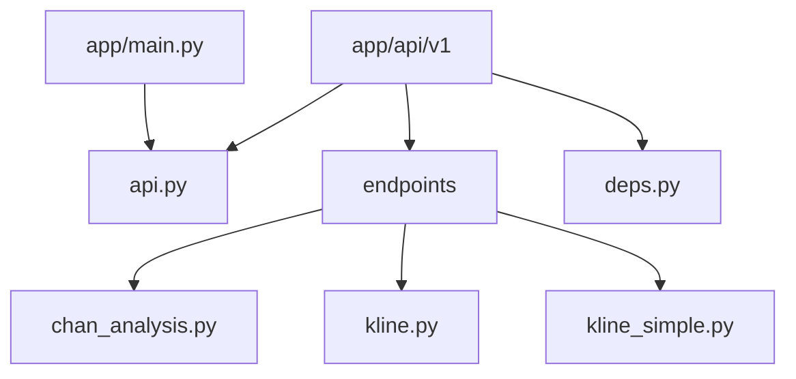
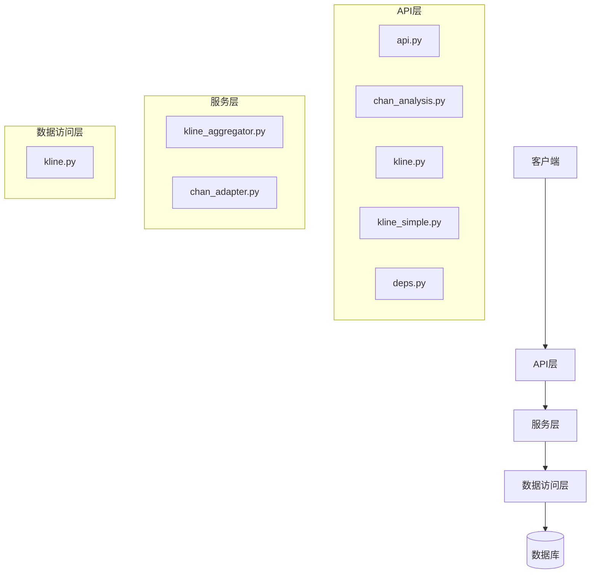
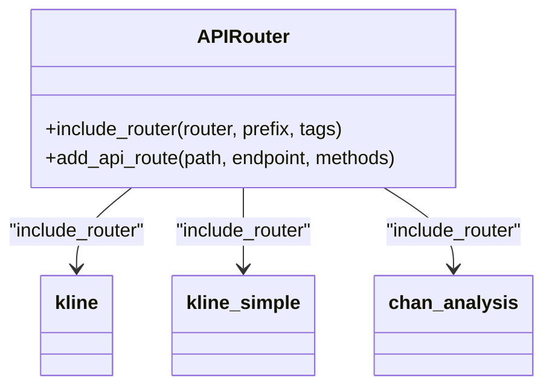
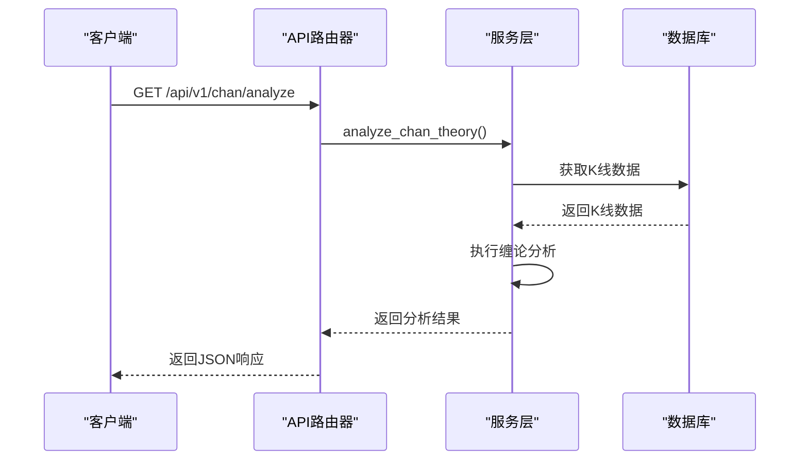
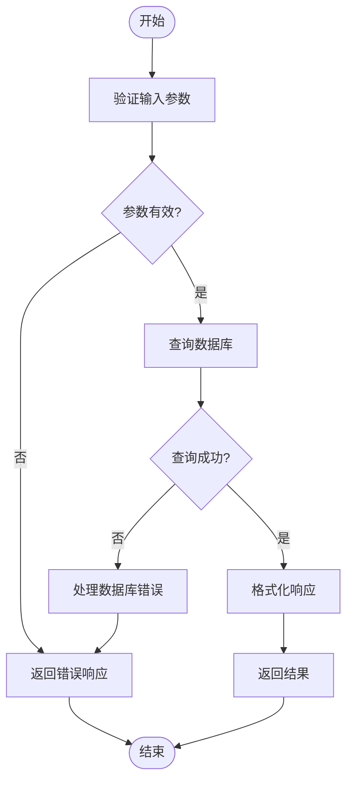
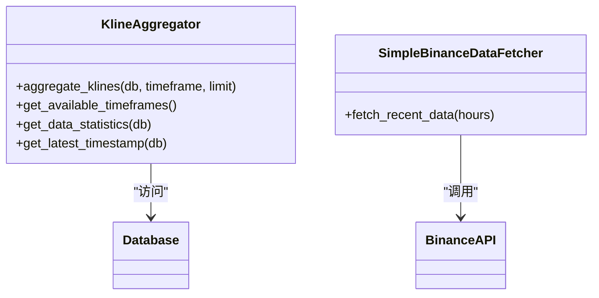
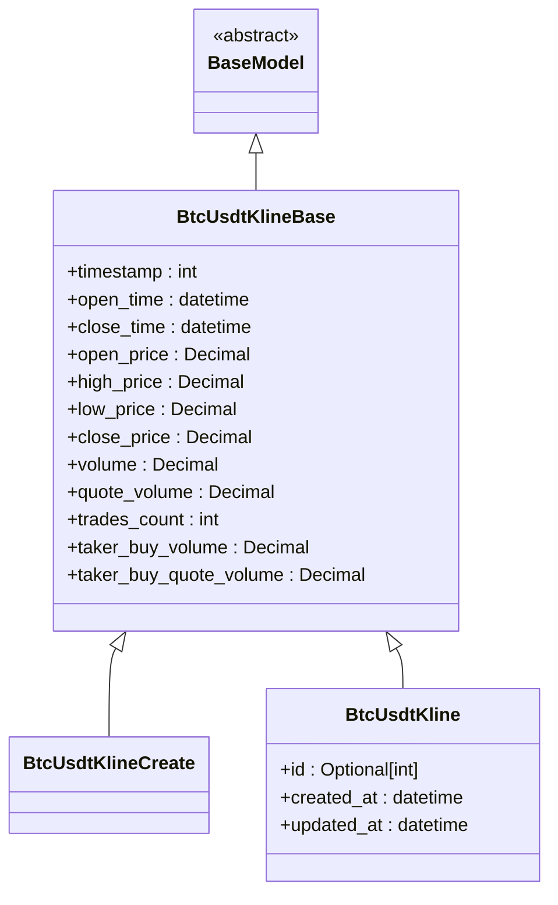
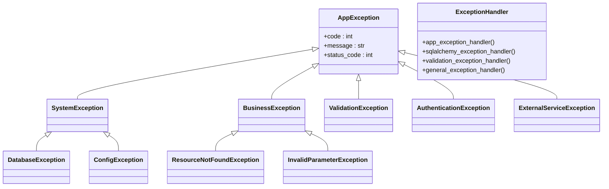
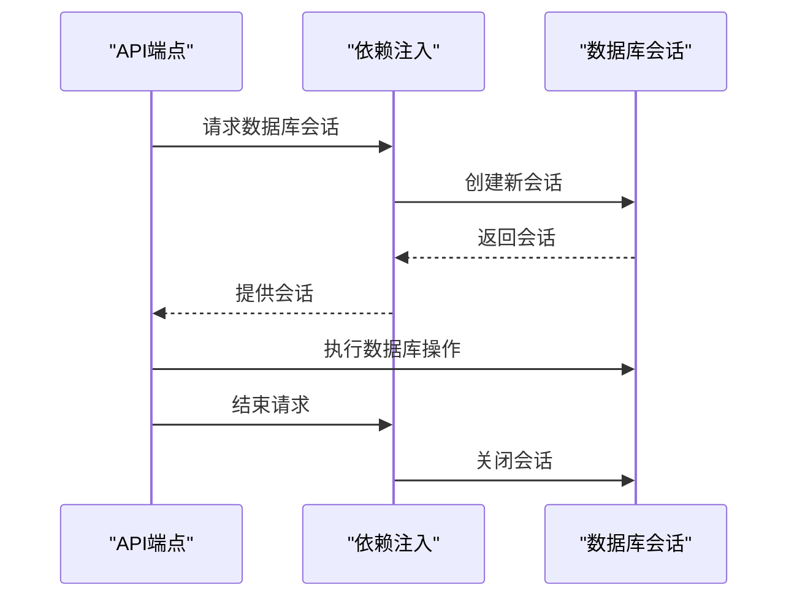
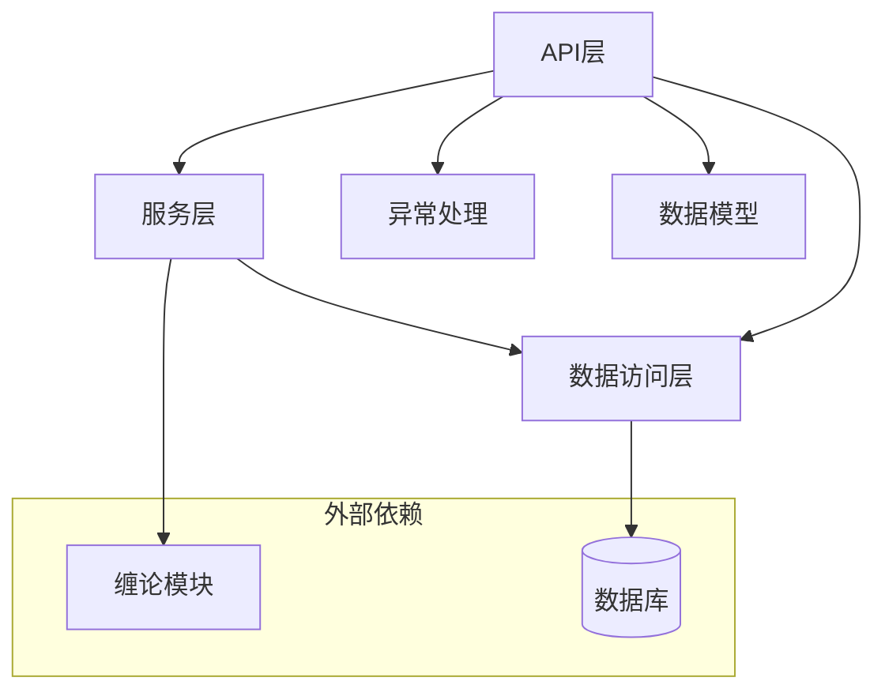

# API层

<cite>
**本文档中引用的文件**  
- [api.py](file://app/api/v1/api.py)
- [chan_analysis.py](file://app/api/v1/endpoints/chan_analysis.py)
- [kline.py](file://app/api/v1/endpoints/kline.py)
- [kline_simple.py](file://app/api/v1/endpoints/kline_simple.py)
- [kline.py](file://app/schemas/kline.py)
- [exceptions.py](file://app/core/exceptions.py)
- [deps.py](file://app/api/deps.py)
- [main.py](file://app/main.py)
</cite>

## 目录
1. [简介](#简介)
2. [项目结构](#项目结构)
3. [核心组件](#核心组件)
4. [架构概览](#架构概览)
5. [详细组件分析](#详细组件分析)
6. [依赖分析](#依赖分析)
7. [性能考虑](#性能考虑)
8. [故障排除指南](#故障排除指南)
9. [结论](#结论)

## 简介
本文档详细描述了本项目中FastAPI的实现方式，重点介绍API路由注册机制、各端点的功能职责、请求/响应模型的定义与验证机制、异常处理集成、依赖注入使用模式以及新增API端点的标准流程和最佳实践。

## 项目结构
本项目采用模块化设计，API层位于`app/api/v1`目录下，包含多个端点模块和统一的路由注册入口。

**图示来源**  
- [api.py](file://app/api/v1/api.py#L1-L12)
- [main.py](file://app/main.py#L1-L110)

**本节来源**  
- [api.py](file://app/api/v1/api.py#L1-L12)
- [main.py](file://app/main.py#L1-L110)

## 核心组件
API层的核心组件包括路由注册器、端点处理器、依赖注入系统、异常处理机制和请求/响应模型。

**本节来源**  
- [api.py](file://app/api/v1/api.py#L1-L12)
- [deps.py](file://app/api/deps.py#L1-L10)
- [exceptions.py](file://app/core/exceptions.py#L1-L110)

## 架构概览
系统采用分层架构，API层作为最上层，负责接收HTTP请求并返回JSON响应。

**图示来源**  
- [api.py](file://app/api/v1/api.py#L1-L12)
- [chan_analysis.py](file://app/api/v1/endpoints/chan_analysis.py#L1-L420)
- [kline.py](file://app/api/v1/endpoints/kline.py#L1-L194)
- [kline_simple.py](file://app/api/v1/endpoints/kline_simple.py#L1-L259)

## 详细组件分析

### 路由注册机制
API路由通过`api.py`文件中的`APIRouter`进行集中注册和管理。

**图示来源**  
- [api.py](file://app/api/v1/api.py#L1-L12)

**本节来源**  
- [api.py](file://app/api/v1/api.py#L1-L12)

### 缠论分析接口
`chan_analysis.py`提供了完整的缠论技术分析功能，包括分型识别、笔的构建、线段分析和买卖点识别。

**图示来源**  
- [chan_analysis.py](file://app/api/v1/endpoints/chan_analysis.py#L1-L420)

**本节来源**  
- [chan_analysis.py](file://app/api/v1/endpoints/chan_analysis.py#L1-L420)

### K线数据查询接口
`kline.py`提供了基于数据库的K线数据查询功能，支持多种查询方式。

**图示来源**  
- [kline.py](file://app/api/v1/endpoints/kline.py#L1-L194)

**本节来源**  
- [kline.py](file://app/api/v1/endpoints/kline.py#L1-L194)

### 简化数据获取接口
`kline_simple.py`提供了简化版的K线数据获取接口，支持多时间周期聚合。

**图示来源**  
- [kline_simple.py](file://app/api/v1/endpoints/kline_simple.py#L1-L259)

**本节来源**  
- [kline_simple.py](file://app/api/v1/endpoints/kline_simple.py#L1-L259)

### 请求/响应模型
使用Pydantic Schema定义和验证请求/响应数据模型。

**图示来源**  
- [kline.py](file://app/schemas/kline.py#L1-L29)

**本节来源**  
- [kline.py](file://app/schemas/kline.py#L1-L29)

### 异常处理集成
系统实现了统一的异常处理机制，确保API返回一致的错误格式。

**图示来源**  
- [exceptions.py](file://app/core/exceptions.py#L1-L110)

**本节来源**  
- [exceptions.py](file://app/core/exceptions.py#L1-L110)

### 依赖注入使用模式
通过`deps.py`文件实现数据库会话的依赖注入。

**图示来源**  
- [deps.py](file://app/api/deps.py#L1-L10)

**本节来源**  
- [deps.py](file://app/api/deps.py#L1-L10)

## 依赖分析
API层依赖于多个内部和外部组件，形成清晰的依赖关系。

**图示来源**  
- [api.py](file://app/api/v1/api.py#L1-L12)
- [chan_analysis.py](file://app/api/v1/endpoints/chan_analysis.py#L1-L420)
- [kline.py](file://app/api/v1/endpoints/kline.py#L1-L194)
- [kline_simple.py](file://app/api/v1/endpoints/kline_simple.py#L1-L259)

**本节来源**  
- [api.py](file://app/api/v1/api.py#L1-L12)
- [chan_analysis.py](file://app/api/v1/endpoints/chan_analysis.py#L1-L420)
- [kline.py](file://app/api/v1/endpoints/kline.py#L1-L194)
- [kline_simple.py](file://app/api/v1/endpoints/kline_simple.py#L1-L259)

## 性能考虑
API层在设计时考虑了性能优化，包括数据库查询优化、缓存机制和异步处理。

## 故障排除指南
当API出现问题时，可以按照以下步骤进行排查：

1. 检查API健康状态：访问`/health`端点
2. 检查数据库连接状态
3. 查看日志文件中的错误信息
4. 验证请求参数是否符合Schema定义
5. 检查依赖服务是否正常运行

**本节来源**  
- [main.py](file://app/main.py#L1-L110)
- [exceptions.py](file://app/core/exceptions.py#L1-L110)

## 结论
本文档详细介绍了本项目中API层的实现方式，包括路由注册、端点功能、数据模型、异常处理和依赖注入等核心机制。开发者可以基于这些标准和最佳实践来扩展和维护API功能。