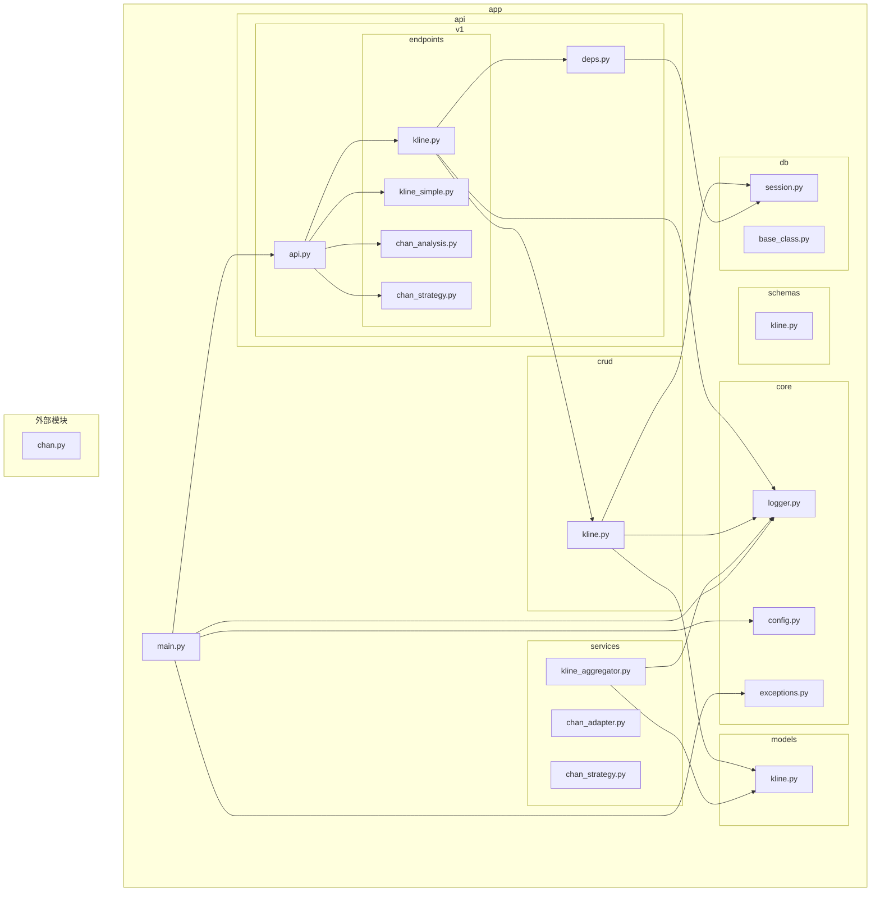
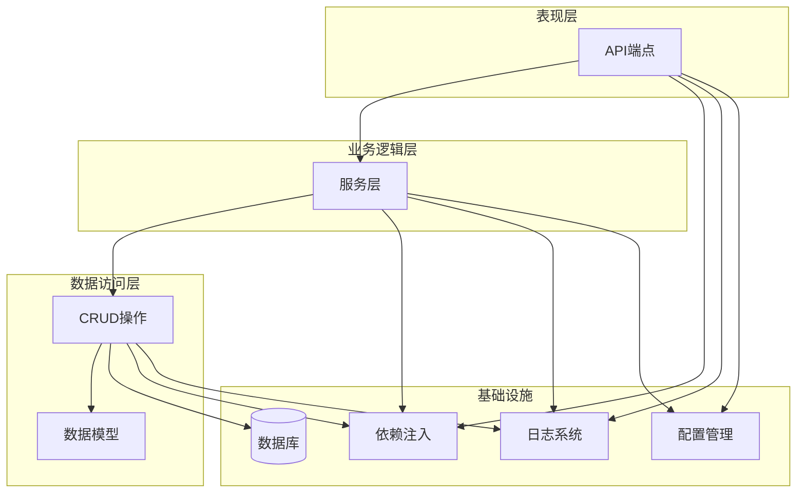
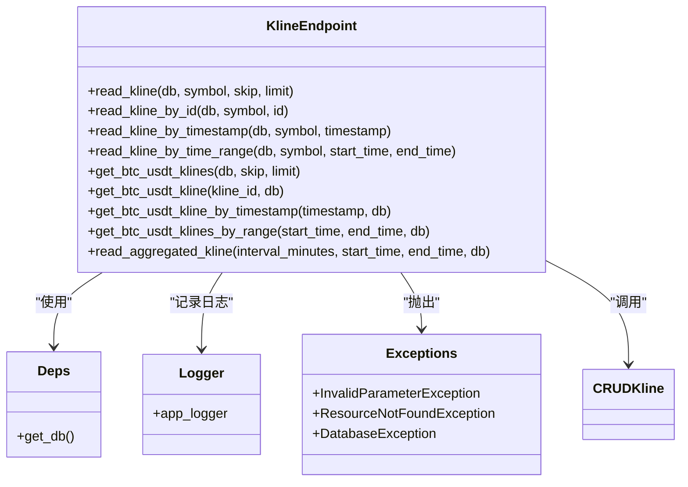
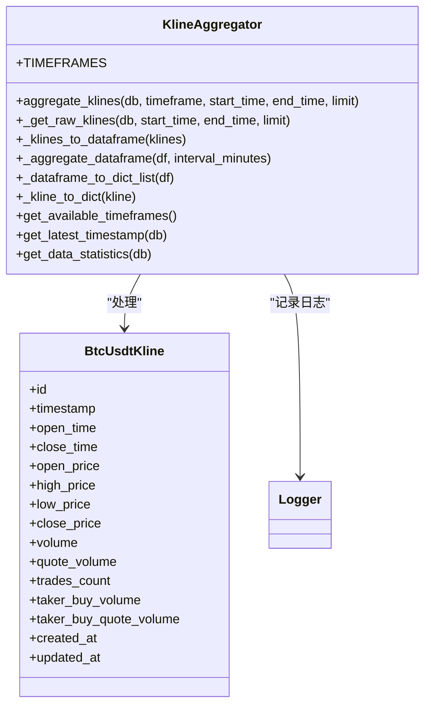
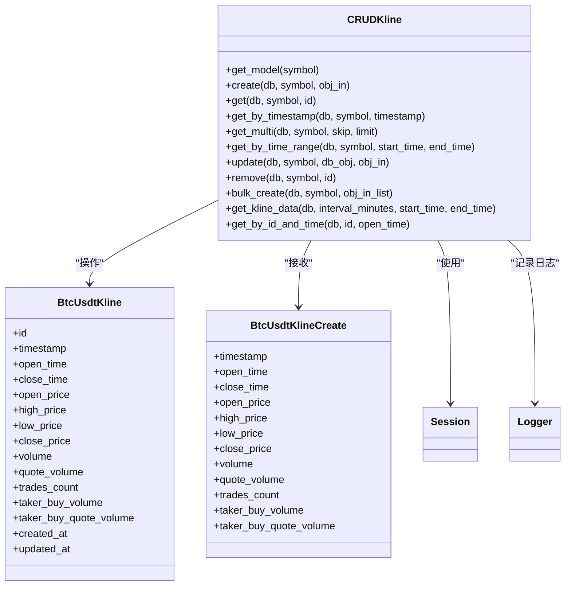
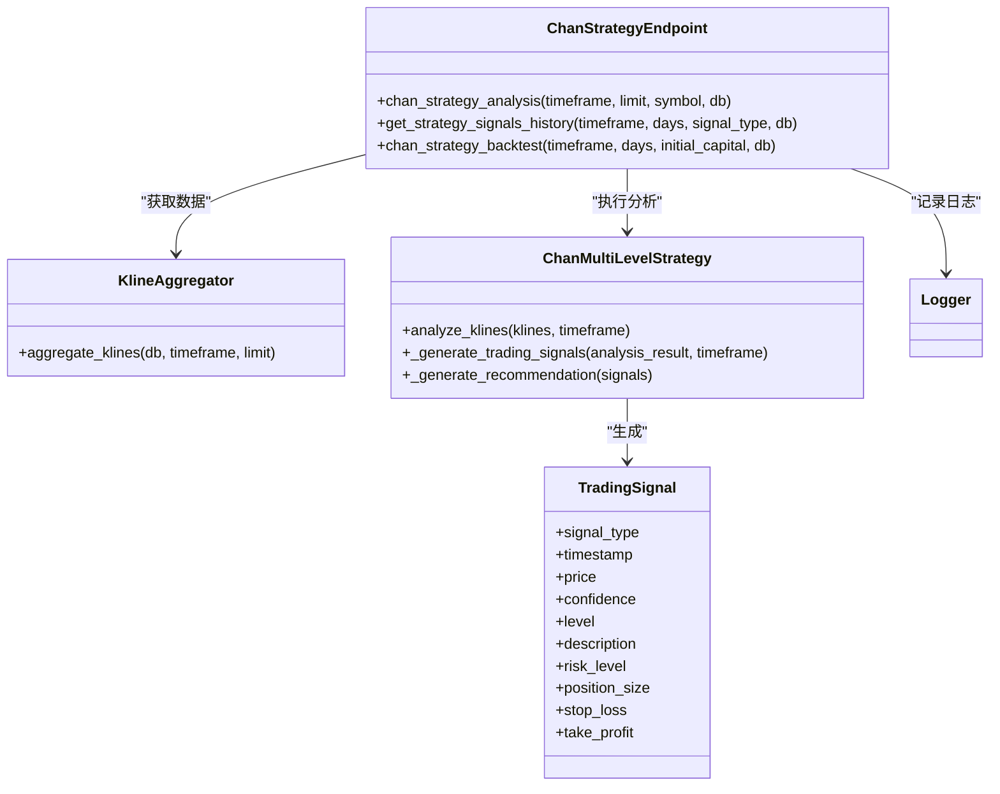
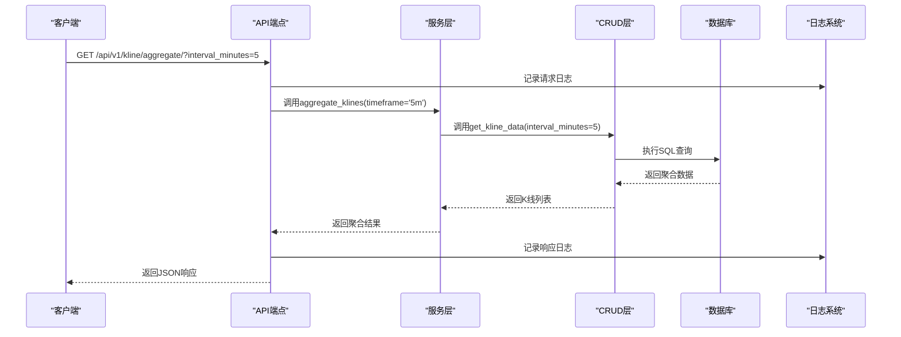
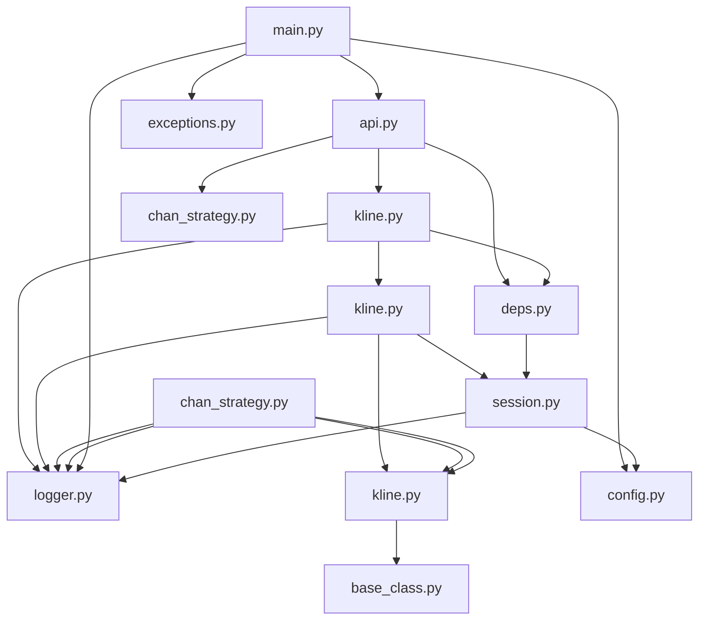

<docs>
# 后端架构

<cite>
**本文档中引用的文件**
- [main.py](file://app/main.py)
- [deps.py](file://app/api/deps.py)
- [config.py](file://app/core/config.py)
- [logger.py](file://app/core/logger.py)
- [api.py](file://app/api/v1/api.py) - *在最近的提交中更新*
- [kline.py](file://app/api/v1/endpoints/kline.py)
- [chan_strategy.py](file://app/api/v1/endpoints/chan_strategy.py) - *新增于最近的提交*
- [kline_aggregator.py](file://app/services/kline_aggregator.py)
- [kline.py](file://app/crud/kline.py)
- [kline.py](file://app/models/kline.py)
- [kline.py](file://app/schemas/kline.py)
- [session.py](file://app/db/session.py)
- [base_class.py](file://app/db/base_class.py)
</cite>

## 更新摘要
**已更改内容**
- 更新了API路由注册部分，以反映新的缠论策略API端点
- 新增了“缠论策略分析API端点”章节，详细描述新功能
- 更新了架构概览图和依赖关系图，包含新的策略模块
- 在项目结构图中添加了新的API端点文件

**新增章节**
- **缠论策略分析API端点**：详细说明了多级别联立分析交易策略的实现

**已更新的源文件**
- [api.py](file://app/api/v1/api.py) - *在提交f26e7632中更新*
- [chan_strategy.py](file://app/api/v1/endpoints/chan_strategy.py) - *在提交f26e7632中新增*

## 目录
1. [简介](#简介)
2. [项目结构](#项目结构)
3. [核心组件](#核心组件)
4. [架构概览](#架构概览)
5. [详细组件分析](#详细组件分析)
6. [依赖分析](#依赖分析)
7. [性能考虑](#性能考虑)
8. [故障排除指南](#故障排除指南)
9. [结论](#结论)

## 简介
本项目是一个基于FastAPI的缠论自动化交易系统后端，采用MVC分层架构设计。系统集成了专业的技术分析模块（Chan模块），支持K线数据聚合、缠论分析、买卖点识别等功能。架构设计注重可测试性、可维护性和可扩展性，通过清晰的分层和依赖注入机制，实现了各组件之间的松耦合。系统支持多时间周期K线数据处理，从1分钟到日线级别，并通过RESTful API提供服务。整体架构遵循现代Python Web应用的最佳实践，包含配置管理、日志系统、异常处理等企业级特性。

## 项目结构
项目采用标准的FastAPI项目结构，按功能模块组织代码。核心应用位于`app`目录下，包含API端点、业务逻辑、数据访问等组件。`chan.py`目录包含独立的缠论分析核心模块。项目结构清晰，各层职责分明，便于维护和扩展。



**图示来源**
- [main.py](file://app/main.py#L1-L109)
- [api.py](file://app/api/v1/api.py#L1-L12)
- [deps.py](file://app/api/deps.py#L1-L10)
- [config.py](file://app/core/config.py#L1-L65)
- [logger.py](file://app/core/logger.py#L1-L44)
- [kline.py](file://app/api/v1/endpoints/kline.py#L1-L194)
- [kline_aggregator.py](file://app/services/kline_aggregator.py#L1-L250)
- [kline.py](file://app/crud/kline.py#L1-L354)
- [kline.py](file://app/models/kline.py#L1-L36)
- [kline.py](file://app/schemas/kline.py#L1-L29)
- [session.py](file://app/db/session.py#L1-L43)
- [base_class.py](file://app/db/base_class.py#L1-L12)

**章节来源**
- [main.py](file://app/main.py#L1-L109)
- [api.py](file://app/api/v1/api.py#L1-L12)

## 核心组件
系统核心组件包括FastAPI应用实例、数据库会话管理、配置系统、日志系统和全局异常处理器。这些组件在应用启动时初始化，为整个系统提供基础服务。API路由通过模块化方式注册，确保代码的可维护性。依赖注入系统通过`get_db`函数实现，为各层组件提供数据库会话。配置系统使用Pydantic Settings，支持环境变量注入，便于不同环境的部署。日志系统配置了控制台和文件双输出，支持日志轮转，确保生产环境的可观测性。

**章节来源**
- [main.py](file://app/main.py#L1-L109)
- [deps.py](file://app/api/deps.py#L1-L10)
- [config.py](file://app/core/config.py#L1-L65)
- [logger.py](file://app/core/logger.py#L1-L44)

## 架构概览
系统采用典型的MVC（Model-View-Controller）分层架构，其中API端点层对应Controller，服务层对应Business Logic，CRUD层对应Data Access，模型层对应Model。这种分层设计实现了关注点分离，提高了代码的可测试性和可维护性。请求处理流程从API端点开始，经过服务层的业务逻辑处理，通过CRUD层访问数据，最终返回响应。各层之间通过清晰的接口进行通信，降低了耦合度。



**图示来源**
- [main.py](file://app/main.py#L1-L109)
- [api.py](file://app/api/v1/api.py#L1-L12)
- [kline.py](file://app/api/v1/endpoints/kline.py#L1-L194)
- [kline_aggregator.py](file://app/services/kline_aggregator.py#L1-L250)
- [kline.py](file://app/crud/kline.py#L1-L354)
- [kline.py](file://app/models/kline.py#L1-L36)
- [chan_strategy.py](file://app/api/v1/endpoints/chan_strategy.py#L1-L441)

## 详细组件分析

### API端点分析
API端点层负责处理HTTP请求和响应，是系统的外部接口。该层通过FastAPI的APIRouter组织路由，支持版本管理。每个端点函数使用依赖注入获取数据库会话，并调用下层服务或CRUD组件完成业务逻辑。端点层包含详细的参数验证、错误处理和日志记录，确保API的健壮性和可观测性。



**图示来源**
- [kline.py](file://app/api/v1/endpoints/kline.py#L1-L194)
- [deps.py](file://app/api/deps.py#L1-L10)
- [logger.py](file://app/core/logger.py#L1-L44)
- [exceptions.py](file://app/core/exceptions.py#L1-L10)

**章节来源**
- [kline.py](file://app/api/v1/endpoints/kline.py#L1-L194)

### 服务层分析
服务层封装了核心业务逻辑，特别是K线数据聚合功能。`KlineAggregator`类提供了将1分钟K线聚合为多种时间周期（5m, 15m, 1h, 4h, 1d等）的能力。该服务使用Pandas进行高效的数据处理，通过resample功能实现时间序列聚合。服务层独立于API和数据访问层，可以被多个端点复用，也便于单元测试。



**图示来源**
- [kline_aggregator.py](file://app/services/kline_aggregator.py#L1-L250)
- [kline.py](file://app/models/kline.py#L1-L36)
- [logger.py](file://app/core/logger.py#L1-L44)

**章节来源**
- [kline_aggregator.py](file://app/services/kline_aggregator.py#L1-L250)

### CRUD层分析
CRUD层负责与数据库的直接交互，实现了数据的创建、读取、更新和删除操作。`CRUDKline`类提供了类型安全的数据库操作接口，支持多种查询方式，包括分页查询、时间范围查询和聚合查询。该层使用SQLAlchemy ORM和原生SQL相结合的方式，既保证了代码的可读性，又能在需要时实现高性能的数据库操作。



**图示来源**
- [kline.py](file://app/crud/kline.py#L1-L354)
- [kline.py](file://app/models/kline.py#L1-L36)
- [kline.py](file://app/schemas/kline.py#L1-L29)
- [session.py](file://app/db/session.py#L1-L43)
- [logger.py](file://app/core/logger.py#L1-L44)

**章节来源**
- [kline.py](file://app/crud/kline.py#L1-L354)

### 数据模型分析
数据模型层定义了数据库表结构和ORM映射。系统采用继承的方式实现多表结构，`Kline`作为抽象基类定义了所有K线表的公共字段，`BtcUsdtKline`和`EthUsdtKline`等具体类继承基类并指定表名。这种设计避免了代码重复，同时支持多种交易品种的数据存储。`SYMBOL_TO_MODEL`映射表实现了交易品种到模型类的动态映射。

```mermaid
classDiagram
class Kline {
<<abstract>>
+id : Integer
+timestamp : BigInteger
+open_time : DateTime
+close_time : DateTime
+open_price : Numeric
+high_price : Numeric
+low_price : Numeric
+close_price : Numeric
+volume : Numeric
+quote_volume : Numeric
+trades_count : Integer
+taker_buy_volume : Numeric
+taker_buy_quote_volume : Numeric
+created_at : DateTime
+updated_at : DateTime
}
class BtcUsdtKline {
__tablename__ = "btc_usdt"
}
class EthUsdtKline {
__tablename__ = "eth_usdt"
}
Kline <|-- BtcUsdtKline
Kline <|-- EthUsdtKline
class SYMBOL_TO_MODEL {
"btc_usdt" : BtcUsdtKline
"eth_usdt" : EthUsdtKline
}
```

**图示来源**
- [kline.py](file://app/models/kline.py#L1-L36)
- [base_class.py](file://app/db/base_class.py#L1-L12)

**章节来源**
- [kline.py](file://app/models/kline.py#L1-L36)

### 缠论策略分析API端点
新增的`chan_strategy.py`文件实现了基于缠论的多级别联立分析交易策略。该API端点提供专业的技术分析功能，包括分型识别、笔段构建、趋势分析和买卖点生成。策略分析支持多种时间周期，能够生成详细的交易信号和风险评估。API设计遵循RESTful原则，提供分析、历史信号查询和回测三大核心功能。



**图示来源**
- [chan_strategy.py](file://app/api/v1/endpoints/chan_strategy.py#L1-L441)
- [kline_aggregator.py](file://app/services/kline_aggregator.py#L1-L250)
- [chan_strategy.py](file://app/services/chan_strategy.py#L1-L661)
- [logger.py](file://app/core/logger.py#L1-L44)

**章节来源**
- [chan_strategy.py](file://app/api/v1/endpoints/chan_strategy.py#L1-L441)

### 请求处理流程分析
以下序列图展示了从HTTP请求到数据库访问的完整处理流程，以获取聚合K线数据为例。该流程体现了各层之间的调用关系和数据流动。



**图示来源**
- [kline.py](file://app/api/v1/endpoints/kline.py#L1-L194)
- [kline_aggregator.py](file://app/services/kline_aggregator.py#L1-L250)
- [kline.py](file://app/crud/kline.py#L1-L354)
- [session.py](file://app/db/session.py#L1-L43)
- [logger.py](file://app/core/logger.py#L1-L44)

## 依赖分析
系统依赖关系清晰，遵循依赖倒置原则。高层模块依赖于抽象接口，而非具体实现。依赖注入系统通过`get_db`函数为各层提供数据库会话，实现了数据库访问的解耦。配置和日志系统作为全局依赖，被各组件共享使用。外部依赖包括FastAPI、SQLAlchemy、Pandas等成熟库，确保了系统的稳定性和性能。



**图示来源**
- [main.py](file://app/main.py#L1-L109)
- [api.py](file://app/api/v1/api.py#L1-L12)
- [deps.py](file://app/api/deps.py#L1-L10)
- [kline.py](file://app/api/v1/endpoints/kline.py#L1-L194)
- [kline.py](file://app/crud/kline.py#L1-L354)
- [kline.py](file://app/models/kline.py#L1-L36)
- [kline_aggregator.py](file://app/services/kline_aggregator.py#L1-L250)
- [session.py](file://app/db/session.py#L1-L43)
- [base_class.py](file://app/db/base_class.py#L1-L12)
- [config.py](file://app/core/config.py#L1-L65)
- [logger.py](file://app/core/logger.py#L1-L44)
- [chan_strategy.py](file://app/api/v1/endpoints/chan_strategy.py#L1-L441)
- [chan_strategy.py](file://app/services/chan_strategy.py#L1-L661)

**章节来源**
- [main.py](file://app/main.py#L1-L109)
- [api.py](file://app/api/v1/api.py#L1-L12)
- [deps.py](file://app/api/deps.py#L1-L10)
- [kline.py](file://app/api/v1/endpoints/kline.py#L1-L194)
- [kline.py](file://app/crud/kline.py#L1-L354)
- [kline.py](file://app/models/kline.py#L1-L36)
- [kline_aggregator.py](file://app/services/kline_aggregator.py#L1-L250)
- [session.py](file://app/db/session.py#L1-L43)
- [base_class.py](file://app/db/base_class.py#L1-L12)
- [config.py](file://app/core/config.py#L1-L65)
- [logger.py](file://app/core/logger.py#L1-L44)
- [chan_strategy.py](file://app/api/v1/endpoints/chan_strategy.py#L1-L441)

## 性能考虑
系统在性能方面进行了多项优化。数据库连接池配置了合理的大小和超时参数，避免了频繁创建连接的开销。SQL查询使用索引优化，特别是对时间戳和时间字段的查询。K线聚合操作使用原生SQL的`time_bucket`函数，利用数据库的聚合能力提高性能。对于大数据量的聚合，服务层使用Pandas进行内存中的高效处理。日志系统配置了适当的日志级别，避免在生产环境中产生过多的调试日志影响