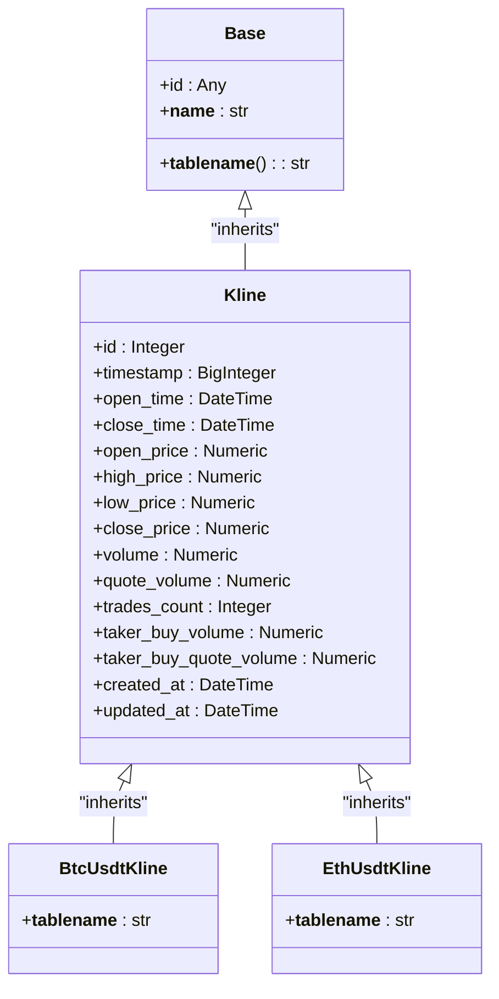
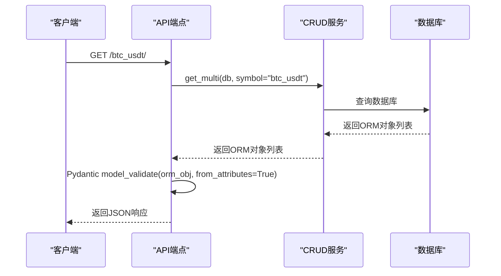

# 数据模型

<cite>
**Referenced Files in This Document**  
- [kline.py](file://app/models/kline.py)
- [kline.py](file://app/schemas/kline.py)
- [kline.py](file://app/api/v1/endpoints/kline.py)
- [kline.py](file://app/crud/kline.py)
- [base_class.py](file://app/db/base_class.py)
</cite>

## 目录
1. [ORM模型设计](#orm模型设计)
2. [API Schema设计](#api-schema设计)
3. [数据转换模式](#数据转换模式)
4. [序列化场景支持](#序列化场景支持)
5. [字段验证与默认值](#字段验证与默认值)
6. [模型定义标准流程](#模型定义标准流程)

## ORM模型设计

`app/models/kline.py` 文件定义了K线数据的ORM模型，采用SQLAlchemy作为ORM框架。核心基类 `Kline` 继承自 `Base`，并设置为抽象基类（`__abstract__ = True`），为所有具体K线表提供统一的字段结构。

该模型包含完整的K线数据字段，包括时间戳（timestamp）、时间范围（open_time/close_time）、价格信息（open_price/high_price/low_price/close_price）、交易量信息（volume/quote_volume/trades_count）以及主动买卖信息（taker_buy_volume/taker_buy_quote_volume）。所有数值字段均使用精确的 `Numeric` 类型以避免浮点数精度问题，其中价格字段精度为(20,8)，交易量字段精度为(30,8)。

数据库层面的约束通过SQLAlchemy的Column参数实现：`primary_key=True` 定义主键，`nullable=False` 确保非空，`index=True` 为高频查询字段创建索引。`created_at` 和 `updated_at` 字段使用 `server_default=func.now()` 实现数据库层面的自动时间戳管理，其中 `updated_at` 还配置了 `onupdate=func.now()` 以在更新时自动刷新。

为支持多交易品种，系统采用表继承模式，通过 `SYMBOL_TO_MODEL` 映射字典将交易对符号（如"btc_usdt"）映射到具体的ORM模型类（如 `BtcUsdtKline`），每个具体模型通过 `__tablename__` 指定对应的数据库表名。

**Diagram sources**
- [kline.py](file://app/models/kline.py#L1-L36)
- [base_class.py](file://app/db/base_class.py#L1-L12)

**Section sources**
- [kline.py](file://app/models/kline.py#L1-L36)

## API Schema设计

`app/schemas/kline.py` 文件定义了用于API请求和响应的数据验证模型，基于Pydantic构建。设计遵循分层继承模式，以最大化代码复用性和类型安全性。

基础模型 `BtcUsdtKlineBase` 定义了K线数据的核心字段结构，与ORM模型保持字段名称和类型的一致性。其字段类型映射为Python原生或标准库类型：`int` 对应数据库的 `BigInteger`，`datetime` 对应 `DateTime`，`Decimal` 对应 `Numeric`。

在此基础上，系统定义了两个派生模型：
- `BtcUsdtKlineCreate`：用于创建操作的请求模型，直接继承自 `BtcUsdtKlineBase`，表示创建新K线记录所需的所有字段。
- `BtcUsdtKline`：用于响应返回的模型，继承自 `BtcUsdtKlineBase` 并额外添加了 `id`、`created_at` 和 `updated_at` 字段，这些字段由数据库自动生成，不应由客户端提供。

关键配置在于 `BtcUsdtKline` 模型内部的 `Config` 类中设置 `from_attributes = True`，这启用了Pydantic的ORM模式，允许模型直接从ORM对象实例创建，而无需手动提取属性。

**Section sources**
- [kline.py](file://app/schemas/kline.py#L1-L30)

## 数据转换模式

系统通过Pydantic的 `from_attributes` 配置实现了ORM模型与API Schema之间的无缝数据转换。当FastAPI需要将ORM对象序列化为JSON响应时，会自动利用此机制。

在 `app/api/v1/endpoints/kline.py` 的路由处理函数中，如 `get_btc_usdt_klines`，CRUD操作返回的ORM对象列表直接作为响应数据返回。由于路由使用了 `response_model=List[BtcUsdtKline]`，FastAPI会自动为每个ORM对象调用 `BtcUsdtKline.model_validate()`，并因 `from_attributes=True` 的配置，Pydantic会通过对象的属性（而非字典）来填充模型字段。

这种模式避免了手动编写 `to_dict()` 或转换函数的样板代码，提高了开发效率和代码的可维护性。例如，当 `crud.kline.get_multi()` 返回ORM对象列表时，这些对象可以直接被Pydantic模型处理，自动完成从数据库记录到API响应的转换。

**Diagram sources**
- [kline.py](file://app/api/v1/endpoints/kline.py#L100-L115)
- [kline.py](file://app/schemas/kline.py#L25-L29)
- [kline.py](file://app/crud/kline.py#L100-L130)

**Section sources**
- [kline.py](file://app/api/v1/endpoints/kline.py#L100-L115)
- [kline.py](file://app/schemas/kline.py#L25-L29)

## 序列化场景支持

数据模型设计充分考虑了不同API场景下的序列化需求：

1.  **创建场景**：使用 `BtcUsdtKlineCreate` 模型作为请求体（request body）的类型提示。该模型不包含 `id`、`created_at`、`updated_at` 等由服务端生成的字段，确保客户端只能提供必要的创建数据。

2.  **查询返回场景**：使用 `BtcUsdtKline` 模型作为响应模型（response model）。它包含了完整的字段集，包括服务端生成的元数据，为客户端提供全面的信息。

3.  **聚合查询场景**：对于复杂的聚合查询（如 `read_aggregated_kline`），CRUD层 `get_kline_data` 方法直接构造并返回 `BtcUsdtKline` 对象列表。这些对象虽然不是直接从数据库查询出的ORM实例，但其结构与 `BtcUsdtKline` 模型兼容，因此仍能被FastAPI正确序列化。

4.  **分页查询场景**：`get_multi` 方法在CRUD层将ORM对象转换为字典列表，以精确控制字段的序列化格式（例如，将 `Decimal` 转换为字符串以避免JSON序列化问题）。这展示了在需要精细控制时，手动转换的灵活性。

**Section sources**
- [kline.py](file://app/api/v1/endpoints/kline.py#L100-L115)
- [kline.py](file://app/api/v1/endpoints/kline.py#L250-L295)
- [kline.py](file://app/crud/kline.py#L100-L130)
- [kline.py](file://app/crud/kline.py#L177-L203)

## 字段验证与默认值

模型系统提供了多层次的验证和默认值管理：

-   **数据库层面验证**：通过SQLAlchemy的 `nullable=False` 约束，确保 `open_price`、`high_price` 等核心字段在数据库中不能为空，提供持久化层的数据完整性保障。

-   **应用层面验证**：Pydantic模型在API入口处进行数据验证。如果客户端提交的数据类型错误（如将 `timestamp` 发送为字符串），或缺少必填字段，Pydantic会自动抛出HTTP 422错误，无需在业务逻辑中手动检查。

-   **默认值设置**：`id` 字段在 `BtcUsdtKline` 模型中定义为 `Optional[int] = None`，这表示该字段在创建时可以不存在（由数据库生成），但在响应中会存在。`created_at` 和 `updated_at` 的默认值由数据库的 `server_default` 机制处理，确保了时间戳的准确性和一致性。

-   **业务逻辑验证**：虽然基础模型不包含复杂验证，但系统在其他地方（如测试脚本 `test_kline_query.py`）展示了业务规则验证，例如断言 `open_time <= close_time` 和 `high_price >= low_price`。这类验证可以在服务层或通过Pydantic的自定义验证器实现。

**Section sources**
- [kline.py](file://app/models/kline.py#L1-L36)
- [kline.py](file://app/schemas/kline.py#L1-L30)
- [test_kline_query.py](file://app/scripts/test_kline_query.py#L41-L69)

## 模型定义标准流程

为开发者提供定义新数据模型的标准流程如下：

1.  **定义ORM模型**：在 `app/models/` 目录下创建新文件，继承 `Base` 类，定义字段、数据类型、约束和索引。对于通用基础字段，可考虑扩展 `Kline` 基类。

2.  **定义Pydantic Schema**：在 `app/schemas/` 目录下创建对应文件，定义 `Base`、`Create` 和 `Response` 三层模型。`Response` 模型必须在 `Config` 中设置 `from_attributes = True`。

3.  **实现CRUD操作**：在 `app/crud/` 目录下创建CRUD类，实现 `create`、`get`、`get_multi`、`update`、`remove` 等标准方法，使用 `model_validate` 进行类型转换。

4.  **创建API端点**：在 `app/api/v1/endpoints/` 目录下创建路由，使用 `Depends` 注入数据库会话，调用CRUD方法，并通过 `response_model` 指定响应Schema。

5.  **版本兼容性与迁移**：
    -   **向后兼容**：新增字段应设为可选（`Optional`）或提供合理的默认值。
    -   **数据库迁移**：使用Alembic等工具管理数据库模式变更。新增非空字段时，需在迁移脚本中提供默认值或填充现有数据。
    -   **API版本控制**：通过 `API_V1_STR` 等配置进行版本隔离，确保旧版API不受影响。

此流程确保了数据模型的一致性、可维护性和可扩展性，为系统稳定运行奠定了坚实基础。

**Section sources**
- [kline.py](file://app/models/kline.py)
- [kline.py](file://app/schemas/kline.py)
- [kline.py](file://app/crud/kline.py)
- [kline.py](file://app/api/v1/endpoints/kline.py)