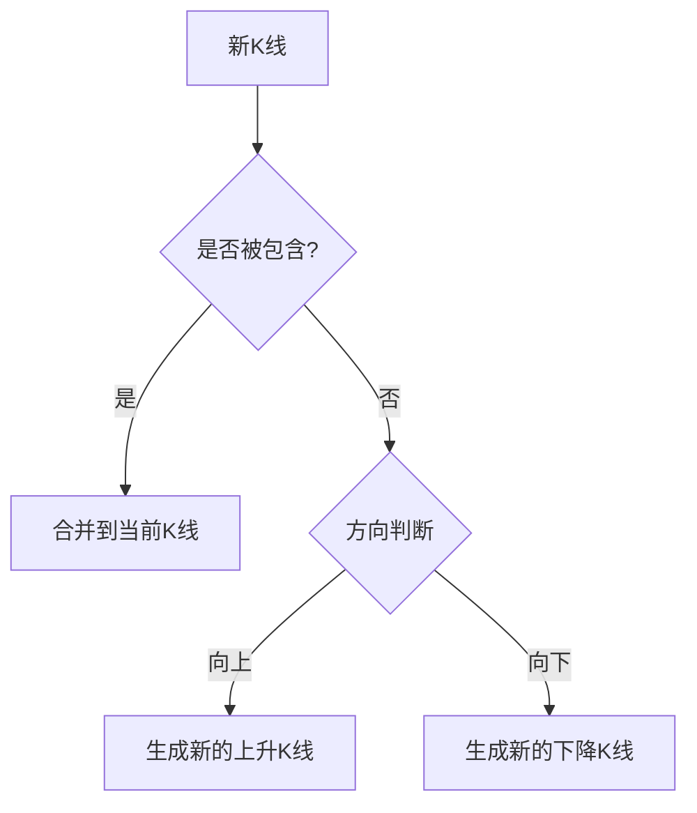
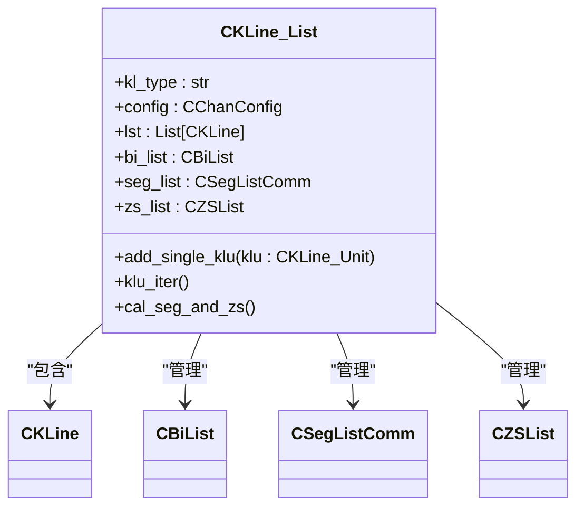
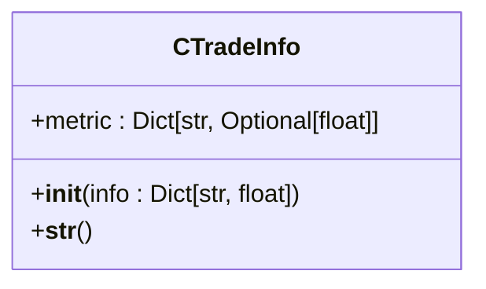
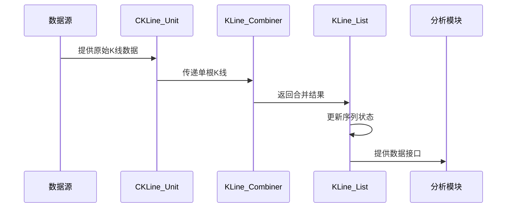

# K线处理

<cite>
**本文档中引用的文件**
- [KLine_Unit.py](file://chan.py/KLine/KLine_Unit.py)
- [KLine_Combiner.py](file://chan.py/Combiner/KLine_Combiner.py)
- [KLine_List.py](file://chan.py/KLine/KLine_List.py)
- [TradeInfo.py](file://chan.py/KLine/TradeInfo.py)
</cite>

## 目录
1. [简介](#简介)
2. [CKLine_Unit类详解](#ckline_unit类详解)
3. [KLine_Combiner合并机制](#kline_combiner合并机制)
4. [KLine_List容器管理](#kline_list容器管理)
5. [TradeInfo扩展数据](#tradeinfo扩展数据)
6. [模块集成与使用示例](#模块集成与使用示例)

## 简介
K线处理模块是缠论技术分析的核心基础组件，负责原始K线数据的表示、合并与管理。该模块通过CKLine_Unit类精确表示单根K线，利用KLine_Combiner实现符合缠论规则的K线合并，通过KLine_List统一管理K线序列，并通过TradeInfo类扩展交易指标。本模块为后续的分型识别、笔段划分等高级分析功能提供数据支持。

## CKLine_Unit类详解

CKLine_Unit类是单根K线的基本数据单元，封装了时间、价格和交易量等核心信息。

### 基本属性
- **时间戳**: 通过CTime对象存储K线时间
- **价格数据**: 包含开盘价(open)、收盘价(close)、最高价(high)、最低价(low)
- **数据验证**: 在初始化时通过check方法验证价格逻辑的合理性

### 核心功能
- **数据完整性检查**: 确保最低价是四个价格中的最小值，最高价是最大值
- **前后关联**: 通过pre和next属性维护K线序列的链式结构
- **索引管理**: 通过set_idx和idx属性管理K线在序列中的位置
- **深度拷贝**: 实现__deepcopy__方法支持对象的完整复制

### 扩展功能
- **技术指标计算**: 支持MACD、BOLL、RSI、KDJ等多种技术指标的动态计算
- **德马克指标**: 内置CDemarkIndex支持德马克序列分析
- **趋势模型**: 支持多种趋势模型的集成与计算

**Section sources**
- [KLine_Unit.py](file://chan.py/KLine/KLine_Unit.py#L16-L153)

## KLine_Combiner合并机制

KLine_Combiner类负责将原始K线按照缠论规则进行合并，生成符合分析要求的合并K线。

### 合并规则


### 核心算法
- **包含判断**: 通过test_combine方法判断两根K线是否存在包含关系
- **方向确定**: 根据高点和低点的变化确定K线方向（UP/DOWN）
- **极值更新**: 在合并过程中动态更新最高价和最低价
- **时间范围**: 维护合并K线的时间跨度（time_begin到time_end）

### 特殊处理
- **一字K线**: 特殊处理开盘价、收盘价、最高价、最低价相等的情况
- **顶底识别**: 支持通过update_fx方法识别分型（FX_TYPE.TOP/BOTTOM）
- **缓存机制**: 使用make_cache装饰器优化高频查询性能

**Diagram sources**
- [KLine_Combiner.py](file://chan.py/Combiner/KLine_Combiner.py#L0-L175)

**Section sources**
- [KLine_Combiner.py](file://chan.py/Combiner/KLine_Combiner.py#L0-L175)

## KLine_List容器管理

KLine_List类作为K线序列的容器，负责管理合并后的K线列表及其相关分析组件。

### 数据结构


### 核心功能
- **K线添加**: 通过add_single_klu方法逐根添加原始K线
- **序列迭代**: 提供klu_iter方法支持K线单元的遍历
- **分段计算**: 集成笔、线段、中枢等缠论核心概念的计算
- **买卖点识别**: 集成买卖点列表的管理与计算

### 处理流程
1. 接收原始K线数据
2. 计算技术指标
3. 尝试与最后一根合并K线合并
4. 若无法合并，则创建新的合并K线
5. 更新分型、笔、线段等衍生结构

**Diagram sources**
- [KLine_List.py](file://chan.py/KLine/KLine_List.py#L0-L204)

**Section sources**
- [KLine_List.py](file://chan.py/KLine/KLine_List.py#L0-L204)

## TradeInfo扩展数据

TradeInfo类用于扩展K线数据，支持换手率、成交额等高级交易指标。

### 数据结构


### 核心特性
- **灵活扩展**: 通过字典结构支持任意数量的交易指标
- **统一接口**: 所有指标通过metric字典统一访问
- **安全初始化**: 使用get方法避免键不存在的异常
- **字符串表示**: 提供清晰的字符串输出格式

### 支持指标
- 换手率
- 成交额
- 成交量
- 其他自定义交易指标

**Diagram sources**
- [TradeInfo.py](file://chan.py/KLine/TradeInfo.py#L0-L13)

**Section sources**
- [TradeInfo.py](file://chan.py/KLine/TradeInfo.py#L0-L13)

## 模块集成与使用示例

### 数据处理流程


### 集成方式
- **与分型识别集成**: 通过fx属性提供分型信息
- **与笔段划分集成**: 通过bi_list和seg_list提供笔段数据
- **与买卖点分析集成**: 通过bs_point_lst提供买卖点信息
- **与可视化集成**: 提供标准化的数据输出格式

### 使用示例
```python
# 创建K线列表
kl_list = CKLine_List(kl_type="1m", conf=config)

# 添加原始K线
for raw_kline in raw_data:
    klu = CKLine_Unit(raw_kline)
    kl_list.add_single_klu(klu)

# 访问合并后的K线
for klc in kl_list:
    print(f"时间: {klc.time_begin}~{klc.time_end}")
    print(f"价格: {klc.low}->{klc.high}")
    print(f"分型: {klc.fx}")
```

**Diagram sources**
- [KLine_Unit.py](file://chan.py/KLine/KLine_Unit.py#L16-L153)
- [KLine_Combiner.py](file://chan.py/Combiner/KLine_Combiner.py#L0-L175)
- [KLine_List.py](file://chan.py/KLine/KLine_List.py#L0-L204)