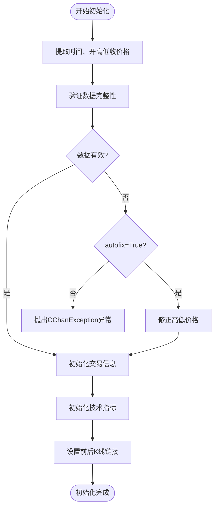
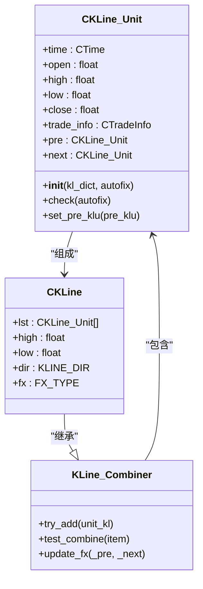
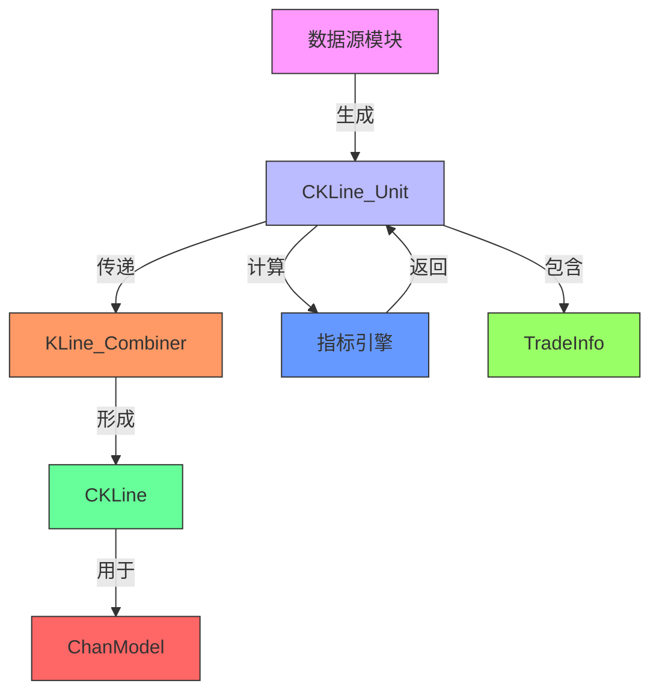

# K线数据单元

<cite>
**本文档中引用的文件**
- [KLine_Unit.py](file://chan.py/KLine/KLine_Unit.py)
- [KLine.py](file://chan.py/KLine/KLine.py)
- [KLine_Combiner.py](file://chan.py/Combiner/KLine_Combiner.py)
- [CEnum.py](file://chan.py/Common/CEnum.py)
- [TradeInfo.py](file://chan.py/KLine/TradeInfo.py)
</cite>

## 目录
1. [简介](#简介)
2. [属性结构](#属性结构)
3. [初始化与数据验证](#初始化与数据验证)
4. [时间序列对齐与价格连续性检查](#时间序列对齐与价格连续性检查)
5. [在分型识别和笔构建中的作用](#在分型识别和笔构建中的作用)
6. [与其他模块的数据传递关系](#与其他模块的数据传递关系)
7. [代码示例](#代码示例)
8. [结论](#结论)

## 简介
`CKLine_Unit` 类是缠论分析系统中K线数据的最小单位，代表单根K线的基本信息。该类封装了时间、价格和交易量等核心市场数据，并提供了数据验证、技术指标计算和层级结构管理等功能。作为整个分析体系的基础单元，`CKLine_Unit` 在时间序列处理、分型识别、笔和线段构建中起着关键作用。

**Section sources**
- [KLine_Unit.py](file://chan.py/KLine/KLine_Unit.py#L16-L153)

## 属性结构
`CKLine_Unit` 类包含以下核心属性：

- **时间戳（time）**: 使用 `CTime` 类型表示的时间信息，来源于 `DATA_FIELD.FIELD_TIME`。
- **开盘价（open）**: 开盘价格，来源于 `DATA_FIELD.FIELD_OPEN`。
- **最高价（high）**: 最高价，来源于 `DATA_FIELD.FIELD_HIGH`。
- **最低价（low）**: 最低价，来源于 `DATA_FIELD.FIELD_LOW`。
- **收盘价（close）**: 收盘价，来源于 `DATA_FIELD.FIELD_CLOSE`。
- **成交量（volume）**: 成交量，作为交易信息的一部分存储在 `trade_info` 中。
- **成交额（turnover）**: 成交额，可选字段，存储在 `trade_info` 中。
- **换手率（turnover_rate）**: 换手率，可选字段，存储在 `trade_info` 中。

此外，还包含一些辅助属性：
- `kl_type`: K线类型（如1分钟、日线等）
- `trade_info`: 交易信息对象，包含成交量、成交额、换手率等
- `demark`: 德马克指标索引
- `sub_kl_list`: 次级别K线单元列表
- `sup_kl`: 指向更高级别的K线单元
- `pre` 和 `next`: 指向前一根和后一根K线单元的指针
- `idx`: 索引值

**Section sources**
- [KLine_Unit.py](file://chan.py/KLine/KLine_Unit.py#L16-L153)
- [CEnum.py](file://chan.py/Common/CEnum.py#L100-L110)

## 初始化与数据验证
`CKLine_Unit` 通过 `__init__` 方法进行初始化，接收一个包含K线数据的字典 `kl_dict` 和一个可选的 `autofix` 参数。

初始化过程包括：
1. 从 `kl_dict` 中提取时间、开盘价、最高价、最低价和收盘价
2. 调用 `check` 方法验证数据完整性
3. 创建 `CTradeInfo` 对象存储交易信息
4. 初始化技术指标相关属性
5. 设置前后K线单元的链接关系

数据验证通过 `check` 方法实现，确保最低价确实是四个价格中的最小值，最高价是最大值。如果数据不合法且 `autofix=True`，则自动修正；否则抛出 `CChanException` 异常。



**Diagram sources**
- [KLine_Unit.py](file://chan.py/KLine/KLine_Unit.py#L16-L50)

**Section sources**
- [KLine_Unit.py](file://chan.py/KLine/KLine_Unit.py#L16-L50)

## 时间序列对齐与价格连续性检查
`CKLine_Unit` 类通过 `pre` 和 `next` 属性维护时间序列的连续性，形成一个双向链表结构。`set_pre_klu` 方法用于设置前一根K线单元，并自动建立双向链接。

价格连续性检查主要通过 `check` 方法实现，确保每根K线的最高价不低于四个价格中的最大值，最低价不高于最小值。这种验证机制保证了K线数据的合理性，防止因数据错误导致后续分析出现偏差。

此外，`include_sub_lv_time` 方法支持跨级别时间对齐，可用于检查次级别K线是否包含特定时间点，这对于多级别分析非常重要。

**Section sources**
- [KLine_Unit.py](file://chan.py/KLine/KLine_Unit.py#L130-L153)

## 在分型识别和笔构建中的作用
`CKLine_Unit` 是分型识别和笔构建的基础单元。多个 `CKLine_Unit` 通过 `KLine_Combiner` 组合成 `CKLine` 对象，形成更高层次的分析结构。

在笔的构建过程中，`CKLine_Unit` 提供了必要的价格信息和时间序列关系。`get_peak_klu` 方法可以获取最高点或最低点所在的K线单元，这对于识别顶分型和底分型至关重要。



**Diagram sources**
- [KLine_Unit.py](file://chan.py/KLine/KLine_Unit.py#L16-L153)
- [KLine.py](file://chan.py/KLine/KLine.py#L1-L97)
- [KLine_Combiner.py](file://chan.py/Combiner/KLine_Combiner.py#L1-L175)

**Section sources**
- [KLine_Unit.py](file://chan.py/KLine/KLine_Unit.py#L16-L153)
- [KLine.py](file://chan.py/KLine/KLine.py#L1-L97)

## 与其他模块的数据传递关系
`CKLine_Unit` 与多个模块存在紧密的数据传递关系：

1. **与 `KLine_Combiner` 模块**: 通过 `try_add` 方法将 `CKLine_Unit` 添加到 `KLine_Combiner` 中，形成合并后的K线。
2. **与 `ChanModel` 模块**: 通过 `set_metric` 方法计算各种技术指标（MACD、BOLL、RSI等），并将结果存储在 `CKLine_Unit` 中。
3. **与数据源模块**: 各数据源（BaoStockAPI、binance.py等）直接生成 `CKLine_Unit` 实例，作为原始数据的载体。
4. **与 `TradeInfo` 模块**: 将成交量、成交额、换手率等交易信息封装在 `CTradeInfo` 对象中。



**Diagram sources**
- [KLine_Unit.py](file://chan.py/KLine/KLine_Unit.py#L16-L153)
- [KLine_Combiner.py](file://chan.py/Combiner/KLine_Combiner.py#L1-L175)
- [TradeInfo.py](file://chan.py/KLine/TradeInfo.py#L1-L20)

**Section sources**
- [KLine_Unit.py](file://chan.py/KLine/KLine_Unit.py#L16-L153)
- [KLine_Combiner.py](file://chan.py/Combiner/KLine_Combiner.py#L1-L175)

## 代码示例
以下是创建 `CKLine_Unit` 实例的典型代码示例：

```python
# 从原始市场数据创建CKLine_Unit实例
kl_dict = {
    DATA_FIELD.FIELD_TIME: CTime("2023-01-01 09:30"),
    DATA_FIELD.FIELD_OPEN: 100.0,
    DATA_FIELD.FIELD_HIGH: 105.0,
    DATA_FIELD.FIELD_LOW: 98.0,
    DATA_FIELD.FIELD_CLOSE: 103.0,
    DATA_FIELD.FIELD_VOLUME: 10000,
    DATA_FIELD.FIELD_TURNOVER: 1030000,
    DATA_FIELD.FIELD_TURNRATE: 0.015
}

# 创建CKLine_Unit实例
klu = CKLine_Unit(kl_dict, autofix=True)

# 设置技术指标
macd_engine = CMACD()
boll_model = BollModel()
klu.set_metric([macd_engine, boll_model])

# 与前后K线建立链接
prev_klu.set_pre_klu(klu)
```

**Section sources**
- [KLine_Unit.py](file://chan.py/KLine/KLine_Unit.py#L16-L153)

## 结论
`CKLine_Unit` 类作为缠论分析系统中最基本的数据单元，不仅封装了完整的K线信息，还提供了数据验证、技术指标计算和层级结构管理等重要功能。它在时间序列对齐、价格连续性检查、分型识别和笔构建中发挥着基础性作用，并与 `KLine_Combiner`、`ChanModel` 等模块保持紧密的数据传递关系。通过合理使用 `CKLine_Unit`，可以为后续的复杂技术分析提供可靠的数据基础。