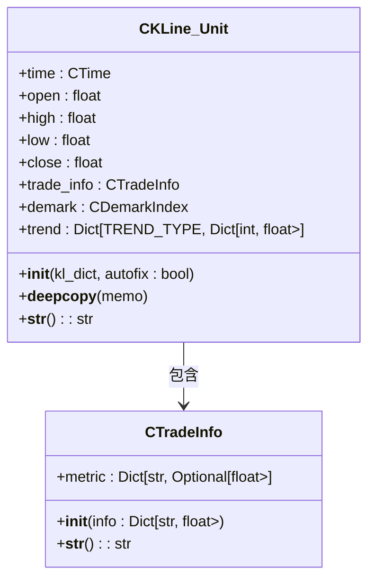

# 交易扩展信息

<cite>
**本文档引用的文件**  
- [TradeInfo.py](file://chan.py/KLine/TradeInfo.py)
- [KLine_Unit.py](file://chan.py/KLine/KLine_Unit.py)
- [CEnum.py](file://chan.py/Common/CEnum.py)
- [binance.py](file://chan.py/DataAPI/binance.py)
- [quick_guide.md](file://chan.py/quick_guide.md)
</cite>

## 目录
1. [设计目的与技术实现](#设计目的与技术实现)
2. [与CKLine_Unit的关联机制](#与ckline_unit的关联机制)
3. [在高级缠论策略中的应用](#在高级缠论策略中的应用)
4. [数据来源配置方式](#数据来源配置方式)
5. [配置示例与数据绑定代码](#配置示例与数据绑定代码)
6. [内存占用与性能考量](#内存占用与性能考量)

## 设计目的与技术实现

`CTradeInfo` 类的设计目的是为了扩展基础K线数据，支持更丰富的交易分析指标。该类通过封装换手率、成交额、资金流向等非标准字段，为高级技术分析提供必要的数据支持。其技术实现基于字典结构，动态加载指定的交易信息字段。

`CTradeInfo` 的构造函数接收一个包含交易信息的字典，并根据预定义的 `TRADE_INFO_LST` 列表初始化内部的 `metric` 字段。这些字段包括成交量（`FIELD_VOLUME`）、成交额（`FIELD_TURNOVER`）和换手率（`FIELD_TURNRATE`），均来自 `DATA_FIELD` 枚举定义。这种设计允许系统灵活地处理不同数据源提供的扩展字段，同时保持接口的一致性。

**Section sources**
- [TradeInfo.py](file://chan.py/KLine/TradeInfo.py#L0-L12)
- [CEnum.py](file://chan.py/Common/CEnum.py#L120-L129)

## 与CKLine_Unit的关联机制

`CTradeInfo` 类与 `CKLine_Unit` 类通过组合关系紧密关联。在 `CKLine_Unit` 的初始化过程中，传入的K线数据字典不仅包含标准的开高低收价格信息，还可能包含扩展的交易信息字段。这些字段被直接传递给 `CTradeInfo` 的构造函数，从而实现数据的封装与集成。

`CKLine_Unit` 在其 `__init__` 方法中创建 `trade_info` 实例，确保每个K线单元都能携带对应的交易扩展信息。此外，在 `__deepcopy__` 方法中，系统会显式复制 `trade_info` 中的各个指标，保证深拷贝操作的完整性。这种设计使得 `CTradeInfo` 成为 `CKLine_Unit` 不可或缺的一部分，支持后续的技术指标计算与分析。



**Diagram sources**
- [KLine_Unit.py](file://chan.py/KLine/KLine_Unit.py#L0-L39)
- [TradeInfo.py](file://chan.py/KLine/TradeInfo.py#L0-L12)

**Section sources**
- [KLine_Unit.py](file://chan.py/KLine/KLine_Unit.py#L0-L154)

## 在高级缠论策略中的应用

`CTradeInfo` 提供的扩展指标在高级缠论策略中具有重要价值，尤其是在量价背离分析中。量价背离是指价格走势与成交量走势出现不一致的现象，通常预示着趋势可能反转。例如，当价格创新高但成交量未同步放大，甚至萎缩时，表明上涨动力不足，可能存在顶部背离。

通过 `trade_info` 中的 `volume` 和 `turnover` 字段，系统可以计算成交量变化率并与价格变化进行对比分析。结合 `demark` 指标和 `trend` 模型，能够构建更加精准的买卖点识别逻辑。例如，在识别出潜在的顶分型后，若同时检测到成交量显著低于前一个高点，则可增强卖出信号的可信度。

此外，换手率（`turnover_rate`）可用于判断市场情绪和筹码交换情况。高换手率往往伴随剧烈的价格波动，可能意味着主力资金的进出。将换手率与其他技术指标结合，有助于识别主力洗盘、拉升或出货阶段，从而优化交易决策。

**Section sources**
- [KLine_Unit.py](file://chan.py/KLine/KLine_Unit.py#L0-L154)
- [CEnum.py](file://chan.py/Common/CEnum.py#L120-L129)

## 数据来源配置方式

`CTradeInfo` 所需的扩展字段主要通过两种方式获取：直接从交易所API获取或通过基础数据计算衍生。系统支持多种数据源，包括 BaoStock、Binance 和本地CSV文件，每种数据源在实现 `get_kl_data` 方法时需按框架要求提供相应的字段。

对于支持详细交易信息的交易所（如Binance），API响应中通常包含 `volume`、`amount`（即 `turnover`）等字段。在数据接入层，通过字段映射机制将原始字段名转换为框架内部统一的 `DATA_FIELD` 常量。例如，在 `BaoStockAPI.py` 中，`amount` 映射为 `FIELD_TURNOVER`，`turn` 映射为 `FIELD_TURNRATE`。

对于不直接提供某些字段的数据源，系统可通过计算衍生。例如，成交额可通过 `close * volume` 近似估算；换手率则需要结合流通股本进行计算。用户在实现自定义数据源时，只需在 `item_dict` 中包含这些字段即可，框架会自动处理后续的封装与集成。

**Section sources**
- [binance.py](file://chan.py/DataAPI/binance.py#L0-L100)
- [quick_guide.md](file://chan.py/quick_guide.md#L374-L412)

## 配置示例与数据绑定代码

以下是一个从Binance API获取数据并绑定 `TradeInfo` 的配置示例：

```python
# 示例：Binance数据源配置
fields = "time,open,high,low,close,volume"
for item in data:
    item_data = [
        time_str,
        item[1],
        item[2],
        item[3],
        item[4],
        item[5]  # volume
    ]
    yield CKLine_Unit(create_item_dict(item_data, GetColumnNameFromFieldList(fields)), autofix=True)
```

在此示例中，`volume` 字段被包含在输出列表中，`create_item_dict` 函数将其映射为 `DATA_FIELD.FIELD_VOLUME`。当 `CKLine_Unit` 被创建时，该字段会自动传递给 `CTradeInfo`，完成数据绑定。

用户若需添加 `turnover` 或 `turnover_rate`，只需确保原始数据中包含对应字段，并在字段映射中正确配置即可。例如，若API返回 `quote_volume`，可在映射中将其设为 `FIELD_TURNOVER`。

**Section sources**
- [binance.py](file://chan.py/DataAPI/binance.py#L0-L100)
- [KLine_Unit.py](file://chan.py/KLine/KLine_Unit.py#L0-L154)

## 内存占用与性能考量

`CTradeInfo` 的引入对内存占用有一定影响，每个 `CKLine_Unit` 实例额外维护一个 `metric` 字典，存储多个浮点数值。在高频交易场景下，K线数据量巨大，这种开销可能显著增加整体内存使用。例如，处理5年1分钟K线数据时，约有260万条记录，每条记录增加3个浮点数（约24字节），总内存增加约60MB。

在性能方面，`CTradeInfo` 的初始化和深拷贝操作均为线性时间复杂度 O(n)，其中 n 为 `TRADE_INFO_LST` 的长度。由于该列表长度固定且较小（通常为3），因此性能影响有限。然而，在实时数据流处理中，频繁的对象创建与销毁可能导致垃圾回收压力增大。

为优化性能，建议在高频场景下：
1. 复用 `CTradeInfo` 实例或采用对象池技术；
2. 对非关键指标进行延迟加载；
3. 在不需要扩展信息的分析模式下，禁用相关字段的解析；
4. 使用更高效的数据结构（如NumPy数组）批量处理历史数据。

**Section sources**
- [TradeInfo.py](file://chan.py/KLine/TradeInfo.py#L0-L12)
- [KLine_Unit.py](file://chan.py/KLine/KLine_Unit.py#L0-L154)