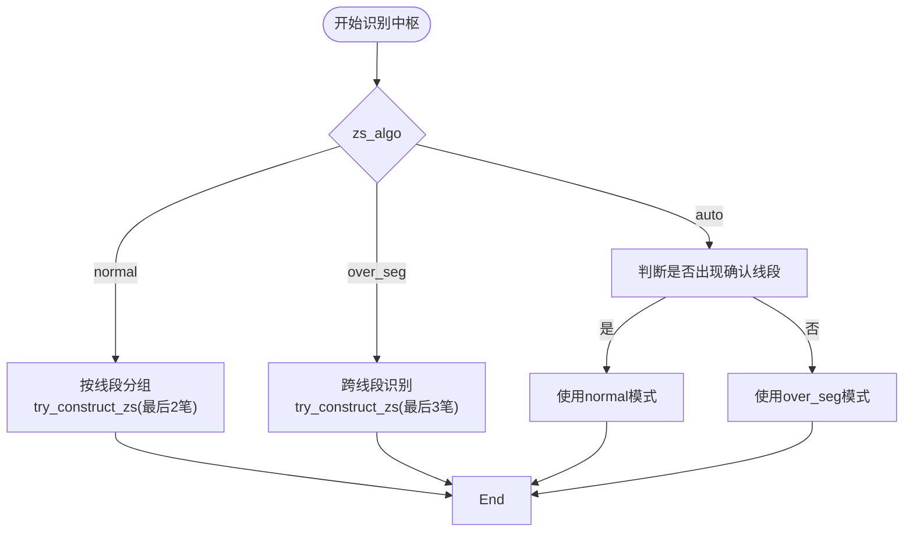

# 中枢识别

<cite>
**本文档中引用的文件**  
- [ZS.py](file://chan.py\ZS\ZS.py)
- [ZSList.py](file://chan.py\ZS\ZSList.py)
- [ZSConfig.py](file://chan.py\ZS\ZSConfig.py)
- [ChanConfig.py](file://chan.py\ChanConfig.py) - *在多级别分析中更新*
</cite>

## 目录
1. [引言](#引言)
2. [中枢的几何与交易意义](#中枢的几何与交易意义)
3. [CZS类结构解析](#czs类结构解析)
4. [CZSList与中枢管理](#czslist与中枢管理)
5. [中枢配置ZSConfig详解](#中枢配置zsconfig详解)
6. [中枢识别算法分析](#中枢识别算法分析)
7. [代码示例：查询与遍历中枢](#代码示例查询与遍历中枢)
8. [结论](#结论)

## 引言
中枢是缠论中的核心概念之一，代表价格在一定时间内的震荡区间，具有重要的几何形态和交易意义。本技术文档深入解析中枢识别的实现机制，涵盖`CZS`类的内部结构、`CZSList`的管理逻辑、`ZSConfig`的配置参数以及不同中枢算法对识别结果的影响。通过代码级分析，帮助开发者理解中枢的构建、合并与查询过程。

## 中枢的几何与交易意义
在缠论中，中枢是由至少三笔重叠部分构成的价格震荡区域，其几何特征表现为一个矩形区间，由高低点围成。中枢的形成标志着市场多空力量的平衡，是趋势延续或反转的重要信号。

- **几何意义**：中枢的高点（high）和低点（low）构成价格波动的边界，中枢中点（mid）为（high + low）/ 2，常作为趋势强弱的参考。
- **交易意义**：
  - **支撑与阻力**：中枢区间可作为后续价格的支撑或阻力区域。
  - **趋势判断**：中枢的延伸、新生或破坏可判断趋势的延续或转折。
  - **买卖点识别**：结合背驰等指标，中枢的突破可生成三类买卖点。

## CZS类结构解析
`CZS`类（中枢类）是中枢识别的核心数据结构，用于表示一个完整的中枢对象。

### 核心属性
- **begin**：中枢起始K线单元（CKLine_Unit），指向第一笔的起始K线。
- **end**：中枢结束K线单元，指向最后一笔的结束K线。
- **low / high**：中枢的价格范围，由所有构成笔的重叠部分决定。
- **mid**：中枢中点，计算公式为 (low + high) / 2。
- **peak_low / peak_high**：中枢所涉及笔的最低点和最高点，用于“峰合并”模式。
- **begin_bi / end_bi**：构成中枢的第一笔和最后一笔。
- **bi_in / bi_out**：进入和离开中枢的笔，用于判断背驰。
- **bi_lst**：中枢内部所有笔的列表。
- **sub_zs_lst**：子中枢列表，用于记录合并过程中的历史中枢。

### 关键方法
- `update_zs_range(lst)`：根据笔列表更新中枢的高低范围。
- `try_add_to_end(item)`：尝试将新笔加入中枢末尾，若在范围内则扩展中枢。
- `combine(zs2, combine_mode)`：与另一中枢合并，依据合并模式判断是否重叠。
- `do_combine(zs2)`：执行合并操作，更新当前中枢的范围和子中枢列表。
- `is_divergence(config, out_bi)`：判断中枢是否发生背驰，基于MACD指标。

**Section sources**
- [ZS.py](file://chan.py\ZS\ZS.py#L12-L234)

## CZSList与中枢管理
`CZSList`类负责管理多个中枢的生成、更新与合并。

### 核心功能
- **zs_lst**：存储已确认的中枢列表。
- **free_item_lst**：临时存储待处理的笔，用于尝试构建新中枢。
- **try_construct_zs(lst, is_sure, zs_algo)**：根据算法尝试从笔列表构建中枢。
- **cal_bi_zs(bi_lst, seg_lst)**：主函数，遍历笔和线段列表，计算所有中枢。
- **try_combine()**：根据配置尝试合并相邻中枢。

### 合并逻辑
当`zs_config.need_combine=True`时，`try_combine()`方法会持续检查最后两个中枢是否满足合并条件：
```python
while len(self.zs_lst) >= 2 and self.zs_lst[-2].combine(self.zs_lst[-1], combine_mode=self.config.zs_combine_mode):
    self.zs_lst = self.zs_lst[:-1]
```
合并后，前一个中枢吸收后一个中枢的信息，并将其加入`sub_zs_lst`。

**Section sources**
- [ZSList.py](file://chan.py\ZS\ZSList.py#L12-L160)

## 中枢配置ZSConfig详解
`ZSConfig`类定义了中枢识别的关键参数，控制中枢的生成与合并行为。

### 配置参数
| 参数名 | 类型 | 默认值 | 说明 |
|--------|------|--------|------|
| need_combine | bool | True | 是否启用中枢合并 |
| zs_combine_mode | str | "zs" | 合并模式："zs"（中枢区间重叠）或"peak"（峰谷重叠） |
| one_bi_zs | bool | False | 是否允许单笔中枢（通常为False） |
| zs_algo | str | "normal" | 中枢识别算法："normal"、"over_seg"、"auto" |

### 参数影响
- **zs_combine_mode = "zs"**：仅当中枢区间（low~high）有重叠时才合并。
- **zs_combine_mode = "peak"**：当中枢涉及的峰谷范围（peak_low~peak_high）有重叠时合并，更激进。
- **one_bi_zs = True**：允许单笔构成中枢，通常用于特殊场景。
- **need_combine = False**：禁用合并，每个独立中枢单独存在。

**Section sources**
- [ZSConfig.py](file://chan.py\ZS\ZSConfig.py#L0-L6)

## 中枢识别算法分析
中枢识别算法由`zs_algo`参数控制，支持三种模式：

### normal 模式
- 基于线段内的笔进行中枢识别。
- 要求至少两笔有重叠才能形成中枢。
- 是最常见和稳定的识别方式。

### over_seg 模式
- 允许跨线段的中枢识别。
- 使用三笔尝试构建中枢，忽略线段边界。
- 适用于震荡行情，能识别更长周期的中枢。

### auto 模式
- 自动切换模式：在确认线段出现前使用`over_seg`，出现后切换为`normal`。
- 平衡了实时性与准确性，适合实盘交易。

#### 算法对中枢识别的影响
- **normal**：中枢较少，稳定性高，适合趋势行情。
- **over_seg**：中枢较多，灵敏度高，适合震荡行情。
- **auto**：动态适应，兼顾不同市场状态。



**Diagram sources**
- [ZSList.py](file://chan.py\ZS\ZSList.py#L12-L160)
- [ZS.py](file://chan.py\ZS\ZS.py#L12-L234)

**Section sources**
- [ZSList.py](file://chan.py\ZS\ZSList.py#L12-L160)

## 代码示例：查询与遍历中枢
以下代码展示如何查询和遍历中枢信息：

```python
# 获取中枢列表
zs_list = CZSList(zs_config)

# 遍历所有中枢
for zs in zs_list:
    print(f"中枢区间: {zs.low:.2f} ~ {zs.high:.2f}")
    print(f"起止笔: {zs.begin_bi.idx} -> {zs.end_bi.idx}")
    if zs.bi_in:
        print(f"入中枢笔: {zs.bi_in.idx}")
    if zs.bi_out:
        print(f"出中枢笔: {zs.bi_out.idx}")

# 查询最新中枢
if len(zs_list) > 0:
    latest_zs = zs_list[-1]
    print(f"最新中枢中点: {latest_zs.mid:.2f}")

# 判断是否发生背驰
config = CPointConfig()
is_div, rate = latest_zs.is_divergence(config)
if is_div:
    print(f"发生背驰，力度比: {rate:.2f}")
```

**Section sources**
- [ZS.py](file://chan.py\ZS\ZS.py#L12-L234)
- [ZSList.py](file://chan.py\ZS\ZSList.py#L12-L160)

## 结论
中枢识别是缠论分析的核心环节，`CZS`、`CZSList`和`ZSConfig`共同构成了一个灵活且可配置的中枢管理系统。通过合理设置`zs_algo`和`zs_combine_mode`，可以适应不同市场环境下的分析需求。开发者应根据交易策略选择合适的算法模式，并结合背驰判断实现精准的买卖点识别。