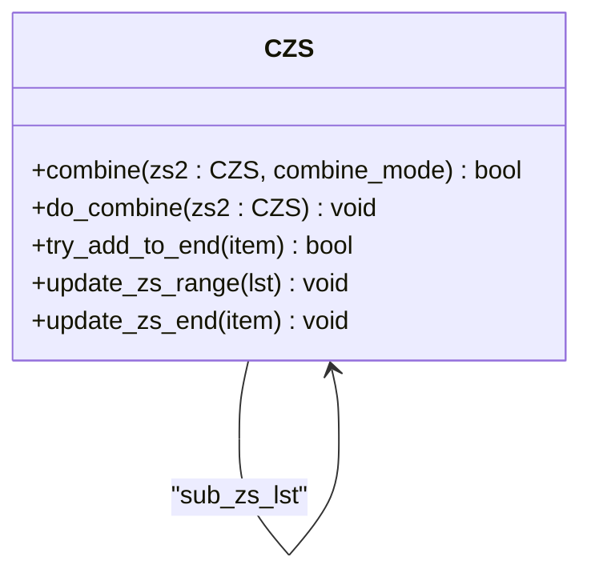
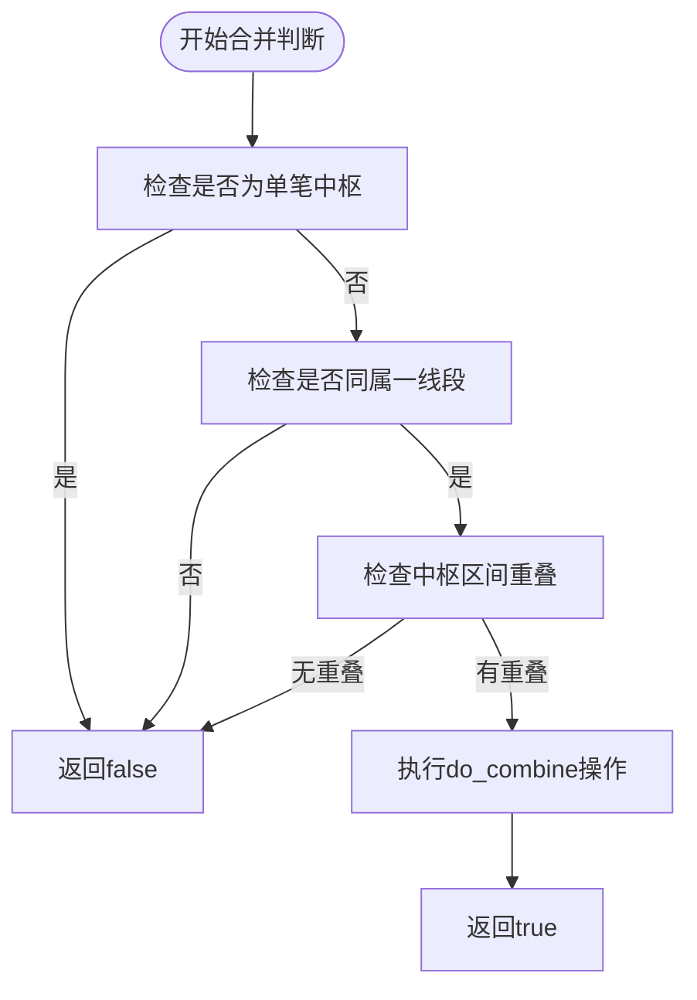
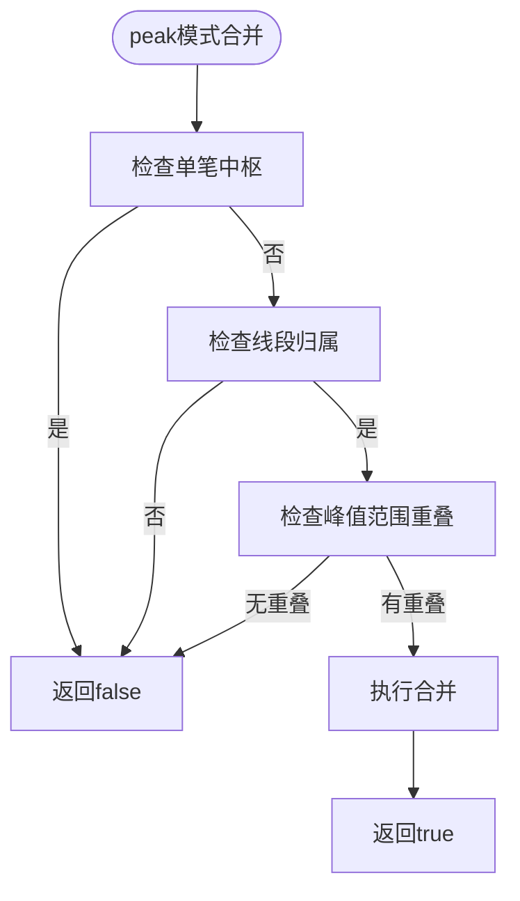
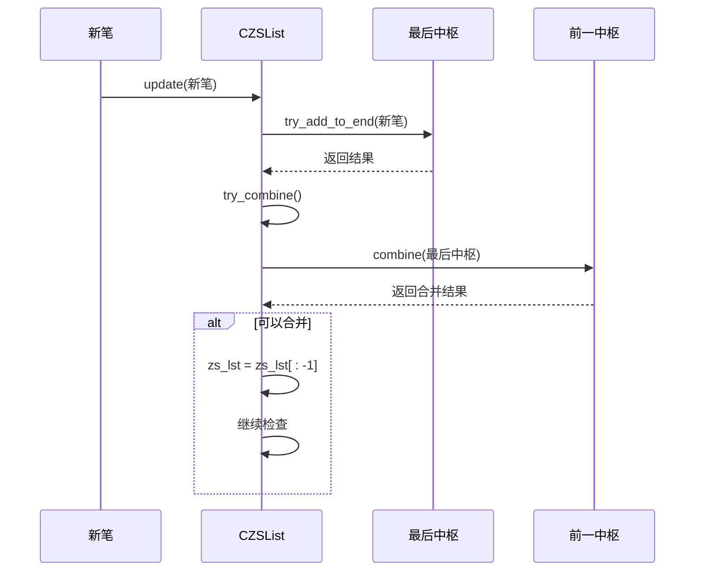
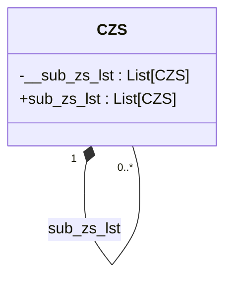
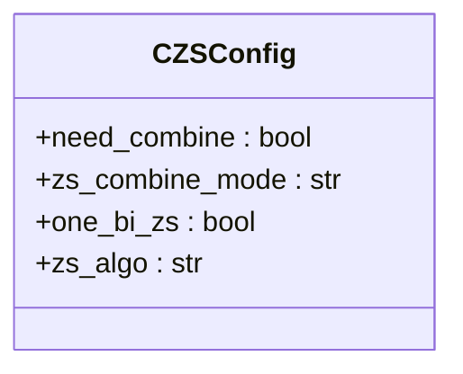

# 中枢合并策略

<cite>
**Referenced Files in This Document**  
- [ZS.py](file://chan.py/ZS/ZS.py)
- [ZSList.py](file://chan.py/ZS/ZSList.py)
- [ZSConfig.py](file://chan.py/ZS/ZSConfig.py)
</cite>

## Table of Contents
1. [中枢合并机制概述](#中枢合并机制概述)
2. [CZS类核心方法分析](#czs类核心方法分析)
3. [合并模式实现逻辑](#合并模式实现逻辑)
4. [链式合并流程](#链式合并流程)
5. [子中枢列表构建](#子中枢列表构建)
6. [配置参数影响](#配置参数影响)

## 中枢合并机制概述

中枢合并是技术分析中的重要机制，用于识别和整合连续的中枢结构。系统通过`CZS`类和`CZSList`类协同工作，实现基于不同模式的中枢合并策略。当新的中枢生成后，系统会自动触发合并流程，通过链式处理机制整合多个连续中枢，形成更复杂的中枢结构。

**Section sources**
- [ZS.py](file://chan.py/ZS/ZS.py#L1-L234)
- [ZSList.py](file://chan.py/ZS/ZSList.py#L1-L161)

## CZS类核心方法分析

`CZS`类作为中枢的核心数据结构，提供了`combine`和`do_combine`两个关键方法来实现合并功能。

`combine`方法是合并的入口点，负责判断两个中枢是否满足合并条件。该方法首先检查待合并中枢是否为单笔中枢，然后验证两个中枢是否属于同一线段。根据配置的合并模式，采用不同的重叠判断逻辑。

`do_combine`方法在确认合并条件满足后执行实际的合并操作。该方法会更新中枢的范围参数，包括高低点、峰值范围等，并将被合并的中枢添加到子中枢列表中。

**Diagram sources**
- [ZS.py](file://chan.py/ZS/ZS.py#L1-L234)

**Section sources**
- [ZS.py](file://chan.py/ZS/ZS.py#L1-L234)

## 合并模式实现逻辑

系统支持两种中枢合并模式：'zs'模式和'peak'模式，通过`zs_combine_mode`配置参数进行切换。

### zs模式：基于中枢区间重叠

在`zs`模式下，合并条件基于中枢区间的重叠判断。系统使用`has_overlap`函数检查两个中枢的高低点范围是否存在重叠。具体来说，当前中枢的`low`和`high`与待合并中枢的`low`和`high`进行比较，只有当两个区间存在交集时才允许合并。

**Diagram sources**
- [ZS.py](file://chan.py/ZS/ZS.py#L156-L170)

### peak模式：基于峰值范围重叠

在`peak`模式下，合并逻辑基于峰值范围的重叠。系统比较两个中枢的`peak_low`和`peak_high`值，这些值记录了中枢所涉及笔的最大值和最小值。当两个中枢的峰值范围存在重叠时，即可触发合并。

**Diagram sources**
- [ZS.py](file://chan.py/ZS/ZS.py#L170-L178)

**Section sources**
- [ZS.py](file://chan.py/ZS/ZS.py#L156-L178)

## 链式合并流程

中枢合并流程通过`try_combine`方法实现，该方法在新中枢生成后自动触发，处理多个连续中枢的链式合并。

### 触发机制

`try_combine`方法在`CZSList`类的`update`方法中被调用。当新的笔被添加到系统并形成新中枢时，系统会检查是否可以与前一个中枢合并。这种设计确保了中枢合并的及时性和连续性。

### 链式处理

`try_combine`方法采用循环机制，持续检查倒数第二个和最后一个中枢的合并条件。只要条件满足，就会执行合并操作，并移除被合并的中枢。这一过程会重复进行，直到无法继续合并为止，从而实现了多个连续中枢的链式整合。

**Diagram sources**
- [ZSList.py](file://chan.py/ZS/ZSList.py#L156-L160)
- [ZS.py](file://chan.py/ZS/ZS.py#L156-L178)

**Section sources**
- [ZSList.py](file://chan.py/ZS/ZSList.py#L156-L160)

## 子中枢列表构建

`sub_zs_lst`子中枢列表是复杂中枢结构的重要组成部分，用于记录中枢的演化历史和内部结构。

### 构建时机

子中枢列表的构建发生在`do_combine`方法执行时。当第一个合并操作发生时，系统会先将当前中枢的副本添加到`sub_zs_lst`中，然后将被合并的中枢添加到列表末尾。这种设计保留了中枢的原始状态和合并过程。

### 数据结构作用

`sub_zs_lst`列表不仅记录了合并的历史，还为后续的分析提供了基础。通过遍历子中枢列表，可以还原中枢的形成过程，分析其内部结构变化，为交易决策提供更丰富的信息。

**Diagram sources**
- [ZS.py](file://chan.py/ZS/ZS.py#L14-L15)
- [ZS.py](file://chan.py/ZS/ZS.py#L185-L195)

**Section sources**
- [ZS.py](file://chan.py/ZS/ZS.py#L14-L15)
- [ZS.py](file://chan.py/ZS/ZS.py#L185-L195)

## 配置参数影响

中枢合并行为受`CZSConfig`类中的多个配置参数影响，这些参数决定了系统的合并策略。

### zs_combine_mode参数

`zs_combine_mode`参数控制合并模式的选择，可设置为'zs'或'peak'。该参数直接影响`combine`方法中的条件判断逻辑，决定了中枢合并的敏感度和范围。

### need_combine参数

`need_combine`参数作为总开关，控制是否启用中枢合并功能。当设置为`false`时，`try_combine`方法会直接返回，跳过所有合并检查。

**Diagram sources**
- [ZSConfig.py](file://chan.py/ZS/ZSConfig.py#L1-L6)

**Section sources**
- [ZSConfig.py](file://chan.py/ZS/ZSConfig.py#L1-L6)