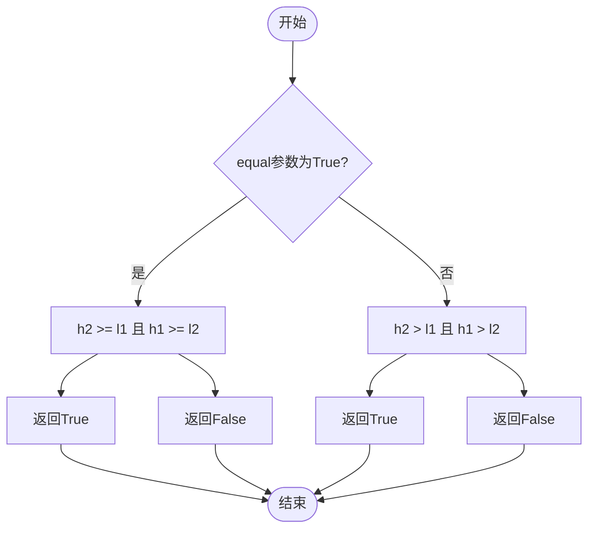
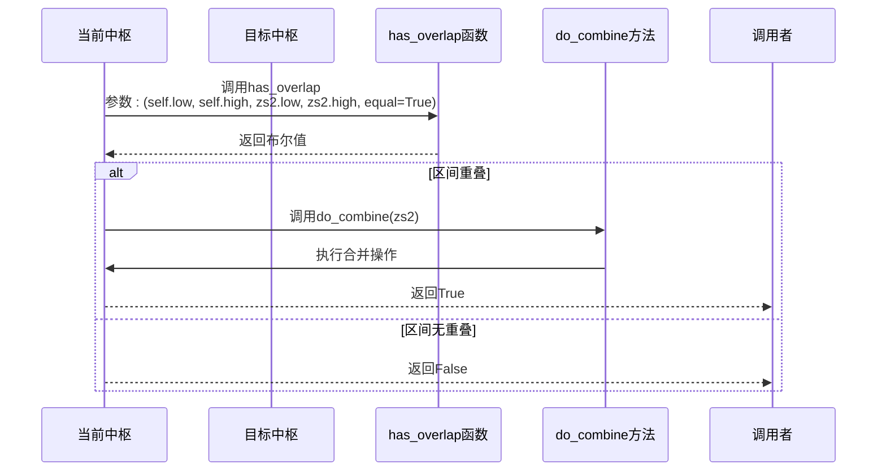
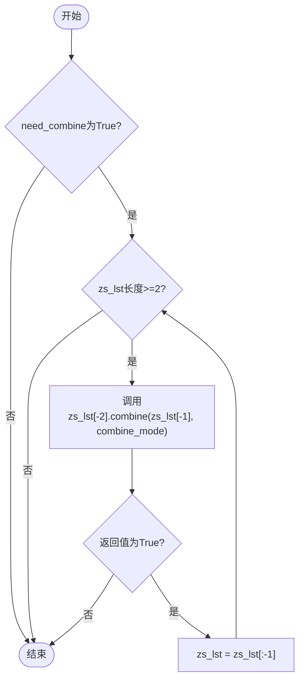
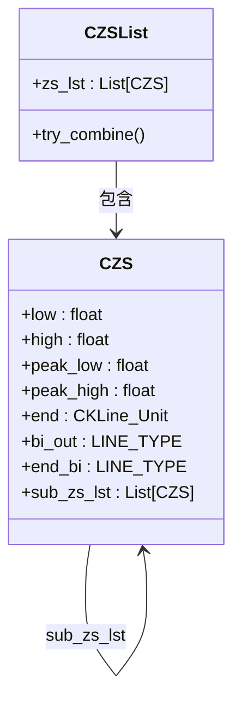

# 基于中枢区间的合并策略

<cite>
**Referenced Files in This Document**   
- [ZS.py](file://chan.py\ZS\ZS.py)
- [ZSList.py](file://chan.py\ZS\ZSList.py)
</cite>

## Table of Contents
1. [中枢合并逻辑概述](#中枢合并逻辑概述)
2. [中枢区间重叠检测](#中枢区间重叠检测)
3. [中枢合并实现](#中枢合并实现)
4. [链式合并过程](#链式合并过程)
5. [核心属性更新](#核心属性更新)

## 中枢合并逻辑概述

在分型理论分析系统中，当 `zs_combine_mode` 配置为 `'zs'` 时，系统采用基于中枢高低点区间重叠的策略来判断相邻中枢是否应进行合并。该策略的核心思想是：若两个相邻中枢的价格区间存在交集，则将它们合并为一个更大的中枢，以反映市场更广泛的震荡区域。

中枢合并过程主要由 `CZS` 类的 `combine` 方法和 `CZSList` 类的 `try_combine` 方法协同完成。`combine` 方法负责判断两个中枢是否满足合并条件并执行合并操作，而 `try_combine` 方法则在中枢列表中循环触发该逻辑，实现多个连续重叠中枢的链式合并。

**Section sources**
- [ZS.py](file://chan.py\ZS\ZS.py#L12-L233)
- [ZSList.py](file://chan.py\ZS\ZSList.py#L12-L160)

## 中枢区间重叠检测

中枢区间重叠的检测由独立的 `has_overlap` 函数实现，该函数位于 `Common.func_util` 模块中。此函数用于判断两个价格区间 `[l1, h1]` 和 `[l2, h2]` 是否存在交集。

**Diagram sources**
- [ZS.py](file://chan.py\ZS\ZS.py#L12-L233)

**Section sources**
- [ZS.py](file://chan.py\ZS\ZS.py#L12-L233)

## 中枢合并实现

`CZS` 类的 `combine` 方法是中枢合并的核心。当 `combine_mode` 为 `'zs'` 时，该方法首先调用 `has_overlap` 函数检测当前中枢与待合并中枢的价格区间是否重叠。

**Diagram sources**
- [ZS.py](file://chan.py\ZS\ZS.py#L12-L233)

**Section sources**
- [ZS.py](file://chan.py\ZS\ZS.py#L12-L233)

## 链式合并过程

`CZSList` 类的 `try_combine` 方法负责在中枢列表中触发链式合并。该方法在每次有新中枢生成后被调用，它会持续检查列表中倒数第二个中枢与最后一个中枢是否可以合并。

**Diagram sources**
- [ZSList.py](file://chan.py\ZS\ZSList.py#L12-L160)

**Section sources**
- [ZSList.py](file://chan.py\ZS\ZSList.py#L12-L160)

## 核心属性更新

当两个中枢被合并时，`do_combine` 方法会更新当前中枢的核心属性。首先，它会将当前中枢的副本和被合并的中枢都添加到 `sub_zs_lst` 子中枢列表中，以保留原始结构信息。

**Diagram sources**
- [ZS.py](file://chan.py\ZS\ZS.py#L12-L233)

**Section sources**
- [ZS.py](file://chan.py\ZS\ZS.py#L12-L233)