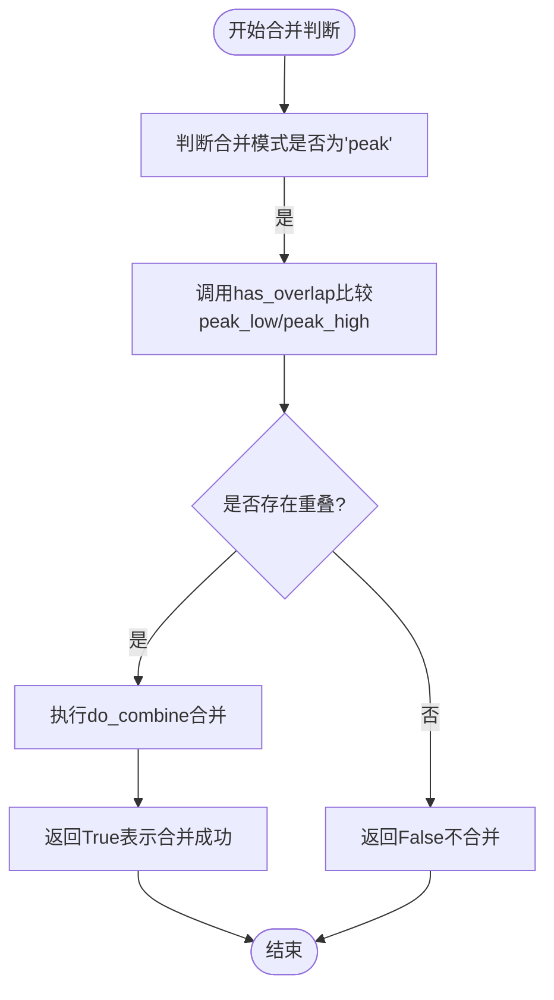

# 基于峰值范围的合并策略

<cite>
**本文档引用文件**  
- [ZS.py](file://chan.py/ZS/ZS.py)
- [ZSConfig.py](file://chan.py/ZS/ZSConfig.py)
- [func_util.py](file://chan.py/Common/func_util.py)
- [ZSList.py](file://chan.py/ZS/ZSList.py)
</cite>

## 目录
1. [引言](#引言)
2. [中枢合并模式概述](#中枢合并模式概述)
3. [peak模式下的合并机制](#peak模式下的合并机制)
4. [代码实现分析](#代码实现分析)
5. [应用场景与示例](#应用场景与示例)
6. [与zs模式的对比](#与zs模式的对比)
7. [结论](#结论)

## 引言
在缠论分析系统中，中枢（ZS）是识别价格震荡区域的核心结构。中枢的合并机制直接影响走势分析的粒度与准确性。本文重点阐述当`zs_combine_mode`设置为`'peak'`时的合并策略，说明该模式如何基于笔的极值点进行中枢合并判断，从而识别更大范围的价格波动区域。

## 中枢合并模式概述
中枢合并模式由配置类`CZSConfig`中的`zs_combine_mode`参数控制，支持两种模式：
- `'zs'`：基于中枢本体区间（low/high）进行重叠判断
- `'peak'`：基于中枢所涉及所有笔的最高高点（peak_high）和最低低点（peak_low）进行重叠判断

该配置决定了中枢合并时的判断逻辑，直接影响中枢的连续性与覆盖范围。

**Section sources**
- [ZSConfig.py](file://chan.py/ZS/ZSConfig.py#L0-L6)

## peak模式下的合并机制
在`peak`模式下，中枢合并不再依赖传统中枢区间（low/high），而是使用`peak_low`与`peak_high`作为判断依据：
- `peak_low`：中枢内所有笔的最低低点的最小值
- `peak_high`：中枢内所有笔的最高高点的最大值

当两个相邻中枢的`peak_low`与`peak_high`范围存在重叠时，即满足`has_overlap(peak_low1, peak_high1, peak_low2, peak_high2)`，系统将触发合并操作，形成一个覆盖更广价格区间的联合中枢。

这种机制能够有效识别跨多个小中枢的大级别震荡区域，适用于复杂走势中捕捉长期盘整结构。

## 代码实现分析
中枢合并的核心逻辑在`CZS.combine`方法中实现。当`combine_mode == 'peak'`时，系统调用`has_overlap`函数比较两个中枢的`peak_low`与`peak_high`范围：



**Diagram sources**
- [ZS.py](file://chan.py/ZS/ZS.py#L90-L125)

`do_combine`方法在合并时会更新联合中枢的边界：
- `low` = min(原low, 被合并中枢low)
- `high` = max(原high, 被合并中枢high)
- `peak_low` = min(原peak_low, 被合并中枢peak_low)
- `peak_high` = max(原peak_high, 被合并中枢peak_high)

合并后，原中枢的`sub_zs_lst`会记录被合并的子中枢，形成层级结构。

**Section sources**
- [ZS.py](file://chan.py/ZS/ZS.py#L124-L160)

`has_overlap`函数定义于`func_util.py`中，用于判断两个区间是否存在重叠：
```python
def has_overlap(l1, h1, l2, h2, equal=False):
    return h2 >= l1 and h1 >= l2 if equal else h2 > l1 and h1 > l2
```
在`peak`模式下，该函数以严格大于方式判断重叠（`equal=False`），确保只有真正重叠的峰值范围才会触发合并。

**Section sources**
- [func_util.py](file://chan.py/Common/func_util.py#L36-L37)

中枢列表`CZSList`在每次新增中枢后会自动调用`try_combine`方法，循环检查最后两个中枢是否满足合并条件，从而保证中枢结构的动态更新与优化。

**Section sources**
- [ZSList.py](file://chan.py/ZS/ZSList.py#L126-L160)

## 应用场景与示例
`peak`模式特别适用于以下场景：
- **宽幅震荡行情**：当价格在较大区间内反复波动，形成多个小中枢时，`peak`模式可将其合并为一个大中枢，更准确反映市场实际盘整范围。
- **趋势延续判断**：通过识别大范围震荡区间的突破，辅助判断趋势是否真正延续。
- **复杂走势分析**：在多级别联立分析中，`peak`模式有助于识别跨级别的共振区域。

例如，在一段上涨趋势中，若出现连续多个小级别中枢，`zs`模式可能因中枢区间不重叠而判定为趋势延续；而`peak`模式若发现这些中枢的峰值范围存在重叠，则会将其合并为一个大中枢，提示市场实际处于宽幅震荡而非单边行情。

## 与zs模式的对比
| 对比维度 | zs模式 | peak模式 |
|---------|--------|---------|
| 判断依据 | 中枢本体区间（low/high） | 笔的极值范围（peak_low/peak_high） |
| 合并敏感度 | 较低，需中枢区间直接重叠 | 较高，只要极值范围重叠即可 |
| 适用场景 | 精确识别独立中枢结构 | 识别大范围价格震荡区域 |
| 走势粒度 | 更细，保留更多独立中枢 | 更粗，形成更大联合中枢 |
| 复杂走势处理 | 可能误判为趋势延续 | 更易识别潜在盘整结构 |

**Section sources**
- [ZS.py](file://chan.py/ZS/ZS.py#L90-L125)
- [ZS.py](file://chan.py/ZS/ZS.py#L124-L160)

## 结论
`peak`模式通过基于笔的极值点进行中枢合并判断，突破了传统中枢区间限制，能够更有效地识别大范围价格震荡区域。该模式在复杂走势分析中具有显著优势，尤其适用于宽幅震荡行情的识别与趋势延续性的判断。开发者和分析师可根据具体分析需求，在`zs`与`peak`模式间灵活选择，以获得更准确的市场结构认知。