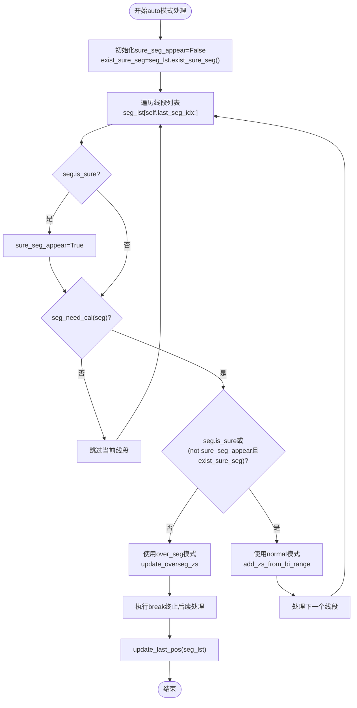
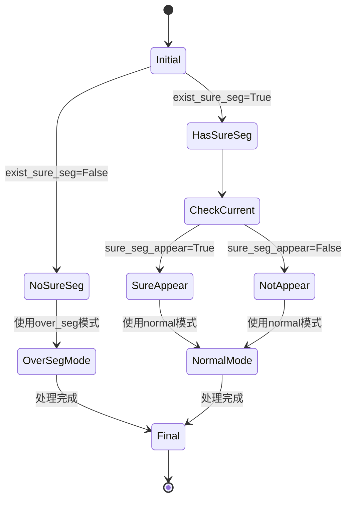
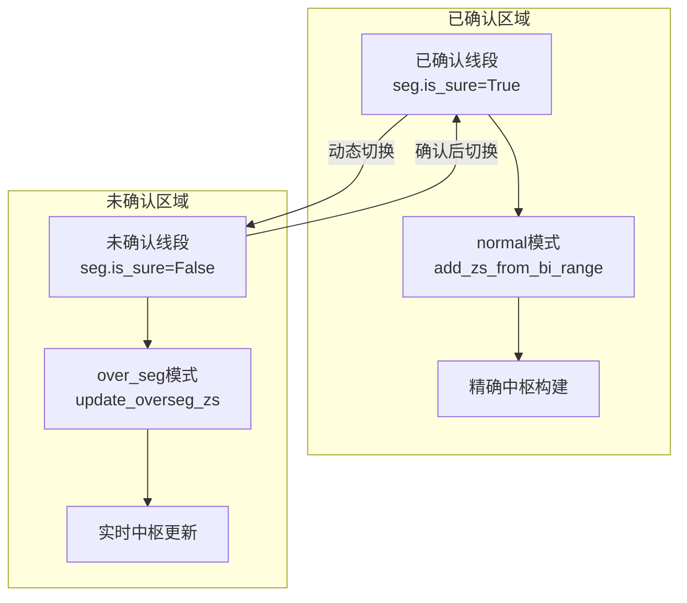
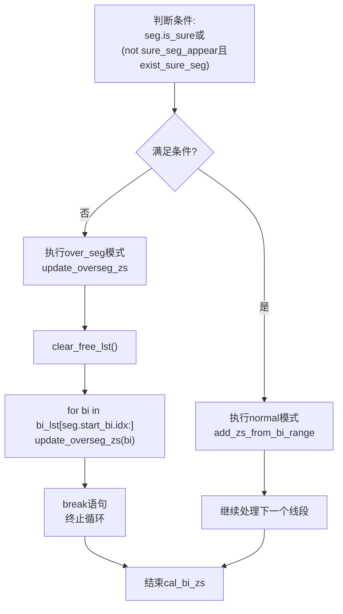

# auto模式中枢构建

<cite>
**本文档引用文件**   
- [ZSList.py](file://chan.py/ZS/ZSList.py)
- [ZSConfig.py](file://chan.py/ZS/ZSConfig.py)
- [Seg.py](file://chan.py/Seg/Seg.py)
- [SegListComm.py](file://chan.py/Seg/SegListComm.py)
</cite>

## 目录
1. [引言](#引言)
2. [核心组件分析](#核心组件分析)
3. [auto模式决策逻辑](#auto模式决策逻辑)
4. [标志位协同工作机制](#标志位协同工作机制)
5. [混合处理流程](#混合处理流程)
6. [临界条件与break语句作用](#临界条件与break语句作用)
7. [精度与响应平衡机制](#精度与响应平衡机制)
8. [结论](#结论)

## 引言
本文档全面解析`zs_algo='auto'`模式下的智能中枢构建策略，重点阐述其根据线段确认状态动态切换`normal`与`over_seg`算法的决策逻辑。通过分析`cal_bi_zs`方法中的`auto`分支，说明`sure_seg_appear`和`exist_sure_seg`两个标志位如何协同工作以判断市场状态，并详细描述在已确认线段区域使用`normal`模式、在未确认区域使用`over_seg`模式的混合处理流程。

## 核心组件分析

**Section sources**
- [ZSList.py](file://chan.py/ZS/ZSList.py#L0-L161)
- [ZSConfig.py](file://chan.py/ZS/ZSConfig.py#L0-L6)

## auto模式决策逻辑

`auto`模式的核心在于根据线段的确认状态动态选择不同的中枢构建算法。当`zs_algo`配置为`"auto"`时，系统会进入特定的处理分支，根据当前线段列表的状态决定采用`normal`模式还是`over_seg`模式。

该模式的决策流程始于`cal_bi_zs`方法，该方法接收笔列表（`bi_lst`）和线段列表（`seg_lst`）作为输入参数。在`auto`分支中，系统首先初始化两个关键标志位：`sure_seg_appear`用于追踪已确认线段是否已出现，`exist_sure_seg`则通过调用`seg_lst.exist_sure_seg()`方法判断是否存在任何已确认的线段。



**Diagram sources**
- [ZSList.py](file://chan.py/ZS/ZSList.py#L100-L128)

**Section sources**
- [ZSList.py](file://chan.py/ZS/ZSList.py#L100-L128)

## 标志位协同工作机制

`sure_seg_appear`和`exist_sure_seg`两个标志位在`auto`模式中扮演着关键角色，它们协同工作以精确判断市场状态并指导中枢构建策略。

`exist_sure_seg`是一个前置判断标志，通过`seg_lst.exist_sure_seg()`方法获取。该方法遍历线段列表，检查是否存在任何`is_sure`属性为`True`的线段。这个标志位反映了整个市场历史中是否已经形成了任何确定性的结构。

`sure_seg_appear`则是一个动态追踪标志，随着对线段列表的遍历而更新。每当遇到一个`is_sure`为`True`的线段时，该标志位就会被设置为`True`。这个标志位记录了在当前处理过程中是否已经遇到了已确认的线段。

两个标志位的组合使用实现了精细的状态判断：
- 当`exist_sure_seg`为`False`时，表示市场尚处于初始阶段，没有任何确认线段，此时系统倾向于使用`over_seg`模式进行早期探测。
- 当`exist_sure_seg`为`True`但`sure_seg_appear`仍为`False`时，表示历史上存在确认线段，但当前处理的线段尚未到达确认区域，系统会继续使用`normal`模式保持一致性。
- 当`sure_seg_appear`变为`True`时，表明已进入已确认线段区域，系统可以安全地使用`normal`模式进行精确构建。



**Diagram sources**
- [ZSList.py](file://chan.py/ZS/ZSList.py#L100-L128)
- [SegListComm.py](file://chan.py/Seg/SegListComm.py#L160-L169)

**Section sources**
- [ZSList.py](file://chan.py/ZS/ZSList.py#L100-L128)
- [SegListComm.py](file://chan.py/Seg/SegListComm.py#L160-L169)

## 混合处理流程

`auto`模式的混合处理流程体现了分区域、分策略的智能构建思想。系统根据线段的确认状态，在不同的区域采用最适合的算法。

在已确认线段区域（`seg.is_sure`为`True`），系统采用`normal`模式。这种模式通过`add_zs_from_bi_range`方法，基于完整的笔范围构建中枢，确保了分析的精确性和稳定性。`normal`模式适用于市场结构已经明确的区域，能够提供可靠的交易信号。

在未确认区域（`seg.is_sure`为`False`），系统采用`over_seg`模式。这种模式通过`update_overseg_zs`方法，对每一笔进行实时更新，能够快速响应市场变化。`over_seg`模式特别适合处理市场转折点和新趋势的早期阶段，提供了更好的实时性。

混合流程的关键在于`seg_need_cal`方法的判断。该方法通过比较线段起始笔的索引与`last_sure_pos`（最后确认位置）来决定是否需要计算该线段。只有当线段起始位置在最后确认位置之后时，才会进行计算，这有效避免了重复计算和数据冗余。



**Diagram sources**
- [ZSList.py](file://chan.py/ZS/ZSList.py#L100-L128)
- [ZSList.py](file://chan.py/ZS/ZSList.py#L145-L160)

**Section sources**
- [ZSList.py](file://chan.py/ZS/ZSList.py#L100-L128)
- [ZSList.py](file://chan.py/ZS/ZSList.py#L145-L160)

## 临界条件与break语句作用

`auto`模式中的临界条件判断是其智能决策的核心。关键的判断条件为：
```
if seg.is_sure or (not sure_seg_appear and exist_sure_seg):
```

这个复合条件实现了多层次的决策逻辑：
- `seg.is_sure`：直接判断当前线段是否已确认
- `(not sure_seg_appear and exist_sure_seg)`：判断是否处于从已确认区域向未确认区域过渡的特殊状态

当条件满足时，系统使用`normal`模式；否则，使用`over_seg`模式并执行`break`语句。

`break`语句在此处发挥着至关重要的作用。一旦进入`over_seg`模式的处理分支，`break`会立即终止后续线段的处理。这种设计基于以下考虑：
1. **实时性优化**：在未确认区域，最新的市场数据最为重要，无需处理更早期的数据
2. **资源节约**：避免对大量历史数据进行不必要的计算
3. **逻辑一致性**：确保`over_seg`模式只应用于最新的市场动态

`break`语句的使用体现了系统在处理效率和分析完整性之间的平衡，确保了在保证关键信息不丢失的前提下，最大限度地提高处理速度。



**Diagram sources**
- [ZSList.py](file://chan.py/ZS/ZSList.py#L100-L128)

**Section sources**
- [ZSList.py](file://chan.py/ZS/ZSList.py#L100-L128)

## 精度与响应平衡机制

`auto`模式通过智能的算法切换机制，成功平衡了分析精度与实时响应的需求。这种平衡机制体现在多个层面：

在**时间维度**上，系统对历史数据（已确认区域）采用高精度的`normal`模式，确保了分析结果的可靠性；对实时数据（未确认区域）采用高响应的`over_seg`模式，确保了对市场变化的快速捕捉。

在**空间维度**上，系统通过`last_sure_pos`和`last_seg_idx`等状态变量，精确划分了不同处理区域的边界。`update_last_pos`方法在每次处理结束后更新这些状态，确保了下一次处理的起点准确无误。

在**资源利用**上，`clear_free_lst`方法的频繁调用确保了内存资源的有效管理，避免了数据累积带来的性能下降。同时，`try_combine`方法在适当时候对中枢进行合并，保持了数据结构的简洁性。

这种平衡机制使得系统能够在保持整体分析框架稳定的同时，对市场最新动态做出快速反应，为交易决策提供了既可靠又及时的支持。

**Section sources**
- [ZSList.py](file://chan.py/ZS/ZSList.py#L100-L128)
- [ZSList.py](file://chan.py/ZS/ZSList.py#L145-L160)

## 结论
`zs_algo='auto'`模式通过`sure_seg_appear`和`exist_sure_seg`标志位的协同工作，实现了根据线段确认状态动态切换`normal`与`over_seg`算法的智能中枢构建策略。该模式在已确认区域使用`normal`模式保证分析精度，在未确认区域使用`over_seg`模式确保实时响应，并通过`break`语句优化处理流程。这种混合处理策略成功平衡了分析的精确性与实时性需求，为市场分析提供了灵活而可靠的工具。