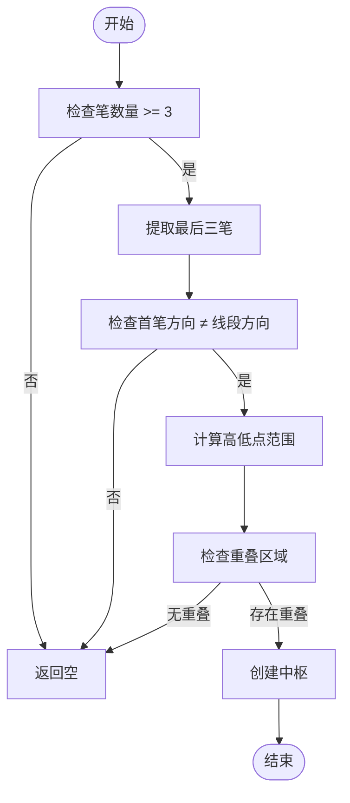
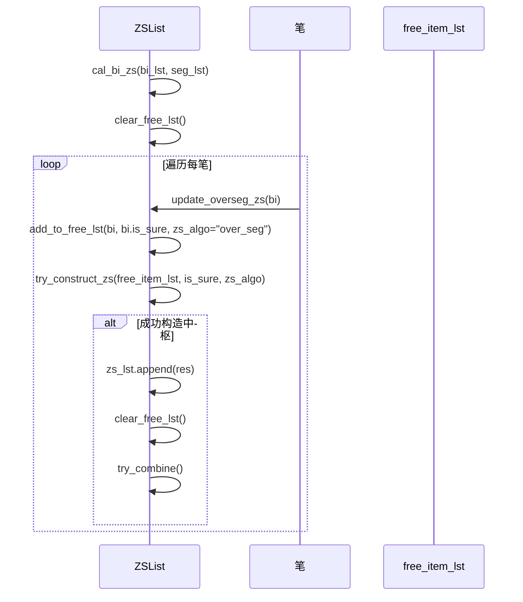
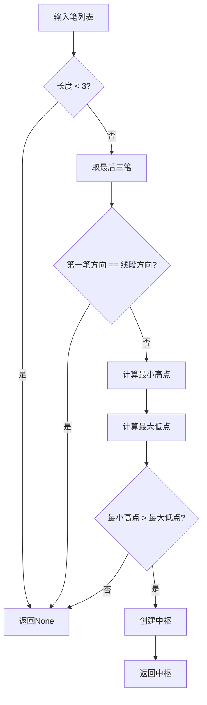

# over_seg模式中枢构建

<cite>
**本文档中引用的文件**
- [ZSList.py](file://chan.py/ZS/ZSList.py)
- [ZS.py](file://chan.py/ZS/ZS.py)
- [ZSConfig.py](file://chan.py/ZS/ZSConfig.py)
- [Seg.py](file://chan.py/Seg/Seg.py)
- [Bi.py](file://chan.py/Bi/Bi.py)
</cite>

## 目录
1. [简介](#简介)
2. [核心机制分析](#核心机制分析)
3. [中枢构建流程](#中枢构建流程)
4. [关键方法解析](#关键方法解析)
5. [方向校验逻辑](#方向校验逻辑)
6. [实时性优势与复杂度权衡](#实时性优势与复杂度权衡)
7. [结论](#结论)

## 简介
本文深入解析`zs_algo='over_seg'`模式下的中枢构建机制。该模式要求至少三笔且首笔方向必须与所属线段相反的特殊条件，旨在提高中枢识别的准确性。通过分析`cal_bi_zs`方法中的`over_seg`分支，说明如何通过`update_overseg_zs`方法逐笔处理并利用`free_item_lst`进行临时存储。

**Section sources**
- [ZSList.py](file://chan.py/ZS/ZSList.py#L0-L161)

## 核心机制分析
在`over_seg`模式下，中枢构建的核心机制是通过对笔序列的严格筛选和方向校验来确保中枢的有效性。此模式要求至少三笔才能构成中枢，并且第一笔的方向必须与所属线段的方向相反。这种设计避免了将线段起始笔误判为中枢组成部分的可能性。



**Diagram sources**
- [ZSList.py](file://chan.py/ZS/ZSList.py#L68-L102)
- [ZS.py](file://chan.py/ZS/ZS.py#L90-L125)

## 中枢构建流程
中枢构建流程从`cal_bi_zs`方法中的`over_seg`分支入手。首先清除`free_item_lst`，然后从上一个中枢结束后的第一笔开始遍历所有笔。对于每一笔，调用`update_overseg_zs`方法进行处理。



**Diagram sources**
- [ZSList.py](file://chan.py/ZS/ZSList.py#L100-L128)
- [ZSList.py](file://chan.py/ZS/ZSList.py#L126-L160)

**Section sources**
- [ZSList.py](file://chan.py/ZS/ZSList.py#L100-L160)

## 关键方法解析
### try_construct_zs 方法
`try_construct_zs`方法负责根据给定的笔列表尝试构造中枢。在`over_seg`模式下，该方法首先检查笔列表长度是否小于3，若是则返回`None`。接着提取最后三笔，并检查第一笔的方向是否与所属线段方向相同，若相同则返回`None`。



**Diagram sources**
- [ZSList.py](file://chan.py/ZS/ZSList.py#L68-L102)

### update_overseg_zs 方法
`update_overseg_zs`方法负责更新`over_seg`模式下的中枢状态。它首先检查是否存在已形成的中枢且`free_item_lst`为空。如果满足条件，则进一步检查当前笔是否可以扩展上一个中枢。如果不满足这些条件，则将当前笔添加到`free_item_lst`中。

**Section sources**
- [ZSList.py](file://chan.py/ZS/ZSList.py#L126-L160)

## 方向校验逻辑
方向校验逻辑是`over_seg`模式的关键部分。通过`lst[0].dir != parent_seg.dir`这一条件，确保了中枢的第一笔方向与所属线段方向相反。这有效防止了将线段起始笔误判为中枢组成部分的情况发生。

```python
if lst[0].dir == lst[0].parent_seg.dir:
    lst = lst[1:]
    return None
```

上述代码片段展示了方向校验的具体实现。当第一笔方向与线段方向相同时，直接返回`None`，从而避免无效中枢的生成。

**Section sources**
- [ZSList.py](file://chan.py/ZS/ZSList.py#L68-L102)

## 实时性优势与复杂度权衡
`over_seg`模式在处理未确认线段时具有显著的实时性优势。由于采用逐笔处理的方式，系统能够及时响应市场变化，快速识别潜在的中枢结构。然而，这种实时性也带来了较高的计算复杂度，特别是在频繁波动的市场环境中。

为了平衡实时性与复杂度，系统采用了`free_item_lst`作为临时存储，仅在满足特定条件时才尝试构造中枢。这种方式既保证了实时性，又避免了不必要的计算开销。

**Section sources**
- [ZSList.py](file://chan.py/ZS/ZSList.py#L100-L160)

## 结论
`over_seg`模式通过严格的笔数要求和方向校验，提高了中枢识别的准确性和可靠性。尽管增加了计算复杂度，但其在实时性方面的优势使其成为处理未确认线段的理想选择。未来可通过优化算法进一步降低复杂度，提升整体性能。