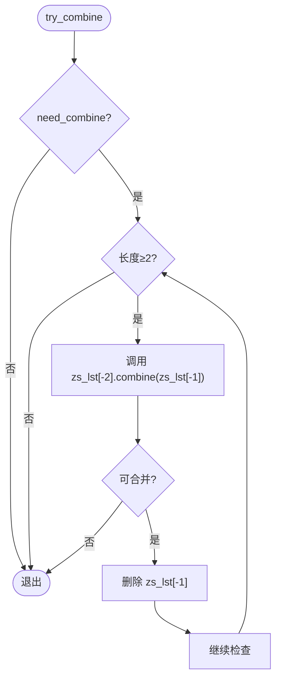
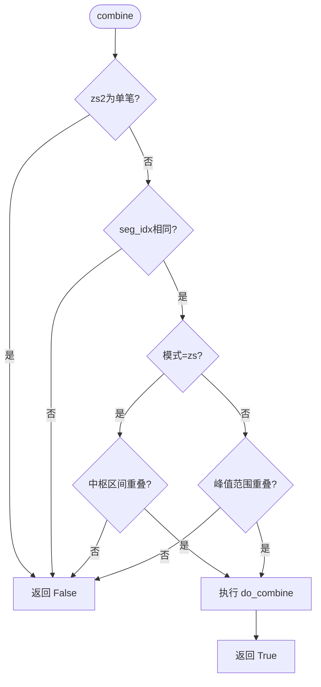
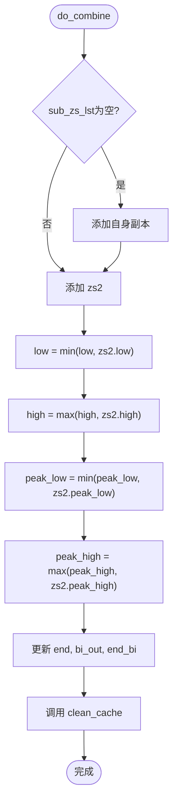
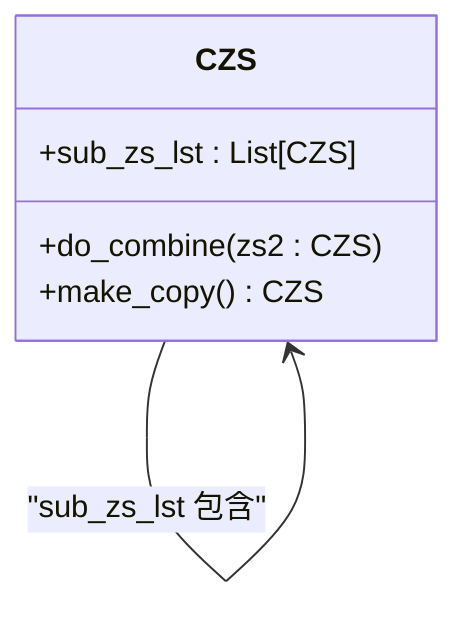

# 中枢合并机制

<cite>
**本文档引用文件**  
- [ZS.py](file://chan.py/ZS/ZS.py)
- [ZSList.py](file://chan.py/ZS/ZSList.py)
- [ZSConfig.py](file://chan.py/ZS/ZSConfig.py)
- [func_util.py](file://chan.py/Common/func_util.py)
</cite>

## 目录
1. [引言](#引言)
2. [中枢合并机制概述](#中枢合并机制概述)
3. [try_combine方法分析](#try_combine方法分析)
4. [CZS类的combine方法详解](#czs类的combine方法详解)
5. [do_combine方法与中枢边界更新](#do_combine方法与中枢边界更新)
6. [合并模式差异：zs与peak](#合并模式差异：zs与peak)
7. [sub_zs_lst与合并历史维护](#sub_zs_lst与合并历史维护)
8. [连续中枢合并的性能影响](#连续中枢合并的性能影响)
9. [clean_cache方法与缓存一致性](#clean_cache方法与缓存一致性)
10. [总结](#总结)

## 引言
中枢（ZS）是缠论分析中的核心结构，用于识别价格走势中的盘整区域。中枢合并机制通过动态整合相邻中枢，提升趋势判断的稳定性与准确性。本文系统阐述中枢合并的实现原理，聚焦`try_combine`方法与`CZS`类`combine`方法的协同流程，深入解析不同合并模式下的条件差异、边界更新逻辑、历史维护机制及性能特性。

## 中枢合并机制概述
中枢合并机制由`CZSList`类驱动，通过`try_combine`方法触发，调用`CZS`类的`combine`方法判断是否满足合并条件。若满足，则执行`do_combine`更新中枢范围，并通过`clean_cache`维护内部缓存一致性。该机制支持两种模式：`zs`（中枢区间重叠）和`peak`（峰值范围重叠），配置由`ZSConfig`控制。

**Section sources**
- [ZSList.py](file://chan.py/ZS/ZSList.py#L156-L160)
- [ZS.py](file://chan.py/ZS/ZS.py#L12-L233)
- [ZSConfig.py](file://chan.py/ZS/ZSConfig.py#L1-L6)

## try_combine方法分析
`try_combine`是中枢列表的合并入口方法，定义于`CZSList`类中。该方法在每次新中枢生成后被调用，检查倒数第二个与最后一个中枢是否可合并。其核心逻辑为：当列表长度≥2时，持续尝试将倒数第二个中枢与最后一个中枢合并，成功则删除末尾中枢，实现向前合并。

**Diagram sources**
- [ZSList.py](file://chan.py/ZS/ZSList.py#L156-L160)

**Section sources**
- [ZSList.py](file://chan.py/ZS/ZSList.py#L156-L160)

## CZS类的combine方法详解
`combine`方法是中枢合并的核心判断逻辑，定义于`CZS`类中。该方法接收另一个中枢`zs2`和合并模式`combine_mode`，返回布尔值表示是否可合并。其判断流程如下：
1. 若`zs2`为单笔中枢，不可合并；
2. 若两个中枢所属线段索引不同，不可合并；
3. 根据`combine_mode`分别判断：
   - `zs`模式：调用`has_overlap`检查中枢区间（low/high）是否重叠；
   - `peak`模式：检查峰值范围（peak_low/peak_high）是否重叠；
4. 满足条件则调用`do_combine`并返回`True`。

**Diagram sources**
- [ZS.py](file://chan.py/ZS/ZS.py#L120-L145)

**Section sources**
- [ZS.py](file://chan.py/ZS/ZS.py#L120-L145)

## do_combine方法与中枢边界更新
`do_combine`方法负责执行实际的合并操作，更新当前中枢的属性。其主要步骤包括：
1. 若`sub_zs_lst`为空，先将当前中枢的副本加入；
2. 将`zs2`加入`sub_zs_lst`；
3. 更新中枢边界：`low`取最小值，`high`取最大值；
4. 更新峰值范围：`peak_low`取最小值，`peak_high`取最大值；
5. 更新结束点与出中枢笔；
6. 调用`clean_cache`清除缓存。

**Diagram sources**
- [ZS.py](file://chan.py/ZS/ZS.py#L133-L145)

**Section sources**
- [ZS.py](file://chan.py/ZS/ZS.py#L133-L145)

## 合并模式差异：zs与peak
中枢合并支持两种模式，由`ZSConfig.zs_combine_mode`配置，默认为`zs`。

| 模式 | 合并条件 | 适用场景 |
|------|----------|----------|
| `zs` | `has_overlap(self.low, self.high, zs2.low, zs2.high, equal=True)` | 要求中枢价格区间存在重叠，更严格，适用于趋势确认 |
| `peak` | `has_overlap(self.peak_low, self.peak_high, zs2.peak_low, zs2.peak_high)` | 要求峰值范围重叠，更宽松，适用于震荡行情识别 |

`has_overlap`函数定义于`func_util.py`，当`equal=True`时允许边界相等视为重叠。

**Section sources**
- [ZS.py](file://chan.py/ZS/ZS.py#L120-L145)
- [ZSConfig.py](file://chan.py/ZS/ZSConfig.py#L3)
- [func_util.py](file://chan.py/Common/func_util.py#L50-L54)

## sub_zs_lst与合并历史维护
`sub_zs_lst`是`CZS`类的私有属性，类型为`List[CZS]`，用于维护合并历史。当首次执行`do_combine`时，先将当前中枢的副本（通过`make_copy`创建）加入列表，随后加入被合并的`zs2`。该设计使得合并后的中枢能够追溯其构成的原始中枢序列，支持后续分析如中枢演化、级别扩展等。

**Diagram sources**
- [ZS.py](file://chan.py/ZS/ZS.py#L50-L50)
- [ZS.py](file://chan.py/ZS/ZS.py#L133-L145)

**Section sources**
- [ZS.py](file://chan.py/ZS/ZS.py#L50-L50)
- [ZS.py](file://chan.py/ZS/ZS.py#L133-L145)

## 连续中枢合并的性能影响
`try_combine`采用循环向前合并策略，可能在连续生成可合并中枢时产生多次合并操作。由于每次合并均涉及属性更新与缓存清理，频繁调用可能带来性能开销。然而，该机制通过`need_combine`配置可关闭，且实际行情中连续可合并中枢较少，因此在正常场景下性能影响可控。

**Section sources**
- [ZSList.py](file://chan.py/ZS/ZSList.py#L156-L160)
- [ZS.py](file://chan.py/ZS/ZS.py#L133-L145)

## clean_cache方法与缓存一致性
`clean_cache`方法用于清除对象的`_memoize_cache`字典，确保在属性变更后，后续的缓存读取操作不会返回过期数据。该方法被`do_combine`、`update_zs_range`、`update_zs_end`等多个修改状态的方法调用，是维护内部状态一致性的关键环节。例如，`get_high_peak_klu`等带`@make_cache`装饰的方法依赖此机制保证结果正确。

**Section sources**
- [ZS.py](file://chan.py/ZS/ZS.py#L43-L44)
- [ZS.py](file://chan.py/ZS/ZS.py#L133-L145)

## 总结
中枢合并机制通过`try_combine`与`CZS.combine`的协同，实现了基于`zs`和`peak`两种模式的动态整合。`do_combine`方法精确更新中枢边界与峰值范围，并通过`sub_zs_lst`维护合并历史。`clean_cache`确保了属性变更后的缓存一致性。该机制在提升分析稳定性的同时，通过合理设计控制了性能开销，是缠论系统中关键的动态结构处理模块。