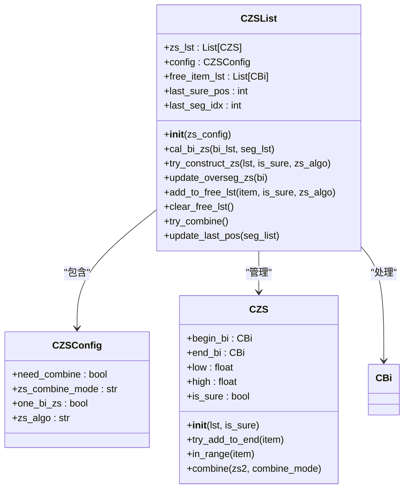
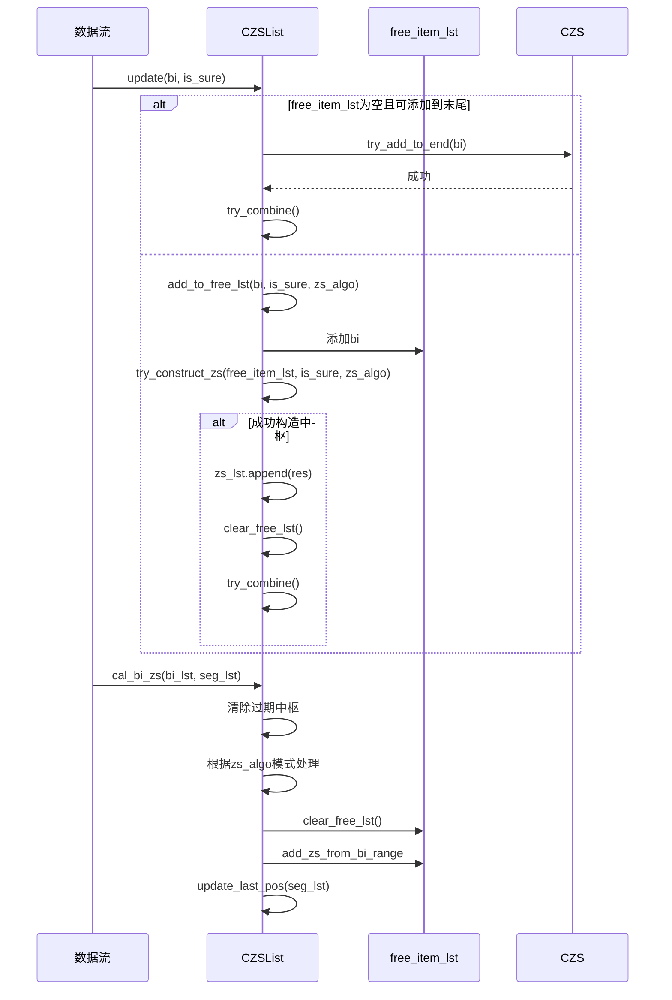
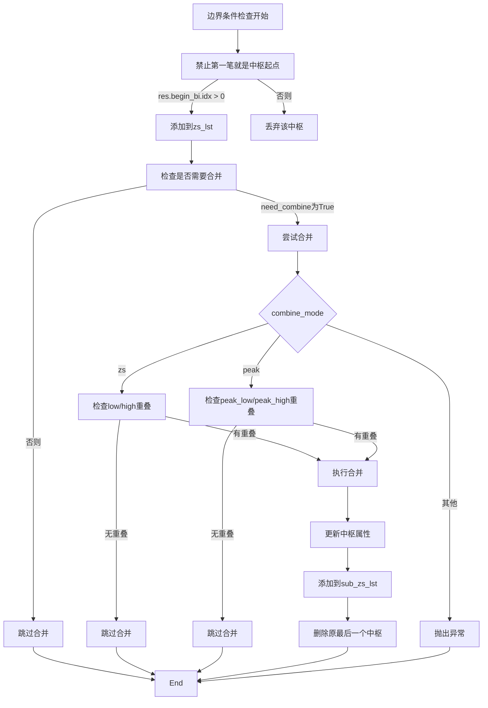

# 中枢构建流程

<cite>
**本文档引用文件**   
- [ZSList.py](file://chan.py/ZS/ZSList.py)
- [ZS.py](file://chan.py/ZS/ZS.py)
- [ZSConfig.py](file://chan.py/ZS/ZSConfig.py)
- [Bi.py](file://chan.py/Bi/Bi.py)
- [Seg.py](file://chan.py/Seg/Seg.py)
- [SegListComm.py](file://chan.py/Seg/SegListComm.py)
</cite>

## 目录
1. [引言](#引言)
2. [核心组件分析](#核心组件分析)
3. [中枢生成逻辑详解](#中枢生成逻辑详解)
4. [不同zs_algo模式处理差异](#不同zs_algo模式处理差异)
5. [free_item_lst缓冲机制](#free_item_lst缓冲机制)
6. [完整构建流程示意图](#完整构建流程示意图)
7. [边界条件与异常处理](#边界条件与异常处理)
8. [总结](#总结)

## 引言
本文档详细阐述了中枢（ZS）的完整构建流程，重点解析从CZSList类的cal_bi_zs方法入手，如何基于笔或线段列表逐步生成中枢。文档深入分析了在不同zs_algo模式下的处理逻辑差异，以及free_item_lst临时列表在实时数据流中的缓冲作用和清空机制。

## 核心组件分析

### CZSList类结构
CZSList类是中枢管理的核心容器，负责维护中枢列表、配置参数和临时缓冲区。



**图示来源**
- [ZSList.py](file://chan.py/ZS/ZSList.py#L12-L160)
- [ZSConfig.py](file://chan.py/ZS/ZSConfig.py#L1-L6)
- [ZS.py](file://chan.py/ZS/ZS.py#L1-L234)

**本节来源**
- [ZSList.py](file://chan.py/ZS/ZSList.py#L12-L30)
- [ZSConfig.py](file://chan.py/ZS/ZSConfig.py#L1-L6)

## 中枢生成逻辑详解

### cal_bi_zs方法执行流程
cal_bi_zs方法是中枢构建的入口点，负责协调整个中枢生成过程。

```mermaid
flowchart TD
Start([开始 cal_bi_zs]) --> ClearOldZS["清除过期中枢\nzs_lst[-1].begin_bi.idx >= last_sure_pos"]
ClearOldZS --> CheckZSAlgo{zs_algo 模式判断}
CheckZSAlgo --> |normal| NormalMode["normal模式处理"]
CheckZSAlgo --> |over_seg| OverSegMode["over_seg模式处理"]
CheckZSAlgo --> |auto| AutoMode["auto模式处理"]
CheckZSAlgo --> |未知| ThrowException["抛出异常"]
NormalMode --> ProcessSegs["遍历线段列表"]
ProcessSegs --> NeedCal{seg_need_cal?}
NeedCal --> |否| NextSeg
NeedCal --> |是| ClearFree["clear_free_lst()"]
ClearFree --> AddFromRange["add_zs_from_bi_range"]
AddFromRange --> NextSeg
NextSeg --> |仍有线段| ProcessSegs
NextSeg --> |无更多线段| HandleUnseg["处理未生成新线段部分"]
HandleUnseg --> UpdatePos["update_last_pos(seg_lst)"]
OverSegMode --> ClearFree2["clear_free_lst()"]
ClearFree2 --> BeginIdx["计算起始bi索引"]
BeginIdx --> ProcessBi["遍历bi列表"]
ProcessBi --> UpdateOverSeg["update_overseg_zs(bi)"]
UpdateOverSeg --> NextBi
NextBi --> |仍有bi| ProcessBi
NextBi --> UpdatePos
AutoMode --> InitVars["初始化变量"]
InitVars --> LoopSeg["遍历线段"]
LoopSeg --> CheckSure{seg.is_sure?}
CheckSure --> |是| MarkSure["sure_seg_appear = True"]
MarkSure --> ContinueLoop
CheckSure --> |否| ContinueLoop
ContinueLoop --> NeedCal2{seg_need_cal?}
NeedCal2 --> |否| NextSeg2
NeedCal2 --> |是| CheckCondition{seg.is_sure 或 (not sure_seg_appear and exist_sure_seg)}
CheckCondition --> |满足| ClearFree3["clear_free_lst()"]
ClearFree3 --> AddRangeSure["add_zs_from_bi_range"]
AddRangeSure --> NextSeg2
CheckCondition --> |不满足| ClearFree4["clear_free_lst()"]
ClearFree4 --> ProcessBi2["遍历bi列表"]
ProcessBi2 --> UpdateOverSeg2["update_overseg_zs(bi)"]
UpdateOverSeg2 --> NextBi2
NextBi2 --> |仍有bi| ProcessBi2
NextBi2 --> BreakLoop["break"]
BreakLoop --> NextSeg2
NextSeg2 --> |仍有线段| LoopSeg
NextSeg2 --> UpdatePos
UpdatePos --> End([结束])
ThrowException --> End
```

**图示来源**
- [ZSList.py](file://chan.py/ZS/ZSList.py#L50-L128)

**本节来源**
- [ZSList.py](file://chan.py/ZS/ZSList.py#L50-L128)

## 不同zs_algo模式处理差异

### normal模式
在normal模式下，中枢的生成遵循传统缠论规则，至少需要两笔重叠才能形成中枢。

```mermaid
flowchart TD
NormalStart["normal模式开始"] --> CheckOneBiZS{one_bi_zs?}
CheckOneBiZS --> |否| CheckLen{len(lst) == 1?}
CheckOneBiZS --> |是| UseLastTwo["使用最后两笔"]
CheckLen --> |是| ReturnNone["返回None"]
CheckLen --> |否| UseLastTwo
UseLastTwo --> TakeLastTwo["lst = lst[-2:]"]
TakeLastTwo --> CalcRange["计算重叠范围"]
CalcRange --> MinHigh["min_high = min(item._high())"]
CalcRange --> MaxLow["max_low = max(item._low())"]
MinHigh --> CheckOverlap{min_high > max_low?}
MaxLow --> CheckOverlap
CheckOverlap --> |是| CreateZS["创建CZS对象"]
CheckOverlap --> |否| ReturnNone2["返回None"]
CreateZS --> ReturnZS["返回CZS"]
ReturnNone --> ReturnNoneObj["返回None"]
ReturnNone2 --> ReturnNoneObj
ReturnNoneObj --> End
```

**图示来源**
- [ZSList.py](file://chan.py/ZS/ZSList.py#L80-L85)

**本节来源**
- [ZSList.py](file://chan.py/ZS/ZSList.py#L80-L85)

### over_seg模式
over_seg模式要求更严格的条件，需要三笔且首笔方向与线段相反才能形成中枢。

```mermaid
flowchart TD
OverSegStart["over_seg模式开始"] --> CheckLen{len(lst) < 3?}
CheckLen --> |是| ReturnNone["返回None"]
CheckLen --> |否| TakeLastThree["lst = lst[-3:]"]
TakeLastThree --> CheckDir{lst[0].dir == lst[0].parent_seg.dir?}
CheckDir --> |是| SliceAndReturn["lst = lst[1:]"]
SliceAndReturn --> ReturnNone2["返回None"]
CheckDir --> |否| Continue
Continue --> CalcRange["计算重叠范围"]
CalcRange --> MinHigh["min_high = min(item._high())"]
CalcRange --> MaxLow["max_low = max(item._low())"]
MinHigh --> CheckOverlap{min_high > max_low?}
MaxLow --> CheckOverlap
CheckOverlap --> |是| CreateZS["创建CZS对象"]
CheckOverlap --> |否| ReturnNone3["返回None"]
CreateZS --> ReturnZS["返回CZS"]
ReturnNone --> ReturnNoneObj["返回None"]
ReturnNone2 --> ReturnNoneObj
ReturnNone3 --> ReturnNoneObj
ReturnNoneObj --> End
```

**图示来源**
- [ZSList.py](file://chan.py/ZS/ZSList.py#L86-L93)

**本节来源**
- [ZSList.py](file://chan.py/ZS/ZSList.py#L86-L93)

### auto模式
auto模式根据线段的确定性动态选择处理策略。

```mermaid
flowchart TD
AutoStart["auto模式开始"] --> InitVars["初始化sure_seg_appear=False"]
InitVars --> GetExistSure["exist_sure_seg = seg_lst.exist_sure_seg()"]
GetExistSure --> LoopSeg["遍历线段"]
LoopSeg --> CheckSure{seg.is_sure?}
CheckSure --> |是| SetSure["sure_seg_appear = True"]
SetSure --> Continue
CheckSure --> |否| Continue
Continue --> NeedCal{seg_need_cal(seg)?}
NeedCal --> |否| NextSeg
NeedCal --> |是| CheckCondition{seg.is_sure 或 (not sure_seg_appear and exist_sure_seg)}
CheckCondition --> |满足| ClearFree["clear_free_lst()"]
ClearFree --> NormalProcess["add_zs_from_bi_range(..., normal)"]
NormalProcess --> NextSeg
CheckCondition --> |不满足| ClearFree2["clear_free_lst()"]
ClearFree2 --> ProcessBi["遍历bi列表"]
ProcessBi --> UpdateOverSeg["update_overseg_zs(bi)"]
UpdateOverSeg --> NextBi
NextBi --> |仍有bi| ProcessBi
NextBi --> Break["break"]
Break --> NextSeg
NextSeg --> |仍有线段| LoopSeg
NextSeg --> EndLoop["结束循环"]
EndLoop --> UpdatePos["update_last_pos(seg_lst)"]
UpdatePos --> End
```

**图示来源**
- [ZSList.py](file://chan.py/ZS/ZSList.py#L100-L128)
- [SegListComm.py](file://chan.py/Seg/SegListComm.py#L160-L169)

**本节来源**
- [ZSList.py](file://chan.py/ZS/ZSList.py#L100-L128)
- [SegListComm.py](file://chan.py/Seg/SegListComm.py#L160-L169)

## free_item_lst缓冲机制

### 缓冲区作用与生命周期
free_item_lst作为临时缓冲区，在实时数据流中起到关键的缓冲作用。



**图示来源**
- [ZSList.py](file://chan.py/ZS/ZSList.py#L35-L49)
- [ZSList.py](file://chan.py/ZS/ZSList.py#L60-L78)

**本节来源**
- [ZSList.py](file://chan.py/ZS/ZSList.py#L35-L78)

## 完整构建流程示意图

### 从原始数据到中枢创建的完整链条
展示从原始笔数据输入到中枢对象创建的完整流程。

```mermaid
flowchart LR
RawData["原始K线数据"] --> BiDetection["笔识别"]
BiDetection --> BiList["CBiList"]
BiList --> SegDetection["线段识别"]
SegDetection --> SegList["CSegListComm"]
BiList --> CZSList["CZSList"]
SegList --> CZSList
CZSList --> |cal_bi_zs| Process["中枢构建处理"]
Process --> |normal模式| NormalFlow["两笔重叠检测"]
Process --> |over_seg模式| OverSegFlow["三笔且首笔方向相反"]
Process --> |auto模式| AutoFlow["动态选择模式"]
NormalFlow --> ConstructZS["try_construct_zs"]
OverSegFlow --> ConstructZS
AutoFlow --> ConstructZS
ConstructZS --> CheckOverlap["检查高低点重叠"]
CheckOverlap --> |有重叠| CreateZS["创建CZS对象"]
CheckOverlap --> |无重叠| Discard["丢弃"]
CreateZS --> AddToZSList["添加到zs_lst"]
AddToZSList --> ClearBuffer["清空free_item_lst"]
ClearBuffer --> TryCombine["尝试合并相邻中枢"]
TryCombine --> |满足合并条件| CombineZS["合并中枢"]
TryCombine --> |不满足| End["流程结束"]
CombineZS --> UpdateZSList["更新zs_lst"]
UpdateZSList --> End
```



**图示来源**
- [ZSList.py](file://chan.py/ZS/ZSList.py#L50-L128)
- [ZS.py](file://chan.py/ZS/ZS.py#L1-L234)
- [SegListComm.py](file://chan.py/Seg/SegListComm.py#L1-L169)

**本节来源**
- [ZSList.py](file://chan.py/ZS/ZSList.py#L50-L128)
- [ZS.py](file://chan.py/ZS/ZS.py#L1-L234)

## 边界条件与异常处理

### 关键边界条件检查
系统在多个关键点进行边界条件检查，确保数据完整性。



**图示来源**
- [ZSList.py](file://chan.py/ZS/ZSList.py#L45-L49)
- [ZS.py](file://chan.py/ZS/ZS.py#L130-L150)

**本节来源**
- [ZSList.py](file://chan.py/ZS/ZSList.py#L45-L49)
- [ZS.py](file://chan.py/ZS/ZS.py#L130-L150)

## 总结
本文档全面解析了中枢的完整构建流程，从CZSList类的cal_bi_zs方法入手，详细阐述了如何基于笔或线段列表逐步生成中枢。重点说明了在不同zs_algo模式（normal、over_seg、auto）下的处理逻辑差异：normal模式下至少需要两笔重叠形成中枢，over_seg模式要求三笔且首笔方向与线段相反。文档还详细描述了free_item_lst临时列表在实时数据流中的缓冲作用及其清空机制，并通过代码示例展示了从原始笔数据输入到中枢对象创建的完整链条，包括边界条件判断和异常处理策略。

[本节无需来源，为总结性内容]