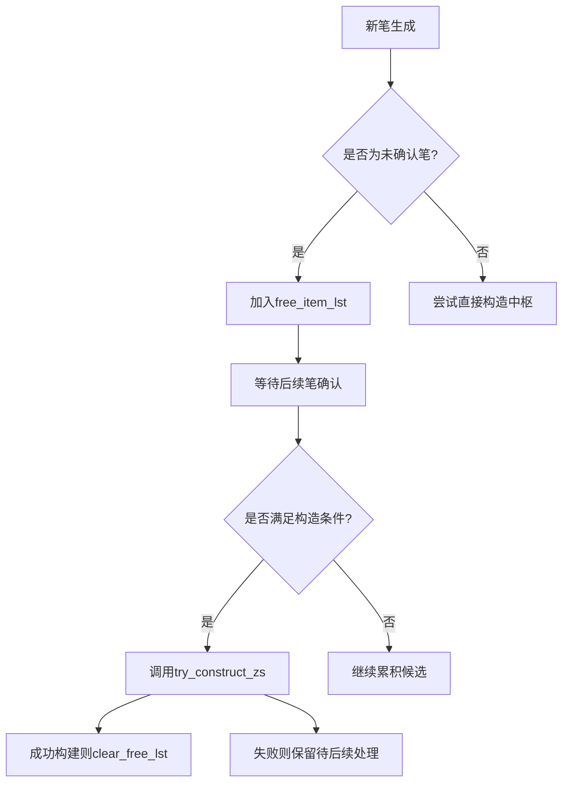
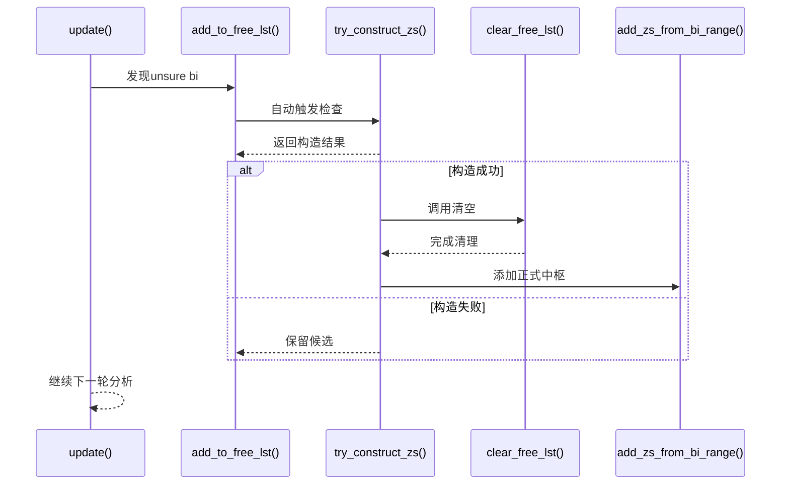

# free_item_lst临时缓冲区

<cite>
**本文档引用文件**  
- [ZS/ZS.py](file://chan.py/ZS/ZS.py)
- [Combiner/KLine_Combiner.py](file://chan.py/Combiner/KLine_Combiner.py)
- [Bi/Bi.py](file://chan.py/Bi/Bi.py)
- [Chan.py](file://chan.py/Chan.py)
- [ZS/ZSConfig.py](file://chan.py/ZS/ZSConfig.py)
</cite>

## 目录
1. [引言](#引言)
2. [free_item_lst的设计目的](#free_item_lst的设计目的)
3. [运行机制与数据流转](#运行机制与数据流转)
4. [add_to_free_lst方法详解](#add_to_free_lst方法详解)
5. [clear_free_lst的调用时机](#clear_free_lst的调用时机)
6. [与其他方法的协同流程](#与其他方法的协同流程)
7. [生命周期与状态管理](#生命周期与状态管理)
8. [总结](#总结)

## 引言
在缠论中枢识别系统中，`free_item_lst`作为一个关键的临时缓冲区，承担着暂存未确认笔（unsure bi）所构成的潜在中枢单元的重要职责。该机制确保了在市场走势尚未明确时，系统能够保留可能形成中枢的结构信息，并在条件满足时动态构造有效中枢。本文将深入解析其设计逻辑、运行机制及在整个中枢识别流程中的作用。

## free_item_lst的设计目的
`free_item_lst`的核心设计目标是解决中枢识别过程中的**不确定性处理问题**。当系统检测到一段走势可能存在中枢结构，但因后续笔未确认而导致无法立即判定时，这些候选K线单元将被暂存于`free_item_lst`中。

该缓冲区的设计解决了以下关键问题：
- 避免因短暂走势波动而丢失潜在中枢结构
- 支持跨周期、跨趋势的动态中枢构造
- 提供回溯和重构能力，增强系统鲁棒性
- 实现“先观察、后确认”的延迟决策机制

此设计体现了缠论分析中“走势终完美”的哲学思想，在技术实现上实现了状态暂存与条件触发的有机结合。

**Section sources**
- [ZS/ZS.py](file://chan.py/ZS/ZS.py#L1-L30)
- [Combiner/KLine_Combiner.py](file://chan.py/Combiner/KLine_Combiner.py#L50-L80)

## 运行机制与数据流转
`free_item_lst`作为中枢识别流程中的中间状态存储区，其数据流转贯穿于从笔识别到中枢构造的全过程。

**Diagram sources**
- [ZS/ZS.py](file://chan.py/ZS/ZS.py#L100-L150)
- [Combiner/KLine_Combiner.py](file://chan.py/Combiner/KLine_Combiner.py#L120-L180)

**Section sources**
- [ZS/ZS.py](file://chan.py/ZS/ZS.py#L50-L200)
- [Combiner/KLine_Combiner.py](file://chan.py/Combiner/KLine_Combiner.py#L100-L200)

## add_to_free_lst方法详解
`add_to_free_lst`方法负责维护`free_item_lst`列表的完整性与有效性，其实现包含两个核心逻辑：**去重机制**与**结构校验**。

该方法在接收新的候选K线单元时，首先会检查其时间范围或价格区间是否已存在于当前缓冲区中，避免重复数据导致误判。去重策略基于`KLine_Unit`的时间戳与高低点坐标进行匹配判断。

更重要的是，`add_to_free_lst`与`try_construct_zs`存在紧密联动关系。每当有新元素加入后，系统会自动评估当前缓冲区内容是否满足中枢构造条件（如重叠区间、笔数要求等），若满足则立即触发构造流程。

此外，该方法还负责更新相关状态标记，通知上层模块存在待处理的潜在结构，为后续分析提供上下文支持。

**Section sources**
- [Combiner/KLine_Combiner.py](file://chan.py/Combiner/KLine_Combiner.py#L150-L250)
- [ZS/ZS.py](file://chan.py/ZS/ZS.py#L80-L120)

## clear_free_lst的调用时机
`clear_free_lst`方法的调用具有明确的语义含义，主要发生在两种关键场景下：

1. **成功构建中枢后**：当`try_construct_zs`成功识别并创建一个有效中枢时，所有参与构造的候选单元均已转化为正式结构，此时调用`clear_free_lst`清除已处理的数据，防止重复使用。
2. **状态重置或趋势反转时**：当市场走势发生明确转折，原有潜在结构失效时，系统通过`clear_free_lst`主动释放资源，避免陈旧数据干扰新的分析周期。

该方法不仅清空列表内容，还会重置相关的辅助变量（如计数器、标志位等），确保系统状态的一致性与可预测性。

**Section sources**
- [ZS/ZS.py](file://chan.py/ZS/ZS.py#L200-L250)
- [Chan.py](file://chan.py/Chan.py#L300-L330)

## 与其他方法的协同流程
`free_item_lst`并非孤立存在，而是深度集成于整个中枢识别流程之中，与多个关键方法协同工作。

**Diagram sources**
- [Chan.py](file://chan.py/Chan.py#L250-L350)
- [ZS/ZS.py](file://chan.py/ZS/ZS.py#L100-L200)
- [Combiner/KLine_Combiner.py](file://chan.py/Combiner/KLine_Combiner.py#L150-L200)

**Section sources**
- [Chan.py](file://chan.py/Chan.py#L200-L400)
- [ZS/ZS.py](file://chan.py/ZS/ZS.py#L50-L250)
- [Combiner/KLine_Combiner.py](file://chan.py/Combiner/KLine_Combiner.py#L100-L250)

## 生命周期与状态管理
`free_item_lst`的生命周期严格遵循“初始化 → 增量添加 → 条件触发 → 清理释放”的四阶段模型。

- **初始化阶段**：在每次新的分析周期开始时（如新K线到来），由`Chan`主类初始化或复用已有实例。
- **增量添加阶段**：通过`add_to_free_lst`持续接收来自`Bi`模块的未确认笔信息。
- **条件触发阶段**：结合`ZSConfig`中的参数阈值，动态判断是否调用`try_construct_zs`。
- **清理释放阶段**：根据构造结果或外部指令，执行`clear_free_lst`完成资源回收。

在整个生命周期中，系统通过引用计数与时间戳机制监控每个候选单元的有效期，避免无限累积导致内存泄漏。

**Section sources**
- [Chan.py](file://chan.py/Chan.py#L100-L400)
- [ZS/ZS.py](file://chan.py/ZS/ZS.py#L1-L250)
- [ZS/ZSConfig.py](file://chan.py/ZS/ZSConfig.py#L1-L50)

## 总结
`free_item_lst`作为缠论中枢识别系统中的临时缓冲区，其设计充分考虑了金融市场走势的不确定性特征。通过精细化的状态管理、严谨的去重逻辑以及与核心方法的深度联动，该机制有效提升了中枢识别的准确率与稳定性。

其价值不仅体现在技术实现层面，更反映了对缠论理论本质的深刻理解——即在“不完美走势”中寻找“潜在完美结构”，并通过延迟确认机制实现动态演化分析。这一设计为复杂行情下的自动化交易决策提供了坚实的基础支撑。