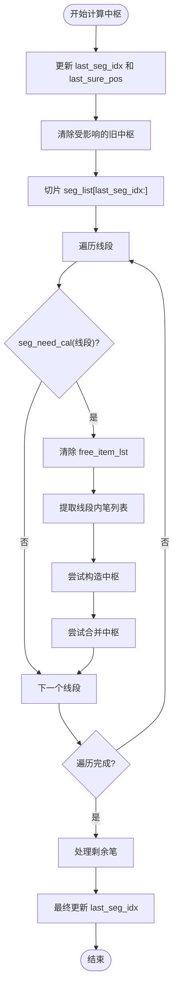

# last_seg_idx状态管理

<cite>
**本文档中引用的文件**
- [ZSList.py](file://chan.py/ZS/ZSList.py)
- [SegListComm.py](file://chan.py/Seg/SegListComm.py)
- [ZSConfig.py](file://chan.py/ZS/ZSConfig.py)
</cite>

## 目录
1. [引言](#引言)
2. [last_seg_idx初始化与last_sure_pos协同机制](#last_seg_idx初始化与last_sure_pos协同机制)
3. [last_seg_idx在中枢计算中的控制作用](#last_seg_idx在中枢计算中的控制作用)
4. [增量更新场景下的切片与遍历逻辑](#增量更新场景下的切片与遍历逻辑)
5. [跨线段中枢计算的连续性保障](#跨线段中枢计算的连续性保障)
6. [结论](#结论)

## 引言
在缠论分析系统中，`CZSList` 类负责管理中枢（ZS）的生成与维护。其中，`last_seg_idx` 作为关键状态变量，与 `last_sure_pos` 协同工作，确保中枢计算的准确性与连续性。本文深入解析 `last_seg_idx` 的角色，包括其初始化、更新机制及其在中枢计算流程中的核心作用。

## last_seg_idx初始化与last_sure_pos协同机制

`last_seg_idx` 与 `last_sure_pos` 在 `CZSList` 初始化时被赋予初始值，分别为 `0` 和 `-1`。这两个变量共同标识了最后一个已确认线段在 `seg_list` 中的位置信息。

- `last_seg_idx`：记录最后一个已确认线段的索引。
- `last_sure_pos`：记录该线段起始笔的索引。

这两个变量通过 `update_last_pos` 方法进行同步更新。该方法从 `seg_list` 末尾向前遍历，找到第一个 `is_sure` 为 `True` 的线段，并将其 `idx` 和 `start_bi.idx` 分别赋值给 `last_seg_idx` 和 `last_sure_pos`。

这种协同机制确保了系统始终知道从哪个线段开始进行新的中枢计算，避免了重复或遗漏。

**Section sources**
- [ZSList.py](file://chan.py/ZS/ZSList.py#L15-L25)

## last_seg_idx在中枢计算中的控制作用

`last_seg_idx` 在 `cal_bi_zs` 方法中发挥着关键的控制作用。该方法负责根据笔列表和线段列表计算中枢。

在 `zs_algo` 为 `"normal"` 或 `"auto"` 的情况下，`cal_bi_zs` 使用 `seg_lst[self.last_seg_idx:]` 对线段列表进行切片操作，仅处理从 `last_seg_idx` 开始的线段。这确保了计算只针对尚未处理或可能发生变化的线段部分。

同时，`seg_need_cal` 方法通过比较 `seg.start_bi.idx` 与 `last_sure_pos` 来判断一个线段是否需要参与计算。只有当线段的起始笔索引大于等于 `last_sure_pos` 时，才认为该线段需要重新计算中枢。

这种双重控制机制（基于索引的切片和基于位置的判断）有效缩小了计算范围，提高了计算效率。

**Section sources**
- [ZSList.py](file://chan.py/ZS/ZSList.py#L100-L128)
- [ZSList.py](file://chan.py/ZS/ZSList.py#L45-L48)

## 增量更新场景下的切片与遍历逻辑

在增量更新场景下，每当有新的K线数据到来，系统会重新计算笔、线段和中枢。`last_seg_idx` 的存在使得中枢计算可以高效地进行增量更新。

具体逻辑如下：
1. 系统首先调用 `update_last_pos` 更新 `last_seg_idx` 和 `last_sure_pos`。
2. 在 `cal_bi_zs` 中，通过 `seg_lst[self.last_seg_idx:]` 获取需要重新计算的线段子集。
3. 遍历这些线段，对每个线段内的笔进行中枢构造尝试。
4. 对于最后一个线段之后的笔（即尚未形成新线段的部分），系统也会进行处理，以确保所有可能的中枢都被识别。

这种基于切片的遍历逻辑避免了对整个历史数据的重复计算，极大地提升了系统的实时性能。

**Section sources**
- [ZSList.py](file://chan.py/ZS/ZSList.py#L100-L128)

## 跨线段中枢计算的连续性保障

`last_seg_idx` 和 `last_sure_pos` 的协同工作是保障跨线段中枢计算连续性与准确性的核心。

在每次计算开始时，系统会清除所有 `begin_bi.idx` 大于等于 `last_sure_pos` 的现有中枢（`self.zs_lst.pop()`）。这确保了计算从一个干净的状态开始，避免了旧数据的干扰。

随后，系统从 `last_seg_idx` 指向的线段开始，重新计算所有可能的中枢。由于 `last_seg_idx` 总是指向最后一个已确认线段，因此计算过程能够无缝衔接上一次的结果，保证了中枢序列的连续性和逻辑一致性。

此外，`add_zs_from_bi_range` 方法中的 `deal_bi_cnt` 机制防止了 `try_add_to_end` 错误地将新笔添加到上一个线段的中枢中，进一步增强了计算的准确性。

**Diagram sources**
- [ZSList.py](file://chan.py/ZS/ZSList.py#L100-L128)
- [ZSList.py](file://chan.py/ZS/ZSList.py#L45-L48)

**Section sources**
- [ZSList.py](file://chan.py/ZS/ZSList.py#L100-L128)

## 结论
`last_seg_idx` 是 `CZSList` 中一个至关重要的状态变量，它与 `last_sure_pos` 紧密协作，共同实现了高效、准确的中枢计算。通过初始化、更新机制、切片操作和遍历逻辑，`last_seg_idx` 有效地控制了中枢计算的起始范围，确保了在增量更新场景下跨线段计算的连续性与准确性。理解这一机制对于掌握整个缠论分析系统的运行原理具有重要意义。