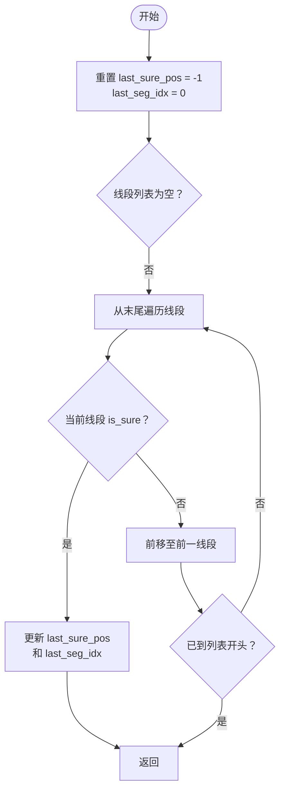
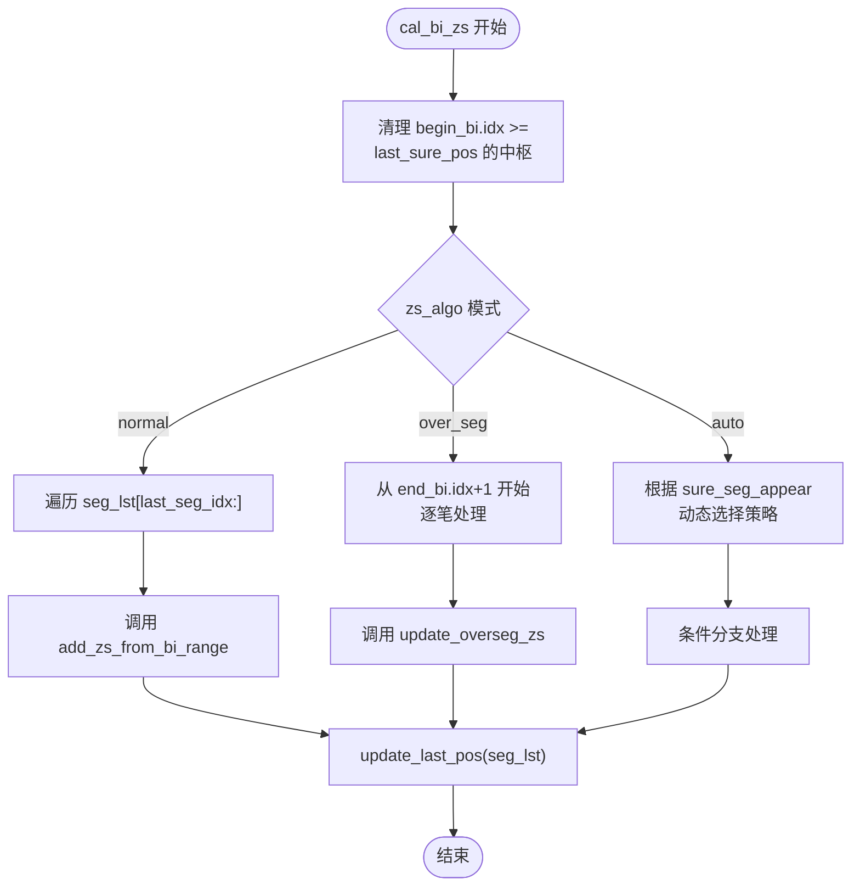

# last_sure_pos状态管理

<cite>
**本文档中引用的文件**  
- [ZSList.py](file://chan.py/ZS/ZSList.py)
- [ZS.py](file://chan.py/ZS/ZS.py)
- [SegListComm.py](file://chan.py/Seg/SegListComm.py)
</cite>

## 目录
1. [last_sure_pos变量定义与初始化](#last_sure_pos变量定义与初始化)  
2. [update_last_pos方法更新机制](#update_last_pos方法更新机制)  
3. [在中枢识别中的作用](#在中枢识别中的作用)  
4. [cal_bi_zs方法中的逻辑分析](#cal_bi_zs方法中的逻辑分析)  
5. [不同zs_algo模式下的行为差异](#不同zs_algo模式下的行为差异)  
6. [状态管理流程示例](#状态管理流程示例)  

## last_sure_pos变量定义与初始化

`last_sure_pos` 是 `CZSList` 类中的一个核心状态变量，用于记录最后一个确认线段的起始笔索引。该变量在 `CZSList` 初始化时被设置为 -1，表示初始状态下无任何确认的线段数据。

该变量的主要作用是作为数据安全边界，确保在进行中枢重新计算时，仅使用已被确认的、不会因后续数据更新而改变的笔数据。通过此机制，系统能够避免未确认数据对已形成中枢的干扰，从而保证分析结果的一致性和稳定性。

**Section sources**  
- [ZSList.py](file://chan.py/ZS/ZSList.py#L12-L16)

## update_last_pos方法更新机制

`update_last_pos` 方法负责更新 `last_sure_pos` 和 `last_seg_idx` 两个状态变量。该方法从线段列表的末尾开始向前遍历，查找第一个被标记为 `is_sure` 的线段，并将其起始笔的索引赋值给 `last_sure_pos`，同时记录该线段的索引到 `last_seg_idx`。

此方法确保了系统始终基于最新的确认线段来确定可安全参与计算的数据范围。当新的确认线段出现时，`last_sure_pos` 会相应前移，允许更多历史数据参与中枢的重新识别和合并操作。

**Diagram sources**  
- [ZSList.py](file://chan.py/ZS/ZSList.py#L20-L30)

**Section sources**  
- [ZSList.py](file://chan.py/ZS/ZSList.py#L20-L30)

## 在中枢识别中的作用

`last_sure_pos` 变量通过 `seg_need_cal` 方法参与中枢识别过程。该方法判断一个线段是否需要参与计算：只有当线段的起始笔索引大于等于 `last_sure_pos` 时，才认为该线段处于可变区域，需要重新计算其中枢。

这一机制有效防止了已确认中枢被未确认数据修改。例如，在实时行情中，最新线段可能因价格波动而频繁调整，若允许这些未确认数据影响历史中枢，则会导致分析结果不稳定。通过 `last_sure_pos` 的边界控制，系统确保只有经过验证的稳定数据才能影响中枢结构。

**Section sources**  
- [ZSList.py](file://chan.py/ZS/ZSList.py#L32-L34)

## cal_bi_zs方法中的逻辑分析

`cal_bi_zs` 方法是中枢计算的核心入口，在每次调用时首先清理所有起始笔索引大于等于 `last_sure_pos` 的现有中枢，确保从该边界开始重新计算。

根据不同的 `zs_algo` 配置模式，处理逻辑有所不同：
- 在 `"normal"` 模式下，遍历从 `last_seg_idx` 开始的所有线段，对每个需要计算的线段调用 `add_zs_from_bi_range` 进行中枢构建。
- 在 `"over_seg"` 模式下，从最后一个中枢的结束笔之后开始，逐笔处理以识别跨线段中枢。
- 在 `"auto"` 模式下，结合确认线段的出现情况动态选择处理策略。

最终，`cal_bi_zs` 方法会调用 `update_last_pos` 更新状态变量，完成一轮完整的状态管理循环。

**Diagram sources**  
- [ZSList.py](file://chan.py/ZS/ZSList.py#L80-L158)

**Section sources**  
- [ZSList.py](file://chan.py/ZS/ZSList.py#L80-L158)

## 不同zs_algo模式下的行为差异

| 模式 | 行为特征 | last_sure_pos影响 |
|------|--------|------------------|
| normal | 基于线段范围构建中枢，每线段独立处理 | 严格按线段边界划分可计算区域 |
| over_seg | 允许中枢跨越线段边界，支持更灵活的形态识别 | 仍受 last_sure_pos 限制，但可跨线段延伸 |
| auto | 动态切换策略：存在确认线段前使用 over_seg，之后切换 normal | 根据 sure_seg_appear 状态动态调整处理范围 |

在 `"auto"` 模式下，系统通过 `sure_seg_appear` 标志位跟踪确认线段的出现时机。在首个确认线段出现前，采用 `over_seg` 策略以提高灵敏度；一旦出现确认线段，则切换至 `normal` 模式以保证稳定性。这种设计兼顾了实时性和准确性。

**Section sources**  
- [ZSList.py](file://chan.py/ZS/ZSList.py#L100-L150)

## 状态管理流程示例

以下为 `last_sure_pos` 在典型场景中的变化过程：

1. **初始状态**：`last_sure_pos = -1`，所有数据均可参与计算
2. **首个确认线段形成**：`update_last_pos` 将 `last_sure_pos` 更新为该线段起始笔索引
3. **新增未确认数据**：`cal_bi_zs` 仅重新计算 `last_sure_pos` 之后的数据
4. **新确认线段出现**：`last_sure_pos` 前移，触发历史数据的重新验证与中枢合并

此流程确保了系统既能及时响应最新市场变化，又能保持历史分析结果的稳定性，实现了动态与静态的平衡。

**Section sources**  
- [ZSList.py](file://chan.py/ZS/ZSList.py#L20-L158)
- [SegListComm.py](file://chan.py/Seg/SegListComm.py#L140-L145)