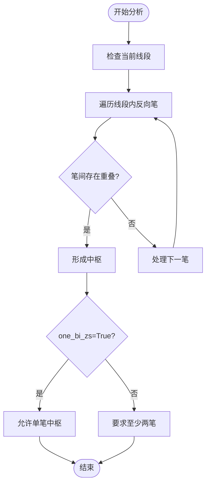
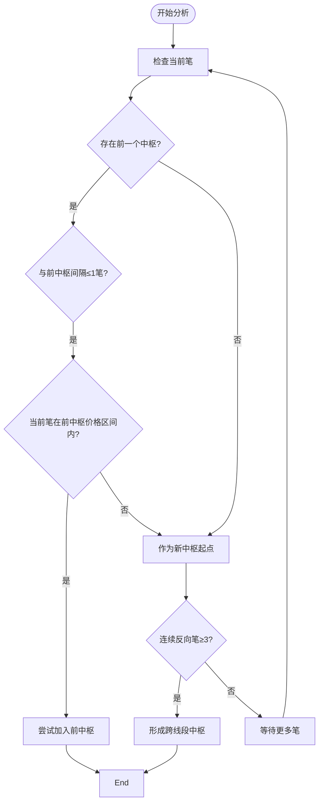
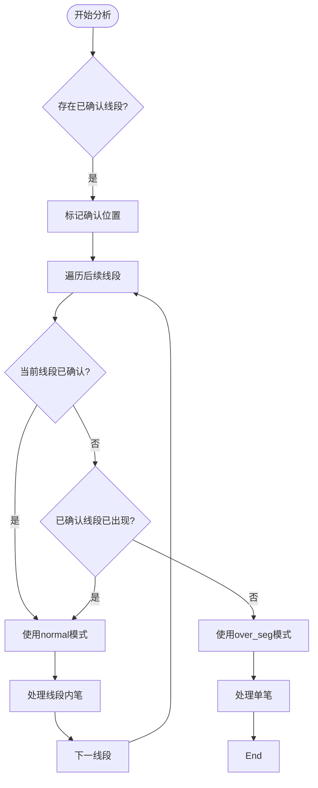

# 中枢配置参数详解

<cite>
**Referenced Files in This Document**   
- [ZSConfig.py](file://chan.py/ZS/ZSConfig.py)
- [ChanConfig.py](file://chan.py/ChanConfig.py)
- [ZSList.py](file://chan.py/ZS/ZSList.py)
</cite>

## 目录
1. [中枢配置体系概述](#中枢配置体系概述)
2. [CZSConfig核心参数详解](#czsconfig核心参数详解)
3. [zs_algo算法模式深度解析](#zs_algo算法模式深度解析)
4. [全局配置集成](#全局配置集成)
5. [配置示例与影响分析](#配置示例与影响分析)

## 中枢配置体系概述

中枢识别是缠论分析体系中的核心环节，其配置参数直接影响技术分析的准确性和灵敏度。本系统通过`CZSConfig`类和`CChanConfig`类构建了分层的配置体系，实现了中枢识别逻辑的灵活控制。`CZSConfig`作为中枢识别的专用配置类，封装了四个核心参数：`need_combine`（中枢合并开关）、`zs_combine_mode`（合并模式）、`one_bi_zs`（单笔中枢开关）和`zs_algo`（中枢算法类型）。这些参数通过`CChanConfig`全局配置类进行统一管理，确保了配置的一致性和可维护性。

**Section sources**
- [ZSConfig.py](file://chan.py/ZS/ZSConfig.py#L0-L5)
- [ChanConfig.py](file://chan.py/ChanConfig.py#L0-L182)

## CZSConfig核心参数详解

`CZSConfig`类是中枢识别功能的配置核心，其构造函数定义了四个关键参数，共同决定了中枢的生成、合并和识别逻辑。

### need_combine（中枢合并开关）

`need_combine`参数控制是否启用中枢合并功能。当设置为`True`时，系统会自动检测相邻中枢之间的包含关系，并根据`zs_combine_mode`指定的算法进行合并，形成更大级别的中枢结构。此功能对于识别长期趋势和关键支撑/阻力区域至关重要。当设置为`False`时，所有识别出的中枢将保持独立状态，适用于需要精细分析短期波动的场景。

### zs_combine_mode（合并模式）

`zs_combine_mode`参数定义了中枢合并的具体算法，支持`zs`和`peak`两种模式。`zs`模式采用标准的中枢重叠判断逻辑，要求两个中枢的价格区间存在交集才能合并。`peak`模式则更为激进，它允许中枢在顶点或底点处进行连接性合并，即使价格区间没有完全重叠。这种模式能够识别出更连续的趋势结构，但也可能增加误判的风险。

### one_bi_zs（单笔中枢开关）

`one_bi_zs`参数决定是否允许单笔构成中枢。在标准缠论中，一个完整的中枢至少需要三笔重叠。然而，在某些特殊市场条件下（如剧烈波动或数据稀疏），允许单笔中枢可以提高系统的响应速度。当此参数为`False`时，系统将严格执行三笔重叠规则；为`True`时，则可能在特定算法模式下（如`over_seg`）识别出单笔中枢。

**Section sources**
- [ZSConfig.py](file://chan.py/ZS/ZSConfig.py#L0-L5)

## zs_algo算法模式深度解析

`zs_algo`参数是中枢识别算法的核心，它决定了系统如何从笔和线段数据中提取中枢结构。该参数支持`normal`、`over_seg`和`auto`三种模式，每种模式针对不同的市场分析需求。

### normal模式（标准模式）

`normal`模式遵循经典的缠论定义，是系统默认的中枢识别算法。在此模式下，系统以线段为基本分析单元，仅在线段内部的笔之间寻找重叠区域来构建中枢。其工作原理如下：对于每一个已确认的线段，系统会遍历其包含的所有反向笔，检查它们的价格区间是否满足重叠条件（即后一笔的高低点区间与前一笔存在交集）。只有当至少两笔（或根据`one_bi_zs`设置）满足此条件时，才会形成一个中枢。这种模式确保了中枢的严谨性和可靠性，适用于大多数常规市场分析场景。

**Diagram sources**
- [ZSList.py](file://chan.py/ZS/ZSList.py#L100-L110)

### over_seg模式（跨线段模式）

`over_seg`模式突破了线段的边界限制，支持跨线段的中枢识别。这种模式适用于捕捉跨越多个线段的大型盘整区间。其工作原理是：系统不再局限于单个线段内部，而是将连续的、方向相反的笔序列作为一个整体来分析。当检测到三个或更多连续的反向笔（由`zs_algo`参数控制）且它们的价格区间存在有效重叠时，即可形成一个跨线段中枢。此模式对`one_bi_zs`参数有严格要求，必须设置为`False`以保证中枢的稳定性。`over_seg`模式能够揭示更深层次的市场结构，但对数据质量和算法鲁棒性要求更高。

**Diagram sources**
- [ZSList.py](file://chan.py/ZS/ZSList.py#L111-L124)

### auto模式（自动模式）

`auto`模式是一种智能切换算法，旨在平衡分析的实时性和准确性。其核心思想是根据线段的确认状态动态选择`normal`或`over_seg`模式。具体工作原理如下：系统首先检查是否存在已确认的线段（`is_sure`）。如果存在，对于已确认的线段部分，采用稳健的`normal`模式进行分析；对于尚未确认的、最新的线段部分，则切换到灵敏的`over_seg`模式。这种策略使得系统在历史数据上保持严谨，而在实时行情中能够快速响应潜在的中枢形成信号。`auto`模式特别适用于需要兼顾回测精度和实盘反应速度的交易系统。

**Diagram sources**
- [ZSList.py](file://chan.py/ZS/ZSList.py#L125-L145)

## 全局配置集成

中枢配置参数通过`CChanConfig`全局配置类进行集成和管理。在`CChanConfig`的构造函数中，`zs_conf`字段被初始化为一个`CZSConfig`实例，其参数值来源于用户提供的配置字典。这种设计实现了配置的集中化和模块化。例如，`zs_combine`配置项映射到`need_combine`，`zs_combine_mode`直接传递，`one_bi_zs`和`zs_algo`也分别对应各自的参数。这种映射关系确保了用户可以通过统一的配置接口来调整中枢识别行为，而无需直接操作底层类。

**Section sources**
- [ChanConfig.py](file://chan.py/ChanConfig.py#L30-L35)

## 配置示例与影响分析

以下配置示例展示了不同参数组合对中枢识别结果的差异化影响：

| 配置组合 | need_combine | zs_combine_mode | one_bi_zs | zs_algo | 分析效果 |
| :--- | :--- | :--- | :--- | :--- | :--- |
| **稳健型** | `True` | `zs` | `False` | `normal` | 严格遵循缠论标准，中枢合并保守，适合长期趋势分析，误报率低。 |
| **灵敏型** | `True` | `peak` | `True` | `over_seg` | 极度敏感，能捕捉微小波动和跨线段结构，适合高频交易，但可能产生过多噪声。 |
| **平衡型** | `True` | `zs` | `False` | `auto` | 历史数据用`normal`保证准确，实时数据用`over_seg`保证速度，是推荐的默认配置。 |

通过合理配置这些参数，用户可以根据不同的交易策略和市场环境，定制出最适合的中枢识别方案。