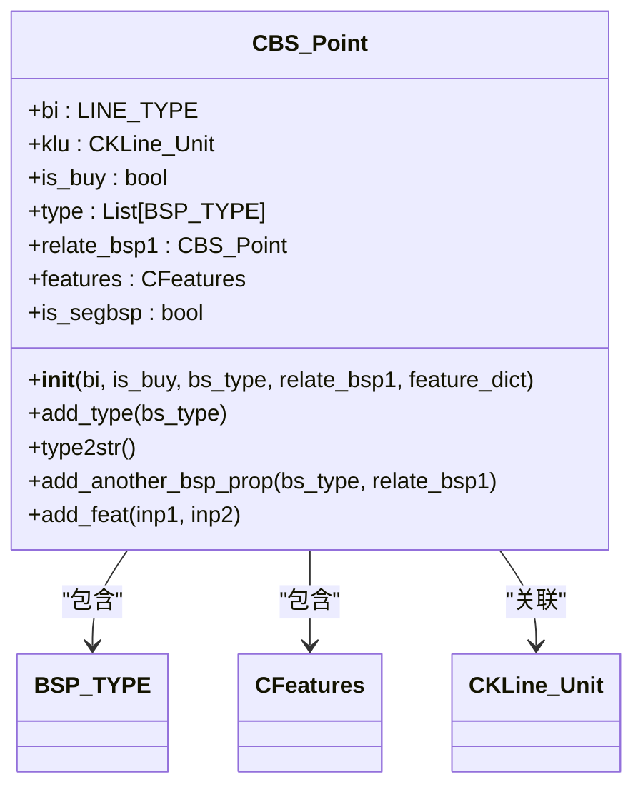
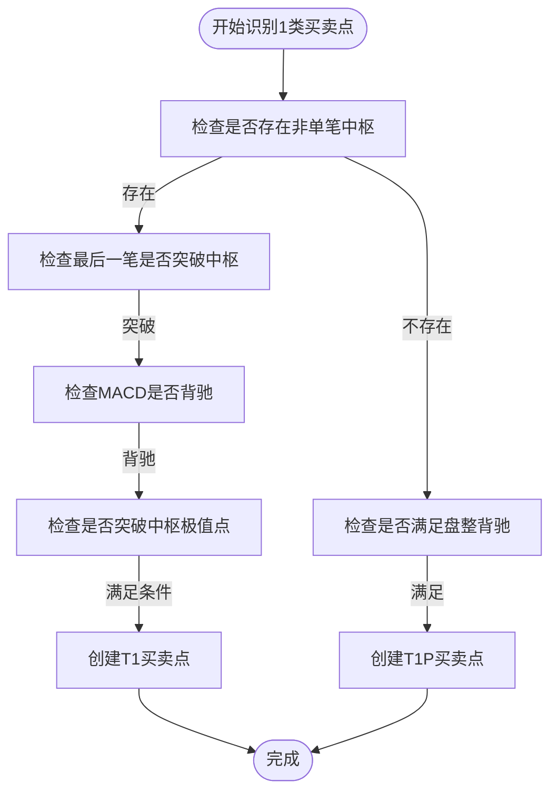
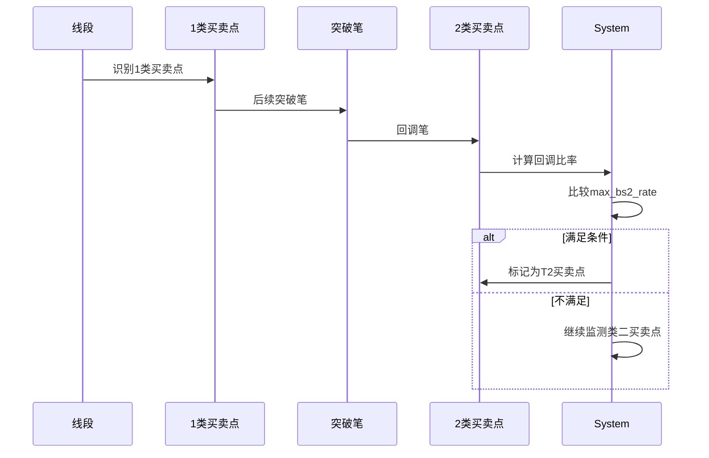
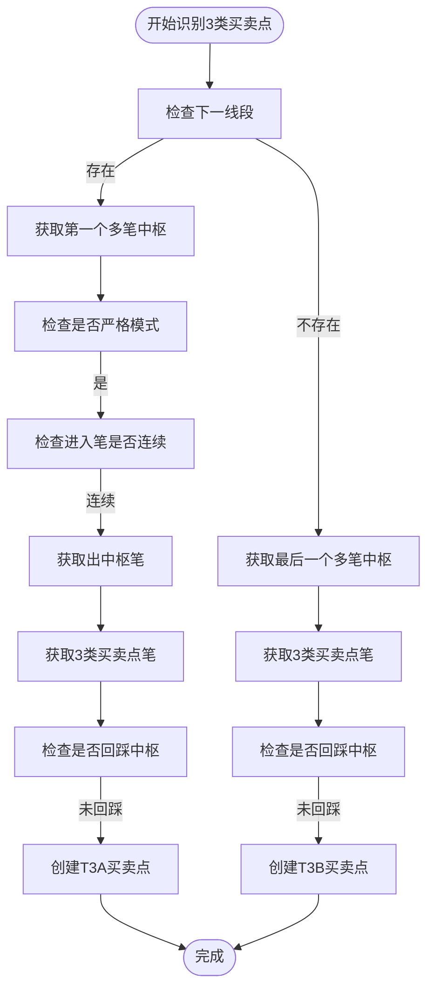
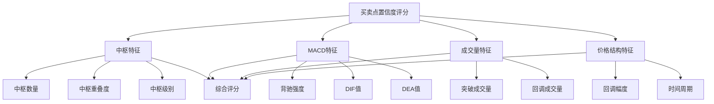
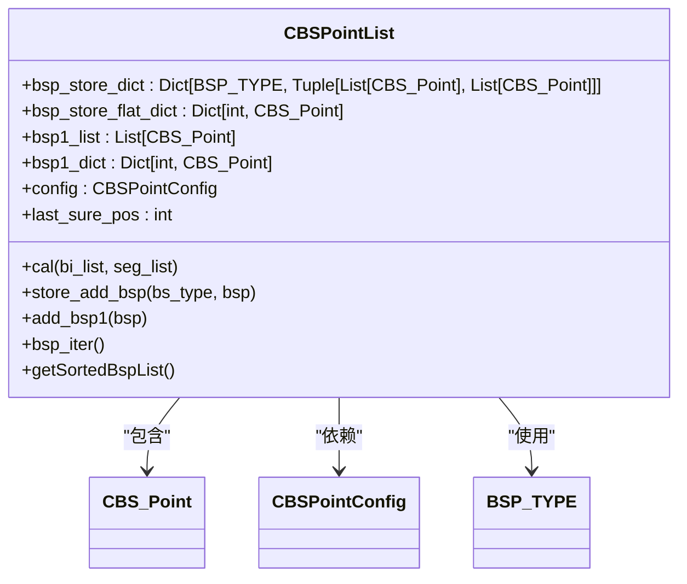
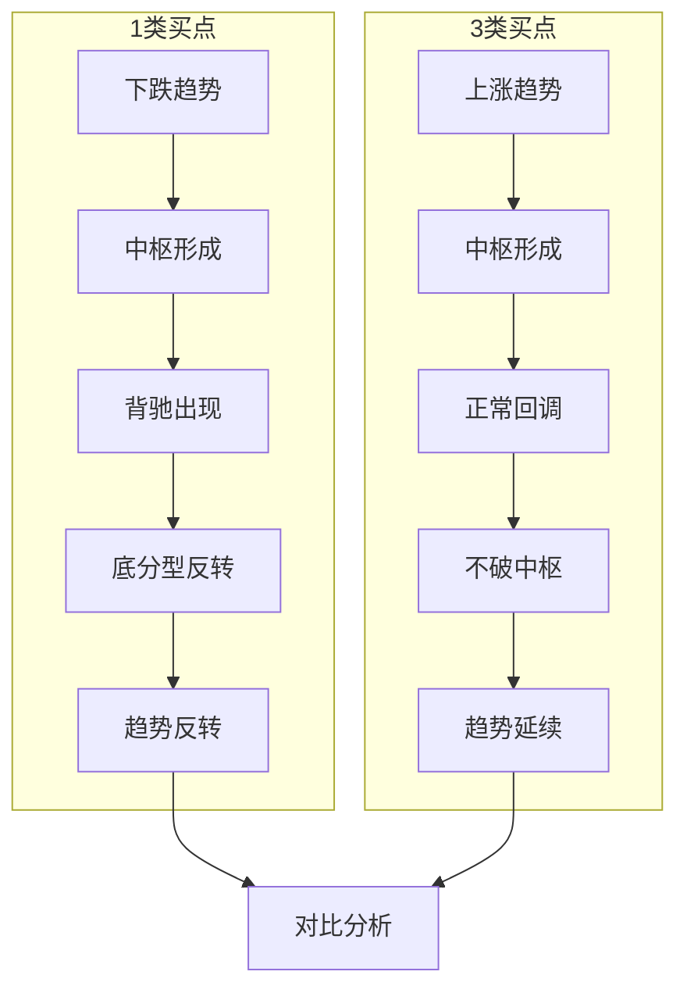

# 买卖点类型

<cite>
**本文档引用文件**   
- [BS_Point.py](file://chan.py/BuySellPoint/BS_Point.py)
- [BSPointList.py](file://chan.py/BuySellPoint/BSPointList.py)
- [CEnum.py](file://chan.py/Common/CEnum.py)
- [ZS.py](file://chan.py/ZS/ZS.py)
- [Seg.py](file://chan.py/Seg/Seg.py)
- [BSPointConfig.py](file://chan.py/BuySellPoint/BSPointConfig.py)
- [MACD.py](file://chan.py/Math/MACD.py)
</cite>

## 目录
1. [引言](#引言)
2. [买卖点核心定义与分类](#买卖点核心定义与分类)
3. [CBS_Point类技术实现分析](#cbs_point类技术实现分析)
4. [1类买卖点识别逻辑](#1类买卖点识别逻辑)
5. [2类买卖点识别逻辑](#2类买卖点识别逻辑)
6. [3类买卖点识别逻辑](#3类买卖点识别逻辑)
7. [顶分型与底分型在方向判断中的作用](#顶分型与底分型在方向判断中的作用)
8. [买卖点置信度评分机制](#买卖点置信度评分机制)
9. [BSPointList买卖点管理机制](#bspointlist买卖点管理机制)
10. [K线序列形态对比分析](#k线序列形态对比分析)
11. [结论](#结论)

## 引言
本文档深入解析缠论中的三类买卖点（1类、2类、3类）及其变体的识别逻辑。详细说明每类买卖点的定义、形成条件和市场含义，结合CBS_Point类的type属性进行技术实现分析。通过实际K线序列示例展示1类买点（底背驰）与3类买点（回踩不破）的形态差异。解释顶分型与底分型在买卖点方向判断中的作用。阐述买卖点置信度评分机制及其影响因素，如中枢重叠程度、MACD背驰强度和成交量变化。提供代码片段说明BSPointList如何按类型分类管理买卖点实例。

## 买卖点核心定义与分类
缠论中的买卖点是判断市场转折的重要信号，分为三类基本类型及多种变体：

- **1类买卖点**：趋势背驰后形成的反转点，是最强的反转信号
- **2类买卖点**：1类买卖点后的回踩或反抽确认点
- **3类买卖点**：趋势延续过程中对前中枢的回踩或反抽不破点

根据代码实现，买卖点类型在`BSP_TYPE`枚举中定义：
- `T1`: 第一类买卖点
- `T1P`: 类似第一类买卖点的变体
- `T2`: 第二类买卖点
- `T2S`: 类二买卖点（连续回调确认）
- `T3A`: 第三类买卖点（中枢在1类后）
- `T3B`: 第三类买卖点（中枢在1类前）

**Section sources**
- [CEnum.py](file://chan.py/Common/CEnum.py#L100-L110)

## CBS_Point类技术实现分析
`CBS_Point`类是买卖点的核心数据结构，封装了买卖点的所有属性和行为。

### 核心字段
- `bi`: 关联的笔对象
- `klu`: 笔结束的K线单元
- `is_buy`: 是否为买点
- `type`: 买卖点类型列表（支持多类型）
- `relate_bsp1`: 关联的第一类买卖点
- `features`: 特征字典（包含置信度评分等）

### 核心方法
- `add_type()`: 添加额外的买卖点类型
- `type2str()`: 将类型列表转换为字符串表示
- `add_another_bsp_prop()`: 添加另一个买卖点属性
- `add_feat()`: 添加特征数据

该类通过泛型支持不同层级的分析（笔或线段），实现了买卖点的统一表示。

**Diagram sources**
- [BS_Point.py](file://chan.py/BuySellPoint/BS_Point.py#L15-L38)

**Section sources**
- [BS_Point.py](file://chan.py/BuySellPoint/BS_Point.py#L15-L38)

## 1类买卖点识别逻辑
1类买卖点是趋势背驰后形成的反转点，分为标准1类（T1）和类1类（T1P）两种。

### 标准1类买点（T1）形成条件
1. 存在至少一个非单笔中枢
2. 最后一笔突破中枢且与中枢方向相反
3. 满足MACD背驰条件
4. 可配置是否要求突破中枢高点/低点

### 类1类买点（T1P）形成条件
1. 前后两笔在同一线段内
2. 方向与线段方向一致
3. 未创新低/高
4. MACD指标出现背驰

### 技术实现
在`CBSPointList.treat_bsp1()`方法中实现标准1类买卖点识别，通过`is_divergence()`方法判断MACD背驰，背驰率由配置参数`divergence_rate`控制。

**Diagram sources**
- [BSPointList.py](file://chan.py/BuySellPoint/BSPointList.py#L140-L165)
- [ZS.py](file://chan.py/ZS/ZS.py#L180-L195)

**Section sources**
- [BSPointList.py](file://chan.py/BuySellPoint/BSPointList.py#L140-L165)
- [ZS.py](file://chan.py/ZS/ZS.py#L180-L195)

## 2类买卖点识别逻辑
2类买卖点是1类买卖点后的回踩或反抽确认点，分为标准2类（T2）和类二买卖点（T2S）。

### 标准2类买卖点（T2）形成条件
1. 存在前一个1类买卖点
2. 回调幅度不超过预设比率（max_bs2_rate）
3. 可配置是否必须跟随1类买卖点

### 类二买卖点（T2S）形成条件
1. 在同一线段内连续回调
2. 每次回调不突破前高/低点
3. 回调幅度不超过预设比率
4. 可配置最大级别（max_bsp2s_lv）

### 技术实现
在`CBSPointList.treat_bsp2()`和`treat_bsp2s()`方法中实现2类买卖点识别。通过`retrace_rate`计算回调比率，与`max_bs2_rate`配置参数比较判断是否满足条件。

**Diagram sources**
- [BSPointList.py](file://chan.py/BuySellPoint/BSPointList.py#L181-L208)

**Section sources**
- [BSPointList.py](file://chan.py/BuySellPoint/BSPointList.py#L181-L208)

## 3类买卖点识别逻辑
3类买卖点是趋势延续过程中对前中枢的回踩或反抽不破点，分为T3A和T3B两种类型。

### T3A买卖点（中枢在1类后）
1. 下一中枢的第一笔突破前中枢
2. 随后一笔不重新进入中枢
3. 可配置是否要求严格模式

### T3B买卖点（中枢在1类前）
1. 1类买卖点后形成中枢
2. 随后一笔不重新进入中枢
3. 可配置是否要求严格模式

### 技术实现
在`CBSPointList.treat_bsp3_after()`和`treat_bsp3_before()`方法中实现3类买卖点识别。通过`bsp3_back2zs()`函数判断是否重新进入中枢，`bsp3_break_zspeak()`函数判断是否突破中枢极值点。

**Diagram sources**
- [BSPointList.py](file://chan.py/BuySellPoint/BSPointList.py#L270-L305)
- [ZS.py](file://chan.py/ZS/ZS.py#L210-L220)

**Section sources**
- [BSPointList.py](file://chan.py/BuySellPoint/BSPointList.py#L270-L305)

## 顶分型与底分型在方向判断中的作用
顶分型和底分型是判断市场方向转变的基础结构，在买卖点识别中起着关键作用：

### 顶分型特征
- 由三根K线组成，中间K线高点最高
- 表示上涨趋势可能结束
- 作为潜在的卖点信号

### 底分型特征
- 由三根K线组成，中间K线低点最低
- 表示下跌趋势可能结束
- 作为潜在的买点信号

在代码实现中，分型信息存储在K线单元中，通过`fx`属性标识：
- `FX_TYPE.TOP`: 顶分型
- `FX_TYPE.BOTTOM`: 底分型
- `FX_TYPE.UNKNOWN`: 无分型

买卖点方向判断逻辑：
1. 买点对应底分型或向上笔
2. 卖点对应顶分型或向下笔
3. 通过`is_buy`字段统一标识买卖方向

**Section sources**
- [CEnum.py](file://chan.py/Common/CEnum.py#L50-L55)
- [Seg.py](file://chan.py/Seg/Seg.py#L100-L110)

## 买卖点置信度评分机制
买卖点置信度评分通过多维度特征综合评估买卖点的可靠性。

### 评分影响因素
1. **中枢重叠程度**：中枢重叠越多，趋势越稳定
2. **MACD背驰强度**：背驰率越小，反转信号越强
3. **成交量变化**：放量突破/缩量回调增加可信度
4. **回调幅度**：适度回调比深幅回调更可靠

### 技术实现
在`CFeatures`类中管理特征数据，通过`add_feat()`方法添加各种特征值。主要特征包括：
- `divergence_rate`: 背驰比率
- MACD各项指标值
- 成交量相关指标

评分机制可配置，通过`BSPointConfig`中的参数调整各因素权重。

**Diagram sources**
- [BS_Point.py](file://chan.py/BuySellPoint/BS_Point.py#L15-L20)
- [BSPointConfig.py](file://chan.py/BuySellPoint/BSPointConfig.py#L30-L50)

**Section sources**
- [BS_Point.py](file://chan.py/BuySellPoint/BS_Point.py#L15-L20)
- [BSPointConfig.py](file://chan.py/BuySellPoint/BSPointConfig.py#L30-L50)

## BSPointList买卖点管理机制
`CBSPointList`类负责统一管理和分类存储各类买卖点。

### 核心数据结构
- `bsp_store_dict`: 按类型和买卖方向分类存储
- `bsp_store_flat_dict`: 按笔索引快速查找
- `bsp1_list`: 单独存储1类买卖点

### 管理功能
1. **分类存储**：`store_add_bsp()`按类型存储买卖点
2. **快速查找**：`bsp_store_flat_dict`通过笔索引定位
3. **迭代访问**：`bsp_iter()`提供统一迭代接口
4. **清理机制**：`clear_store_end()`清理过期数据

### 识别流程
1. `cal()`方法启动整体计算
2. 依次调用`cal_seg_bs1point()`、`cal_seg_bs2point()`、`cal_seg_bs3point()`
3. 通过`add_bs()`统一添加买卖点
4. 更新最后确认位置`update_last_pos()`

**Diagram sources**
- [BSPointList.py](file://chan.py/BuySellPoint/BSPointList.py#L15-L30)

**Section sources**
- [BSPointList.py](file://chan.py/BuySellPoint/BSPointList.py#L15-L30)

## K线序列形态对比分析
通过实际K线序列对比1类买点与3类买点的形态差异。

### 1类买点（底背驰）形态特征
- 趋势下跌后出现背驰
- 最后一笔力度减弱
- MACD柱状图面积或峰值缩小
- 形成底分型反转

### 3类买点（回踩不破）形态特征
- 趋势上涨过程中
- 回调不跌破前中枢上沿
- 缩量回调后快速反弹
- 保持原有趋势结构

### 形态对比
| 特征 | 1类买点 | 3类买点 |
|------|--------|--------|
| 趋势阶段 | 趋势反转点 | 趋势延续点 |
| 中枢关系 | 突破中枢后反转 | 回踩中枢不破 |
| 风险收益 | 高风险高收益 | 低风险适中收益 |
| 确认信号 | 背驰确认 | 不破确认 |
| 操作策略 | 主动出击 | 被动等待 |

**Diagram sources**
- [BSPointList.py](file://chan.py/BuySellPoint/BSPointList.py#L140-L305)
- [ZS.py](file://chan.py/ZS/ZS.py#L100-L200)

**Section sources**
- [BSPointList.py](file://chan.py/BuySellPoint/BSPointList.py#L140-L305)

## 结论
本文档全面解析了缠论三类买卖点的识别逻辑和技术实现。1类买卖点基于趋势背驰原理，是最重要的反转信号；2类买卖点作为1类买卖点的确认，提高了交易的可靠性；3类买卖点则用于判断趋势的延续性。通过CBS_Point和BSPointList类的实现，系统能够准确识别和管理各类买卖点，并结合MACD、成交量等多维度特征进行置信度评分。顶分型和底分型作为基础结构，在买卖点方向判断中发挥重要作用。该实现为量化交易策略提供了坚实的理论和技术基础。