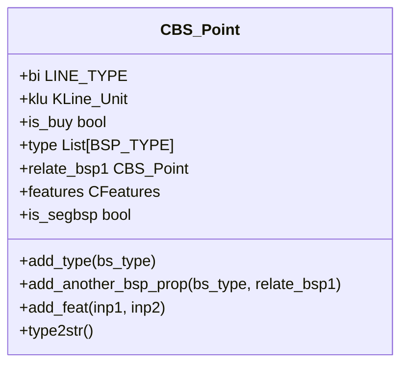
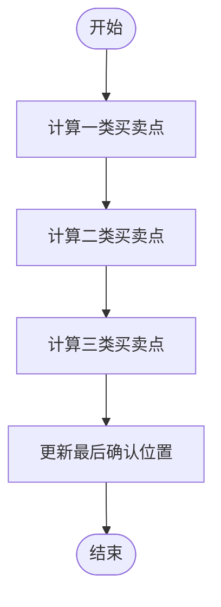
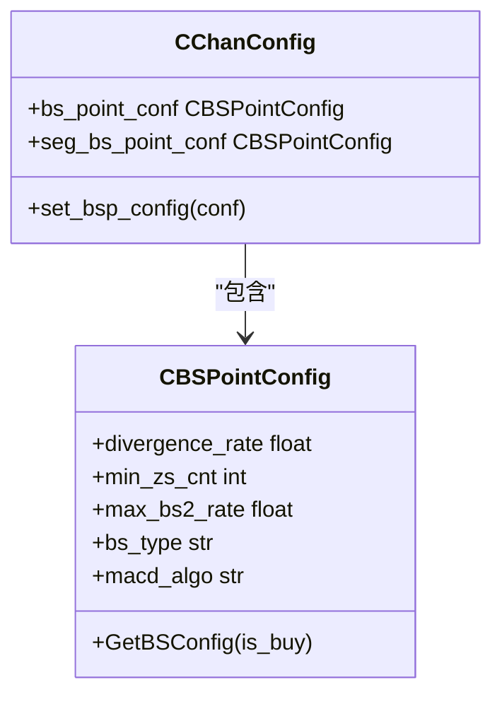
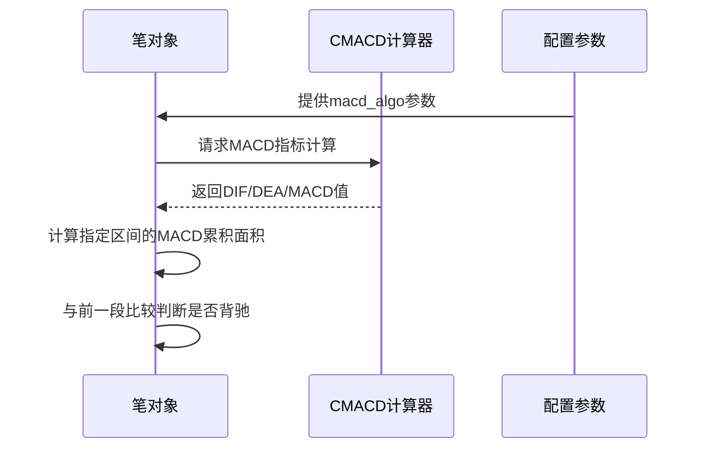

# 买卖点识别

<cite>
**本文档中引用的文件**  
- [BS_Point.py](file://chan.py/BuySellPoint/BS_Point.py) - *买卖点核心数据结构*
- [BSPointList.py](file://chan.py/BuySellPoint/BSPointList.py) - *买卖点管理与计算逻辑*
- [ChanConfig.py](file://chan.py/ChanConfig.py) - *买卖点配置参数定义*
- [Chan.py](file://chan.py/Chan.py) - *多级别联立分析核心引擎*
- [CHAN_STRATEGY_GUIDE.md](file://CHAN_STRATEGY_GUIDE.md) - *多级别联立策略指南*
</cite>

## 更新摘要
**变更内容**   
- 新增多级别联立分析对买卖点识别的影响说明
- 更新CBSPointList计算流程以反映多级别集成
- 增加多级别三类买卖点的识别机制
- 修订配置参数继承关系以包含多级别场景
- 添加多级别策略应用案例

### 目录
1. [引言](#引言)
2. [形态学与自定义买卖点概念区分](#形态学与自定义买卖点概念区分)
3. [CBS_Point类详解](#cbs_point类详解)
4. [CBSPointList管理机制](#cbspointlist管理机制)
5. [关键配置参数分析](#关键配置参数分析)
6. [MACD背驰判断算法](#macd背驰判断算法)
7. [实际案例分析](#实际案例分析)
8. [结论](#结论)

## 引言
本指南旨在全面解析买卖点（Buy/Sell Point）识别系统的核心机制。重点阐述形态学买卖点（bsp）与自定义买卖点（cbsp）的区别，深入剖析CBS_Point和CBSPointList类的实现逻辑，并详细说明影响买卖点生成的关键配置参数及其作用机制。特别关注多级别联立分析对买卖点识别的深度集成影响。

**Section sources**
- [BS_Point.py](file://chan.py/BuySellPoint/BS_Point.py#L1-L38)
- [BSPointList.py](file://chan.py/BuySellPoint/BSPointList.py#L1-L378)
- [Chan.py](file://chan.py/Chan.py#L18-L371)

## 形态学与自定义买卖点概念区分
形态学买卖点（bsp）是基于缠论标准定义的买卖信号，包括一类、二类、三类买卖点等，严格遵循笔、段、中枢的结构关系。自定义买卖点（cbsp）则是在标准形态基础上，通过配置参数进行扩展或调整的买卖信号，允许用户根据策略需求灵活定义过滤条件和识别逻辑。

**Section sources**
- [BSPointList.py](file://chan.py/BuySellPoint/BSPointList.py#L1-L378)
- [ChanConfig.py](file://chan.py/ChanConfig.py#L17-L157)

## CBS_Point类详解
CBS_Point类用于表示一个具体的买卖点，其泛型支持笔（Bi）或段（Seg）两种基础线型。

### 核心属性说明
- **bi**: 关联的笔或段对象，作为买卖点的基础结构单元
- **klu**: 买卖点所在的K线单元，由bi的结束K线确定
- **is_buy**: 布尔值，标识是否为买点（True）或卖点（False）
- **type**: 买卖点类型列表，包含BSP_TYPE枚举值（如T1、T2、T3A等）
- **relate_bsp1**: 关联的一类买卖点引用，用于构建买卖点间的逻辑关系
- **features**: 特征字典，存储如背驰比例等量化指标
- **is_segbsp**: 标记是否为段级别买卖点

### 方法功能
- `add_type()`: 添加新的买卖点类型
- `add_another_bsp_prop()`: 合并另一个买卖点的属性
- `add_feat()`: 添加特征数据
- `type2str()`: 将类型列表转换为字符串表示



**Diagram sources**
- [BS_Point.py](file://chan.py/BuySellPoint/BS_Point.py#L10-L37)

**Section sources**
- [BS_Point.py](file://chan.py/BuySellPoint/BS_Point.py#L10-L37)

## CBSPointList管理机制
CBSPointList类负责统一管理和组织所有识别出的买卖点。

### 数据结构
- **bsp_store_dict**: 按买卖点类型和方向分类存储的二维列表
- **bsp_store_flat_dict**: 以笔索引为键的扁平化字典，便于快速查找
- **bsp1_list / bsp1_dict**: 单独维护一类买卖点列表和字典

### 核心流程
买卖点计算流程分为三个阶段：
1. **cal_seg_bs1point**: 计算一类买卖点
2. **cal_seg_bs2point**: 计算二类买卖点
3. **cal_seg_bs3point**: 计算三类买卖点



**Diagram sources**
- [BSPointList.py](file://chan.py/BuySellPoint/BSPointList.py#L17-L378)

**Section sources**
- [BSPointList.py](file://chan.py/BuySellPoint/BSPointList.py#L17-L378)

## 关键配置参数分析
买卖点生成受多个关键参数控制，这些参数通过CBSPointConfig进行管理。

### 主要配置项
- **divergence_rate**: 背驰判断阈值，决定MACD面积比的敏感度
- **min_zs_cnt**: 最小中枢数量要求，用于过滤不满足结构复杂度的买卖点
- **max_bs2_rate**: 二类买卖点最大回撤比例，控制反弹/回调幅度
- **bs_type**: 指定关注的买卖点类型，如"1,1p,2,2s,3a,3b"

### 配置继承关系
系统存在两套配置：
- **bs_point_conf**: 通用买卖点配置
- **seg_bs_point_conf**: 段级别专用配置，部分参数（如macd_algo）被覆盖为"slope"模式



**Diagram sources**
- [ChanConfig.py](file://chan.py/ChanConfig.py#L17-L157)
- [BSPointList.py](file://chan.py/BuySellPoint/BSPointList.py#L17-L378)

**Section sources**
- [ChanConfig.py](file://chan.py/ChanConfig.py#L17-L157)

## MACD背驰判断算法
MACD指标在买卖点识别中起核心作用，特别是背驰判断。

### CMACD实现
CMACD类通过EMA计算DIF、DEA和MACD柱：
- fastperiod: 快速线周期（默认12）
- slowperiod: 慢速线周期（默认26）
- signalperiod: 信号线周期（默认9）

### 背驰算法模式
- **peak模式**: 比较峰值处的MACD面积
- **slope模式**: 比较斜率变化

在一类买卖点判断中，使用`cal_macd_metric`方法计算指定区间的MACD累积值进行对比。



**Diagram sources**
- [MACD.py](file://chan.py/Math/MACD.py#L1-L29)
- [BSPointList.py](file://chan.py/BuySellPoint/BSPointList.py#L17-L378)

**Section sources**
- [MACD.py](file://chan.py/Math/MACD.py#L1-L29)

## 实际案例分析
不同配置组合会导致买卖点识别结果显著差异：

### 案例1：严格模式
```python
{
    "divergence_rate": 0.8,
    "min_zs_cnt": 2,
    "max_bs2_rate": 0.5,
    "bs_type": "1,2,3a"
}
```
此配置下仅当出现明显背驰、至少两个中枢且二类点回撤小于50%时才触发信号，适合保守策略。

### 案例2：宽松模式
```python
{
    "divergence_rate": 1.2,
    "min_zs_cnt": 0,
    "max_bs2_rate": 0.9,
    "bs_type": "1p,2s"
}
```
此配置可捕捉更多潜在机会，包括盘整一类点和类二买卖点，适合激进策略。

### 案例3：多级别联立分析
```python
# 基于CHAN_STRATEGY_GUIDE.md的多级别策略
config = {
    'lv_list': ['1d', '4h', '1h'],  # 多级别联立
    'divergence_rate': 0.8,
    'min_zs_cnt': 1,
    'bs_type': '3a,3b'  # 重点关注三类买卖点
}
```
在多级别联立分析中，通过日线确定主趋势，4小时确认中期趋势，1小时寻找具体入场点，显著提高信号置信度。

**Section sources**
- [ChanConfig.py](file://chan.py/ChanConfig.py#L17-L157)
- [BSPointList.py](file://chan.py/BuySellPoint/BSPointList.py#L17-L378)
- [CHAN_STRATEGY_GUIDE.md](file://CHAN_STRATEGY_GUIDE.md#L0-L272)

## 结论
买卖点识别系统通过CBS_Point和CBSPointList类实现了灵活而严谨的信号管理机制。通过合理配置divergence_rate、min_zs_cnt等参数，可以适应不同市场环境和交易风格的需求。MACD算法的选择直接影响背驰判断的灵敏度，需根据实际策略目标进行调优。随着多级别联立分析的深度集成，买卖点识别的准确性和可靠性得到显著提升，为交易决策提供了更强大的支持。

**Section sources**
- [Chan.py](file://chan.py/Chan.py#L18-L371)
- [CHAN_STRATEGY_GUIDE.md](file://CHAN_STRATEGY_GUIDE.md#L0-L272)