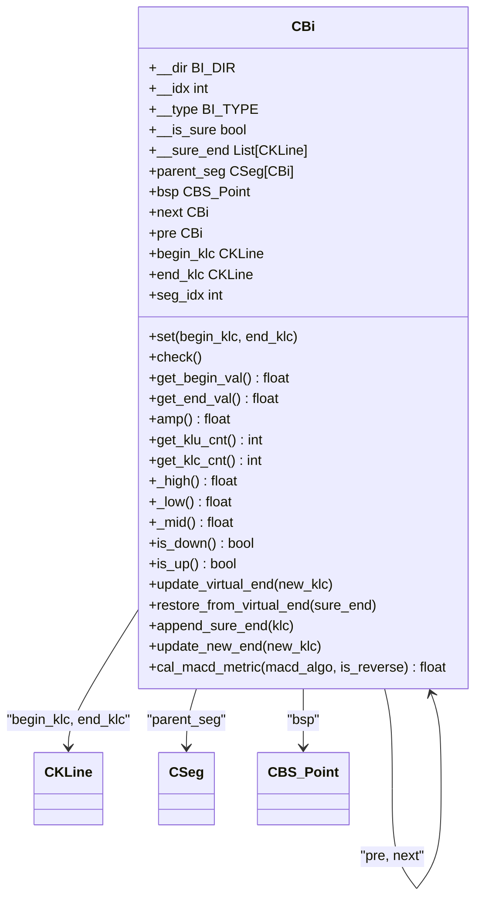
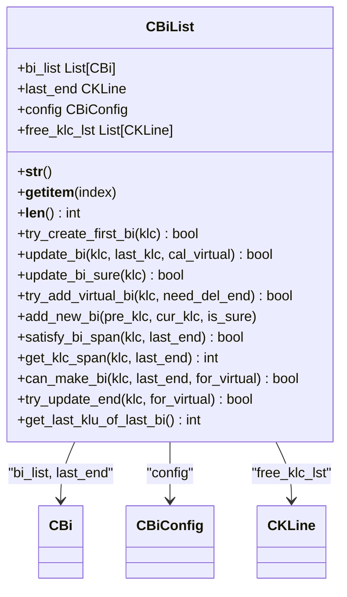

# 笔构建

<cite>
**本文档中引用的文件**  
- [Bi.py](file://chan.py/Bi/Bi.py)
- [BiConfig.py](file://chan.py/Bi/BiConfig.py)
- [BiList.py](file://chan.py/Bi/BiList.py)
- [KLine.py](file://chan.py/KLine/KLine.py)
- [CEnum.py](file://chan.py/Common/CEnum.py)
- [func_util.py](file://chan.py/Common/func_util.py)
- [KLine_Unit.py](file://chan.py/KLine/KLine_Unit.py)
</cite>

## 目录
1. [引言](#引言)
2. [笔在缠论中的定义与作用](#笔在缠论中的定义与作用)
3. CBi类结构解析
4. CBiList管理机制
5. BiConfig配置详解
6. 笔构建算法与分型依赖
7. 配置示例与策略调整
8. 结论

## 引言
在缠论技术分析体系中，"笔"是构成走势结构的基本单元，其准确识别直接影响后续线段、中枢乃至买卖点的判断。本文档深入解析`CBi`、`CBiList`和`CBiConfig`三个核心类的设计与实现，阐明笔的构建逻辑、配置参数及其对交易策略的影响，为开发者和量化分析师提供详尽的技术参考。

## 笔在缠论中的定义与作用
在缠论中，**笔**（Bi）是由至少五根K线构成的、连接两个相邻有效分型（顶分型与底分型）的走势段。一笔的成立需满足方向性、跨度和分型验证等条件。作为最小分析单元，笔不仅反映了短期价格趋势，还为线段划分提供了基础支撑。其起止点分别对应分型的确认点，方向由起始分型类型决定：底分型起始为向上笔，顶分型起始为向下笔。

**Section sources**
- [CEnum.py](file://chan.py/Common/CEnum.py#L43-L48)
- [KLine.py](file://chan.py/KLine/KLine.py#L45-L97)

### CBi类结构解析
`CBi`类（[Bi.py](file://chan.py/Bi/Bi.py)）封装了一笔的完整信息，其核心属性包括：

- **方向（dir）**：由起始K线分型（fx）决定，对应`BI_DIR.UP`或`BI_DIR.DOWN`。
- **起止点（begin_klc, end_klc）**：分别指向构成笔的起始和结束K线合并单元（CKLine）。
- **K线列表（klc_lst）**：通过迭代器返回从起始到结束的所有K线单元。
- **确定性标志（is_sure）**：标识该笔是否已确认完成，未确认的为“虚笔”。
- **关联结构**：包含前后笔（pre, next）、所属线段（parent_seg）及可能的买卖点（bsp）。

此外，`CBi`提供多种计算方法，如幅度（amp）、K线计数（get_klc_cnt）、中位价（_mid）及MACD相关指标（Cal_MACD_area、Cal_MACD_peak等），支持多维度走势分析。



**Diagram sources**
- [Bi.py](file://chan.py/Bi/Bi.py#L10-L326)
- [KLine.py](file://chan.py/KLine/KLine.py#L10-L97)

**Section sources**
- [Bi.py](file://chan.py/Bi/Bi.py#L10-L326)

### CBiList管理机制
`CBiList`类（[BiList.py](file://chan.py/Bi/BiList.py)）负责笔序列的动态维护与更新。其主要功能包括：

- **笔序列（bi_list）**：存储已确认的笔对象列表。
- **虚笔处理**：通过`try_add_virtual_bi`方法处理未完成的潜在笔，利用`update_virtual_end`进行延伸。
- **笔的生成与更新**：`can_make_bi`判断是否满足成笔条件，`add_new_bi`添加新笔，`try_update_end`更新末笔端点。
- **缓存管理**：`free_klc_lst`用于首笔生成前的分型缓存，提升初始识别精度。

`CBiList`通过`update_bi`方法驱动笔的实时更新，结合`delete_virtual_bi`清理无效虚笔，确保笔序列的准确性与一致性。



**Diagram sources**
- [BiList.py](file://chan.py/Bi/BiList.py#L10-L235)
- [Bi.py](file://chan.py/Bi/Bi.py#L10-L326)
- [BiConfig.py](file://chan.py/Bi/BiConfig.py#L1-L30)

**Section sources**
- [BiList.py](file://chan.py/Bi/BiList.py#L10-L235)

### BiConfig配置详解
`CBiConfig`类（[BiConfig.py](file://chan.py/Bi/BiConfig.py)）集中管理笔识别的各项参数，直接影响成笔的严格程度与灵敏度：

- **bi_algo**：笔算法类型，支持`normal`（常规）和`fx`（仅分型）两种模式。
- **is_strict**：是否启用严格模式，影响K线跨度要求。
- **bi_fx_check**：分型验证方法，对应`FX_CHECK_METHOD`枚举，包括：
  - `STRICT`：严格检查前后三根K线
  - `LOSS`：宽松检查，仅看分型K线
  - `HALF`：检查前后两根K线
  - `TOTALLY`：要求完全不重叠
- **gap_as_kl**：是否将价格缺口视为额外K线，影响跨度计算。
- **bi_end_is_peak**：要求笔的终点必须是局部极值点。
- **bi_allow_sub_peak**：允许次级极值点参与成笔。

这些配置共同决定了笔的识别阈值，适用于不同市场环境与交易风格。

**Section sources**
- [BiConfig.py](file://chan.py/Bi/BiConfig.py#L1-L30)
- [CEnum.py](file://chan.py/Common/CEnum.py#L62-L66)

### 笔构建算法与分型依赖
笔的构建高度依赖于分型（FX）的正确识别。`can_make_bi`方法通过`check_fx_valid`验证两分型间的有效性。例如，当`bi_fx_check="half"`时，系统检查顶分型后两根K线的低点是否低于底分型前两根K线的高点，确保趋势反转的有效性。

同时，`satisfy_bi_span`根据`is_strict`配置设定K线数量门槛：严格模式要求至少4根K线，非严格模式则要求3根K线且包含至少3根基础K线（KLU）。`gap_as_kl`参数在存在缺口时增加跨度计数，防止因数据稀疏导致误判。

**Section sources**
- [BiList.py](file://chan.py/Bi/BiList.py#L150-L180)
- [KLine.py](file://chan.py/KLine/KLine.py#L70-L97)

### 配置示例与策略调整
以下代码片段展示了如何根据交易策略定制笔的构建参数：

```python
# 激进策略：快速响应，低门槛
aggressive_config = CBiConfig(
    bi_algo="normal",
    is_strict=False,
    bi_fx_check="loss",
    gap_as_kl=True,
    bi_end_is_peak=False
)

# 保守策略：高可靠性，高门槛
conservative_config = CBiConfig(
    bi_algo="normal",
    is_strict=True,
    bi_fx_check="strict",
    gap_as_kl=False,
    bi_end_is_peak=True
)

# 创建笔列表并应用配置
bi_list = CBiList(bi_conf=aggressive_config)
```

激进配置适用于高频交易，能捕捉更多短期机会；保守配置则适合中长线投资，减少噪音干扰。

**Section sources**
- [BiConfig.py](file://chan.py/Bi/BiConfig.py#L1-L30)
- [BiList.py](file://chan.py/Bi/BiList.py#L10-L235)

## 结论
`CBi`、`CBiList`与`CBiConfig`共同构成了缠论笔构建的核心框架。通过精细化的配置参数与严谨的逻辑验证，系统能够灵活适应不同交易需求，在保证准确性的同时提供足够的策略调整空间。理解这些组件的内部机制，有助于开发者优化缠论模型，提升量化交易系统的稳定性与盈利能力。