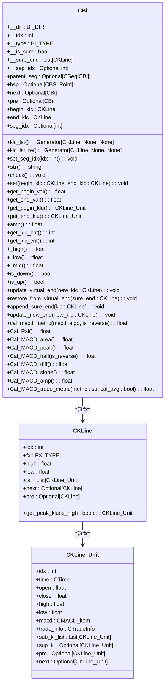
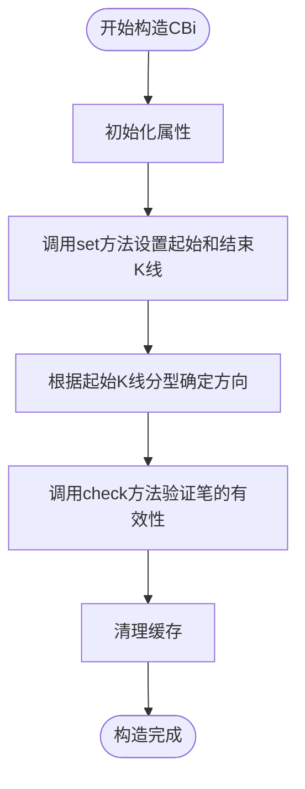

# 笔类设计

<cite>
**本文档中引用的文件**  
- [Bi.py](file://chan.py/Bi/Bi.py)
- [BiConfig.py](file://chan.py/Bi/BiConfig.py)
- [KLine_Unit.py](file://chan.py/KLine/KLine_Unit.py)
- [KLine.py](file://chan.py/KLine/KLine.py)
- [CEnum.py](file://chan.py/Common/CEnum.py)
</cite>

## 目录
1. [简介](#简介)
2. [核心数据结构设计](#核心数据结构设计)
3. [关键属性与状态逻辑](#关键属性与状态逻辑)
4. [构造与验证机制](#构造与验证机制)
5. [内部状态更新机制](#内部状态更新机制)
6. [与其他模块的交互](#与其他模块的交互)
7. [实际使用示例](#实际使用示例)
8. [结论](#结论)

## 简介
`CBi` 类是缠论分析系统中的核心组件之一，用于表示“笔”这一基本技术分析单元。该类封装了笔的方向、起止位置、包含的K线单元列表以及确定性标志等关键信息，并提供了丰富的计算和验证方法。本文档深入解析 `CBi` 类的实现细节，重点描述其作为缠论中‘笔’的基本数据结构设计。

**Section sources**
- [Bi.py](file://chan.py/Bi/Bi.py#L9-L325)

## 核心数据结构设计
`CBi` 类的设计围绕缠论中“笔”的定义展开，通过一系列属性和方法来准确描述笔的形态和行为。类中主要包含以下核心属性：

- **方向（direction）**：表示笔的上升或下降趋势。
- **起始与结束时间戳（start_klu, end_klu）**：分别指向笔的起始和结束K线单元。
- **包含的K线单元列表（kl_list）**：记录构成该笔的所有K线单元。
- **确定性标志（is_sure）**：标识该笔是否为已确认的笔。

这些属性共同构成了笔的基本数据结构，确保了在不同市场行情下能够准确生成和判断笔对象。

**Diagram sources**
- [Bi.py](file://chan.py/Bi/Bi.py#L9-L325)
- [KLine.py](file://chan.py/KLine/KLine.py#L44-L44)
- [KLine_Unit.py](file://chan.py/KLine/KLine_Unit.py#L0-L154)

**Section sources**
- [Bi.py](file://chan.py/Bi/Bi.py#L9-L325)
- [KLine.py](file://chan.py/KLine/KLine.py#L44-L44)
- [KLine_Unit.py](file://chan.py/KLine/KLine_Unit.py#L0-L154)

## 关键属性与状态逻辑
`CBi` 类中的关键属性及其状态变化逻辑如下：

- **方向（direction）**：通过 `__dir` 属性存储，根据起始K线的分型类型（`FX_TYPE.BOTTOM` 或 `FX_TYPE.TOP`）确定笔的方向。
- **起始与结束时间戳（start_klu, end_klu）**：通过 `get_begin_klu()` 和 `get_end_klu()` 方法获取，分别返回笔的起始和结束K线单元。
- **包含的K线单元列表（kl_list）**：通过 `klc_lst` 和 `klc_lst_re` 属性提供正向和反向迭代器，遍历构成该笔的所有K线。
- **确定性标志（is_sure）**：通过 `__is_sure` 属性标识该笔是否为已确认的笔，初始值由构造函数传入。

这些属性的状态变化逻辑确保了笔的完整性和一致性。

**Section sources**
- [Bi.py](file://chan.py/Bi/Bi.py#L9-L325)

## 构造与验证机制
`CBi` 类的构造过程通过 `__init__` 方法完成，接收起始和结束K线、索引和确定性标志作为参数。构造过程中调用 `set` 方法设置起始和结束K线，并根据起始K线的分型类型确定笔的方向。`check` 方法用于验证笔的方向和收尾位置的一致性，确保笔的有效性。

**Diagram sources**
- [Bi.py](file://chan.py/Bi/Bi.py#L9-L325)

**Section sources**
- [Bi.py](file://chan.py/Bi/Bi.py#L9-L325)

## 内部状态更新机制
`CBi` 类提供了多种方法来更新其内部状态：

- **update_virtual_end**：将当前结束K线添加到 `__sure_end` 列表中，并更新新的结束K线，同时将 `__is_sure` 标志设为 `False`。
- **restore_from_virtual_end**：恢复到已确认的结束K线，将 `__is_sure` 标志设为 `True`，并清空 `__sure_end` 列表。
- **append_sure_end**：向 `__sure_end` 列表中添加已确认的K线。
- **update_new_end**：更新新的结束K线，并重新验证笔的有效性。

这些方法确保了笔在动态市场环境下的状态一致性。

**Section sources**
- [Bi.py](file://chan.py/Bi/Bi.py#L9-L325)

## 与其他模块的交互
`CBi` 类与其他模块（如分型识别、线段构建）进行交互，主要体现在以下几个方面：

- **分型识别**：通过 `begin_klc.fx` 和 `end_klc.fx` 获取起始和结束K线的分型类型，用于确定笔的方向。
- **线段构建**：通过 `parent_seg` 属性记录该笔所属的线段，支持线段的构建和管理。
- **买卖点识别**：通过 `bsp` 属性记录该笔尾部是否为买卖点，支持买卖点的识别和分析。

这些交互机制使得 `CBi` 类能够无缝集成到整个缠论分析系统中。

**Section sources**
- [Bi.py](file://chan.py/Bi/Bi.py#L9-L325)

## 实际使用示例
在不同市场行情下，`CBi` 类的生成与判断逻辑如下：

- **上升行情**：当起始K线为底分型时，笔的方向为上升，`__dir` 设为 `BI_DIR.UP`。
- **下降行情**：当起始K线为顶分型时，笔的方向为下降，`__dir` 设为 `BI_DIR.DOWN`。
- **确定性判断**：通过 `is_sure` 属性判断该笔是否为已确认的笔，结合 `__sure_end` 列表中的K线进行验证。

这些示例展示了 `CBi` 类在实际应用中的灵活性和准确性。

**Section sources**
- [Bi.py](file://chan.py/Bi/Bi.py#L9-L325)

## 结论
`CBi` 类作为缠论分析系统中的核心组件，通过精心设计的数据结构和丰富的功能方法，准确地描述了“笔”这一基本技术分析单元。其构造、验证和状态更新机制确保了笔的完整性和一致性，与其他模块的交互机制使其能够无缝集成到整个系统中。通过深入解析 `CBi` 类的实现细节，可以更好地理解和应用缠论分析方法。