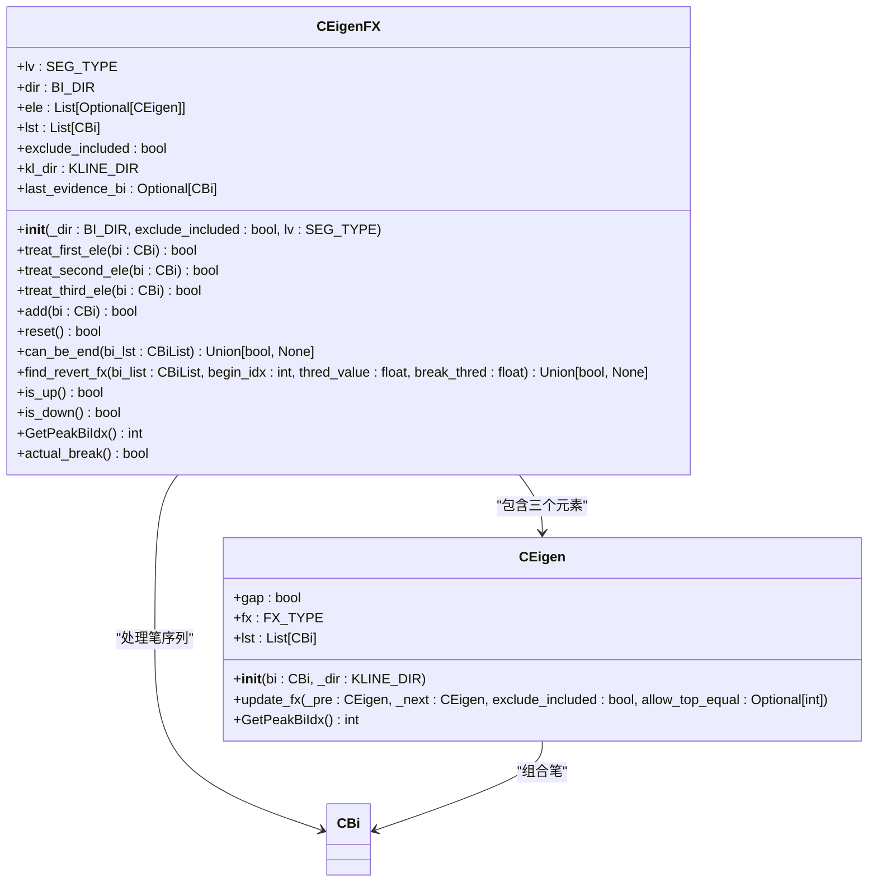
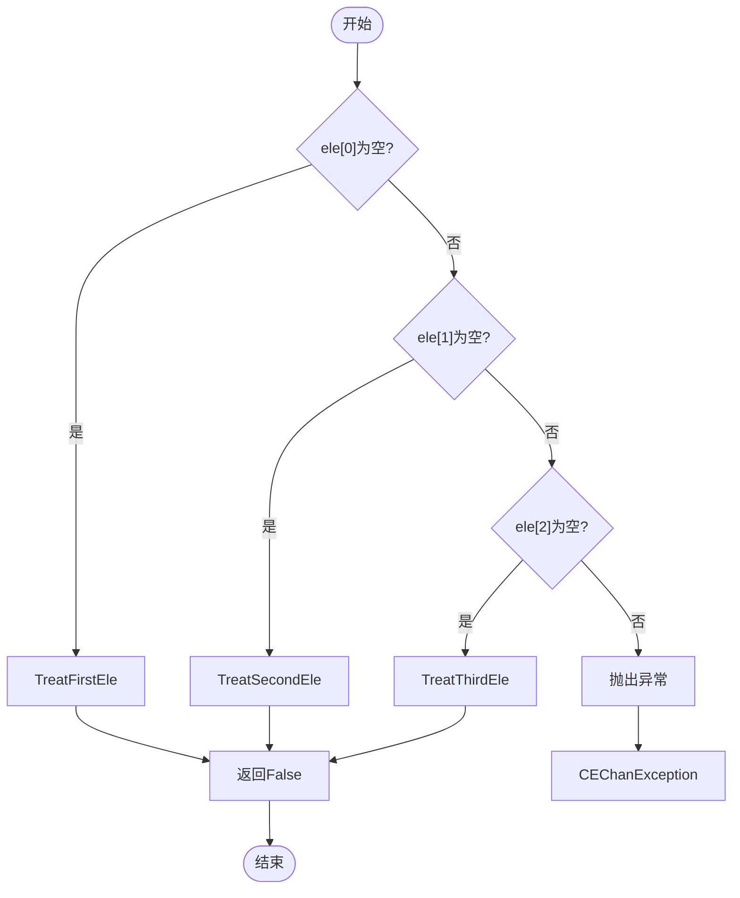
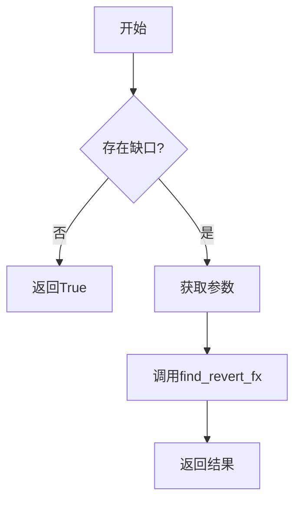
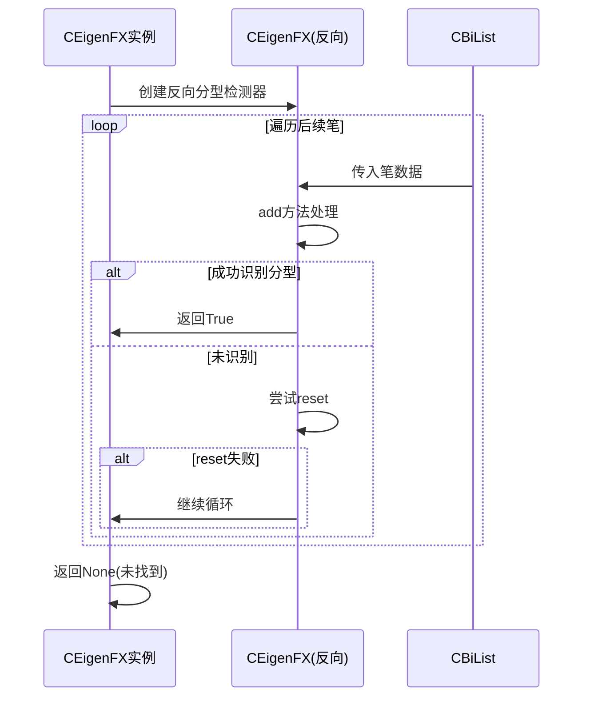

# 特征序列分型识别

<cite>
**本文档引用文件**  
- [EigenFX.py](file://chan.py/Seg/EigenFX.py)
- [Eigen.py](file://chan.py/Seg/Eigen.py)
- [Bi.py](file://chan.py/Bi/Bi.py)
- [CEnum.py](file://chan.py/Common/CEnum.py)
- [KLine_Combiner.py](file://chan.py/Combiner/KLine_Combiner.py)
</cite>

## 目录
1. [引言](#引言)
2. [核心组件分析](#核心组件分析)
3. [初始化参数配置](#初始化参数配置)
4. [三阶段处理逻辑](#三阶段处理逻辑)
5. [状态机控制与重置机制](#状态机控制与重置机制)
6. [线段终结判定](#线段终结判定)
7. [反向分型验证](#反向分型验证)
8. [实际K线场景应用](#实际k线场景应用)
9. [结论](#结论)

## 引言
本文档全面解析特征序列分型（EigenFX）的识别算法及其在线段终结判定中的关键应用。通过深入分析CEigenFX类的设计与实现，系统阐述其在缠论技术分析体系中的核心作用。该算法基于笔（CBi）序列构建特征序列，用于识别有效的顶分型或底分型结构，为后续的线段划分和买卖点生成提供重要依据。

## 核心组件分析

**Section sources**
- [EigenFX.py](file://chan.py/Seg/EigenFX.py#L11-L149)
- [Eigen.py](file://chan.py/Seg/Eigen.py#L7-L28)

### CEigenFX类结构

**Diagram sources**
- [EigenFX.py](file://chan.py/Seg/EigenFX.py#L11-L149)
- [Eigen.py](file://chan.py/Seg/Eigen.py#L7-L28)

## 初始化参数配置
CEigenFX类的初始化方法`__init__`接受三个关键参数，用于配置分型识别的行为模式：

- **_dir (BI_DIR)**：指定线段方向，决定识别顶分型还是底分型。当方向为UP时识别顶分型，方向为DOWN时识别底分型。
- **exclude_included (bool)**：包含处理策略开关。若为True，则启用严格的包含关系处理规则；若为False，则采用宽松的合并策略。
- **lv (SEG_TYPE)**：层级设置，标识当前处理的分析层级，支持BI（笔）和SEG（线段）两种级别。

初始化过程中，系统会创建一个长度为3的元素数组`ele`用于存储特征序列的三个构成元素，并初始化笔列表`lst`以记录参与计算的所有笔对象。

**Section sources**
- [EigenFX.py](file://chan.py/Seg/EigenFX.py#L11-L20)

## 三阶段处理逻辑

### 第一元素处理
`treat_first_ele`方法负责处理特征序列的第一个笔元素。该方法将输入的笔（CBi）封装为一个CEigen对象并赋值给`ele[0]`。此阶段不进行任何分型判断，仅完成初始状态的建立。

**Section sources**
- [EigenFX.py](file://chan.py/Seg/EigenFX.py#L22-L25)

### 第二元素处理
`treat_second_ele`方法处理第二个笔元素，其核心逻辑包括：
1. 尝试将新笔与第一个元素进行合并（通过`try_add`方法）
2. 若无法合并，则创建新的CEigen对象作为第二个元素
3. 验证前两个元素是否满足构成分型的基本条件：对于上升线段，第二个元素的高点必须高于第一个元素；对于下降线段，第二个元素的低点必须低于第一个元素
4. 若不满足条件，则触发`reset`机制重新开始识别

**Section sources**
- [EigenFX.py](file://chan.py/Seg/EigenFX.py#L27-L37)

### 第三元素处理
`treat_third_ele`方法处理第三个笔元素，这是形成有效分型的关键阶段：
1. 记录证据笔`last_evidence_bi`
2. 根据包含处理策略设置`allow_top_equal`参数
3. 尝试将新笔与第二个元素合并
4. 若成功创建第三个元素，则调用`actual_break`验证实际突破条件
5. 调用`update_fx`方法更新中间元素的分型类型
6. 判断是否形成有效的顶分型或底分型

**Section sources**
- [EigenFX.py](file://chan.py/Seg/EigenFX.py#L39-L55)

## 状态机控制与重置机制
`add`方法实现了状态机控制流程，根据`ele`数组中已填充的元素数量，依次调用对应的处理函数：

**Diagram sources**
- [EigenFX.py](file://chan.py/Seg/EigenFX.py#L57-L75)

当识别过程出现异常或不符合分型条件时，`reset`方法提供恢复机制：
- 若启用包含处理（exclude_included=True），则清空状态并从第二个笔开始重新识别
- 若禁用包含处理，则将第二个元素前移为第一个元素，实现滑动窗口式的连续检测

**Section sources**
- [EigenFX.py](file://chan.py/Seg/EigenFX.py#L77-L93)

## 线段终结判定
`can_be_end`方法用于判断当前线段是否可能终结，其判定逻辑如下：

当特征序列的中间元素存在缺口时，需要通过`find_revert_fx`方法验证反向分型的存在性。否则，直接认为线段可能终结。

**Section sources**
- [EigenFX.py](file://chan.py/Seg/EigenFX.py#L95-L107)

## 反向分型验证
`find_revert_fx`方法实现反向分型的验证逻辑：

**Diagram sources**
- [EigenFX.py](file://chan.py/Seg/EigenFX.py#L133-L149)

该方法创建一个反向的CEigenFX实例，用于检测是否存在能够确认当前线段终结的反向分型。通过遍历后续笔序列，寻找符合标准的顶分型或底分型结构。

## 实际K线场景应用
在实际K线分析中，特征序列分型识别的计算链条如下：

1. **笔序列生成**：基于K线数据生成标准化的笔（CBi）序列
2. **特征序列构建**：按照三笔结构逐个处理，构建特征序列的三个元素
3. **分型识别**：通过`add`方法的状态机流程完成分型判定
4. **终结验证**：利用`can_be_end`和`find_revert_fx`方法验证线段终结条件
5. **买卖点关联**：将确认的分型结果传递给买卖点生成模块（BSPointList）

此过程与缠论的多级别分析框架紧密结合，为趋势判断和交易决策提供可靠的技术依据。

**Section sources**
- [EigenFX.py](file://chan.py/Seg/EigenFX.py#L11-L149)
- [Bi.py](file://chan.py/Bi/Bi.py#L1-L326)

## 结论
特征序列分型识别算法通过严谨的状态机设计和分阶段处理逻辑，实现了对市场结构的精确刻画。其核心价值在于：
- 提供了一套标准化的分型识别框架
- 支持灵活的参数配置以适应不同市场环境
- 实现了异常情况下的自动恢复机制
- 通过缺口验证增强了线段划分的可靠性

该算法作为缠论自动化分析的核心组件，为后续的中枢识别、趋势判断和买卖点生成奠定了坚实的基础。