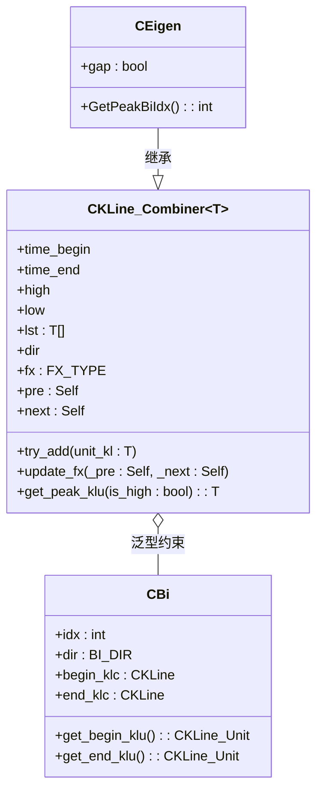
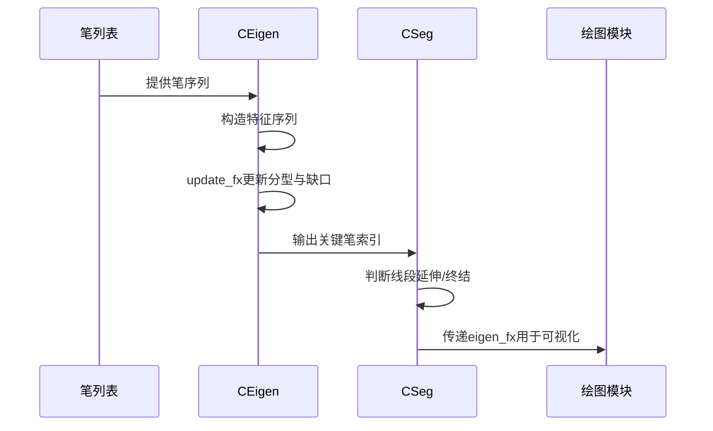

# 特征序列生成

<cite>
**本文档中引用的文件**  
- [Eigen.py](file://chan.py/Seg/Eigen.py)
- [KLine_Combiner.py](file://chan.py/Combiner/KLine_Combiner.py)
- [Bi.py](file://chan.py/Bi/Bi.py)
- [Seg.py](file://chan.py/Seg/Seg.py)
</cite>

## 目录
1. [引言](#引言)
2. [特征序列生成机制](#特征序列生成机制)
3. [CEigen类结构与继承关系](#ceigen类结构与继承关系)
4. [__init__方法：方向与缺口初始化](#init方法方向与缺口初始化)
5. [update_fx方法：分型更新与缺口检测](#update_fx方法分型更新与缺口检测)
6. [GetPeakBiIdx方法：关键笔索引定位](#getpeakbiidx方法关键笔索引定位)
7. [特征序列在实际行情中的构建示例](#特征序列在实际行情中的构建示例)
8. [与Seg模块的交互及前置依赖](#与seg模块的交互及前置依赖)
9. [结论](#结论)

## 引言
特征序列（Eigen）是缠论线段分析中的核心概念之一，用于判断线段延伸与终结的关键依据。在本系统中，`CEigen`类通过继承`CKLine_Combiner`并结合`CBi`对象实现特征序列的构造与管理。本文将深入解析其生成机制、核心方法实现及其在整个线段识别流程中的作用。

**Section sources**
- [Eigen.py](file://chan.py/Seg/Eigen.py#L1-L29)

## 特征序列生成机制
特征序列由一系列相邻的“笔”（CBi）构成，用于描述价格走势中潜在的转折结构。其核心目标是识别出具有方向性意义的分型（顶分型或底分型），并通过缺口标记判断市场动能的强弱。该序列并非直接基于K线生成，而是通过对已确认的笔进行组合与分析，形成更高层次的结构化数据。

特征序列的生成遵循以下步骤：
1. 以某一笔作为起始单元
2. 按照方向一致性原则合并后续笔
3. 利用前后单元判断分型状态
4. 标记是否存在价格跳空（gap）
5. 确定关键笔的位置以支持线段划分

**Section sources**
- [Eigen.py](file://chan.py/Seg/Eigen.py#L7-L27)
- [KLine_Combiner.py](file://chan.py/Combiner/KLine_Combiner.py#L1-L176)

## CEigen类结构与继承关系
`CEigen`类继承自`CKLine_Combiner[CBi]`，表示其组合的基本单位为`CBi`类型的对象。这种设计使得特征序列能够复用基础组合器的功能，如区间合并、极值计算和前后单元链接等。



**Diagram sources**
- [Eigen.py](file://chan.py/Seg/Eigen.py#L7-L27)
- [KLine_Combiner.py](file://chan.py/Combiner/KLine_Combiner.py#L13-L176)

**Section sources**
- [Eigen.py](file://chan.py/Seg/Eigen.py#L7-L27)
- [KLine_Combiner.py](file://chan.py/Combiner/KLine_Combiner.py#L13-L176)

## __init__方法：方向与缺口初始化
`__init__`方法负责初始化特征序列的基本属性。其参数包括起始笔（bi）和方向（_dir），通过调用父类构造函数完成时间范围、高低点及方向的初始化。

```python
def __init__(self, bi, _dir):
    super(CEigen, self).__init__(bi, _dir)
    self.gap = False
```

其中，`self.gap = False`为新增字段，用于标记该特征序列是否包含价格缺口。初始状态下默认无缺口，后续在`update_fx`方法中根据行情变化动态更新。

**Section sources**
- [Eigen.py](file://chan.py/Seg/Eigen.py#L7-L10)

## update_fx方法：分型更新与缺口检测
`update_fx`方法在继承父类逻辑的基础上，增加了对价格缺口的检测功能。父类方法首先根据前后单元的相对位置判断当前单元是否构成顶分型或底分型，并设置`fx`属性。

在此基础上，子类追加如下逻辑：

```python
if (self.fx == FX_TYPE.TOP and _pre.high < self.low) or \
   (self.fx == FX_TYPE.BOTTOM and _pre.low > self.high):
    self.gap = True
```

该条件判断表明：
- 若当前为顶分型且前一单元的最高价低于本单元最低价，则存在向上跳空；
- 若当前为底分型且前一单元的最低价高于本单元最高价，则存在向下跳空。

一旦满足任一条件，`gap`标记被置为`True`，表示该特征序列存在有效缺口，通常预示着强烈的趋势延续信号。

**Section sources**
- [Eigen.py](file://chan.py/Seg/Eigen.py#L12-L18)
- [KLine_Combiner.py](file://chan.py/Combiner/KLine_Combiner.py#L130-L148)

## GetPeakBiIdx方法：关键笔索引定位
`GetPeakBiIdx`方法用于确定构成特征序列峰值的关键笔索引，是判断线段延伸与否的重要依据。

```python
def GetPeakBiIdx(self):
    assert self.fx != FX_TYPE.UNKNOWN
    bi_dir = self.lst[0].dir
    if bi_dir == BI_DIR.UP:  # 下降线段
        return self.get_peak_klu(is_high=False).idx - 1
    else:
        return self.get_peak_klu(is_high=True).idx - 1
```

逻辑解析如下：
- 首先确保分型类型已知（非UNKNOWN）
- 获取序列首笔的方向（bi_dir）
- 若首笔为上涨（BI_DIR.UP），说明处于下降线段，应取最低点对应K线单元（is_high=False）
- 否则取最高点对应K线单元（is_high=True）
- 返回对应K线单元的索引减1，转换为笔的索引

此索引值将作为后续线段划分算法中判断“破坏”与“延伸”的基准点。

**Section sources**
- [Eigen.py](file://chan.py/Seg/Eigen.py#L20-L27)

## 特征序列在实际行情中的构建示例
假设某行情中存在连续五笔：B1（下跌）、B2（上涨）、B3（下跌）、B4（上涨）、B5（下跌），系统在识别到B3结束时，会尝试构造特征序列以判断是否形成新的线段终点。

1. 以B2为起点创建`CEigen`实例，方向为UP
2. 调用`try_add(B3)`尝试合并，因方向相反不合并
3. 此时序列包含B2，调用`update_fx(B1, B3)`更新分型状态
4. 若B1.high < B2.high 且 B3.high < B2.high，且满足其他条件，则判定为顶分型
5. 进一步检查B1.high < B2.low，若成立则设置`gap=True`
6. 调用`GetPeakBiIdx()`返回B2的索引，作为潜在的线段高点

该过程实现了从原始笔序列到结构化特征序列的转化，为线段识别提供输入。

**Section sources**
- [Eigen.py](file://chan.py/Seg/Eigen.py#L7-L27)
- [Bi.py](file://chan.py/Bi/Bi.py#L1-L327)

## 与Seg模块的交互及前置依赖
`CEigen`模块在整体线段识别流程中处于前置地位，其输出结果直接服务于`Seg`模块的线段划分逻辑。

在`CSeg`类中，存在`eigen_fx: Optional[CEigenFX]`字段，用于存储与当前线段相关的特征序列分型信息。`CEigenFX`进一步封装了多个`CEigen`对象，形成完整的分型结构。

线段延伸判断依赖于特征序列的关键笔索引。例如，在判断当前线段是否被“破坏”时，系统会调用`GetPeakBiIdx()`获取前一线段的终点位置，并与当前走势进行对比。若新出现的笔突破该位置且满足其他条件，则可能触发线段延伸或终结。

此外，`SegConfig`中配置的`left_method="peak"`也间接依赖于`GetPeakBiIdx`所提供的峰值定位能力，确保线段左侧边界的准确性。



**Diagram sources**
- [Eigen.py](file://chan.py/Seg/Eigen.py#L7-L27)
- [Seg.py](file://chan.py/Seg/Seg.py#L1-L154)

**Section sources**
- [Eigen.py](file://chan.py/Seg/Eigen.py#L7-L27)
- [Seg.py](file://chan.py/Seg/Seg.py#L1-L154)

## 结论
特征序列（CEigen）作为缠论线段分析的核心前置模块，通过继承`CKLine_Combiner`并结合`CBi`对象实现了高效、准确的结构化数据构造。其`__init__`方法完成基础初始化，`update_fx`方法增强分型识别能力并引入缺口检测，`GetPeakBiIdx`方法提供关键笔索引支持线段判断。整个机制与`Seg`模块紧密协作，构成了完整的线段识别链条，为技术分析提供了坚实的底层支撑。