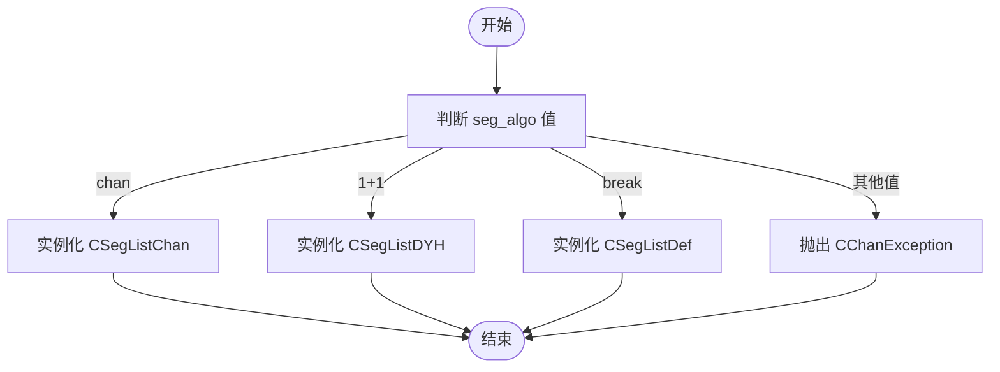

# 线段算法配置管理

<cite>
**本文档引用文件**  
- [SegConfig.py](file://chan.py/Seg/SegConfig.py)
- [CEnum.py](file://chan.py/Common/CEnum.py)
- [ChanException.py](file://chan.py/Common/ChanException.py)
- [KLine_List.py](file://chan.py/KLine/KLine_List.py)
- [SegListChan.py](file://chan.py/Seg/SegListChan.py)
- [SegListDYH.py](file://chan.py/Seg/SegListDYH.py)
- [SegListDef.py](file://chan.py/Seg/SegListDef.py)
</cite>

## 目录
1. [引言](#引言)
2. [CSegConfig类结构解析](#csegconfig类结构解析)
3. [seg_algo参数与算法选择机制](#seg_algo参数与算法选择机制)
4. [left_method参数与未完成线段处理策略](#left_method参数与未完成线段处理策略)
5. [LEFT_SEG_METHOD枚举类型映射关系](#left_seg_method枚举类型映射关系)
6. [CChanException异常校验机制](#cchanexception异常校验机制)
7. [配置对象初始化与行为定制示例](#配置对象初始化与行为定制示例)
8. [配置项对系统性能与分析精度的影响](#配置项对系统性能与分析精度的影响)
9. [总结](#总结)

## 引言
在缠论技术分析系统中，线段（Segment）是构成走势结构的基本单元之一。`CSegConfig` 类作为线段构建的核心配置管理器，通过灵活的参数设计实现了多种线段识别算法的动态切换和未完成线段的策略控制。本文将深入解析该类的设计原理及其对线段构建行为的调控机制。

## CSegConfig类结构解析

`CSegConfig` 类定义于 `SegConfig.py` 文件中，负责封装线段生成过程中的关键配置参数。其主要属性包括：

- `seg_algo`: 字符串类型，用于指定线段识别算法
- `left_method`: 枚举类型 `LEFT_SEG_METHOD`，决定未完成线段的保留策略

该类在初始化时接受两个可选参数，并根据输入值进行内部状态设置。若参数不合法，则抛出 `CChanException` 异常。

**Section sources**
- [SegConfig.py](file://chan.py/Seg/SegConfig.py#L4-L12)

## seg_algo参数与算法选择机制

`seg_algo` 参数通过字符串值 `"chan"`、`"dye"`（即 `"1+1"`）、`"def"`（即 `"break"`）分别对应三种不同的线段识别算法实现：

| 算法标识 | 实现类 | 说明 |
|--------|-------|------|
| `"chan"` | `CSegListChan` | 基于特征序列的标准线段算法 |
| `"1+1"` | `CSegListDYH` | 都业华课程中的“1+1终结”算法 |
| `"break"` | `CSegListDef` | 基于笔破坏的线段算法 |

该参数的分发逻辑由 `KLine_List.py` 中的 `get_seglist_instance` 函数实现。当创建线段列表实例时，会根据 `seg_algo` 的值动态导入并实例化对应的线段处理器。



**Diagram sources**
- [KLine_List.py](file://chan.py/KLine/KLine_List.py#L14-L35)
- [SegListChan.py](file://chan.py/Seg/SegListChan.py#L9-L11)
- [SegListDYH.py](file://chan.py/Seg/SegListDYH.py#L28-L30)
- [SegListDef.py](file://chan.py/Seg/SegListDef.py#L16-L18)

**Section sources**
- [KLine_List.py](file://chan.py/KLine/KLine_List.py#L14-L35)

## left_method参数与未完成线段处理策略

`left_method` 参数控制未完成线段（即当前仍在发展的线段）的处理方式，其取值影响线段列表更新过程中对末尾不确定线段的保留策略。

该参数接受字符串 `"all"` 或 `"peak"`，分别对应以下行为：

- **`"all"`**: 保留所有未完成线段，适用于需要完整保留历史走势片段的场景
- **`"peak"`**: 仅保留峰值点构成的线段，过滤中间波动，提升走势主干清晰度

此参数在初始化时被转换为 `LEFT_SEG_METHOD` 枚举类型，供线段处理逻辑使用。

**Section sources**
- [SegConfig.py](file://chan.py/Seg/SegConfig.py#L7-L12)

## LEFT_SEG_METHOD枚举类型映射关系

`LEFT_SEG_METHOD` 枚举定义于 `CEnum.py` 文件中，用于表示未完成线段的保留策略。其与配置字符串的映射关系如下：

```python
class LEFT_SEG_METHOD(Enum):
    ALL = auto()   # 对应配置值 "all"
    PEAK = auto()  # 对应配置值 "peak"
```

在 `CSegConfig.__init__` 方法中完成字符串到枚举的转换：
- 若输入 `"all"`，则设置 `self.left_method = LEFT_SEG_METHOD.ALL`
- 若输入 `"peak"`，则设置 `self.left_method = LEFT_SEG_METHOD.PEAK`
- 其他值将触发异常

这种设计确保了配置值的类型安全性和语义明确性。

**Diagram sources**
- [CEnum.py](file://chan.py/Common/CEnum.py#L117-L120)
- [SegConfig.py](file://chan.py/Seg/SegConfig.py#L7-L12)

**Section sources**
- [CEnum.py](file://chan.py/Common/CEnum.py#L117-L120)

## CChanException异常校验机制

当 `left_method` 参数值非法时，`CSegConfig` 会抛出 `CChanException` 异常，并携带错误码 `ErrCode.PARA_ERROR`。该机制确保了配置参数的合法性校验。

`CChanException` 类定义于 `ChanException.py`，继承自 Python 的 `Exception` 类，并包含以下关键特性：

- `errcode`: 错误代码，使用 `ErrCode` 枚举定义
- `msg`: 错误信息字符串
- 提供 `is_kldata_err()` 和 `is_chan_err()` 方法用于分类错误类型

在 `CSegConfig` 中，非法参数的处理逻辑如下：
```python
else:
    raise CChanException(f"unknown left_seg_method={left_method}", ErrCode.PARA_ERROR)
```

该设计实现了统一的异常处理框架，便于上层调用者捕获和处理配置错误。

**Diagram sources**
- [ChanException.py](file://chan.py/Common/ChanException.py#L1-L20)
- [SegConfig.py](file://chan.py/Seg/SegConfig.py#L11-L12)

**Section sources**
- [ChanException.py](file://chan.py/Common/ChanException.py#L1-L20)

## 配置对象初始化与行为定制示例

用户可通过创建自定义 `CSegConfig` 对象来定制线段构建行为。例如：

```python
# 使用标准特征序列算法，保留所有未完成线段
config1 = CSegConfig(seg_algo="chan", left_method="all")

# 使用都业华“1+1”算法，仅保留峰值线段
config2 = CSegConfig(seg_algo="1+1", left_method="peak")

# 使用笔破坏算法（已弃用，仅作演示）
config3 = CSegConfig(seg_algo="break", left_method="all")
```

这些配置对象通常作为 `CChanConfig` 的一部分传递给分析引擎，在 `KLine_List` 初始化时用于创建相应的线段处理器实例。

**Section sources**
- [SegConfig.py](file://chan.py/Seg/SegConfig.py#L4-L12)
- [KLine_List.py](file://chan.py/KLine/KLine_List.py#L20-L25)

## 配置项对系统性能与分析精度的影响

不同配置组合对系统性能和分析精度具有显著影响：

### 算法选择影响
- **`"chan"`**: 计算复杂度较高，但符合传统缠论定义，精度高
- **`"1+1"`**: 逻辑简单，响应快，但可能遗漏部分次级走势
- **`"break"`**: 易受噪声干扰，现已标记为弃用

### 保留策略影响
- **`"all"`**: 内存占用大，适合回溯分析
- **`"peak"`**: 节省内存，适合实时交易系统

合理选择配置可在保证分析质量的同时优化资源消耗。

**Section sources**
- [SegListChan.py](file://chan.py/Seg/SegListChan.py#L14-L76)
- [SegListDYH.py](file://chan.py/Seg/SegListDYH.py#L28-L96)
- [SegListDef.py](file://chan.py/Seg/SegListDef.py#L16-L60)

## 总结
`CSegConfig` 类通过简洁而灵活的设计，实现了线段构建算法的可配置化。其核心机制包括：
- 利用字符串参数动态选择三种线段算法
- 通过枚举映射实现未完成线段处理策略的精确控制
- 借助 `CChanException` 提供健壮的参数校验能力

开发者可根据实际需求定制配置对象，平衡分析精度与系统性能，满足多样化的技术分析场景。