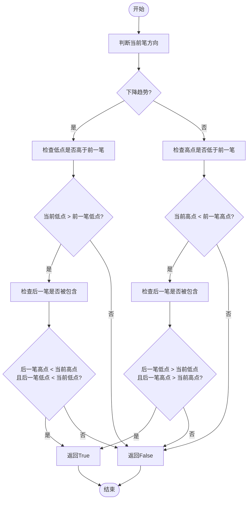
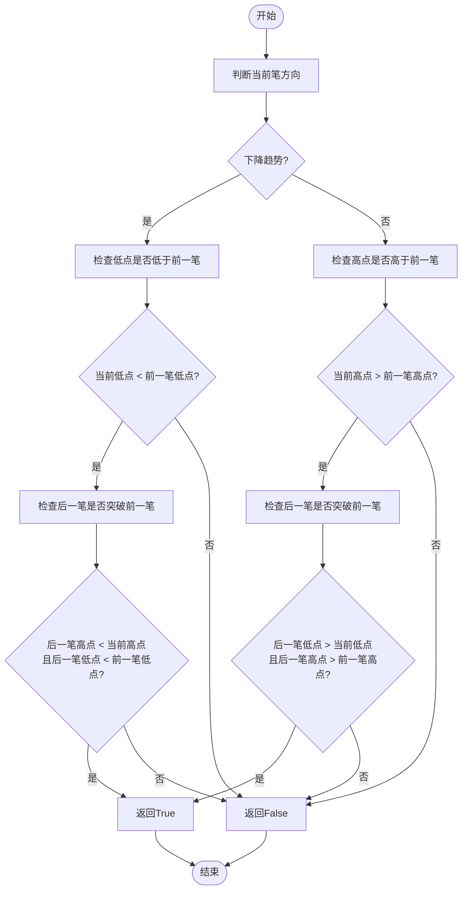
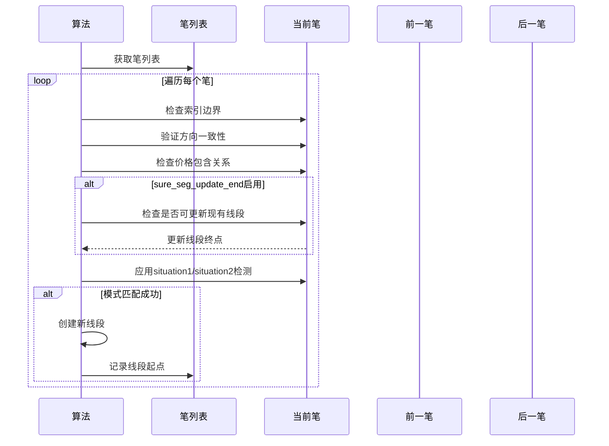
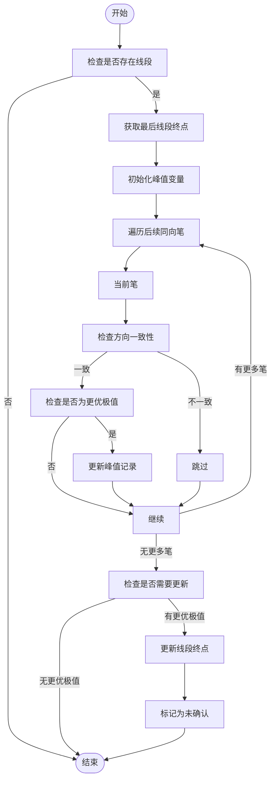
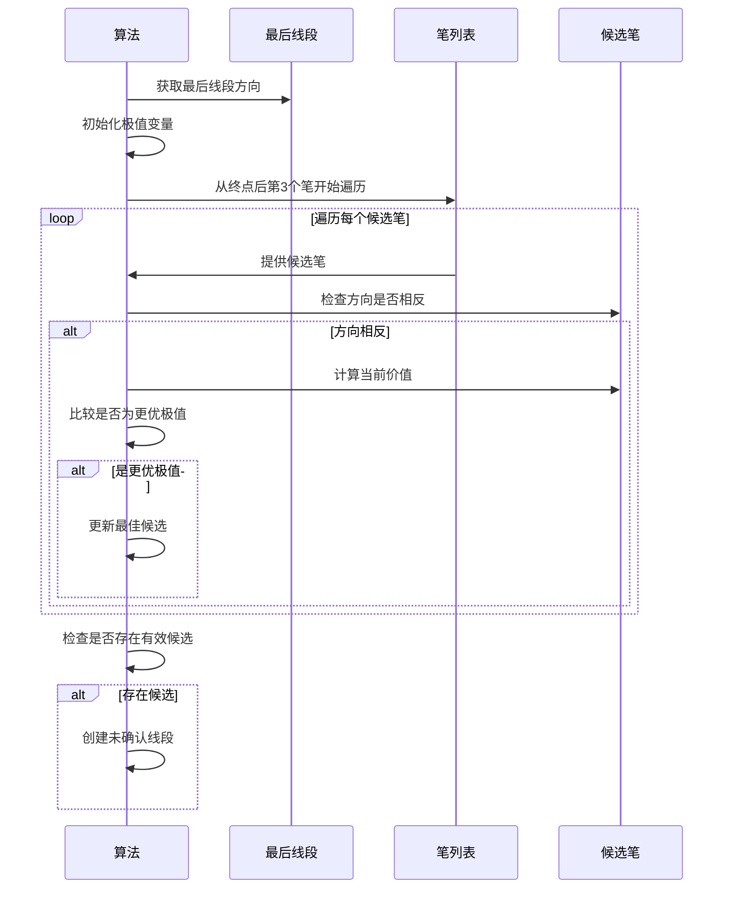
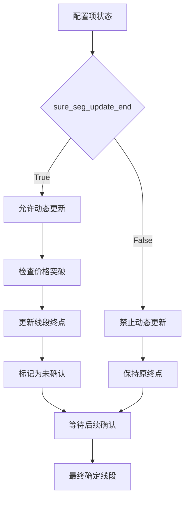

# 都业华1+1法则线段算法

<cite>
**本文档引用文件**   
- [SegListDYH.py](file://chan.py/Seg/SegListDYH.py)
- [SegListComm.py](file://chan.py/Seg/SegListComm.py)
- [BiList.py](file://chan.py/Bi/BiList.py)
- [CEnum.py](file://chan.py/Common/CEnum.py)
- [Seg.py](file://chan.py/Seg/Seg.py)
</cite>

## 目录
1. [简介](#简介)
2. [核心组件](#核心组件)
3. [价格结构模式分析](#价格结构模式分析)
4. [线段转折点检测机制](#线段转折点检测机制)
5. [动态调整机制](#动态调整机制)
6. [未确认线段处理](#未确认线段处理)
7. [配置项影响分析](#配置项影响分析)
8. [算法特性与风险](#算法特性与风险)

## 简介
本文档全面解析CSegListDYH类实现的都业华1+1法则线段构建算法。该算法基于笔（Bi）序列构建线段（Segment），通过定义两种典型价格结构模式来识别市场转折点，特别适用于捕捉短期反转信号。算法结合了确定性检测和动态调整机制，能够在不同市场环境下灵活应用。

## 核心组件

CSegListDYH类继承自CSegListComm基类，实现了都业华1+1法则特有的线段构建逻辑。其核心功能包括：基于situation1和situation2模式检测确定性线段、动态更新已确认线段终点、处理未确认线段以及收集左侧剩余线段。

**Section sources**
- [SegListDYH.py](file://chan.py/Seg/SegListDYH.py#L27-L95)
- [SegListComm.py](file://chan.py/Seg/SegListComm.py#L14-L156)

## 价格结构模式分析

### Situation1模式
situation1函数定义了第一种典型价格结构模式，用于检测价格走势中的潜在反转点。该模式要求当前笔的价格极值优于前一笔，同时后一笔完全包含在当前笔的范围内。

当处于下降趋势时，要求当前笔的低点高于前一笔的低点，并且后一笔的高点和低点都低于当前笔的相应价位。当处于上升趋势时，要求当前笔的高点低于前一笔的高点，并且后一笔的高点和低点都高于当前笔的相应价位。

**Diagram sources**
- [SegListDYH.py](file://chan.py/Seg/SegListDYH.py#L1-L14)

**Section sources**
- [SegListDYH.py](file://chan.py/Seg/SegListDYH.py#L1-L14)

### Situation2模式
situation2函数定义了第二种典型价格结构模式，与situation1相比，该模式对价格极值的要求更为严格。它要求当前笔的极值不仅优于前一笔，而且后一笔的极值要突破前一笔的极值。

在下降趋势中，要求当前笔的低点低于前一笔的低点，同时后一笔的低点也低于前一笔的低点。在上升趋势中，要求当前笔的高点高于前一笔的高点，同时后一笔的高点也高于前一笔的高点。

**Diagram sources**
- [SegListDYH.py](file://chan.py/Seg/SegListDYH.py#L15-L26)

**Section sources**
- [SegListDYH.py](file://chan.py/Seg/SegListDYH.py#L15-L26)

## 线段转折点检测机制

### cal_bi_sure方法
cal_bi_sure方法是确定性线段检测的核心，它遍历笔列表并应用situation1和situation2模式来识别线段转折点。该方法首先进行基本条件检查，包括确保当前笔与前一线段方向一致，以及满足最小间隔要求。

当sure_seg_update_end配置项启用时，该方法会动态更新已有线段的终点。如果发现符合条件的笔，就会创建新的线段。算法确保新线段与前一线段之间至少间隔4个笔，以避免过于密集的信号产生。

**Diagram sources**
- [SegListDYH.py](file://chan.py/Seg/SegListDYH.py#L40-L69)

**Section sources**
- [SegListDYH.py](file://chan.py/Seg/SegListDYH.py#L40-L69)

## 动态调整机制

### try_update_last_seg方法
try_update_last_seg方法实现了对已确认线段终点的动态调整机制。该方法在确定性线段检测后执行，用于优化线段的最终位置。它会检查最后一个线段终点之后的所有同向笔，寻找更优的价格极值。

对于上升线段，寻找更高的高点；对于下降线段，寻找更低的低点。一旦发现更优的极值点，就将该点作为新的线段终点，并将线段状态标记为"未确认"，以便后续进一步验证。

**Diagram sources**
- [SegListDYH.py](file://chan.py/Seg/SegListDYH.py#L71-L87)

**Section sources**
- [SegListDYH.py](file://chan.py/Seg/SegListDYH.py#L71-L87)

## 未确认线段处理

### cal_bi_unsure方法
cal_bi_unsure方法负责处理未确认线段的峰值追踪逻辑。该方法在左侧笔突破最后一个确定线段时被调用，用于识别潜在的反转信号。

算法从最后一个线段终点后的第四个笔开始搜索，寻找与线段方向相反的笔中的最优极值。对于上升线段，寻找更低的低点；对于下降线段，寻找更高的高点。找到的极值点将被创建为未确认线段，等待后续确认。

**Diagram sources**
- [SegListDYH.py](file://chan.py/Seg/SegListDYH.py#L89-L107)

**Section sources**
- [SegListDYH.py](file://chan.py/Seg/SegListDYH.py#L89-L107)

## 配置项影响分析

### sure_seg_update_end配置项
sure_seg_update_end配置项对线段更新行为有重要影响。当该配置项设置为True时，算法允许动态更新已有线段的终点，这使得线段能够更好地适应市场的最新变化。

启用此配置项后，如果发现价格走势继续沿着线段方向发展并创出新高/新低，算法会相应地调整线段终点。这种机制提高了算法对趋势延续的敏感度，但也可能增加在震荡市场中的误触发风险。

**Diagram sources**
- [SegListDYH.py](file://chan.py/Seg/SegListDYH.py#L30-L31)
- [SegListDYH.py](file://chan.py/Seg/SegListDYH.py#L58-L62)

**Section sources**
- [SegListDYH.py](file://chan.py/Seg/SegListDYH.py#L30-L31)
- [SegListDYH.py](file://chan.py/Seg/SegListDYH.py#L58-L62)

## 算法特性与风险

### 灵敏度优势
都业华1+1法则线段算法在捕捉短期反转信号方面表现出较高的灵敏度。通过结合situation1和situation2两种模式，算法能够识别不同类型的市场转折结构。动态调整机制使得线段能够及时响应价格变化，提高了信号的时效性。

算法对价格结构的精细刻画使其在趋势初期就能发出信号，为交易者提供了较早的入场机会。未确认线段的处理机制也为潜在的反转提供了预警。

### 误触发风险
在噪音较多的市场环境中，该算法存在一定的误触发风险。由于算法对价格极值较为敏感，频繁的价格波动可能导致过多的虚假信号。特别是在横盘整理阶段，situation1和situation2模式可能被反复触发，产生大量无效线段。

动态更新机制在趋势延续时表现良好，但在剧烈震荡行情中可能导致线段频繁调整，增加交易成本。建议结合其他过滤条件或指标来降低误触发率。

**Section sources**
- [SegListDYH.py](file://chan.py/Seg/SegListDYH.py#L1-L96)
- [SegListComm.py](file://chan.py/Seg/SegListComm.py#L14-L156)