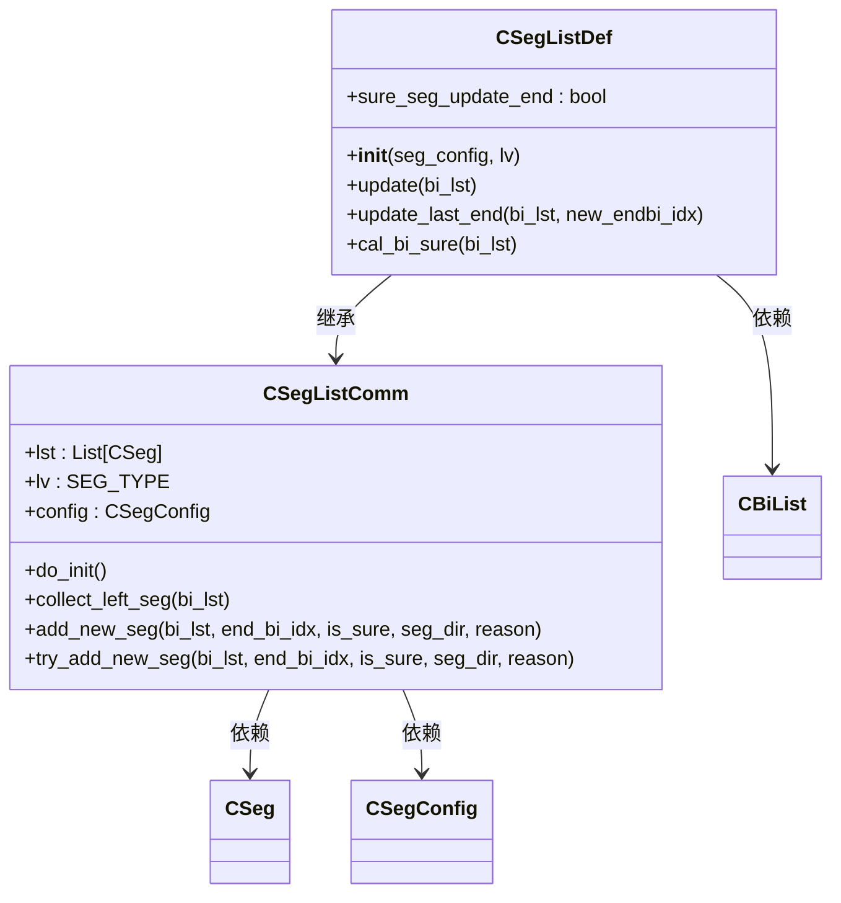

# 默认简化线段算法

<cite>
**本文档引用的文件**  
- [SegListDef.py](file://chan.py/Seg/SegListDef.py)
- [SegListComm.py](file://chan.py/Seg/SegListComm.py)
- [BiList.py](file://chan.py/Bi/BiList.py)
- [SegConfig.py](file://chan.py/Seg/SegConfig.py)
</cite>

## 目录
1. [引言](#引言)
2. [核心组件分析](#核心组件分析)
3. [趋势判断条件解析](#趋势判断条件解析)
4. [潜在线段终点追踪机制](#潜在线段终点追踪机制)
5. [已确认线段终点更新逻辑](#已确认线段终点更新逻辑)
6. [线段延伸行为控制机制](#线段延伸行为控制机制)
7. [算法性能与局限性分析](#算法性能与局限性分析)
8. [高频交易策略调优建议](#高频交易策略调优建议)

## 引言
本文档详细解析CSegListDef类实现的默认简化线段构建算法。该算法基于笔序列进行线段划分，通过定义明确的趋势判断条件和终点追踪机制，在保证计算效率的同时实现对市场走势的基本刻画。重点分析is_up_seg和is_down_seg函数定义的简化趋势判断条件，以及cal_bi_sure方法中peak_bi变量如何追踪潜在线段终点。

**本节不涉及具体源码文件分析，无需标注来源**

## 核心组件分析

CSegListDef类继承自CSegListComm基类，实现了默认的线段识别逻辑。其核心功能包括线段更新、终点确认和延伸控制。算法以笔列表（CBiList）为输入，通过迭代处理每根笔来构建线段序列。

**图示来源**  
- [SegListDef.py](file://chan.py/Seg/SegListDef.py#L15-L59)
- [SegListComm.py](file://chan.py/Seg/SegListComm.py#L1-L169)

**本节来源**  
- [SegListDef.py](file://chan.py/Seg/SegListDef.py#L15-L59)
- [SegListComm.py](file://chan.py/Seg/SegListComm.py#L1-L169)

## 趋势判断条件解析

is_up_seg和is_down_seg函数定义了简化的趋势判断条件。其中，is_up_seg函数判断当前笔是否高于前前笔的高点，即bi._high() > pre_bi._high()；is_down_seg函数判断当前笔是否低于前前笔的低点，即bi._low() < pre_bi._low()。这种判断方式跳过了传统缠论中复杂的分型验证过程，采用直接的价格比较来确定趋势延续性。

该设计显著降低了计算复杂度，特别适用于需要快速响应的实时交易系统。然而，由于未考虑中间笔的结构完整性，可能在震荡行情中产生过多的伪信号。

**本节来源**  
- [SegListDef.py](file://chan.py/Seg/SegListDef.py#L7-L11)

## 潜在线段终点追踪机制

cal_bi_sure方法使用peak_bi变量追踪潜在线段终点。算法遍历笔列表时，首先跳过前两根笔（idx < 2），然后根据以下逻辑更新peak_bi：

1. 当存在peak_bi且当前笔与其方向相同且价格更优时，更新peak_bi为当前笔
2. 当满足sure_seg_update_end条件且当前笔突破已确认线段终点时，调用update_last_end更新终点并重置peak_bi
3. 当当前笔满足is_up_seg或is_down_seg条件时：
   - 若peak_bi为空且满足新线段条件，则设置peak_bi
   - 若peak_bi方向与当前笔相反且间隔超过2根笔，则确认新线段并更新peak_bi

此机制通过peak_bi变量实现了对潜在转折点的持续跟踪，并在满足条件时及时确认线段。

**本节来源**  
- [SegListDef.py](file://chan.py/Seg/SegListDef.py#L30-L59)

## 已确认线段终点更新逻辑

update_last_end方法在更新已确认线段终点时实施严格的索引验证逻辑。该方法首先获取上一个终点笔索引last_endbi_idx，然后断言新终点索引new_endbi_idx必须满足new_endbi_idx >= last_endbi_idx + 2。这一约束确保了线段延伸至少包含一根完整的中间笔，防止了因微小价格波动导致的频繁调整。

更新操作包括：
1. 将线段的end_bi更新为新索引对应的笔
2. 调用update_bi_list方法更新线段内部的笔列表
3. 保持线段结构的完整性

该验证逻辑有效避免了线段结构的退化，保证了线段划分的合理性。

**本节来源**  
- [SegListDef.py](file://chan.py/Seg/SegListDef.py#L20-L24)

## 线段延伸行为控制机制

算法通过sure_seg_update_end标志位控制线段延伸行为。当该标志位为True时，若当前笔方向与最后确认线段方向一致且价格突破该线段终点，则触发update_last_end操作。这一机制允许线段在趋势延续时动态延伸，而不是立即创建新线段。

该设计体现了"一笔延伸优于两笔形成"的原则，有助于过滤市场噪音，特别是在趋势行情中能保持线段的连续性。标志位的初始值为False，其状态可能由更高层的配置或外部条件控制。

**本节来源**  
- [SegListDef.py](file://chan.py/Seg/SegListDef.py#L18-L18)
- [SegListDef.py](file://chan.py/Seg/SegListDef.py#L41-L44)

## 算法性能与局限性分析

该算法在处理密集笔序列时展现出显著的计算效率优势。由于采用了简化的趋势判断条件和线性的遍历逻辑，时间复杂度为O(n)，其中n为笔的数量。相比传统的递归式线段划分算法，避免了重复的结构验证，特别适合高频数据处理场景。

然而，简化规则可能导致线段划分粗糙的问题：
1. 未考虑分型完整性，可能在震荡市中产生过多短线段
2. 直接的价格比较容易受到异常值影响
3. 缺乏对线段力度的综合评估
4. 在极端行情中可能出现线段过长或过短的情况

这些局限性在低频交易中影响较小，但在高频策略中可能影响信号质量。

**本节来源**  
- [SegListDef.py](file://chan.py/Seg/SegListDef.py#L7-L59)
- [SegListComm.py](file://chan.py/Seg/SegListComm.py#L1-L169)

## 高频交易策略调优建议

针对高频交易策略，提出以下调优建议：

1. **动态调整sure_seg_update_end**：根据市场波动率动态切换该标志位，高波动时启用延伸，低波动时禁用以提高灵敏度
2. **引入过滤条件**：在is_up_seg和is_down_seg判断前增加成交量或波动率过滤，减少伪信号
3. **多时间尺度验证**：结合更高级别的线段结构进行交叉验证，提高信号可靠性
4. **参数优化**：通过历史回测优化left_method等配置参数，适应不同品种的特性
5. **异常处理**：增加对极端行情的特殊处理逻辑，防止算法失效

这些改进可在保持算法高效性的同时，显著提升线段划分的质量，更适合高频交易环境的需求。

**本节来源**  
- [SegListDef.py](file://chan.py/Seg/SegListDef.py#L7-L59)
- [SegConfig.py](file://chan.py/Seg/SegConfig.py#L1-L13)