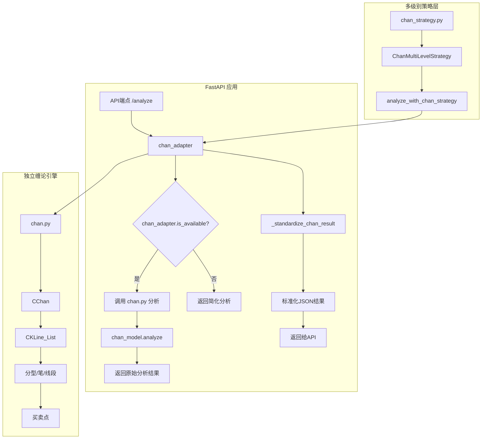
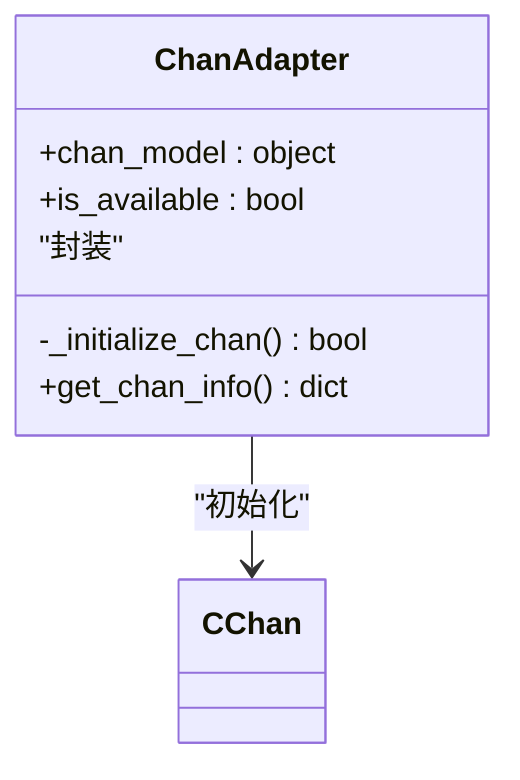
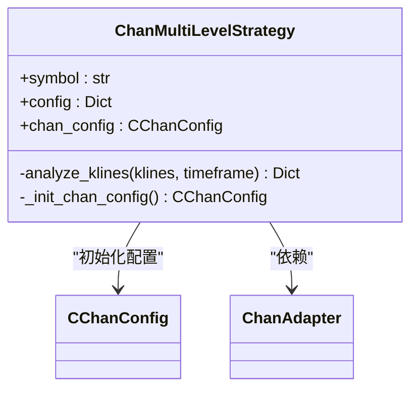
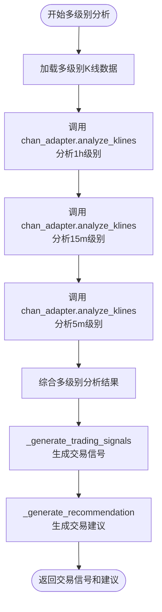
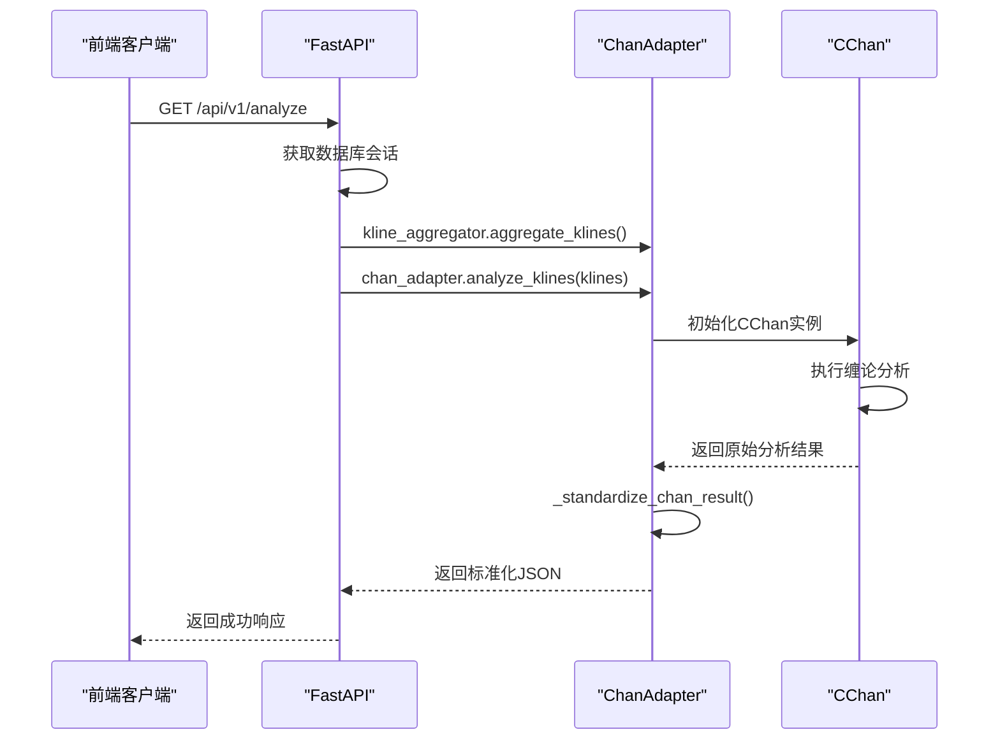
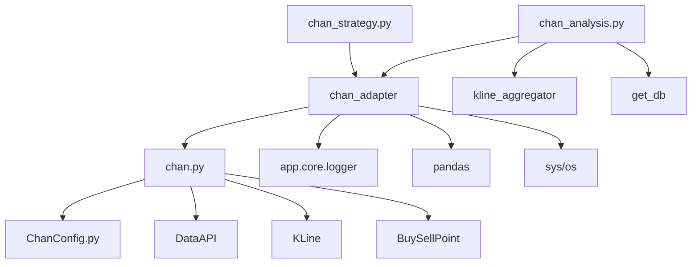

# 适配器集成

<cite>
**本文档中引用的文件**   
- [chan_adapter.py](file://app/services/chan_adapter.py) - *更新以支持多级别策略集成*
- [chan_strategy.py](file://app/services/chan_strategy.py) - *新增的多级别联立分析策略*
- [Chan.py](file://chan.py/Chan.py) - *核心缠论分析引擎*
- [chan_analysis.py](file://app/api/v1/endpoints/chan_analysis.py) - *API端点集成*
- [ChanConfig.py](file://chan.py/ChanConfig.py) - *缠论配置管理*
</cite>

## 更新摘要
**变更内容**   
- **新增多级别策略集成**：`chan_adapter.py`现在与`chan_strategy.py`协同工作，支持多级别联立分析。
- **新增核心组件**：添加了`ChanMultiLevelStrategy`类的详细分析，说明其在适配器模式中的角色。
- **更新架构概述**：修改了架构图，以反映`chan_adapter`与`chan_strategy`之间的新集成关系。
- **更新依赖分析**：增加了`chan_strategy.py`作为`chan_adapter.py`的新依赖项。
- **增强故障排除指南**：补充了与多级别策略相关的故障排除步骤。

## 目录
1. [简介](#简介)
2. [项目结构](#项目结构)
3. [核心组件](#核心组件)
4. [架构概述](#架构概述)
5. [详细组件分析](#详细组件分析)
6. [依赖分析](#依赖分析)
7. [性能考虑](#性能考虑)
8. [故障排除指南](#故障排除指南)
9. [结论](#结论)

## 简介
本文档详细说明了缠论模块适配器（`chan_adapter.py`）如何作为桥梁，将独立的`chan.py`分析引擎无缝集成到FastAPI后端应用中。该适配器的主要职责包括初始化CChan实例、处理API请求参数、调用缠论核心方法进行分析，并将复杂的缠论对象（如笔、线段、买卖点）转换为API友好的JSON数据结构。**根据最新的代码变更，本文档已更新以反映`chan_adapter`与新增的`chan_strategy.py`服务的集成，该服务实现了多级别联立分析功能。** 文档还阐述了这种适配器模式带来的好处，如解耦核心分析逻辑与Web框架，便于单元测试和未来替换分析引擎。

## 项目结构
项目采用分层架构，主要分为`app`（FastAPI应用）和`chan.py`（独立缠论分析引擎）两个核心部分。`app`目录包含API端点、服务、数据库模型等，而`chan.py`是一个独立的Python模块，实现了完整的缠论分析逻辑。`chan_adapter.py`位于`app/services/`目录下，是连接这两个部分的关键适配器。**新增的`chan_strategy.py`服务也位于`app/services/`目录下，它利用`chan_adapter`提供的接口，实现了更高级的多级别联立分析交易策略。**

**Section sources**
- [chan_adapter.py](file://app/services/chan_adapter.py)
- [chan_strategy.py](file://app/services/chan_strategy.py)

## 核心组件
`chan_adapter.py`中的`ChanAdapter`类是集成的核心。它负责初始化`chan.py`模块，处理数据转换，并提供统一的接口供API端点调用。当`chan.py`模块不可用时，适配器会自动切换到简化分析模式，确保系统稳定性。**此外，`chan_strategy.py`中的`ChanMultiLevelStrategy`类是新增的核心组件，它作为`chan_adapter`的上层消费者，利用其提供的标准化分析结果，执行更复杂的多级别联立分析和交易信号生成。**

**Section sources**
- [chan_adapter.py](file://app/services/chan_adapter.py#L1-L517)
- [chan_strategy.py](file://app/services/chan_strategy.py#L1-L662)

## 架构概述

**Diagram sources**
- [chan_adapter.py](file://app/services/chan_adapter.py#L1-L517)
- [Chan.py](file://chan.py/Chan.py#L1-L298)
- [chan_strategy.py](file://app/services/chan_strategy.py#L1-L662)

## 详细组件分析

### ChanAdapter 类分析
`ChanAdapter`类封装了与`chan.py`模块交互的所有复杂性。

#### 初始化与状态管理

**Diagram sources**
- [chan_adapter.py](file://app/services/chan_adapter.py#L1-L517)
- [Chan.py](file://chan.py/Chan.py#L1-L298)

**Section sources**
- [chan_adapter.py](file://app/services/chan_adapter.py#L1-L517)

#### 数据分析与转换流程

**Diagram sources**
- [chan_adapter.py](file://app/services/chan_adapter.py#L1-L517)

**Section sources**
- [chan_adapter.py](file://app/services/chan_adapter.py#L1-L517)

### ChanMultiLevelStrategy 类分析
`ChanMultiLevelStrategy`类是新增的多级别联立分析策略的核心，它依赖于`chan_adapter`提供的服务。

#### 策略初始化与配置

**Diagram sources**
- [chan_strategy.py](file://app/services/chan_strategy.py#L1-L662)

**Section sources**
- [chan_strategy.py](file://app/services/chan_strategy.py#L1-L662)

#### 多级别分析与信号生成流程

**Diagram sources**
- [chan_strategy.py](file://app/services/chan_strategy.py#L1-L662)

**Section sources**
- [chan_strategy.py](file://app/services/chan_strategy.py#L1-L662)

### API端点集成分析
`chan_analysis.py`中的API端点展示了如何在FastAPI中使用`chan_adapter`。

#### 缠论分析API调用序列

**Diagram sources**
- [chan_analysis.py](file://app/api/v1/endpoints/chan_analysis.py#L1-L421)
- [chan_adapter.py](file://app/services/chan_adapter.py#L1-L517)

**Section sources**
- [chan_analysis.py](file://app/api/v1/endpoints/chan_analysis.py#L1-L421)

## 依赖分析

**Diagram sources**
- [chan_adapter.py](file://app/services/chan_adapter.py#L1-L517)
- [chan_analysis.py](file://app/api/v1/endpoints/chan_analysis.py#L1-L421)
- [Chan.py](file://chan.py/Chan.py#L1-L298)
- [chan_strategy.py](file://app/services/chan_strategy.py#L1-L662)

**Section sources**
- [chan_adapter.py](file://app/services/chan_adapter.py#L1-L517)
- [chan_analysis.py](file://app/api/v1/endpoints/chan_analysis.py#L1-L421)
- [chan_strategy.py](file://app/services/chan_strategy.py#L1-L662)

## 性能考虑
- **初始化开销**：`ChanAdapter`在启动时初始化`CChan`实例，避免了每次请求都创建新实例的开销。
- **数据转换**：使用`pandas.DataFrame`作为中间数据格式，提高了数据处理效率。
- **错误回退**：当`chan.py`模块不可用时，`_fallback_analysis`方法提供快速响应，保证了API的可用性。
- **日志记录**：详细的日志有助于监控性能瓶颈和分析失败原因。
- **多级别分析开销**：`ChanMultiLevelStrategy`会为每个分析级别调用`chan_adapter`，这会增加总体计算开销。建议在生产环境中合理配置分析级别和频率。

## 故障排除指南
- **Chan模块不可用**：检查`chan.py`子模块是否已正确初始化 (`git submodule update --init`)。
- **数据转换失败**：确保K线数据格式正确，包含`timestamp`, `open_price`, `high_price`, `low_price`, `close_price`, `volume`等字段。
- **分析结果为空**：检查`chan.py`的配置文件和数据源是否正确。
- **性能问题**：减少`limit`参数的值，或优化`chan.py`内部的分析算法。
- **多级别策略无信号**：确认`chan_strategy.py`的`confidence_threshold`参数设置合理，并检查输入的多级别K线数据是否完整。

**Section sources**
- [chan_adapter.py](file://app/services/chan_adapter.py#L1-L517)
- [test_chan_integration.py](file://test_chan_integration.py#L1-L206)
- [chan_strategy.py](file://app/services/chan_strategy.py#L1-L662)

## 结论
`chan_adapter.py`成功地实现了缠论分析引擎与FastAPI应用的解耦。通过适配器模式，系统获得了更高的灵活性和可维护性。核心分析逻辑被封装在独立的`chan.py`模块中，便于单独测试和升级。FastAPI应用通过`chan_adapter`提供的简单接口即可获得复杂的缠论分析结果，同时具备良好的错误处理和回退机制，确保了系统的健壮性。**新增的`chan_strategy.py`服务进一步证明了该架构的可扩展性，它能够无缝地利用`chan_adapter`的输出，构建更高级的交易策略，而无需修改底层的分析引擎。**