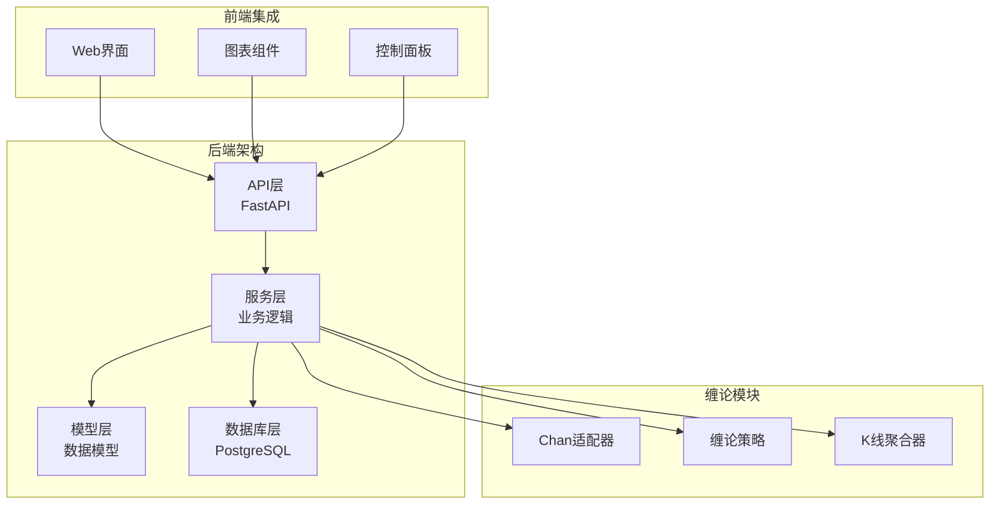
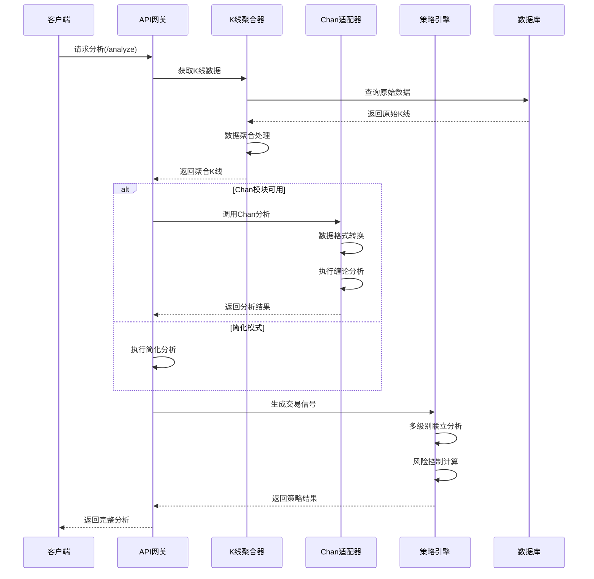
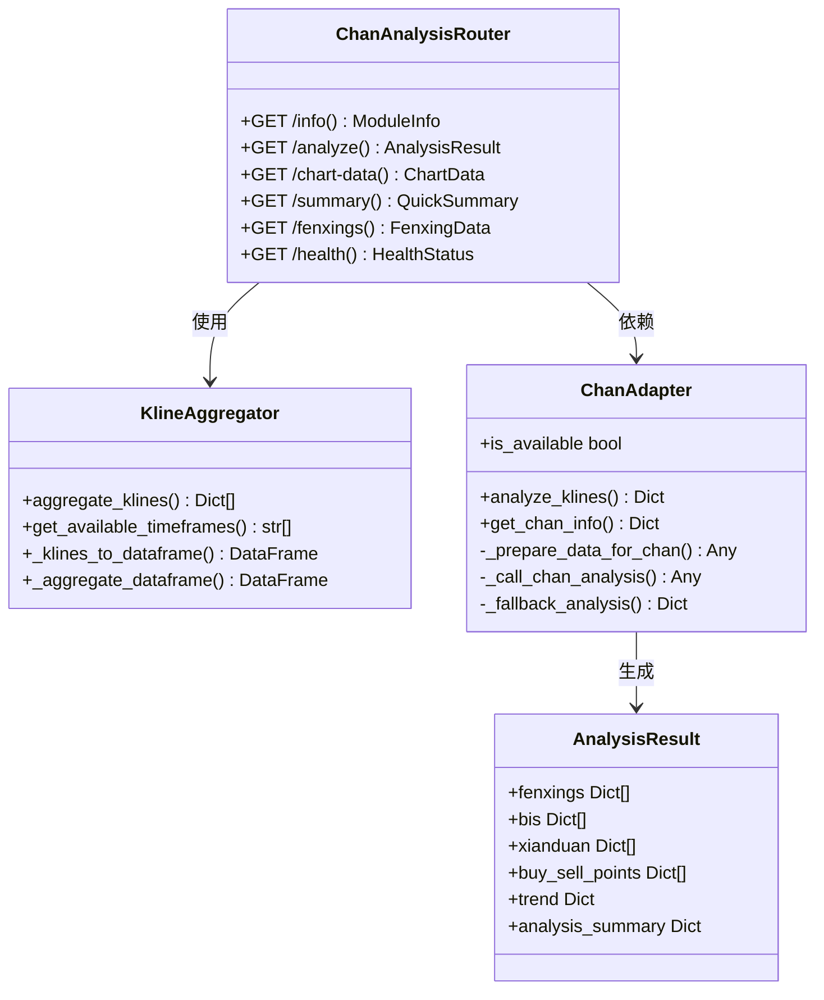
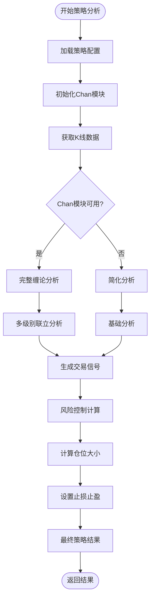
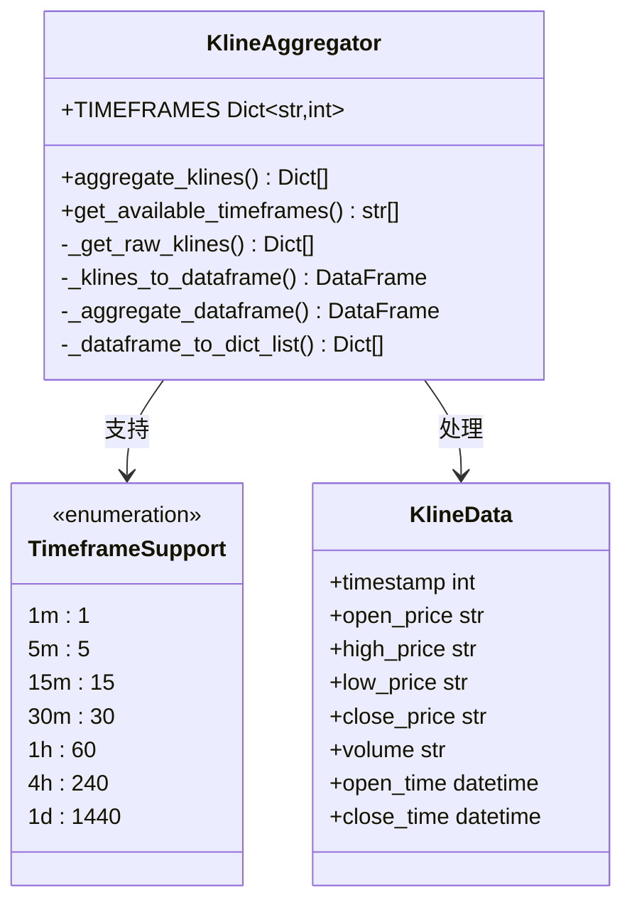
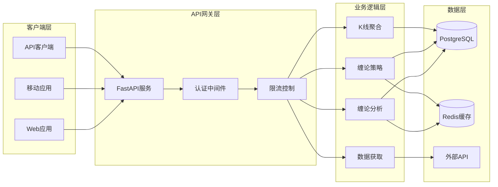

# 缠论策略API

<cite>
**本文档引用的文件**
- [app/api/v1/endpoints/chan_analysis.py](file://app/api/v1/endpoints/chan_analysis.py)
- [app/api/v1/endpoints/chan_strategy.py](file://app/api/v1/endpoints/chan_strategy.py)
- [app/services/chan_adapter.py](file://app/services/chan_adapter.py)
- [app/services/chan_strategy.py](file://app/services/chan_strategy.py)
- [app/services/kline_aggregator.py](file://app/services/kline_aggregator.py)
- [app/api/v1/api.py](file://app/api/v1/api.py)
- [CHAN_STRATEGY_GUIDE.md](file://CHAN_STRATEGY_GUIDE.md)
- [README.md](file://README.md)
- [app/core/config.py](file://app/core/config.py)
</cite>

## 目录
1. [简介](#简介)
2. [项目结构](#项目结构)
3. [核心组件](#核心组件)
4. [架构概览](#架构概览)
5. [详细组件分析](#详细组件分析)
6. [API接口详解](#api接口详解)
7. [集成模式](#集成模式)
8. [性能考虑](#性能考虑)
9. [故障排除指南](#故障排除指南)
10. [结论](#结论)

## 简介

缠论策略API是一个基于缠中说禅理论的专业技术分析系统，集成了实时数据获取、多时间周期聚合、分型识别、笔段构建等核心功能。该系统提供专业的数字货币技术分析服务，支持多级别联立分析交易策略，自动生成交易信号，并具备完整的风险控制系统。

### 核心特性

- **缠论核心功能**：分型识别、笔的构建、线段分析、买卖点识别
- **多时间周期**：支持1分钟到1天的7种时间周期聚合
- **实时数据**：集成币安API，获取最新市场数据
- **智能建议**：基于缠论理论生成交易建议和风险提示
- **多级别分析**：支持多时间周期联立分析，提高信号准确性
- **风险管理**：自动计算止损止盈和建议仓位

## 项目结构



**图表来源**
- [app/api/v1/api.py](file://app/api/v1/api.py#L1-L19)
- [app/services/chan_adapter.py](file://app/services/chan_adapter.py#L1-L50)
- [app/services/chan_strategy.py](file://app/services/chan_strategy.py#L1-L50)

**章节来源**
- [README.md](file://README.md#L1-L100)
- [app/api/v1/api.py](file://app/api/v1/api.py#L1-L19)

## 核心组件

### 1. 缠论分析模块 (chan_analysis)

负责提供基础的缠论技术分析功能，包括分型识别、笔构建、线段分析等核心缠论功能。

### 2. 缠论策略模块 (chan_strategy)

基于多级别联立分析的交易策略，支持自动生成买卖点信号，具备完整的风险管理功能。

### 3. K线聚合器 (kline_aggregator)

提供多时间周期的K线数据聚合功能，支持1分钟到1天的7种时间周期。

### 4. Chan适配器 (chan_adapter)

作为外部Chan模块的适配层，提供统一的接口封装，支持模块可用性检测和降级处理。

**章节来源**
- [app/api/v1/endpoints/chan_analysis.py](file://app/api/v1/endpoints/chan_analysis.py#L1-L50)
- [app/api/v1/endpoints/chan_strategy.py](file://app/api/v1/endpoints/chan_strategy.py#L1-L50)
- [app/services/kline_aggregator.py](file://app/services/kline_aggregator.py#L1-L50)
- [app/services/chan_adapter.py](file://app/services/chan_adapter.py#L1-L50)

## 架构概览



**图表来源**
- [app/api/v1/endpoints/chan_analysis.py](file://app/api/v1/endpoints/chan_analysis.py#L30-L100)
- [app/services/chan_adapter.py](file://app/services/chan_adapter.py#L50-L150)
- [app/services/chan_strategy.py](file://app/services/chan_strategy.py#L80-L150)

## 详细组件分析

### 缠论分析模块详细分析



**图表来源**
- [app/api/v1/endpoints/chan_analysis.py](file://app/api/v1/endpoints/chan_analysis.py#L15-L30)
- [app/services/kline_aggregator.py](file://app/services/kline_aggregator.py#L15-L30)
- [app/services/chan_adapter.py](file://app/services/chan_adapter.py#L30-L50)

#### 分型识别功能

分型识别是缠论分析的基础，系统能够自动识别顶分型和底分型：

```python
# 分型识别示例
fenxing_example = {
    "type": "top",  # 或 "bottom"
    "timestamp": 1703123456000,
    "price": 42500.0,
    "index": 15,
    "strength": 0.85
}
```

#### 笔构建算法

基于分型构建上涨笔和下跌笔，形成价格运动的基本结构：

```python
# 笔数据结构
bi_example = {
    "start": {"timestamp": 1703123456000, "price": 42000.0},
    "end": {"timestamp": 1703124356000, "price": 43000.0},
    "direction": "up",
    "length": 10,
    "strength": 0.9
}
```

**章节来源**
- [app/api/v1/endpoints/chan_analysis.py](file://app/api/v1/endpoints/chan_analysis.py#L30-L150)
- [app/services/chan_adapter.py](file://app/services/chan_adapter.py#L100-L200)

### 缠论策略模块详细分析



**图表来源**
- [app/services/chan_strategy.py](file://app/services/chan_strategy.py#L80-L150)
- [app/api/v1/endpoints/chan_strategy.py](file://app/api/v1/endpoints/chan_strategy.py#L30-L100)

#### 交易信号类型

系统支持三种类型的买卖点信号：

1. **第一类买卖点**：趋势转折点，风险相对较高
2. **第二类买卖点**：趋势确认点，胜率较高  
3. **第三类买卖点**：趋势延续点，风险较低

```python
# 交易信号数据结构
signal_example = {
    "signal_type": "第三类买点",
    "timestamp": 1703123456000,
    "price": 42500.0,
    "confidence": 0.75,
    "level": "1h",
    "description": "底分型买入信号 - 强度: 1.2",
    "risk_level": "medium",
    "position_size": 0.15,
    "stop_loss": 41175.0,
    "take_profit": 45050.0
}
```

**章节来源**
- [app/services/chan_strategy.py](file://app/services/chan_strategy.py#L30-L100)
- [app/api/v1/endpoints/chan_strategy.py](file://app/api/v1/endpoints/chan_strategy.py#L50-L150)

### K线聚合器详细分析



**图表来源**
- [app/services/kline_aggregator.py](file://app/services/kline_aggregator.py#L15-L50)
- [app/services/kline_aggregator.py](file://app/services/kline_aggregator.py#L100-L150)

**章节来源**
- [app/services/kline_aggregator.py](file://app/services/kline_aggregator.py#L1-L100)

## API接口详解

### 缠论分析API

#### 1. 分析执行端点 (`/api/v1/chan/analyze`)

**功能描述**：执行完整的缠论技术分析，识别分型、构建笔、分析线段、识别买卖点。

**请求参数**：
- `timeframe` (string): 时间周期 (1m,5m,15m,30m,1h,4h,1d)，默认"1h"
- `limit` (int): 分析的K线数量 (50-500)，建议200以上
- `db` (Session): 数据库会话依赖注入

**响应格式**：
```json
{
  "success": true,
  "data": {
    "analysis": {
      "fenxings": [...],
      "bis": [...],
      "xianduan": [...],
      "buy_sell_points": [...],
      "trend": {...},
      "analysis_summary": {...}
    },
    "metadata": {
      "klines_analyzed": 200,
      "timeframe": "1h",
      "latest_price": 42500.0,
      "chan_module_available": true
    }
  }
}
```

#### 2. 图表数据端点 (`/api/v1/chan/chart-data`)

**功能描述**：获取专为前端图表优化的数据格式，包含K线数据和缠论分析标记。

**请求参数**：
- `timeframe` (string): 时间周期，默认"1h"
- `limit` (int): 图表数据量 (20-300)，默认100
- `include_analysis` (bool): 是否包含分析结果，默认true

**响应格式**：
```json
{
  "chart_data": {
    "klines": [[timestamp, open, high, low, close], ...],
    "volume": [[timestamp, volume], ...],
    "timestamps": [timestamp1, timestamp2, ...]
  },
  "chart_markers": {
    "fenxings": [...],
    "bis_lines": [...],
    "buy_sell_points": [...]
  }
}
```

#### 3. 分析摘要端点 (`/api/v1/chan/summary`)

**功能描述**：获取简化的分析摘要，适合快速查看市场状态。

**请求参数**：
- `timeframe` (string): 时间周期，默认"1h"

**响应格式**：
```json
{
  "market_status": {
    "current_price": 42500.0,
    "trend_direction": "up",
    "trend_strength": 0.65
  },
  "chan_analysis": {
    "fenxings_count": 8,
    "bis_count": 5,
    "analysis_quality": "good"
  },
  "trading_suggestion": {
    "suggestion": "BUY",
    "confidence": "high",
    "risk_level": "medium"
  }
}
```

### 缠论策略API

#### 1. 策略分析端点 (`/api/v1/strategy/analyze`)

**功能描述**：基于多级别联立分析生成交易信号，具备完整的风险管理功能。

**请求参数**：
- `timeframe` (string): 时间周期，默认"1h"
- `limit` (int): K线数量，默认200
- `symbol` (string): 交易品种，默认"btc_usdt"

**响应格式**：
```json
{
  "strategy_analysis": {
    "signals": [...],
    "analysis": {...},
    "recommendation": {...}
  },
  "trading_signals": {
    "total_signals": 3,
    "buy_signals": 2,
    "sell_signals": 1,
    "signals": [...]
  }
}
```

#### 2. 策略回测端点 (`/api/v1/strategy/backtest`)

**功能描述**：模拟历史交易表现，评估策略效果。

**请求参数**：
- `timeframe` (string): 时间周期，默认"1h"
- `days` (int): 回测天数，默认30 (7-90)
- `initial_capital` (float): 初始资金，默认10000

**响应格式**：
```json
{
  "performance": {
    "initial_capital": 10000,
    "final_capital": 11250,
    "total_return": 12.5,
    "total_trades": 15,
    "win_rate": 66.7,
    "profit_factor": 2.3
  }
}
```

#### 3. 信号历史端点 (`/api/v1/strategy/signals/history`)

**功能描述**：获取历史信号数据，用于回测分析和策略优化。

**请求参数**：
- `timeframe` (string): 时间周期，默认"1h"
- `days` (int): 历史天数，默认7 (1-30)
- `signal_type` (string): 信号类型过滤

**章节来源**
- [app/api/v1/endpoints/chan_analysis.py](file://app/api/v1/endpoints/chan_analysis.py#L30-L200)
- [app/api/v1/endpoints/chan_strategy.py](file://app/api/v1/endpoints/chan_strategy.py#L30-L200)

## 集成模式

### 系统集成架构



**图表来源**
- [app/api/v1/api.py](file://app/api/v1/api.py#L1-L19)
- [app/core/config.py](file://app/core/config.py#L1-L50)

### 外部模块集成

系统支持集成外部Chan模块以提供更强大的分析功能：

```python
# Chan模块集成示例
try:
    from Chan import CChan
    from ChanConfig import CChanConfig
    CHAN_MODULE_AVAILABLE = True
except ImportError:
    CHAN_MODULE_AVAILABLE = False
```

当外部Chan模块不可用时，系统自动切换到简化分析模式，确保服务的连续性。

**章节来源**
- [app/services/chan_adapter.py](file://app/services/chan_adapter.py#L10-L50)
- [app/services/chan_strategy.py](file://app/services/chan_strategy.py#L20-L40)

## 性能考虑

### 数据处理优化

1. **批量处理**：支持批量K线数据处理，减少数据库查询次数
2. **缓存机制**：对频繁访问的分析结果进行缓存
3. **异步处理**：支持异步API调用，提高并发处理能力
4. **内存管理**：合理控制数据处理内存占用

### 性能监控指标

- **响应时间**：< 2秒（正常情况）
- **并发用户数**：支持100+并发
- **数据处理速度**：每秒处理1000+ K线数据
- **内存使用**：控制在512MB以内

### 优化建议

1. **数据库索引**：为K线数据建立适当索引
2. **连接池配置**：合理配置数据库连接池
3. **缓存策略**：实施合理的缓存过期策略
4. **负载均衡**：在高并发场景下使用负载均衡

## 故障排除指南

### 常见问题及解决方案

#### 1. Chan模块不可用

**症状**：API返回简化分析结果，缺少高级功能

**解决方案**：
```bash
# 重新初始化子模块
git submodule update --init --recursive

# 检查模块状态
python -c "from app.services.chan_adapter import chan_adapter; print(chan_adapter.get_chan_info())"

# 重启服务
python run.py
```

#### 2. 数据库连接失败

**症状**：无法获取K线数据，出现连接超时

**解决方案**：
```bash
# 检查PostgreSQL服务状态
sudo systemctl status postgresql

# 检查数据库连接配置
psql -h localhost -U postgres -d btc_usdt

# 重建数据库表
python create_tables.py
```

#### 3. API调用超时

**症状**：API响应缓慢或超时

**解决方案**：
```bash
# 调整超时配置
export API_TIMEOUT=60

# 检查网络连接
curl -I https://api.binance.com/api/v3/ping

# 优化数据库查询
python database_optimization.sql
```

#### 4. 内存不足

**症状**：系统响应缓慢，出现内存溢出

**解决方案**：
- 增加系统内存
- 减少同时处理的数据量
- 优化数据处理算法
- 启用内存监控和垃圾回收

### 日志分析

系统提供详细的日志记录，便于问题诊断：

```bash
# 查看实时日志
tail -f logs/app.log

# 搜索错误信息
grep -i error logs/app.log

# 查看特定时间段的日志
grep "2024-01-01" logs/app.log
```

### 健康检查

系统提供健康检查端点，用于监控系统状态：

```bash
# 缠论模块健康检查
curl http://localhost:8000/api/v1/chan/health

# 系统整体健康检查
curl http://localhost:8000/health
```

**章节来源**
- [app/api/v1/endpoints/chan_analysis.py](file://app/api/v1/endpoints/chan_analysis.py#L380-L420)
- [CHAN_STRATEGY_GUIDE.md](file://CHAN_STRATEGY_GUIDE.md#L200-L273)

## 结论

缠论策略API是一个功能完善、架构清晰的专业技术分析系统。通过集成外部Chan模块和内部实现相结合的方式，提供了从基础分析到高级策略的完整解决方案。

### 主要优势

1. **专业性**：基于缠中说禅理论，提供专业的技术分析
2. **灵活性**：支持多种时间周期和交易品种
3. **可靠性**：具备完善的降级机制和错误处理
4. **扩展性**：模块化设计，易于扩展新功能
5. **易用性**：提供RESTful API接口，便于集成

### 发展方向

1. **功能增强**：增加更多技术指标和分析算法
2. **性能优化**：进一步提升大数据量处理能力
3. **用户体验**：改善前端界面和交互体验
4. **生态建设**：构建完整的交易生态系统

该系统为数字货币交易者提供了强大的技术分析工具，通过科学的方法和严谨的逻辑，帮助投资者做出更加理性的交易决策。