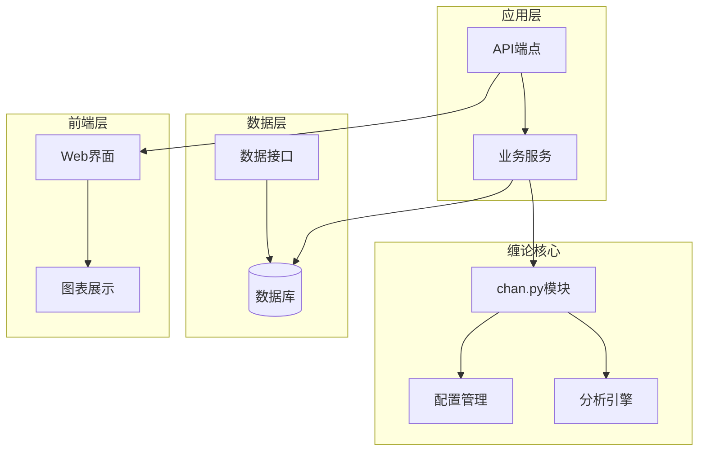
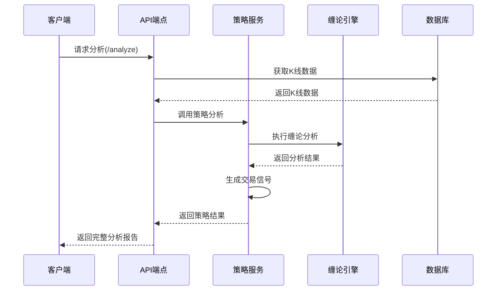
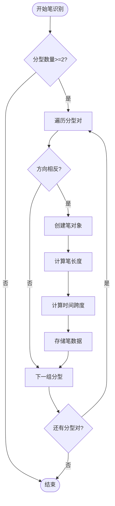
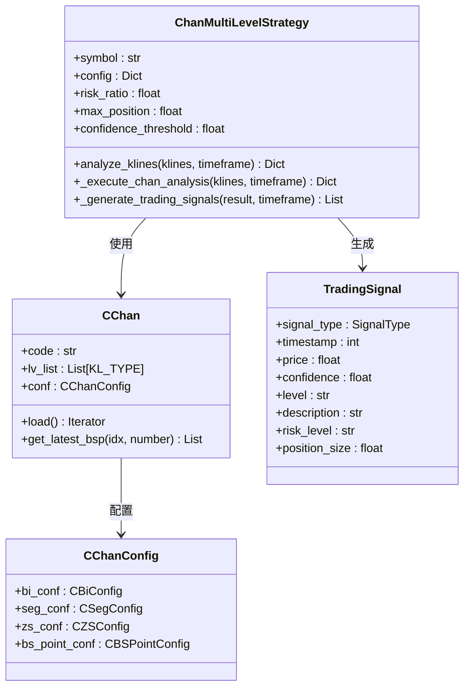
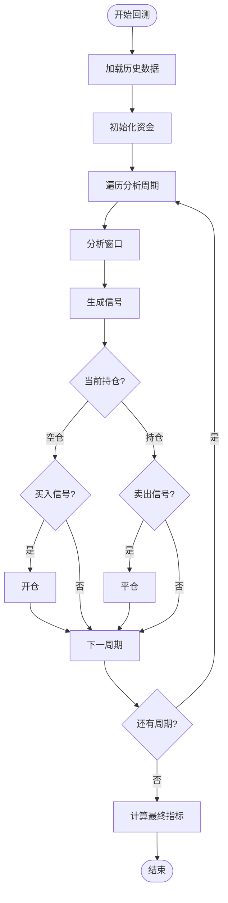
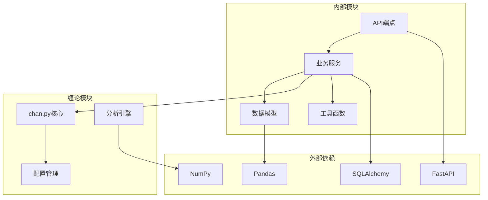

# 缠论策略模块

<cite>
**本文档中引用的文件**   
- [chan_strategy.py](file://app/api/v1/endpoints/chan_strategy.py)
- [chan_strategy.py](file://app/services/chan_strategy.py)
- [ChanConfig.py](file://chan.py\ChanConfig.py)
- [Chan.py](file://chan.py\Chan.py)
- [README.md](file://chan.py\README.md)
- [multi_level_strategy.py_bak.py](file://chan.py\Debug\multi_level_strategy.py_bak.py)
- [CHAN_STRATEGY_GUIDE.md](file://CHAN_STRATEGY_GUIDE.md)
- [API参考.md](file://doc\API参考\API参考.md)
</cite>

## 目录
1. [简介](#简介)
2. [项目结构](#项目结构)
3. [核心组件](#核心组件)
4. [架构概览](#架构概览)
5. [详细组件分析](#详细组件分析)
6. [依赖关系分析](#依赖关系分析)
7. [性能考虑](#性能考虑)
8. [故障排除指南](#故障排除指南)
9. [结论](#结论)

## 简介

缠论策略模块是一个基于缠中说禅理论的专业技术分析交易策略系统，专为量化交易设计。该模块实现了多级别联立分析功能，能够自动生成交易信号，提供完整的风险管理解决方案，并支持实时和历史数据分析。

### 核心特性

- **多级别分析**：支持1分钟到日线的多时间周期分析
- **智能信号生成**：基于缠论理论的专业买卖点识别
- **风险管理**：自动计算止损止盈和建议仓位
- **置信度评级**：每个信号都有置信度评分
- **实时分析**：支持实时K线数据分析
- **策略回测**：历史数据策略表现评估

### 技术栈

- **后端框架**：FastAPI
- **数据分析**：Python 3.11+
- **缠论引擎**：chan.py专业分析库
- **数据库**：SQLAlchemy ORM
- **API服务**：RESTful API接口

## 项目结构



**图表来源**
- [chan_strategy.py](file://app/api/v1/endpoints/chan_strategy.py#L1-L50)
- [chan_strategy.py](file://app/services/chan_strategy.py#L1-L50)

**章节来源**
- [chan_strategy.py](file://app/api/v1/endpoints/chan_strategy.py#L1-L442)
- [chan_strategy.py](file://app/services/chan_strategy.py#L1-L662)

## 核心组件

### 1. 策略分析API端点

策略模块提供了完整的RESTful API接口，支持多种分析场景：

```python
@router.get("/analyze")
def chan_strategy_analysis(
    timeframe: str = Query("1h", description="时间周期"),
    limit: int = Query(200, ge=50, le=500, description="分析的K线数量"),
    symbol: str = Query("btc_usdt", description="交易品种")
):
    """
    缠论策略分析 - 多级别联立分析生成交易信号
    """
```

### 2. 缠论多级别策略类

```python
class ChanMultiLevelStrategy:
    """缠论多级别联立分析策略"""
    
    def __init__(self, symbol: str = "BTC/USDT", config: Optional[Dict] = None):
        self.symbol = symbol
        self.config = config or {}
        
        # 策略参数
        self.risk_ratio = self.config.get('risk_ratio', 0.02)
        self.max_position = self.config.get('max_position', 0.3)
        self.confidence_threshold = self.config.get('confidence_threshold', 0.6)
```

### 3. 交易信号数据结构

```python
@dataclass
class TradingSignal:
    """交易信号数据结构"""
    signal_type: SignalType
    timestamp: int
    price: float
    confidence: float
    level: str
    description: str
    risk_level: str
    position_size: float
    stop_loss: Optional[float] = None
    take_profit: Optional[float] = None
```

**章节来源**
- [chan_strategy.py](file://app/api/v1/endpoints/chan_strategy.py#L15-L100)
- [chan_strategy.py](file://app/services/chan_strategy.py#L40-L80)

## 架构概览



**图表来源**
- [chan_strategy.py](file://app/api/v1/endpoints/chan_strategy.py#L34-L102)
- [chan_strategy.py](file://app/services/chan_strategy.py#L80-L150)

### 系统架构层次

1. **API层**：FastAPI端点处理HTTP请求
2. **业务层**：策略逻辑和服务协调
3. **分析层**：缠论引擎和算法实现
4. **数据层**：数据库和数据源接口

## 详细组件分析

### 分型识别组件

分型识别是缠论分析的基础，系统实现了顶分型和底分型的自动识别：

```python
def _identify_fenxings(self, klines: List[Dict]) -> List[Dict]:
    """识别分型"""
    fenxings = []
    
    try:
        if len(klines) < 3:
            return fenxings
        
        for i in range(1, len(klines) - 1):
            prev_high = float(klines[i-1]['high_price'])
            prev_low = float(klines[i-1]['low_price'])
            curr_high = float(klines[i]['high_price'])
            curr_low = float(klines[i]['low_price'])
            
            # 顶分型识别
            if (curr_high > prev_high and curr_high > next_high and
                curr_low > prev_low and curr_low > next_low):
                fenxings.append({
                    'type': 'top',
                    'timestamp': klines[i]['timestamp'],
                    'price': curr_high,
                    'index': i,
                    'strength': self._calculate_fenxing_strength(klines, i)
                })
```

### 笔构建组件

笔是连接分型的桥梁，系统实现了严格的笔构建算法：



**图表来源**
- [chan_strategy.py](file://app/services/chan_strategy.py#L200-L250)

### 买卖点识别组件

系统实现了三种类型的买卖点识别：

1. **第一类买卖点**：趋势转折点，风险相对较高
2. **第二类买卖点**：趋势确认点，风险适中
3. **第三类买卖点**：趋势延续点，风险较低

```python
def _create_fenxing_signal(self, fenxing: Dict, trend: Dict, timeframe: str) -> Optional[TradingSignal]:
    """基于分型创建信号"""
    trend_direction = trend.get('direction', 'unknown')
    trend_strength = trend.get('strength', 0)
    
    # 计算基础置信度
    base_confidence = min(0.5 + fenxing['strength'] * 0.2, 0.8)
    
    # 趋势一致性加成
    if ((fenxing['type'] == 'bottom' and trend_direction == 'up') or
        (fenxing['type'] == 'top' and trend_direction == 'down')):
        confidence = min(base_confidence + trend_strength * 0.2, 0.95)
        risk_level = "low"
```

### 多级别联立分析



**图表来源**
- [chan_strategy.py](file://app/services/chan_strategy.py#L40-L100)
- [Chan.py](file://chan.py\Chan.py#L15-L50)
- [ChanConfig.py](file://chan.py\ChanConfig.py#L15-L50)

**章节来源**
- [chan_strategy.py](file://app/services/chan_strategy.py#L200-L400)
- [chan_strategy.py](file://app/services/chan_strategy.py#L400-L600)

### 风险管理系统

系统实现了完整的风险管理框架：

```python
def _generate_recommendation(self, signals: List[TradingSignal]) -> Dict:
    """生成交易建议"""
    if not signals:
        return {
            'action': 'WAIT',
            'reason': '暂无明确信号',
            'confidence': 0,
            'position_size': 0
        }
    
    # 选择置信度最高的信号
    best_signal = max(signals, key=lambda x: x.confidence)
    
    if best_signal.signal_type.value.startswith('第') and '买' in best_signal.signal_type.value:
        action = 'BUY'
    elif best_signal.signal_type.value.startswith('第') and '卖' in best_signal.signal_type.value:
        action = 'SELL'
    else:
        action = 'WAIT'
    
    return {
        'action': action,
        'reason': best_signal.description,
        'confidence': best_signal.confidence,
        'position_size': best_signal.position_size,
        'price': best_signal.price,
        'stop_loss': best_signal.stop_loss,
        'take_profit': best_signal.take_profit,
        'risk_level': best_signal.risk_level
    }
```

### 策略回测系统



**图表来源**
- [chan_strategy.py](file://app/api/v1/endpoints/chan_strategy.py#L300-L400)

**章节来源**
- [chan_strategy.py](file://app/services/chan_strategy.py#L500-L662)
- [chan_strategy.py](file://app/api/v1/endpoints/chan_strategy.py#L300-L442)

## 依赖关系分析



**图表来源**
- [chan_strategy.py](file://app/services/chan_strategy.py#L1-L30)
- [chan_strategy.py](file://app/api/v1/endpoints/chan_strategy.py#L1-L20)

### 关键依赖说明

1. **FastAPI**：提供高性能的Web API框架
2. **SQLAlchemy**：ORM数据库操作
3. **Pandas**：数据处理和分析
4. **NumPy**：数值计算
5. **chan.py**：核心缠论分析引擎

**章节来源**
- [chan_strategy.py](file://app/services/chan_strategy.py#L1-L30)
- [chan_strategy.py](file://app/api/v1/endpoints/chan_strategy.py#L1-L20)

## 性能考虑

### 1. 缓存策略

系统实现了多层次的缓存机制：
- **内存缓存**：高频访问的数据缓存
- **数据库缓存**：查询结果缓存
- **分析结果缓存**：避免重复计算

### 2. 异步处理

```python
async def async_chan_analysis(klines: List[Dict], timeframe: str):
    """异步缠论分析"""
    # 异步数据获取
    data_task = asyncio.create_task(fetch_kline_data(timeframe))
    
    # 并行分析
    analysis_tasks = [
        asyncio.create_task(analyze_fenxings(klines)),
        asyncio.create_task(analyze_bis(klines)),
        asyncio.create_task(analyze_trend(klines))
    ]
    
    # 等待所有任务完成
    results = await asyncio.gather(*analysis_tasks)
    return combine_results(results)
```

### 3. 内存优化

- **流式处理**：大数据集的流式处理
- **对象池**：重复使用的对象池化
- **垃圾回收**：及时释放不需要的对象

## 故障排除指南

### 常见问题及解决方案

#### 1. 缠论模块不可用

**症状**：策略功能受限，使用简化分析模式
**原因**：chan.py模块导入失败
**解决方案**：
```python
# 检查模块可用性
try:
    from Chan import CChan
    from ChanConfig import CChanConfig
    CHAN_MODULE_AVAILABLE = True
except ImportError as e:
    print(f"⚠️ Chan模块导入失败: {e}")
    CHAN_MODULE_AVAILABLE = False
```

#### 2. 数据质量问题

**症状**：分析结果不准确
**原因**：K线数据缺失或格式错误
**解决方案**：
```python
# 数据质量检查
def validate_kline_data(klines: List[Dict]) -> bool:
    """验证K线数据质量"""
    if not klines:
        return False
    
    # 检查数据完整性
    for kline in klines:
        required_fields = ['timestamp', 'open_price', 'high_price', 'low_price', 'close_price']
        if not all(field in kline for field in required_fields):
            return False
    
    return True
```

#### 3. 性能问题

**症状**：分析响应缓慢
**原因**：数据量过大或算法效率低
**解决方案**：
- 减少分析的K线数量（建议200根以上）
- 使用适当的缓存策略
- 优化数据库查询

### 调试工具

系统提供了丰富的调试功能：

```python
# 启用调试模式
config = CChanConfig({
    "print_warning": True,
    "print_err_time": True,
    "trigger_step": True  # 步进模式调试
})

# 获取详细分析信息
result = chan_strategy.analyze_klines(klines, timeframe)
app_logger.info(f"分析完成 - 分型: {len(result['analysis']['fenxings'])}")
```

**章节来源**
- [chan_strategy.py](file://app/services/chan_strategy.py#L15-L30)
- [chan_strategy.py](file://app/services/chan_strategy.py#L550-L600)

## 结论

缠论策略模块是一个功能完善、架构清晰的专业量化交易策略系统。它成功地将缠中说禅理论转化为可执行的交易策略，为投资者提供了科学、系统的决策支持。

### 主要优势

1. **理论基础扎实**：基于缠中说禅理论，具有坚实的数学基础
2. **功能完整**：涵盖从数据获取到信号生成的完整流程
3. **性能优异**：采用多种优化策略，保证高效运行
4. **易于扩展**：模块化设计，便于功能扩展和定制

### 发展方向

1. **机器学习集成**：结合AI算法提升信号准确性
2. **多资产支持**：扩展到股票、期货等更多资产类别
3. **实时交易**：对接实盘交易平台
4. **可视化增强**：改进图表展示和交互体验

该模块为量化交易领域提供了一个优秀的参考实现，展示了如何将复杂的理论转化为实用的交易工具。