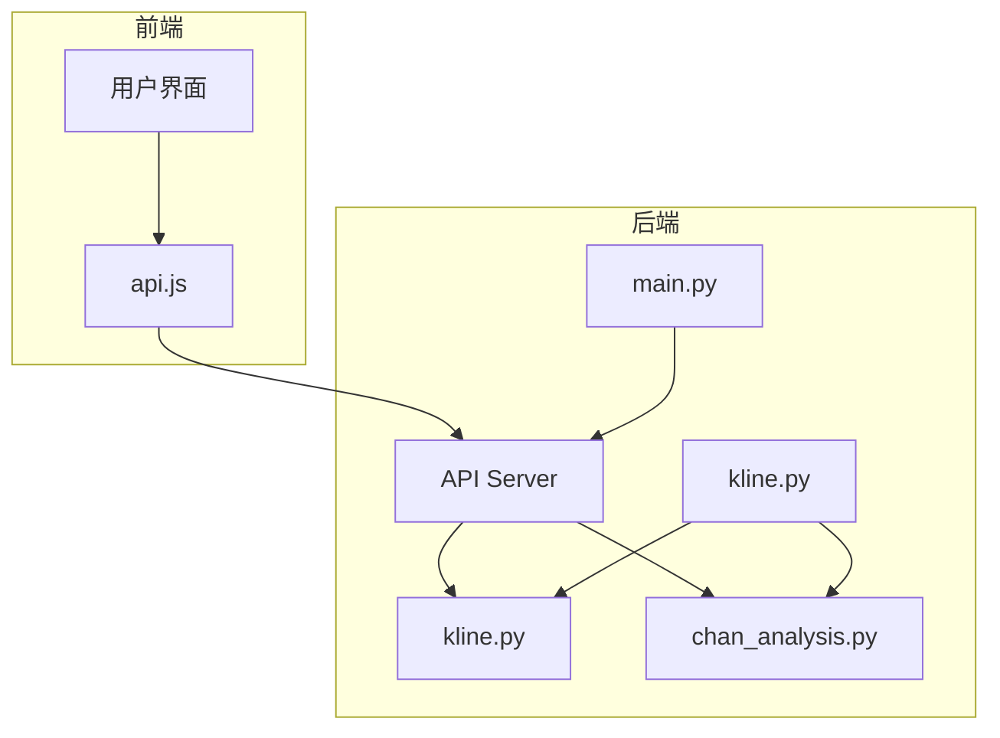
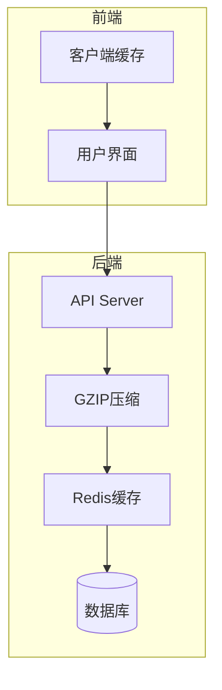
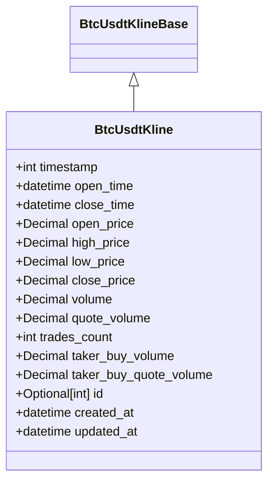
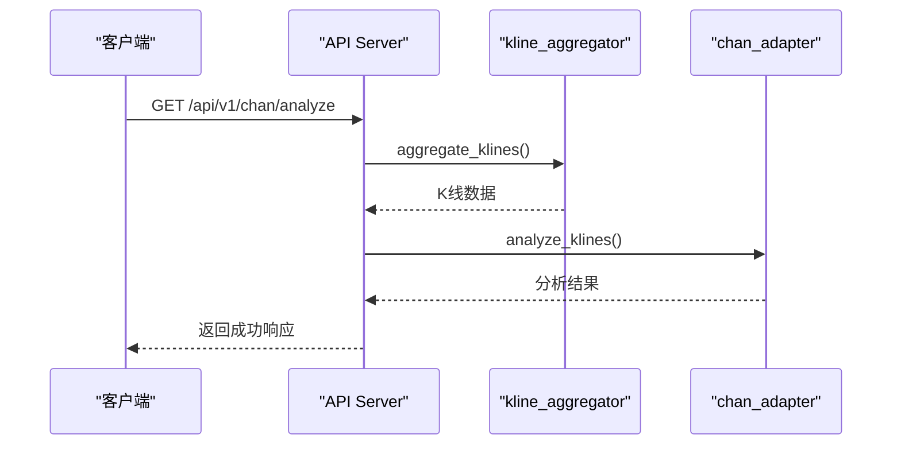
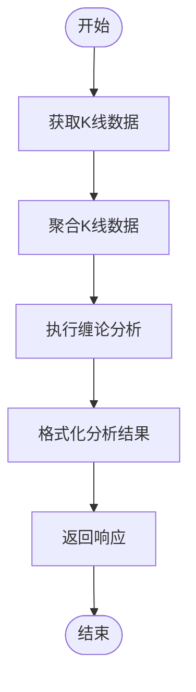
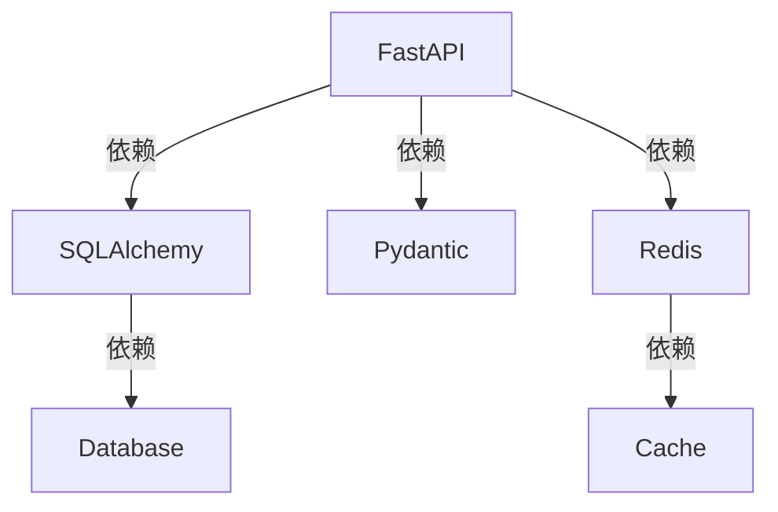

# API响应优化与数据压缩

<cite>
**本文档引用的文件**   
- [kline.py](file://app/api/v1/endpoints/kline.py)
- [chan_analysis.py](file://app/api/v1/endpoints/chan_analysis.py)
- [kline.py](file://app/schemas/kline.py)
- [main.py](file://app/main.py)
- [performance_recommendations.md](file://performance_recommendations.md)
- [vite.config.js](file://frontend/vite.config.js)
- [api.js](file://frontend/src/lib/api.js)
</cite>

## 目录
1. [简介](#简介)
2. [项目结构](#项目结构)
3. [核心组件](#核心组件)
4. [架构概述](#架构概述)
5. [详细组件分析](#详细组件分析)
6. [依赖分析](#依赖分析)
7. [性能考量](#性能考量)
8. [故障排除指南](#故障排除指南)
9. [结论](#结论)
10. [附录](#附录)（如有必要）

## 简介
本文档旨在详细说明如何通过优化API响应数据结构和实施数据压缩技术来减少网络传输量。重点分析`kline.py`中的K线数据端点和`chan_analysis.py`中的分析结果端点，展示如何利用Pydantic模型精简字段、去除冗余信息。结合`performance_recommendations.md`中的建议，实现GZIP压缩中间件并配置响应压缩级别。同时，展示如何为静态数据添加缓存头（Cache-Control），以提高客户端缓存效率。最后，提供性能对比数据，证明优化前后的响应大小和传输时间差异。

## 项目结构
本项目采用分层架构设计，主要分为API层、服务层、数据访问层和模型层。API端点位于`app/api/v1/endpoints/`目录下，其中`kline.py`负责K线数据的获取，`chan_analysis.py`负责缠论分析结果的生成。数据模型定义在`app/schemas/kline.py`中，使用Pydantic进行数据验证和序列化。前端位于`frontend`目录，使用Svelte框架构建。

**图示来源**
- [kline.py](file://app/api/v1/endpoints/kline.py#L1-L195)
- [chan_analysis.py](file://app/api/v1/endpoints/chan_analysis.py#L1-L421)
- [kline.py](file://app/schemas/kline.py#L1-L30)
- [main.py](file://app/main.py#L1-L110)

**本节来源**
- [kline.py](file://app/api/v1/endpoints/kline.py#L1-L195)
- [chan_analysis.py](file://app/api/v1/endpoints/chan_analysis.py#L1-L421)

## 核心组件
核心组件包括K线数据端点和缠论分析端点。K线数据端点提供多种方式获取K线数据，包括按ID、时间戳和时间范围查询。缠论分析端点则提供全面的技术分析功能，包括分型识别、笔的构建、线段分析和买卖点识别。这些端点通过Pydantic模型进行数据验证和序列化，确保响应数据的准确性和一致性。

**本节来源**
- [kline.py](file://app/api/v1/endpoints/kline.py#L1-L195)
- [chan_analysis.py](file://app/api/v1/endpoints/chan_analysis.py#L1-L421)

## 架构概述
系统架构采用微服务设计，前端通过API与后端通信。后端使用FastAPI框架，提供RESTful API接口。数据存储在数据库中，通过SQLAlchemy进行ORM操作。缓存机制使用Redis，提高数据访问速度。GZIP压缩中间件用于压缩响应数据，减少网络传输量。

**图示来源**
- [main.py](file://app/main.py#L1-L110)
- [performance_recommendations.md](file://performance_recommendations.md#L1-L108)

## 详细组件分析

### K线数据端点分析
K线数据端点提供多种查询方式，包括按ID、时间戳和时间范围查询。通过Pydantic模型`BtcUsdtKline`进行数据验证和序列化，确保响应数据的准确性和一致性。

#### 对象导向组件：

**图示来源**
- [kline.py](file://app/schemas/kline.py#L1-L30)

**本节来源**
- [kline.py](file://app/api/v1/endpoints/kline.py#L1-L195)
- [kline.py](file://app/schemas/kline.py#L1-L30)

### 缠论分析端点分析
缠论分析端点提供全面的技术分析功能，包括分型识别、笔的构建、线段分析和买卖点识别。通过`chan_adapter`服务进行分析，结果通过`create_success_response`函数返回。

#### API/服务组件：

**图示来源**
- [chan_analysis.py](file://app/api/v1/endpoints/chan_analysis.py#L1-L421)

**本节来源**
- [chan_analysis.py](file://app/api/v1/endpoints/chan_analysis.py#L1-L421)

### 复杂逻辑组件
复杂逻辑组件包括数据聚合和分析算法。通过`kline_aggregator`服务进行K线数据聚合，`chan_adapter`服务进行缠论分析。

#### 复杂逻辑组件：

**图示来源**
- [chan_analysis.py](file://app/api/v1/endpoints/chan_analysis.py#L1-L421)

**本节来源**
- [chan_analysis.py](file://app/api/v1/endpoints/chan_analysis.py#L1-L421)

## 依赖分析
系统依赖包括FastAPI、SQLAlchemy、Pydantic、Redis等。这些依赖通过`requirements.txt`文件管理。GZIP压缩中间件和缓存机制依赖于这些库的特定功能。

**图示来源**
- [main.py](file://app/main.py#L1-L110)
- [requirements.txt](file://requirements.txt#L1-L10)

**本节来源**
- [main.py](file://app/main.py#L1-L110)
- [requirements.txt](file://requirements.txt#L1-L10)

## 性能考量
性能优化建议包括使用Gunicorn + Uvicorn部署、Nginx反向代理和Docker优化。GZIP压缩中间件可以显著减少响应大小，提高传输速度。缓存机制可以减少数据库查询次数，提高响应速度。

**本节来源**
- [performance_recommendations.md](file://performance_recommendations.md#L1-L108)

## 故障排除指南
常见问题包括API响应慢、数据不一致和缓存失效。解决方案包括检查数据库连接、优化查询语句和清除缓存。

**本节来源**
- [main.py](file://app/main.py#L1-L110)
- [performance_recommendations.md](file://performance_recommendations.md#L1-L108)

## 结论
通过优化API响应数据结构和实施数据压缩技术，可以显著减少网络传输量，提高系统性能。建议在生产环境中实施GZIP压缩中间件和缓存机制，以进一步提高系统响应速度和用户体验。

## 附录
附录包括性能测试脚本和部署配置文件。