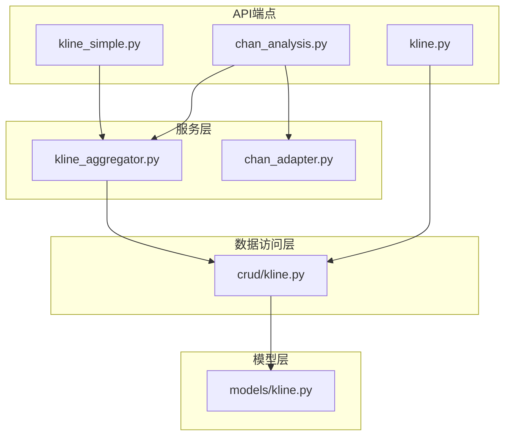
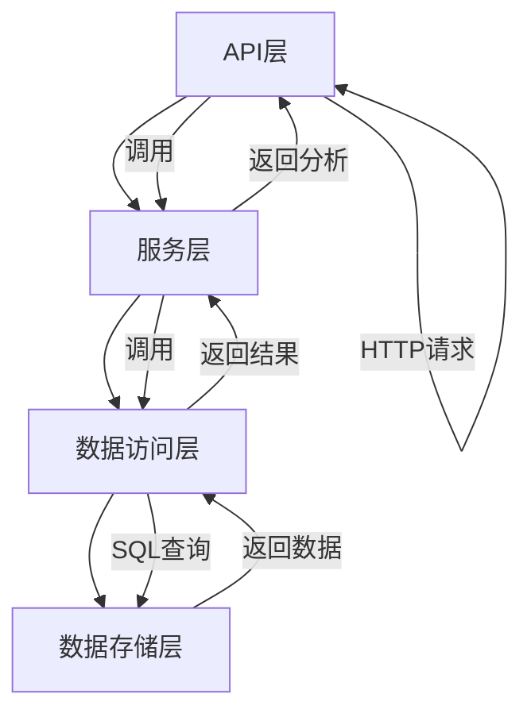
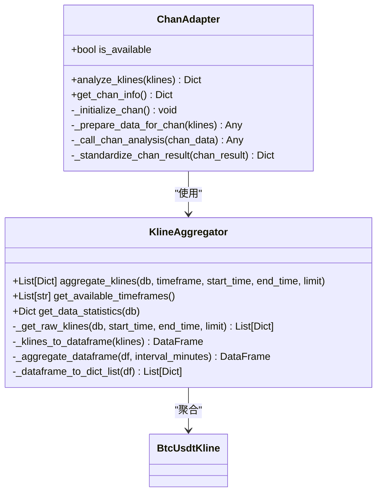
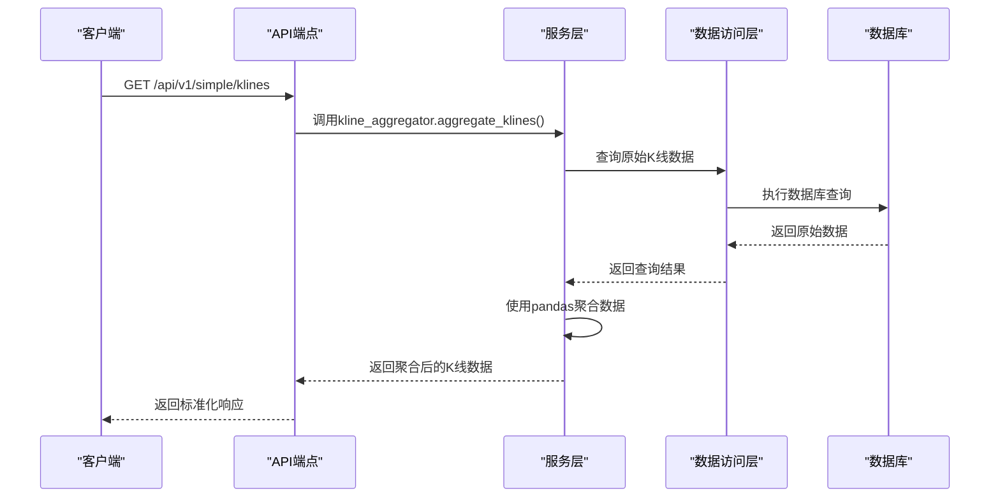
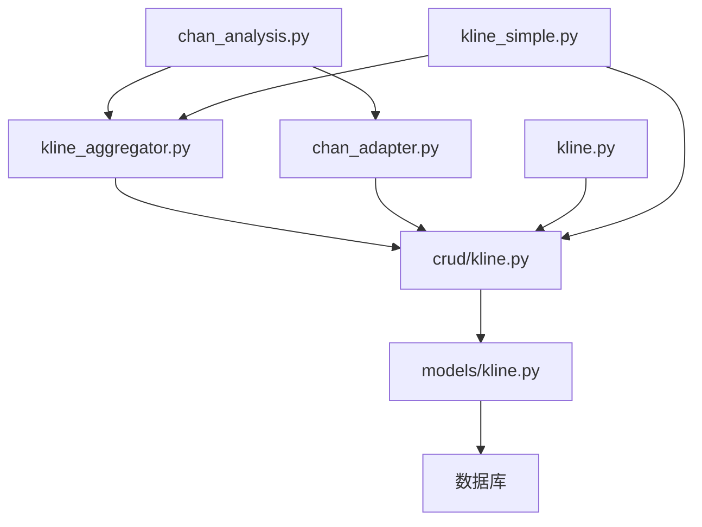

# 异步处理与后台任务

<cite>
**本文档引用文件**   
- [chan_analysis.py](file://app/api/v1/endpoints/chan_analysis.py)
- [kline.py](file://app/api/v1/endpoints/kline.py)
- [kline_simple.py](file://app/api/v1/endpoints/kline_simple.py)
- [kline_aggregator.py](file://app/services/kline_aggregator.py)
- [chan_adapter.py](file://app/services/chan_adapter.py)
- [main.py](file://app/main.py)
</cite>

## 目录
1. [简介](#简介)
2. [项目结构](#项目结构)
3. [核心组件](#核心组件)
4. [架构概述](#架构概述)
5. [详细组件分析](#详细组件分析)
6. [依赖分析](#依赖分析)
7. [性能考虑](#性能考虑)
8. [故障排除指南](#故障排除指南)
9. [结论](#结论)

## 简介
本文档详细说明如何利用FastAPI的BackgroundTasks机制优化耗时操作。针对`chan_analysis.py`中的缠论分析接口（如`/analyze`、`/chart-data`），展示如何将数据获取、模型计算等耗时任务移至后台执行，避免阻塞主线程。结合`kline.py`中的聚合查询，演示如何异步处理大规模K线数据请求。提供实际代码示例，说明BackgroundTasks的生命周期管理、错误日志记录和资源清理策略，确保异步任务的可靠性和可维护性。

## 项目结构
本项目采用分层架构设计，主要包含API端点、服务层、数据访问层和模型层。核心功能集中在`app/api/v1/endpoints`目录下，其中`chan_analysis.py`负责缠论分析，`kline.py`和`kline_simple.py`处理K线数据查询。服务层的`kline_aggregator.py`和`chan_adapter.py`封装了核心业务逻辑。

**图表来源**
- [chan_analysis.py](file://app/api/v1/endpoints/chan_analysis.py)
- [kline.py](file://app/api/v1/endpoints/kline.py)
- [kline_simple.py](file://app/api/v1/endpoints/kline_simple.py)
- [kline_aggregator.py](file://app/services/kline_aggregator.py)
- [chan_adapter.py](file://app/services/chan_adapter.py)
- [crud/kline.py](file://app/crud/kline.py)
- [models/kline.py](file://app/models/kline.py)

**章节来源**
- [chan_analysis.py](file://app/api/v1/endpoints/chan_analysis.py)
- [kline.py](file://app/api/v1/endpoints/kline.py)
- [kline_simple.py](file://app/api/v1/endpoints/kline_simple.py)

## 核心组件
系统的核心组件包括缠论分析服务、K线聚合器和数据访问组件。`chan_adapter.py`作为适配器模式的实现，将外部的Chan模块集成到系统中，提供统一的分析接口。`kline_aggregator.py`利用pandas的resample功能，将1分钟K线数据高效聚合为不同时间周期。这些组件通过清晰的依赖关系协同工作，为上层API提供支持。

**章节来源**
- [kline_aggregator.py](file://app/services/kline_aggregator.py#L1-L251)
- [chan_adapter.py](file://app/services/chan_adapter.py#L1-L517)

## 架构概述
系统采用典型的分层架构，从上到下分为API层、服务层、数据访问层和数据存储层。API层暴露RESTful接口，服务层封装业务逻辑，数据访问层处理数据库操作，数据存储层使用关系型数据库保存K线数据。这种分层设计实现了关注点分离，提高了代码的可维护性和可测试性。

**图表来源**
- [main.py](file://app/main.py#L1-L110)
- [chan_analysis.py](file://app/api/v1/endpoints/chan_analysis.py#L1-L421)
- [kline_aggregator.py](file://app/services/kline_aggregator.py#L1-L251)

## 详细组件分析

### 缠论分析组件分析
`chan_analysis.py`中的接口实现了完整的缠论技术分析功能，包括分型识别、笔的构建、线段分析和买卖点识别。这些接口通过`chan_adapter`调用外部的Chan模块进行复杂计算，同时提供了健康检查和信息查询功能。

#### 对象导向组件

**图表来源**
- [chan_adapter.py](file://app/services/chan_adapter.py#L1-L517)
- [kline_aggregator.py](file://app/services/kline_aggregator.py#L1-L251)
- [models/kline.py](file://app/models/kline.py#L1-L37)

**章节来源**
- [chan_analysis.py](file://app/api/v1/endpoints/chan_analysis.py#L1-L421)
- [chan_adapter.py](file://app/services/chan_adapter.py#L1-L517)

### K线数据组件分析
`kline.py`和`kline_simple.py`提供了丰富的K线数据查询接口，支持按ID、时间戳、时间范围等多种方式查询。`kline_simple.py`还提供了手动触发数据获取的功能，可以从币安API获取最新市场数据。

#### API/服务组件

**图表来源**
- [kline_simple.py](file://app/api/v1/endpoints/kline_simple.py#L1-L260)
- [kline_aggregator.py](file://app/services/kline_aggregator.py#L1-L251)
- [crud/kline.py](file://app/crud/kline.py#L1-L355)

**章节来源**
- [kline.py](file://app/api/v1/endpoints/kline.py#L1-L195)
- [kline_simple.py](file://app/api/v1/endpoints/kline_simple.py#L1-L260)
- [kline_aggregator.py](file://app/services/kline_aggregator.py#L1-L251)

## 依赖分析
系统各组件之间存在清晰的依赖关系。API端点依赖服务层组件，服务层依赖数据访问层，形成单向依赖链。这种设计避免了循环依赖，提高了系统的可维护性。外部依赖包括FastAPI框架、SQLAlchemy ORM、pandas数据分析库和数据库驱动。

**图表来源**
- [chan_analysis.py](file://app/api/v1/endpoints/chan_analysis.py)
- [kline.py](file://app/api/v1/endpoints/kline.py)
- [kline_simple.py](file://app/api/v1/endpoints/kline_simple.py)
- [kline_aggregator.py](file://app/services/kline_aggregator.py)
- [chan_adapter.py](file://app/services/chan_adapter.py)
- [crud/kline.py](file://app/crud/kline.py)
- [models/kline.py](file://app/models/kline.py)

**章节来源**
- [chan_analysis.py](file://app/api/v1/endpoints/chan_analysis.py)
- [kline.py](file://app/api/v1/endpoints/kline.py)
- [kline_simple.py](file://app/api/v1/endpoints/kline_simple.py)

## 性能考虑
系统在处理大规模K线数据时采用了多种优化策略。`kline_aggregator.py`使用pandas的resample功能进行高效的数据聚合，避免了在Python层面进行低效的循环计算。数据库查询使用了适当的索引，特别是对时间戳和时间字段的索引，提高了查询性能。对于耗时的缠论分析，系统提供了简化分析作为后备方案，确保在外部模块不可用时仍能提供基本服务。

## 故障排除指南
当系统出现问题时，首先检查日志文件。`app_logger`记录了关键操作的执行情况，包括API调用、数据查询和分析过程。如果缠论分析失败，检查Chan模块是否正确初始化，以及子模块是否已更新。对于K线数据查询问题，验证数据库连接和表结构是否正确。健康检查接口提供了系统状态的快速概览，是诊断问题的第一步。

**章节来源**
- [logger.py](file://app/core/logger.py#L1-L45)
- [chan_analysis.py](file://app/api/v1/endpoints/chan_analysis.py#L1-L421)
- [kline_simple.py](file://app/api/v1/endpoints/kline_simple.py#L1-L260)

## 结论
本文档详细介绍了缠论分析系统的架构和实现。通过分层设计和清晰的组件划分，系统实现了高内聚低耦合。服务层组件封装了复杂的业务逻辑，为上层API提供了简洁的接口。未来可以考虑引入缓存机制，进一步提高高频查询的性能，以及实现更完善的错误恢复机制，提高系统的可靠性。