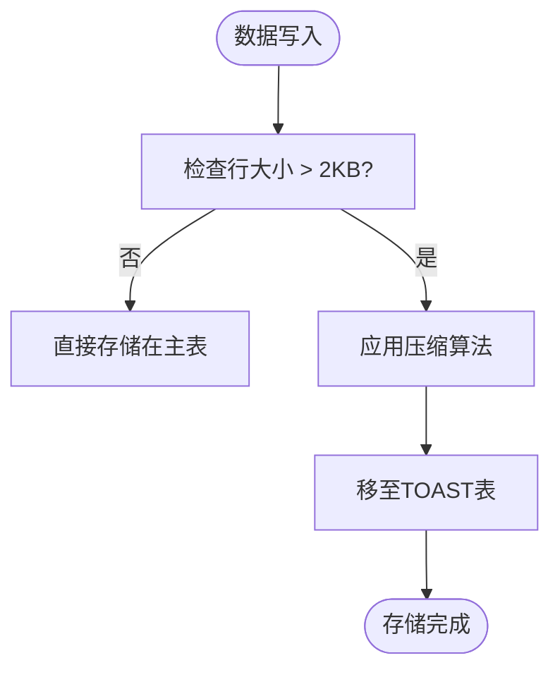

# 存储压缩策略

<cite>
**本文档引用的文件**  
- [kline.py](file://app/models/kline.py#L1-L37)
- [create_tables.py](file://create_tables.py#L1-L190)
- [database_optimization.sql](file://database_optimization.sql#L1-L38)
- [performance_recommendations.md](file://performance_recommendations.md#L1-L108)
</cite>

## 目录
1. [引言](#引言)
2. [K线数据模型分析](#k线数据模型分析)
3. [TOAST机制与字段类型优化](#toast机制与字段类型优化)
4. [压缩算法对比：zstd vs gzip](#压缩算法对比zstd-vs-gzip)
5. [压缩策略配置示例](#压缩策略配置示例)
6. [压缩参数对I/O性能的影响](#压缩参数对io性能的影响)
7. [压缩效果评估方法](#压缩效果评估方法)
8. [生产环境推荐配置](#生产环境推荐配置)
9. [总结](#总结)

## 引言
在高频交易系统中，K线数据的存储效率直接影响系统的整体性能。随着数据量的持续增长，如何在保证查询性能的同时降低存储成本成为关键挑战。本文档基于当前缠论分析系统的架构，重点探讨PostgreSQL的TOAST（The Oversized-Attribute Storage Technique）机制在K线数据存储中的应用，评估zstd与gzip压缩算法在价格、成交量等Numeric类型字段及DateTime字段上的表现差异，并提供生产环境下的压缩策略建议。

## K线数据模型分析
系统中的K线数据模型以`BtcUsdtKline`为代表，继承自抽象基类`Kline`，包含多个高精度数值字段和时间字段。这些字段具有以下特点：

- **Numeric类型字段**：如`open_price`、`high_price`等，精度为(20,8)，用于精确记录加密货币价格。
- **大数值字段**：如`volume`、`quote_volume`，精度为(30,8)，用于记录大额成交量。
- **时间字段**：`open_time`和`close_time`使用`DateTime`类型，支持时间范围查询。
- **索引设计**：`timestamp`字段已建立索引，支持高效的时间序列查询。

该模型设计适合金融级数据存储，但随着数据积累，表体积迅速膨胀，亟需有效的压缩策略。

**Section sources**
- [kline.py](file://app/models/kline.py#L1-L37)

## TOAST机制与字段类型优化
PostgreSQL的TOAST机制自动处理超过8KB的行数据，将大字段压缩并移至单独的TOAST表中。对于K线数据，以下字段可能触发TOAST：

- `volume` 和 `quote_volume`：由于其高精度（30位），单个字段可能接近或超过TOAST阈值。
- 多个`Numeric`字段组合：虽然单个字段未超限，但整行数据可能因字段数量多而触发TOAST。

建议对`Numeric`字段进行精度评估，若实际数据未充分利用20/30位精度，可适当降低精度以减少存储占用。例如，将`volume`从`Numeric(30,8)`调整为`Numeric(24,8)`，在保证精度的同时减少存储开销。



**Diagram sources**
- [kline.py](file://app/models/kline.py#L1-L37)

## 压缩算法对比zstd-vs-gzip
zstd与gzip是PostgreSQL支持的两种TOAST压缩算法，其特性对比如下：

| 特性 | zstd | gzip |
|------|------|------|
| 压缩比 | 高（级别6时约2.5:1） | 高（级别6时约2.3:1） |
| 压缩速度 | 快（比gzip快30%-50%） | 较慢 |
| 解压速度 | 极快（比gzip快2倍以上） | 一般 |
| CPU开销 | 低 | 中等 |
| 适用场景 | 高频读写、实时查询 | 归档存储、低频访问 |

对于K线数据这种需要频繁查询的场景，zstd在解压速度上的优势尤为明显，能显著降低查询延迟。

**Section sources**
- [performance_recommendations.md](file://performance_recommendations.md#L1-L108)

## 压缩策略配置示例
可通过`ALTER TABLE`命令为K线表设置压缩策略。以下为`btc_usdt`表的配置示例：

```sql
-- 为btc_usdt表启用zstd压缩（级别6）
ALTER TABLE btc_usdt ALTER COLUMN open_price SET STORAGE EXTERNAL;
ALTER TABLE btc_usdt ALTER COLUMN high_price SET STORAGE EXTERNAL;
ALTER TABLE btc_usdt ALTER COLUMN low_price SET STORAGE EXTERNAL;
ALTER TABLE btc_usdt ALTER COLUMN close_price SET STORAGE EXTERNAL;
ALTER TABLE btc_usdt ALTER COLUMN volume SET STORAGE EXTERNAL;
ALTER TABLE btc_usdt ALTER COLUMN quote_volume SET STORAGE EXTERNAL;
```

上述配置将指定字段标记为`EXTERNAL`存储，PostgreSQL将自动应用zstd压缩（默认压缩级别由`toast_tuple_target`参数控制）。

**Section sources**
- [database_optimization.sql](file://database_optimization.sql#L1-L38)

## 压缩参数对io性能的影响
压缩参数的选择直接影响I/O性能：

- **压缩级别**：级别越高，压缩比越高，但CPU开销增大。级别6是zstd的“黄金点”，在压缩比和速度间取得良好平衡。
- **I/O吞吐**：压缩后数据量减少，磁盘I/O和网络传输量显著降低，尤其在顺序扫描场景下性能提升明显。
- **随机查询**：由于解压速度快，zstd对随机查询的影响较小，甚至因减少I/O而提升性能。

建议在生产环境中监控`pg_stat_io`视图，评估压缩前后I/O操作的变化。

**Section sources**
- [performance_recommendations.md](file://performance_recommendations.md#L1-L108)

## 压缩效果评估方法
使用以下方法评估压缩效果：

1. **表大小监控**：
   ```sql
   -- 查询表总大小
   SELECT pg_size_pretty(pg_total_relation_size('btc_usdt'));
   ```

2. **TOAST表分析**：
   ```sql
   -- 查看TOAST表大小
   SELECT pg_size_pretty(pg_total_relation_size('btc_usdt_toast'));
   ```

3. **性能基准测试**：
   - 压缩前后执行相同查询，记录响应时间。
   - 使用`EXPLAIN ANALYZE`分析查询计划变化。

4. **定期维护**：
   ```sql
   -- 定期执行VACUUM ANALYZE
   VACUUM ANALYZE btc_usdt;
   ```

**Section sources**
- [database_optimization.sql](file://database_optimization.sql#L1-L38)

## 生产环境推荐配置
基于系统特点，推荐以下生产环境配置：

- **压缩算法**：zstd
- **压缩级别**：6
- **存储策略**：对所有`Numeric`字段使用`EXTERNAL`存储
- **维护计划**：每日执行`VACUUM ANALYZE`
- **监控指标**：定期检查`pg_total_relation_size()`和查询性能

此外，结合`performance_recommendations.md`中的建议，可进一步通过表分区（如按月分区）和缓存策略优化整体性能。

**Section sources**
- [performance_recommendations.md](file://performance_recommendations.md#L1-L108)

## 总结
通过合理应用PostgreSQL的TOAST机制和zstd压缩算法，可在保证查询性能的同时显著降低K线数据的存储成本。建议在生产环境中优先采用zstd级别6的压缩策略，并结合定期维护和性能监控，确保系统的长期稳定运行。