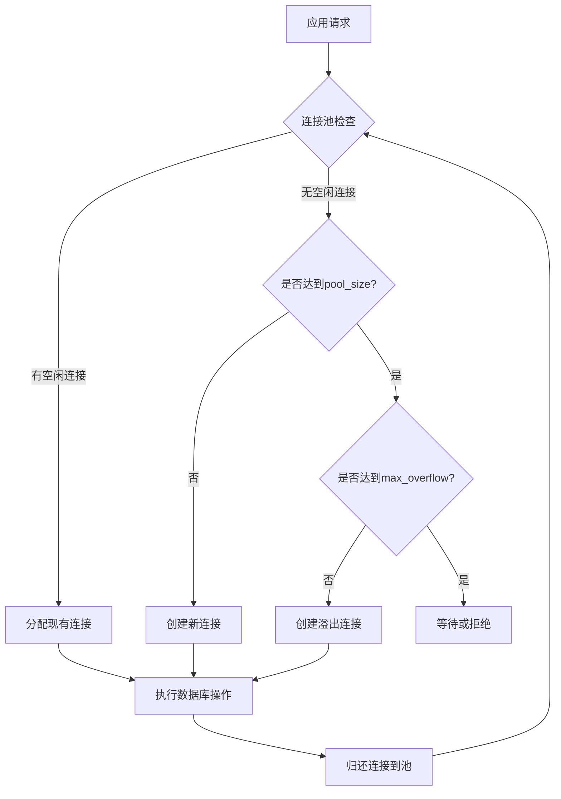

# 数据库优化

<cite>
**本文档引用的文件**
- [kline_aggregator.py](file://app/services/kline_aggregator.py)
- [database_optimization.sql](file://database_optimization.sql)
- [create_tables.py](file://create_tables.py)
- [session.py](file://app/db/session.py)
- [config.py](file://app/core/config.py)
- [kline.py](file://app/models/kline.py)
- [crud/kline.py](file://app/crud/kline.py)
- [kline_simple.py](file://app/api/v1/endpoints/kline_simple.py)
</cite>

## 目录
1. [引言](#引言)
2. [数据库连接池配置](#数据库连接池配置)
3. [索引优化策略](#索引优化策略)
4. [表分区实践](#表分区实践)
5. [数据库维护命令](#数据库维护命令)
6. [查询优化分析](#查询优化分析)
7. [数据库参数调优](#数据库参数调优)
8. [性能监控建议](#性能监控建议)
9. [结论](#结论)

## 引言
本文档旨在为交易系统中的K线数据存储提供全面的数据库优化方案。基于系统中`kline_aggregator.py`的数据访问模式和`database_optimization.sql`中的优化建议，重点阐述连接池配置、索引设计、表分区、查询优化和性能调优等关键实践。目标是提升系统在处理高频K线数据时的查询效率和稳定性。

## 数据库连接池配置

数据库连接池是管理数据库连接的核心组件，能够显著提升应用性能和资源利用率。在本系统中，通过SQLAlchemy配置了高效的连接池策略。



**图示来源**
- [session.py](file://app/db/session.py#L1-L44)

**连接池关键参数配置建议：**

- **连接池大小 (pool_size)**：设置为10，表示连接池中保持的常驻连接数。对于中等负载的交易系统，建议设置为CPU核心数的1-2倍。
- **最大溢出连接数 (max_overflow)**：设置为20，表示在池满后可额外创建的连接数。这能应对突发的请求高峰。
- **连接回收时间 (pool_recycle)**：设置为3600秒（1小时），定期回收连接以防止数据库连接因长时间空闲而被中断。
- **连接超时 (pool_timeout)**：设置为30秒，获取连接的最长等待时间，避免请求无限期阻塞。

**Section sources**
- [session.py](file://app/db/session.py#L1-L44)
- [config.py](file://app/core/config.py#L1-L66)

## 索引优化策略

针对K线数据表的查询模式，合理的索引设计是提升查询性能的关键。系统中的`database_optimization.sql`文件提供了具体的索引创建语句。

### K线数据表索引建议

为`btc_usdt`表创建以下索引以优化常见查询：

```sql
-- 按开盘时间降序索引，优化获取最新K线数据
CREATE INDEX IF NOT EXISTS idx_btc_usdt_open_time ON btc_usdt(open_time DESC);

-- 按时间戳索引，优化按时间戳精确查询
CREATE INDEX IF NOT EXISTS idx_btc_usdt_timestamp ON btc_usdt(timestamp);

-- 按时间范围复合索引，优化时间范围查询
CREATE INDEX IF NOT EXISTS idx_btc_usdt_time_range ON btc_usdt(open_time, close_time);
```

**图示来源**
- [database_optimization.sql](file://database_optimization.sql#L5-L10)

### 索引选择原则

- **`open_time DESC`**：对于获取最新K线数据的查询（如`ORDER BY open_time DESC LIMIT 100`），降序索引能直接利用索引顺序，避免排序操作。
- **`timestamp`**：当需要根据毫秒级时间戳精确查找某根K线时，该索引能提供O(1)的查找性能。
- **`(open_time, close_time)`**：对于时间范围查询（如`WHERE open_time >= '2024-01-01' AND close_time <= '2024-01-02'`），复合索引能高效过滤数据。

**Section sources**
- [database_optimization.sql](file://database_optimization.sql#L5-L10)
- [kline.py](file://app/models/kline.py#L1-L37)

## 表分区实践

随着K线数据量的增长，单表查询性能会显著下降。表分区是将大表按特定规则（如时间）拆分为多个物理子表的技术，能大幅提升查询效率。

### 按时间分区的SQL示例

以下SQL示例展示了如何为K线表创建按月分区的结构：

```sql
-- 创建主表
CREATE TABLE kline_data (
    id SERIAL,
    symbol VARCHAR(10) NOT NULL,
    open_time TIMESTAMP NOT NULL,
    close_time TIMESTAMP NOT NULL,
    open_price NUMERIC(20,8),
    high_price NUMERIC(20,8),
    low_price NUMERIC(20,8),
    close_price NUMERIC(20,8),
    volume NUMERIC(30,8),
    PRIMARY KEY (id, open_time)
) PARTITION BY RANGE (open_time);

-- 创建2024年1月的分区
CREATE TABLE kline_data_202401 PARTITION OF kline_data
    FOR VALUES FROM ('2024-01-01') TO ('2024-02-01');

-- 创建2024年2月的分区
CREATE TABLE kline_data_202402 PARTITION OF kline_data
    FOR VALUES FROM ('2024-02-01') TO ('2024-03-01');
```

**图示来源**
- [database_optimization.sql](file://database_optimization.sql#L1-L38)

### 分区优势

- **查询性能**：查询特定时间段的数据时，数据库只需扫描对应的分区，避免全表扫描。
- **维护效率**：可以独立对某个分区进行VACUUM、ANALYZE或删除操作，例如轻松删除一年前的旧数据。
- **并行处理**：PostgreSQL可以并行扫描多个分区，进一步提升大范围查询的性能。

**Section sources**
- [database_optimization.sql](file://database_optimization.sql#L1-L38)
- [create_tables.py](file://create_tables.py#L1-L190)

## 数据库维护命令

定期执行数据库维护命令是保持数据库高性能的关键。

### ANALYZE 命令

`ANALYZE`命令收集表的统计信息，帮助查询规划器生成最优的执行计划。

```sql
-- 收集指定表的统计信息
ANALYZE btc_usdt;

-- 收集所有表的统计信息
ANALYZE;
```

**使用时机**：
- 在大量数据插入、更新或删除后。
- 当发现查询执行计划突然变差时。
- 作为定期维护任务（如每天凌晨执行）。

### VACUUM 命令

`VACUUM`命令回收被删除或过期数据占用的空间，并更新表的可见性映射。

```sql
-- 基础VACUUM，回收空间
VACUUM btc_usdt;

-- VACUUM ANALYZE，同时回收空间和更新统计信息
VACUUM ANALYZE btc_usdt;
```

**使用时机**：
- 对于频繁更新的K线表，建议开启`autovacuum`并调整相关参数。
- 手动执行`VACUUM ANALYZE`作为深度维护的一部分。

**Section sources**
- [database_optimization.sql](file://database_optimization.sql#L13-L14)
- [create_tables.py](file://create_tables.py#L1-L190)

## 查询优化分析

结合`kline_aggregator.py`中的数据访问模式，可以制定针对性的查询优化策略。

### 避免全表扫描

在`kline_aggregator.py`的`aggregate_klines`方法中，通过`open_time`范围过滤数据：

```python
raw_klines = db.query(BtcUsdtKline).filter(
    and_(
        BtcUsdtKline.open_time >= start_time,
        BtcUsdtKline.open_time < end_time
    )
).order_by(BtcUsdtKline.open_time).all()
```

**优化建议**：
- 确保`open_time`字段有索引（如`idx_btc_usdt_open_time`）。
- 使用`BETWEEN`或范围查询时，复合索引`(open_time, close_time)`效果更佳。

### 合理使用WHERE和ORDER BY

- **WHERE条件**：将选择性最高的条件放在前面。对于时间序列数据，时间范围通常是选择性最高的。
- **ORDER BY**：如果排序字段与索引顺序一致（如`ORDER BY open_time ASC`配合`open_time`索引），数据库可以直接利用索引顺序，避免额外排序。

### 聚合查询优化

`kline_aggregator.py`使用Pandas进行数据聚合。对于大数据量，考虑在数据库层完成聚合：

```sql
-- 使用timescaledb的time_bucket进行高效聚合
SELECT 
    time_bucket('5 minutes', open_time) AS five_min,
    FIRST(open_price, open_time),
    MAX(high_price),
    MIN(low_price),
    LAST(close_price, open_time),
    SUM(volume)
FROM btc_usdt 
WHERE open_time > NOW() - INTERVAL '24 hours'
GROUP BY five_min 
ORDER BY five_min;
```

**Section sources**
- [kline_aggregator.py](file://app/services/kline_aggregator.py#L1-L251)
- [kline_simple.py](file://app/api/v1/endpoints/kline_simple.py#L1-L260)
- [crud/kline.py](file://app/crud/kline.py#L1-L355)

## 数据库参数调优

根据系统负载调整PostgreSQL配置参数，能显著提升整体性能。

### 关键配置参数建议

| 参数 | 建议值 | 说明 |
| :--- | :--- | :--- |
| `max_connections` | 100 | 最大并发连接数 |
| `shared_buffers` | 256MB | 数据库专用内存缓存 |
| `effective_cache_size` | 1GB | 操作系统和数据库缓存的总估计 |
| `work_mem` | 4MB | 排序和哈希操作的内存 |
| `maintenance_work_mem` | 64MB | VACUUM和CREATE INDEX等维护操作的内存 |

**配置来源**：
这些参数建议在`database_optimization.sql`文件的注释部分有明确说明。

**Section sources**
- [database_optimization.sql](file://database_optimization.sql#L17-L27)
- [config.py](file://app/core/config.py#L1-L66)

## 性能监控建议

建立完善的性能监控体系，及时发现和解决瓶颈。

### 监控指标

- **连接池状态**：监控活跃连接数、空闲连接数，判断是否需要调整`pool_size`和`max_overflow`。
- **慢查询日志**：启用`log_min_duration_statement`，记录执行时间超过阈值的SQL。
- **表大小和索引使用率**：监控`btc_usdt`表的增长趋势和索引命中率。

### 监控工具

- **pg_stat_statements**：扩展插件，用于分析SQL执行性能。
- **Prometheus + Grafana**：搭建可视化监控面板，实时观察数据库各项指标。

**Section sources**
- [session.py](file://app/db/session.py#L1-L44)
- [kline_aggregator.py](file://app/services/kline_aggregator.py#L1-L251)

## 结论
通过对数据库连接池、索引、分区、查询和配置的全面优化，可以显著提升交易系统处理K线数据的性能和稳定性。关键在于根据实际的数据访问模式（如`kline_aggregator.py`中的聚合查询）来定制优化策略，并通过定期维护和监控确保数据库长期高效运行。实施本文档中的建议，将为系统的可扩展性和可靠性奠定坚实基础。