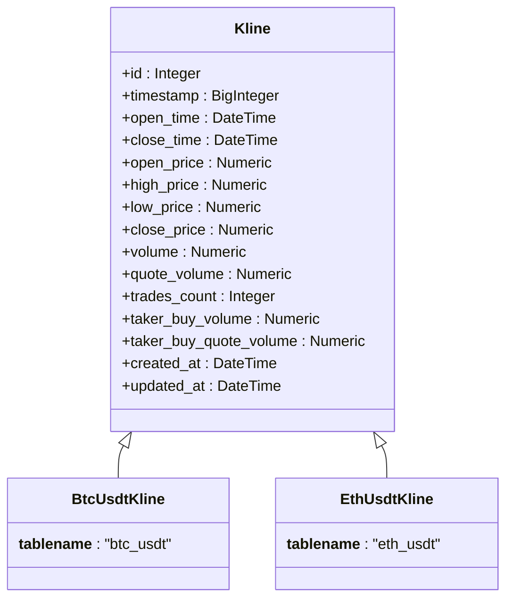
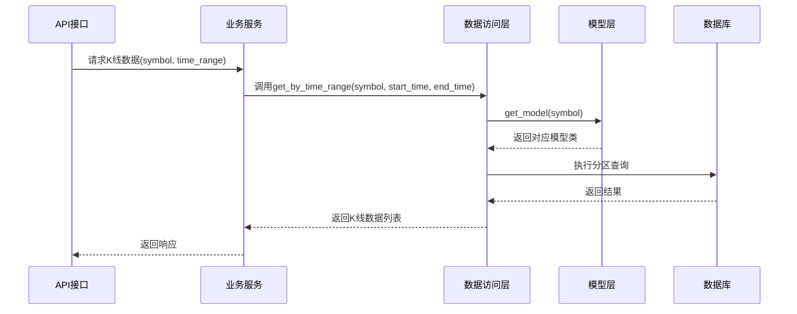

# 表分区方案

<cite>
**本文档引用的文件**
- [database_optimization.sql](file://database_optimization.sql)
- [kline.py](file://app/models/kline.py)
- [crud/kline.py](file://app/crud/kline.py)
- [endpoints/kline.py](file://app/api/v1/endpoints/kline.py)
- [kline_aggregator.py](file://app/services/kline_aggregator.py)
</cite>

## 目录
1. [引言](#引言)
2. [项目结构分析](#项目结构分析)
3. [核心数据模型](#核心数据模型)
4. [表分区策略设计](#表分区策略设计)
5. [代码层动态访问支持](#代码层动态访问支持)
6. [分区维护脚本示例](#分区维护脚本示例)
7. [性能优化建议](#性能优化建议)
8. [结论](#结论)

## 引言
本文档旨在为交易系统中的K线数据表设计一套可扩展的表分区方案。随着BTC/USDT和ETH/USDT等交易对的K线数据持续增长，查询性能面临挑战。虽然当前`database_optimization.sql`文件中未直接实现分区，但已通过创建索引等方式进行了初步优化。本文将基于现有结构提出基于时间的范围分区策略，以提升大规模时间范围查询的效率。

**Section sources**
- [database_optimization.sql](file://database_optimization.sql#L1-L37)

## 项目结构分析
项目采用典型的分层架构，主要包括API接口层、业务逻辑层、数据访问层和模型定义层。K线相关功能集中在`app`目录下，具体结构如下：
- `app/api/v1/endpoints/kline.py`：提供K线数据的RESTful API接口
- `app/services/kline_aggregator.py`：实现K线数据聚合功能
- `app/crud/kline.py`：封装K线数据的增删改查操作
- `app/models/kline.py`：定义K线数据的ORM模型

该结构清晰地分离了关注点，便于维护和扩展。

**Section sources**
- [kline.py](file://app/models/kline.py#L1-L37)
- [kline_aggregator.py](file://app/services/kline_aggregator.py#L1-L251)
- [endpoints/kline.py](file://app/api/v1/endpoints/kline.py#L1-L195)

## 核心数据模型
K线数据模型采用继承方式实现多交易对支持。基类`Kline`定义了通用字段，子类`BtcUsdtKline`和`EthUsdtKline`分别对应具体交易对。关键字段包括：
- `open_time`：K线开始时间，作为分区键
- `close_time`：K线结束时间
- `timestamp`：时间戳（毫秒），已建立索引
- 各类价格和成交量信息

通过`SYMBOL_TO_MODEL`映射表实现交易对与模型类的动态关联，为分区表的动态访问提供了基础。



**Diagram sources**
- [kline.py](file://app/models/kline.py#L1-L37)

**Section sources**
- [kline.py](file://app/models/kline.py#L1-L37)

## 表分区策略设计
针对K线数据量大的特点，建议采用基于时间的范围分区策略。PostgreSQL的`PARTITION BY RANGE`语法可有效支持此需求。

### 分区方案选择
建议按月进行分区，平衡了分区数量和单个分区大小。对于数据量特别大的交易对，可考虑按天分区。

### 分区语法示例
```sql
-- 创建主表并指定分区键
CREATE TABLE kline_base (
    id SERIAL,
    timestamp BIGINT NOT NULL,
    open_time TIMESTAMP NOT NULL,
    close_time TIMESTAMP NOT NULL,
    open_price NUMERIC(20,8) NOT NULL,
    high_price NUMERIC(20,8) NOT NULL,
    low_price NUMERIC(20,8) NOT NULL,
    close_price NUMERIC(20,8) NOT NULL,
    volume NUMERIC(30,8) NOT NULL,
    quote_volume NUMERIC(30,8) NOT NULL,
    trades_count INTEGER NOT NULL,
    taker_buy_volume NUMERIC(30,8) NOT NULL,
    taker_buy_quote_volume NUMERIC(30,8) NOT NULL,
    created_at TIMESTAMP NOT NULL DEFAULT NOW(),
    updated_at TIMESTAMP NOT NULL DEFAULT NOW()
) PARTITION BY RANGE (open_time);

-- 创建具体分区
CREATE TABLE btc_usdt_202401 PARTITION OF kline_base
    FOR VALUES FROM ('2024-01-01') TO ('2024-02-01');
CREATE TABLE btc_usdt_202402 PARTITION OF kline_base
    FOR VALUES FROM ('2024-02-01') TO ('2024-03-01');
```

### 查询优化效果
分区后，时间范围查询将只扫描相关分区，显著减少I/O操作。例如查询2024年1月的数据将仅扫描`btc_usdt_202401`分区。

**Section sources**
- [database_optimization.sql](file://database_optimization.sql#L1-L37)
- [kline.py](file://app/models/kline.py#L1-L37)

## 代码层动态访问支持
现有代码已具备支持分区表动态访问的基础，主要通过`SYMBOL_TO_MODEL`机制实现。

### 动态模型获取
`CRUDKline.get_model()`方法根据交易对符号动态返回对应的模型类，这一机制可无缝适配分区表。



**Diagram sources**
- [crud/kline.py](file://app/crud/kline.py#L1-L355)
- [endpoints/kline.py](file://app/api/v1/endpoints/kline.py#L1-L195)

**Section sources**
- [crud/kline.py](file://app/crud/kline.py#L1-L355)
- [endpoints/kline.py](file://app/api/v1/endpoints/kline.py#L1-L195)

## 分区维护脚本示例
为确保分区表的正常运行，需定期执行维护任务。

### 创建新分区脚本
```sql
-- 创建下个月的分区
DO $$
DECLARE
    next_month DATE := DATE_TRUNC('month', CURRENT_DATE + INTERVAL '1 month');
    partition_name TEXT := 'btc_usdt_' || TO_CHAR(next_month, 'YYYYMM');
    start_date TIMESTAMP := next_month;
    end_date TIMESTAMP := next_month + INTERVAL '1 month';
BEGIN
    EXECUTE format('CREATE TABLE IF NOT EXISTS %I PARTITION OF kline_base FOR VALUES FROM (%L) TO (%L)',
                   partition_name, start_date, end_date);
    RAISE NOTICE 'Created partition: %', partition_name;
END $$;
```

### 删除旧分区脚本
```sql
-- 删除6个月前的分区
DO $$
DECLARE
    old_month DATE := DATE_TRUNC('month', CURRENT_DATE - INTERVAL '6 months');
    partition_name TEXT := 'btc_usdt_' || TO_CHAR(old_month, 'YYYYMM');
BEGIN
    EXECUTE format('DROP TABLE IF EXISTS %I', partition_name);
    RAISE NOTICE 'Dropped partition: %', partition_name;
END $$;
```

### 全局索引管理
```sql
-- 为分区表创建全局索引
CREATE INDEX IF NOT EXISTS idx_kline_base_open_time ON kline_base(open_time DESC);
CREATE INDEX IF NOT EXISTS idx_kline_base_timestamp ON kline_base(timestamp);

-- 重建索引（定期执行）
REINDEX TABLE kline_base;
```

**Section sources**
- [database_optimization.sql](file://database_optimization.sql#L1-L37)

## 性能优化建议
结合分区策略，提出以下综合性能优化建议：

### 数据库配置优化
```sql
-- postgresql.conf建议配置
max_connections = 100
shared_buffers = 256MB
effective_cache_size = 1GB
work_mem = 4MB
maintenance_work_mem = 64MB
random_page_cost = 1.1
effective_io_concurrency = 200
wal_buffers = 16MB
checkpoint_completion_target = 0.9
```

### 定期维护任务
```sql
-- 每周执行
VACUUM ANALYZE kline_base;

-- 每月执行
REINDEX TABLE kline_base;
```

### 查询优化
利用分区裁剪特性，确保查询条件包含`open_time`字段，以便PostgreSQL优化器能够选择正确的分区。

**Section sources**
- [database_optimization.sql](file://database_optimization.sql#L1-L37)

## 结论
本文档提出了针对K线数据的表分区方案，通过按时间范围分区可显著提升大规模时间范围查询的性能。现有代码结构中的`SYMBOL_TO_MODEL`映射机制为分区表的动态访问提供了良好支持。建议实施按月分区策略，并配合定期的分区维护任务，以确保系统的长期稳定运行。该方案既满足了当前性能需求，又具备良好的可扩展性，为未来数据量的增长做好了准备。