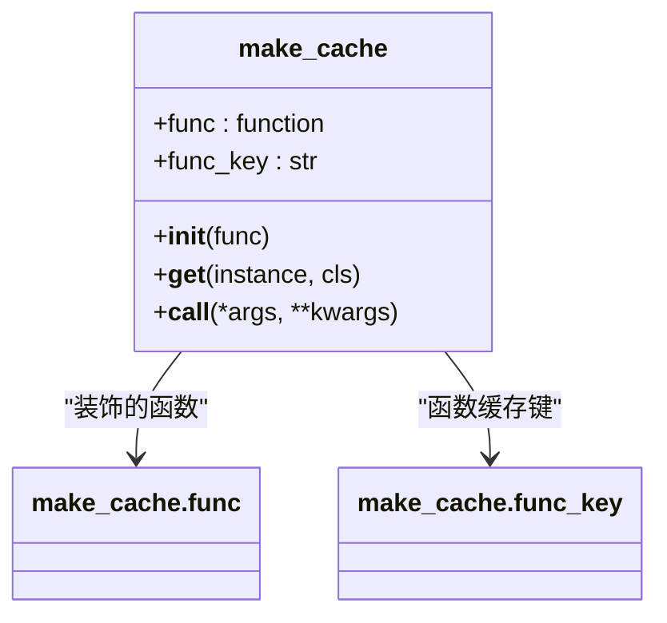
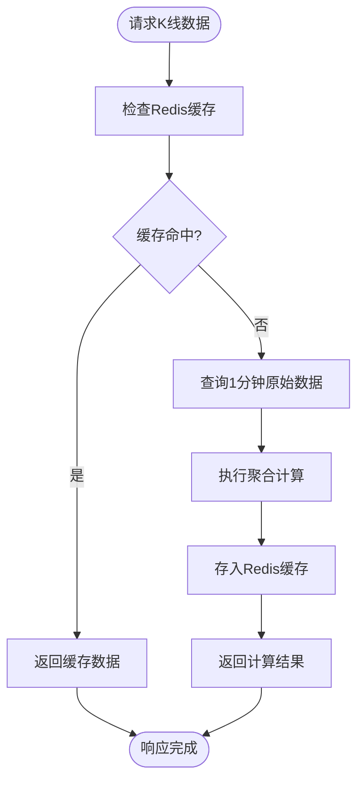
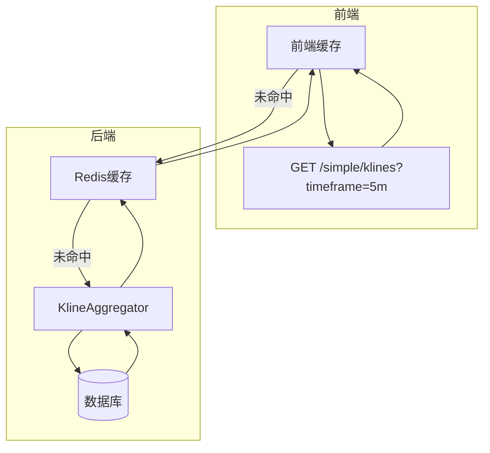

# 缓存实现策略

<cite>
**本文档中引用的文件**  
- [kline_aggregator.py](file://app/services/kline_aggregator.py)
- [cache.py](file://chan.py/Common/cache.py)
- [kline.py](file://app/api/v1/endpoints/kline.py)
- [api.js](file://frontend/src/lib/api.js)
- [performance_optimization.md](file://frontend/performance_optimization.md)
</cite>

## 目录
1. [引言](#引言)
2. [K线聚合器中的缓存集成](#k线聚合器中的缓存集成)
3. [make_cache装饰器机制分析](#make_cache装饰器机制分析)
4. [内存缓存与Redis缓存适用场景对比](#内存缓存与redis缓存适用场景对比)
5. [缓存键设计与TTL策略](#缓存键设计与ttl策略)
6. [缓存更新策略](#缓存更新策略)
7. [前端缓存协同机制](#前端缓存协同机制)
8. [总结](#总结)

## 引言
在高频交易系统中，K线数据的实时性与计算效率至关重要。本项目通过在`kline_aggregator.py`中实现多层级缓存机制，有效避免了重复计算和数据库查询，显著提升了系统响应速度。本文将深入剖析其缓存实现方案，涵盖从后端服务到前端展示的完整缓存链路。

## K线聚合器中的缓存集成

在`KlineAggregator`类中，虽然当前版本未直接集成Redis缓存，但其结构为缓存扩展提供了良好基础。关键方法`aggregate_klines`负责将1分钟原始K线数据聚合为多种时间周期（如5m、1h等），该过程涉及大量数据读取与计算，是缓存优化的核心目标。

未来可在`aggregate_klines`方法中引入Redis客户端，通过构造唯一缓存键（如`kline:btc_usdt:5m:latest`）查询是否存在已计算结果。若命中则直接返回，否则执行聚合逻辑并将结果写入Redis，设置合理过期时间。

**Section sources**
- [kline_aggregator.py](file://app/services/kline_aggregator.py#L50-L250)

## make_cache装饰器机制分析

`chan.py/Common/cache.py`中的`make_cache`装饰器实现了基于实例的内存缓存机制，其核心原理如下：

1. **初始化阶段**：接收被装饰函数，验证其必须为实例方法（仅含`self`参数），并生成函数唯一标识`func_key`。
2. **绑定阶段**：通过`__get__`确保装饰器绑定到类实例，并为实例创建私有缓存字典`_memoize_cache`。
3. **调用阶段**：每次方法调用前检查`func_key`是否已在缓存中，若有则直接返回缓存结果；否则执行原函数并将结果存入缓存。

此机制适用于单进程内频繁调用且输入不变的方法，能有效减少重复计算开销。

**Diagram sources**
- [cache.py](file://chan.py/Common/cache.py#L4-L34)

**Section sources**
- [cache.py](file://chan.py/Common/cache.py#L4-L34)

## 内存缓存与Redis缓存适用场景对比

| 特性 | 内存缓存（make_cache） | 分布式Redis缓存 |
|------|------------------------|------------------|
| **作用范围** | 单个类实例内 | 跨进程、跨服务器共享 |
| **生命周期** | 与对象实例相同 | 可配置TTL自动过期 |
| **数据一致性** | 仅限当前实例 | 所有节点一致 |
| **性能** | 极快（内存访问） | 快（网络延迟可忽略） |
| **适用场景** | 高频调用、无副作用的纯计算方法 | 共享数据、跨请求复用、集群环境 |
| **资源占用** | 增加进程内存 | 独立缓存服务 |

对于K线聚合这类计算密集型操作，在单机部署时`make_cache`可提升性能；而在微服务或多节点部署下，Redis缓存更能发挥其优势，避免各节点重复计算。

**Section sources**
- [cache.py](file://chan.py/Common/cache.py#L4-L34)
- [kline_aggregator.py](file://app/services/kline_aggregator.py#L50-L250)

## 缓存键设计与TTL策略

合理的缓存键设计是缓存系统高效运行的基础。针对不同时间周期的K线数据，建议采用如下命名规范：

- **缓存键格式**：`kline:{symbol}:{timeframe}:{range_type}`
- **示例**：
  - `kline:btc_usdt:5m:latest` —— 最新5分钟K线
  - `kline:btc_usdt:1h:history` —— 历史1小时K线
  - `kline:btc_usdt:1d:summary` —— 日线汇总数据

TTL（Time To Live）设置应根据数据更新频率而定：
- **5m/15m K线**：TTL = 5分钟，确保在下一个周期开始前失效
- **1h/4h K线**：TTL = 30分钟，平衡新鲜度与查询频率
- **1d K线**：TTL = 24小时，每日更新一次即可
- **静态数据（如支持周期列表）**：TTL = 30分钟或更长

**Diagram sources**
- [kline_aggregator.py](file://app/services/kline_aggregator.py#L50-L250)

## 缓存更新策略

缓存更新主要采用两种策略：

### 过期失效（Expiration-based Invalidation）
这是最常用的策略，即设置合理的TTL，让缓存在指定时间后自动删除。优点是实现简单、无额外开销；缺点是在缓存有效期内可能返回陈旧数据。

适用于K线聚合场景：由于K线数据按固定周期生成（如每5分钟一根），可在周期结束时让缓存过期，下一请求触发重新计算。

### 写时更新（Write-through Invalidation）
当底层数据发生变化时（如新1分钟K线写入数据库），主动清除或更新相关聚合缓存。可通过数据库触发器或消息队列实现。

例如，每当有新的`BtcUsdtKline`记录插入时，发布事件通知`KlineAggregator`清除`kline:btc_usdt:*`相关缓存。此策略保证数据强一致性，但增加了系统复杂性。

推荐结合使用：以过期失效为主，辅以关键节点的写时清除，实现性能与一致性的平衡。

**Section sources**
- [kline_aggregator.py](file://app/services/kline_aggregator.py#L50-L250)
- [kline.py](file://app/api/v1/endpoints/kline.py#L150-L194)

## 前端缓存协同机制

前端也实现了分层缓存策略，与后端形成协同效应：

- **缓存层级**：
  - 静态数据（如时间周期列表）：30分钟缓存
  - 历史K线数据：5分钟缓存
  - 实时K线数据：30秒缓存

- **缓存键生成**：基于API端点和参数生成唯一键，如`/simple/klines?timeframe=1h&limit=200`

- **缓存清除**：支持按模式清除（如`clearCache('klines')`），便于手动刷新数据

这种前后端协同的缓存体系，大幅减少了对后端服务的重复请求，提升了用户体验。

**Diagram sources**
- [api.js](file://frontend/src/lib/api.js#L219-L263)
- [kline_aggregator.py](file://app/services/kline_aggregator.py#L50-L250)

**Section sources**
- [api.js](file://frontend/src/lib/api.js#L219-L263)
- [performance_optimization.md](file://frontend/performance_optimization.md#L0-L67)

## 总结
本系统通过`make_cache`装饰器实现了高效的实例级内存缓存，为K线聚合等计算密集型操作提供了优化基础。为进一步提升性能与可扩展性，建议在`KlineAggregator`中集成Redis缓存，采用基于时间周期的缓存键命名规范，并设置合理的TTL策略。结合前端的分层缓存机制，可构建一个高效、低延迟的K线数据服务体系。缓存更新宜以过期失效为主，辅以关键数据的写时清除，确保系统在性能与一致性之间取得最佳平衡。