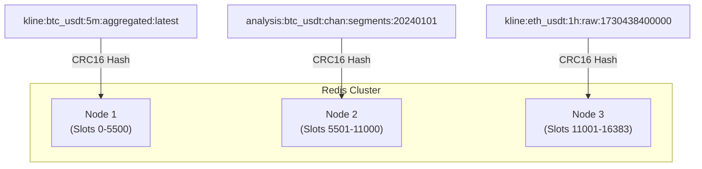
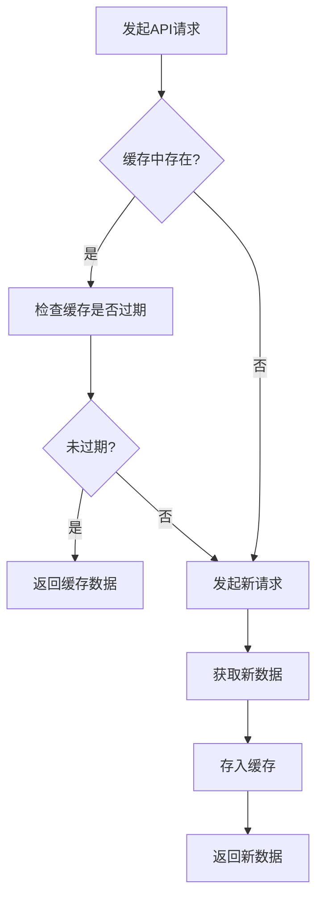

# 缓存键设计规范

<cite>
**本文档引用的文件**
- [kline_aggregator.py](file://app/services/kline_aggregator.py)
- [cache.py](file://chan.py/Common/cache.py)
- [api.js](file://frontend/src/lib/api.js)
- [performance_optimization.md](file://frontend/performance_optimization.md)
</cite>

## 目录
1. [引言](#引言)
2. [核心原则](#核心原则)
3. [分层键结构设计](#分层键结构设计)
4. [具体示例](#具体示例)
5. [通配符查询支持](#通配符查询支持)
6. [哈希槽与数据分片](#哈希槽与数据分片)
7. [前端缓存策略](#前端缓存策略)
8. [后端实现考量](#后端实现考量)
9. [最佳实践](#最佳实践)
10. [结论](#结论)

## 引言
在交易系统中，缓存是提升性能和响应速度的关键组件。随着系统复杂度的增加，特别是K线数据聚合和缠论分析等计算密集型任务的引入，建立一套统一、可维护的缓存键命名规范变得至关重要。本规范旨在基于`kline_aggregator.py`中的数据聚合逻辑，设计一套分层、可预测的缓存键结构，以确保系统的可维护性、避免键冲突，并支持高效的批量管理操作。

## 核心原则
在设计缓存键时，必须遵循以下核心原则：

- **可读性**: 键名应清晰表达其内容，便于开发人员理解和调试。
- **唯一性**: 确保不同数据的键不会发生冲突。
- **一致性**: 在整个系统中使用统一的命名模式。
- **可预测性**: 给定一组参数，应能准确推导出其对应的缓存键。
- **支持通配符查询**: 键的结构应便于使用`KEYS`或`SCAN`命令进行模式匹配和批量操作。

**Section sources**
- [kline_aggregator.py](file://app/services/kline_aggregator.py#L0-L50)

## 分层键结构设计
基于系统需求，推荐采用以下分层结构的缓存键格式：

```
{domain}:{symbol}:{timeframe}:{type}:{timestamp}
```

各部分含义如下：

- **domain (域)**: 数据的业务领域，如`kline`（K线）、`analysis`（分析）、`config`（配置）等。
- **symbol (交易对)**: 交易的资产对，如`btc_usdt`、`eth_usdt`。
- **timeframe (时间周期)**: K线的时间粒度，如`1m`、`5m`、`1h`、`1d`。
- **type (类型)**: 数据的具体类型或用途，如`raw`（原始）、`aggregated`（聚合）、`segments`（线段）、`fenxing`（分型）。
- **timestamp (时间戳)**: 数据对应的时间点。对于最新数据，可使用`latest`作为占位符。

这种分层结构从左到右，从宏观到微观，逻辑清晰，易于扩展。

**Section sources**
- [kline_aggregator.py](file://app/services/kline_aggregator.py#L10-L25)

## 具体示例
以下是根据上述规范生成的具体缓存键示例：

- **K线数据**
  - `kline:btc_usdt:5m:aggregated:latest`：存储最新的5分钟聚合K线数据。
  - `kline:btc_usdt:1h:raw:1730438400000`：存储时间戳为`1730438400000`的1小时原始K线数据。

- **分析数据**
  - `analysis:btc_usdt:chan:segments:20240101`：存储2024年1月1日BTC/USDT交易对的缠论线段分析结果。
  - `analysis:btc_usdt:macd:indicator:latest`：存储最新的MACD指标计算结果。

- **配置与元数据**
  - `config:system:version:latest`：存储系统最新版本号。
  - `metadata:btc_usdt:timeframes:supported`：存储BTC/USDT交易对支持的所有时间周期列表。

**Section sources**
- [kline_aggregator.py](file://app/services/kline_aggregator.py#L100-L150)
- [cache.py](file://chan.py/Common/cache.py#L4-L33)

## 通配符查询支持
分层的键结构天然支持通配符查询，这对于缓存的批量管理和监控非常有用。

- **获取特定交易对的所有数据**:
  ```bash
  KEYS kline:btc_usdt:*:*:*
  ```
  此命令将返回所有与`btc_usdt`相关的K线数据。

- **清除特定时间周期的所有缓存**:
  ```bash
  KEYS *:*:5m:*:*
  ```
  此命令可以找到所有5分钟周期的数据，便于在数据更新后进行针对性的缓存清理。

- **获取所有最新的分析结果**:
  ```bash
  KEYS analysis:*:*:*:latest
  ```
  此命令可以快速获取所有交易对、所有分析类型的最新结果。

**Section sources**
- [api.js](file://frontend/src/lib/api.js#L259-L263)

## 哈希槽与数据分片
对于大规模系统，单一的Redis实例可能成为性能瓶颈。使用Redis集群进行数据分片是常见的解决方案。Redis集群通过哈希槽（Hash Slot）机制来分布数据。

- **哈希槽机制**: Redis集群共有16384个哈希槽。每个键通过`CRC16(key) mod 16384`算法映射到一个特定的哈希槽，该槽位被分配给集群中的某个节点。
- **分片优势**: 数据和读写负载被分散到多个节点，提高了系统的整体吞吐量和可用性。
- **设计考量**: 本规范中的分层键结构对哈希槽分配是友好的。由于键名具有高熵（高随机性），数据在集群中通常能均匀分布，避免了热点问题。



**Diagram sources**
- [kline_aggregator.py](file://app/services/kline_aggregator.py#L10-L25)

## 前端缓存策略
前端应用也实现了类似的缓存思想，但使用了内存中的`Map`对象，并结合了时间过期机制。

- **缓存键生成**: 前端通过`getCacheKey(endpoint, params)`函数生成缓存键，其逻辑是将API端点和参数排序后拼接，确保了键的唯一性和可预测性。
- **分层缓存时长**: 实现了分层的缓存过期策略：
  - `STATIC_CACHE_DURATION` (30分钟): 用于相对静态的数据，如支持的时间周期列表。
  - `CACHE_DURATION` (5分钟): 用于一般的历史K线数据。
  - `REALTIME_CACHE_DURATION` (30秒): 用于实时性要求高的最新K线数据。
- **模式清除**: 提供了`clearCache(pattern)`函数，支持按模式清除缓存，这与后端的通配符查询思想一致。



**Diagram sources**
- [api.js](file://frontend/src/lib/api.js#L219-L263)
- [performance_optimization.md](file://frontend/performance_optimization.md#L0-L67)

## 后端实现考量
在后端实现中，`kline_aggregator.py`是核心的数据聚合模块，其逻辑直接决定了缓存数据的来源和结构。

- **数据源**: 聚合器从`BtcUsdtKline`模型中获取1分钟原始K线数据。
- **聚合逻辑**: 使用`pandas`库的`resample`功能，按照`TIMEFRAMES`字典中定义的周期进行聚合，聚合规则为：开盘价取第一个，最高价取最大值，最低价取最小值，收盘价取最后一个，成交量求和。
- **缓存集成**: 虽然当前代码未直接实现缓存，但`aggregate_klines`方法的输出是理想的缓存候选。在实际部署中，应在调用此方法前后加入缓存读取和写入逻辑，以避免重复计算。

**Section sources**
- [kline_aggregator.py](file://app/services/kline_aggregator.py#L50-L150)

## 最佳实践
1. **使用常量定义域和类型**: 在代码中定义常量（如`DOMAIN_KLINE = "kline"`），避免硬编码字符串，减少出错风险。
2. **封装键生成函数**: 创建一个工具函数（如`generate_cache_key(domain, symbol, timeframe, type, timestamp)`）来统一生成键，确保一致性。
3. **谨慎使用`KEYS`命令**: 在生产环境中，`KEYS`命令会阻塞Redis，应使用`SCAN`命令进行迭代查询。
4. **监控缓存命中率**: 定期监控缓存的命中率，评估缓存策略的有效性。
5. **考虑缓存穿透和雪崩**: 实现适当的机制（如布隆过滤器、随机过期时间）来应对缓存穿透和雪崩问题。

## 结论
本规范提出了一套基于分层结构的缓存键命名方案，该方案具有高可读性、可维护性和可扩展性。通过`{domain}:{symbol}:{timeframe}:{type}:{timestamp}`的格式，能够清晰地标识数据，并支持高效的通配符查询。结合Redis集群的哈希槽机制，可以实现数据的水平扩展。前端和后端的实践都表明，合理的缓存策略是提升系统性能的关键。建议在项目中全面采纳此规范，以构建一个健壮、高效的缓存系统。