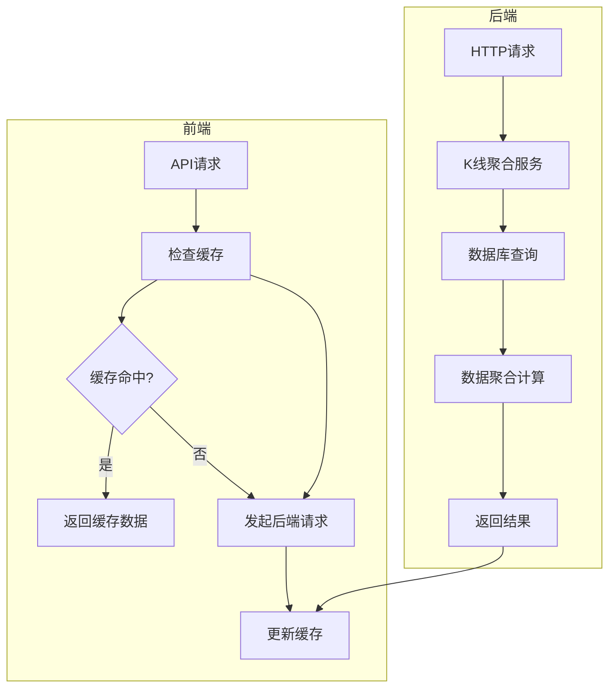
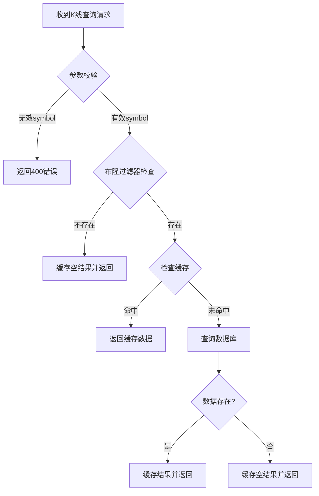
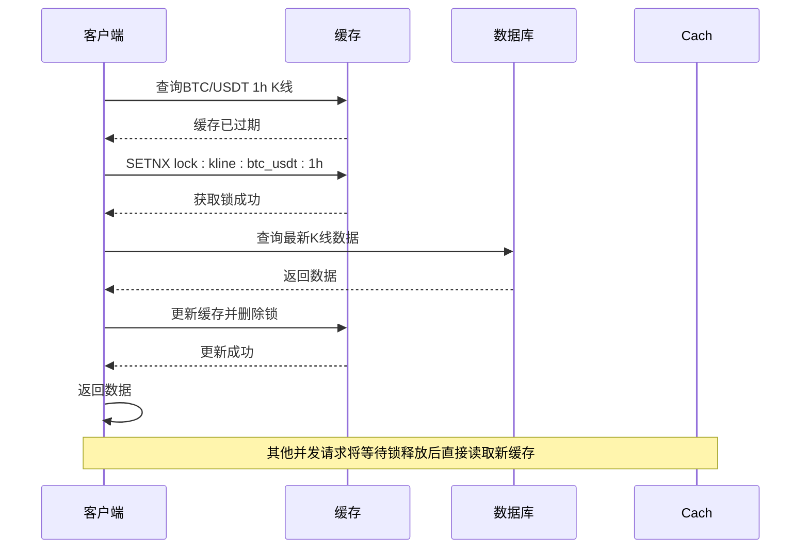

# 缓存问题应对策略

<cite>
**本文档引用的文件**
- [kline_aggregator.py](file://app/services/kline_aggregator.py)
- [cache.py](file://chan.py/Common/cache.py)
- [kline.py](file://app/api/v1/endpoints/kline.py)
- [kline.py](file://app/crud/kline.py)
- [kline.py](file://app/models/kline.py)
</cite>

## 目录
1. [引言](#引言)
2. [项目缓存机制分析](#项目缓存机制分析)
3. [缓存穿透问题与解决方案](#缓存穿透问题与解决方案)
4. [缓存雪崩问题与解决方案](#缓存雪崩问题与解决方案)
5. [缓存击穿问题与解决方案](#缓存击穿问题与解决方案)
6. [K线聚合场景中的缓存策略实现](#k线聚合场景中的缓存策略实现)
7. [总结](#总结)

## 引言
在交易系统中，K线数据是核心的金融数据之一，频繁被查询和聚合计算。为提升系统性能，缓存机制被广泛应用于减少数据库压力和降低响应延迟。然而，缓存系统在高并发场景下可能面临三大经典问题：缓存穿透、缓存雪崩和缓存击穿。本文将结合本项目中的 `kline_aggregator.py` 模块，系统性地分析这三大问题，并提出针对性的解决方案，以保障系统的稳定性和高可用性。

## 项目缓存机制分析
通过对项目代码的分析，发现当前系统中存在多个层次的缓存机制：

1. **前端缓存**：在 `frontend/src/lib/api.js` 中实现了基于 `Map` 的内存缓存，根据不同数据类型设置不同的缓存时长（5分钟、30分钟、30秒）。
2. **后端计算缓存**：在 `chan.py/Common/cache.py` 中定义了 `make_cache` 装饰器，用于缓存类方法的计算结果，避免重复计算。
3. **数据聚合服务**：`app/services/kline_aggregator.py` 负责将1分钟K线数据聚合为不同时间周期（5m、15m、1h等），该过程涉及大量数据读取和计算，是缓存优化的重点场景。



**图示来源**
- [api.js](file://frontend/src/lib/api.js#L219-L263)
- [kline_aggregator.py](file://app/services/kline_aggregator.py#L11-L246)

**本节来源**
- [api.js](file://frontend/src/lib/api.js#L219-L263)
- [cache.py](file://chan.py/Common/cache.py#L0-L33)
- [kline_aggregator.py](file://app/services/kline_aggregator.py#L11-L246)

## 缓存穿透问题与解决方案
### 问题描述
缓存穿透是指查询一个不存在的数据，由于缓存中没有该数据，请求会直接穿透到数据库。在本项目中，可能的场景包括：
- 查询不存在的交易品种（symbol），如 `ltc_usdt`（当前仅支持 `btc_usdt` 和 `eth_usdt`）
- 查询不存在的时间周期（timeframe），如 `2m`（系统仅支持1m、5m、15m等标准周期）

### 解决方案
1. **布隆过滤器预检**：在查询前使用布隆过滤器快速判断symbol和timeframe是否存在，避免无效查询到达数据库。
2. **缓存空结果**：对于确认不存在的查询，将空结果（或特定标记）缓存一段时间（如5分钟），防止相同请求重复穿透。



**图示来源**
- [kline.py](file://app/api/v1/endpoints/kline.py#L15-L30)
- [kline_aggregator.py](file://app/services/kline_aggregator.py#L11-L246)

**本节来源**
- [kline.py](file://app/api/v1/endpoints/kline.py#L15-L30)
- [kline_aggregator.py](file://app/services/kline_aggregator.py#L11-L246)

## 缓存雪崩问题与解决方案
### 问题描述
缓存雪崩是指大量缓存键在同一时间过期，导致瞬间大量请求直接打到数据库，可能造成数据库压力过大甚至崩溃。在K线聚合场景中，如果所有聚合结果的缓存都设置为固定TTL（如30分钟），则可能在整点时刻同时过期。

### 解决方案
采用**随机化TTL**策略：在基础过期时间上增加随机偏移。例如，基础TTL为30分钟，可增加±5分钟的随机偏移，使实际过期时间分布在25-35分钟之间，避免集中过期。

```python
# 伪代码示例
base_ttl = 30 * 60  # 30分钟
random_offset = random.randint(-300, 300)  # ±5分钟
actual_ttl = base_ttl + random_offset
redis.setex(cache_key, actual_ttl, data)
```

**本节来源**
- [kline_aggregator.py](file://app/services/kline_aggregator.py#L11-L246)

## 缓存击穿问题与解决方案
### 问题描述
缓存击穿是指某个热点键（如BTC/USDT的1小时K线）在过期的瞬间，大量并发请求同时到达，导致这些请求全部穿透到数据库，造成瞬时压力。

### 解决方案
1. **互斥锁（Redis SETNX）**：当缓存失效时，只允许一个请求去数据库加载数据，其他请求等待并重用第一个请求的结果。
2. **逻辑过期策略**：缓存中存储数据的同时存储一个逻辑过期时间。当请求发现数据"过期"时，不直接删除，而是启动一个异步任务更新缓存，当前请求仍返回旧数据，保证服务不中断。



**图示来源**
- [kline_aggregator.py](file://app/services/kline_aggregator.py#L11-L246)

**本节来源**
- [kline_aggregator.py](file://app/services/kline_aggregator.py#L11-L246)

## K线聚合场景中的缓存策略实现
结合 `kline_aggregator.py` 中获取最新K线的场景，可实现以下综合缓存策略：

1. **多级缓存架构**：
   - L1：内存缓存（如 `make_cache` 装饰器），用于缓存计算结果，生命周期与对象实例相同。
   - L2：分布式缓存（如Redis），用于跨实例共享缓存数据，设置随机化TTL。

2. **热点数据预热**：在系统启动或低峰期，预先加载常用时间周期（1m、5m、1h）的K线数据到缓存中。

3. **异常降级策略**：当缓存系统不可用时，直接查询数据库，并记录监控日志，避免系统完全瘫痪。

4. **监控与告警**：监控缓存命中率、穿透率、雪崩情况，设置告警阈值。

```python
# 伪代码：增强的KlineAggregator
class EnhancedKlineAggregator(KlineAggregator):
    def aggregate_klines_with_cache(self, db, timeframe, start_time=None, end_time=None, limit=200):
        cache_key = f"kline:{timeframe}:{start_time}:{end_time}:{limit}"
        
        # 1. 检查内存缓存
        if cache_key in self._memoize_cache:
            return self._memoize_cache[cache_key]
            
        # 2. 检查Redis缓存
        cached = redis.get(cache_key)
        if cached:
            return json.loads(cached)
            
        # 3. 处理缓存击穿：使用互斥锁
        lock_key = f"lock:{cache_key}"
        if redis.setnx(lock_key, "1", 30):  # 30秒锁
            try:
                # 4. 执行原始聚合逻辑
                result = super().aggregate_klines(db, timeframe, start_time, end_time, limit)
                
                # 5. 设置随机化TTL的Redis缓存
                base_ttl = 1800  # 30分钟
                random_ttl = base_ttl + random.randint(-300, 300)
                redis.setex(cache_key, random_ttl, json.dumps(result))
                
                # 6. 更新内存缓存
                self._memoize_cache[cache_key] = result
                
                return result
            finally:
                redis.delete(lock_key)
        else:
            # 等待锁释放后重试（简化处理）
            time.sleep(0.1)
            return self.aggregate_klines_with_cache(db, timeframe, start_time, end_time, limit)
```

**本节来源**
- [kline_aggregator.py](file://app/services/kline_aggregator.py#L11-L246)
- [cache.py](file://chan.py/Common/cache.py#L0-L33)

## 总结
针对本项目中的K线数据缓存需求，建议实施以下综合策略：

1. **缓存穿透**：通过布隆过滤器预检和缓存空结果，防止无效查询冲击数据库。
2. **缓存雪崩**：采用随机化TTL策略，避免大量缓存键同时过期。
3. **缓存击穿**：对热点数据使用互斥锁或逻辑过期策略，保护数据库免受瞬时高并发冲击。

通过在 `kline_aggregator.py` 服务中集成这些策略，可以显著提升系统的稳定性和响应性能，特别是在高并发交易场景下，有效保障用户体验和系统可靠性。