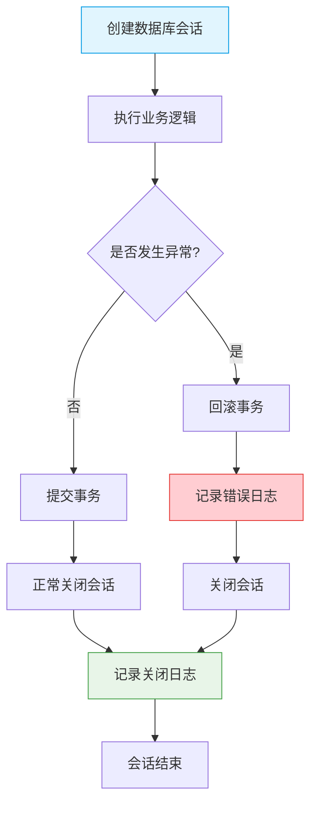

# 资源告警

<cite>
**本文档引用的文件**  
- [performance_recommendations.md](file://performance_recommendations.md)
- [app/db/session.py](file://app/db/session.py#L1-L43)
- [app/core/logger.py](file://app/core/logger.py#L1-L44)
- [app/core/config.py](file://app/core/config.py#L1-L65)
</cite>

## 目录
1. [引言](#引言)
2. [数据库连接池监控与告警](#数据库连接池监控与告警)
3. [系统级资源监控指标](#系统级资源监控指标)
4. [数据库会话状态监控与日志集成](#数据库会话状态监控与日志集成)
5. [系统资源采集工具建议](#系统资源采集工具建议)
6. [自动响应预案](#自动响应预案)
7. [总结](#总结)

## 引言
本文档旨在根据 `performance_recommendations.md` 中的性能优化建议，结合项目中数据库连接池配置和日志系统实现，制定一套完整的资源使用监控与告警机制。重点涵盖数据库连接池使用率、空闲连接不足、连接泄漏等场景的告警规则，并定义系统级资源监控指标，确保交易系统的稳定运行。

## 数据库连接池监控与告警

根据 `performance_recommendations.md` 和 `app/db/session.py` 的配置，当前数据库连接池已优化为：
- 基础连接数（`pool_size`）：10
- 最大溢出连接数（`max_overflow`）：20
- 总最大连接数：30
- 连接回收时间（`pool_recycle`）：3600秒（1小时）
- 连接超时（`pool_timeout`）：30秒

### 告警规则设定

#### 1. 连接池使用率过高告警
当活跃连接数占总连接数（`pool_size + max_overflow`）比例超过80%时触发告警。

```python
# 告警判断逻辑示例（需结合实际监控工具实现）
if (active_connections / 30) > 0.8:
    trigger_alert("数据库连接池使用率超过80%")
```

#### 2. 空闲连接不足告警
当空闲连接数少于3个时，预示可能即将发生连接争用。

```python
# 示例逻辑
if idle_connections < 3:
    trigger_warning("数据库空闲连接不足")
```

#### 3. 连接泄漏检测告警
通过日志分析检测未正确关闭的会话。在 `app/db/session.py` 中，`get_db()` 函数通过 `finally` 块确保会话关闭，若日志中频繁出现 `"Creating new database session"` 而缺少 `"Closing database session"`，则可能存在泄漏。

**Section sources**
- [app/db/session.py](file://app/db/session.py#L35-L43)
- [performance_recommendations.md](file://performance_recommendations.md#L75-L77)

## 系统级资源监控指标

定义以下系统级资源监控指标，确保服务运行环境健康：

| 监控指标 | 阈值 | 告警级别 | 说明 |
|--------|------|---------|------|
| 内存使用率 | >80% | 警告 | 持续高内存使用可能导致OOM |
| 磁盘剩余空间 | <20% | 警告 | 空间不足影响日志写入和数据存储 |
| CPU平均负载 | >系统核心数×1.5 | 警告 | 高负载影响响应性能 |
| 数据库连接池使用率 | >80% | 警告 | 见上文详细说明 |
| 日志错误频率 | >10次/分钟 | 严重 | 表明系统存在持续性问题 |

**Section sources**
- [performance_recommendations.md](file://performance_recommendations.md#L73-L77)
- [app/core/config.py](file://app/core/config.py#L50-L52)

## 数据库会话状态监控与日志集成

### 会话状态监控机制

`app/db/session.py` 中的 `get_db()` 函数提供了会话创建与关闭的日志记录点，结合 `app/core/logger.py` 的日志系统，可实现会话状态监控。



**Diagram sources**
- [app/db/session.py](file://app/db/session.py#L35-L43)
- [app/core/logger.py](file://app/core/logger.py#L30-L35)

### 日志分析策略

- **正常流程**：应成对出现 `"Creating new database session"` 和 `"Closing database session"`
- **异常流程**：出现 `"Database session error"` 后应有 `"Closing database session"`
- **泄漏迹象**：大量创建日志但关闭日志不成比例

可通过日志聚合系统（如ELK）设置监控规则，自动检测异常模式。

**Section sources**
- [app/db/session.py](file://app/db/session.py#L35-L43)
- [app/core/logger.py](file://app/core/logger.py#L1-L44)

## 系统资源采集工具建议

建议集成 `psutil` 库进行系统资源采集，如 `performance_recommendations.md` 所建议。

### psutil集成示例

```python
import psutil

def collect_system_metrics():
    return {
        "memory_usage": psutil.virtual_memory().percent,
        "disk_usage": psutil.disk_usage('/').percent,
        "cpu_usage": psutil.cpu_percent(interval=1),
        "process_count": len(psutil.pids())
    }
```

该采集函数可作为健康检查端点的一部分，或通过Prometheus暴露为监控指标。

**Section sources**
- [performance_recommendations.md](file://performance_recommendations.md#L105-L107)
- [app/core/logger.py](file://app/core/logger.py#L1-L44)

## 自动响应预案

### 自动扩容预案

当系统资源持续超过阈值时，可触发自动扩容：
1. 检测到CPU或内存持续高负载
2. 触发容器编排平台（如Kubernetes）增加Pod副本
3. 更新负载均衡配置

### 服务降级预案

当数据库连接池紧张或系统资源不足时，启动服务降级：
1. 限制非核心API调用频率
2. 暂停定时数据获取任务
3. 返回缓存数据而非实时查询
4. 记录降级事件并告警

降级逻辑可通过中间件实现，结合配置中心动态开关。

**Section sources**
- [performance_recommendations.md](file://performance_recommendations.md#L73-L80)
- [app/core/config.py](file://app/core/config.py#L1-L65)

## 总结

本文档基于现有代码和性能建议，建立了完整的资源监控与告警体系。通过监控数据库连接池状态、系统资源使用情况，并结合日志分析，可及时发现潜在风险。建议尽快实施 `psutil` 集成和Prometheus监控，建立自动化告警和响应机制，提升系统的稳定性和可观测性。