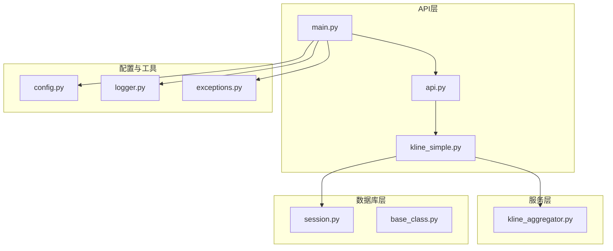
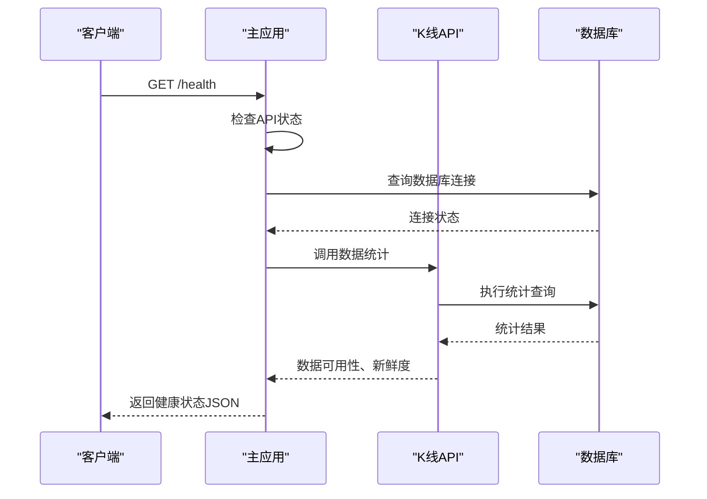
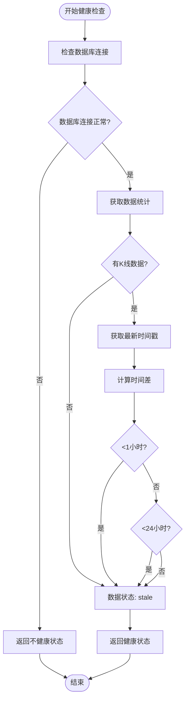
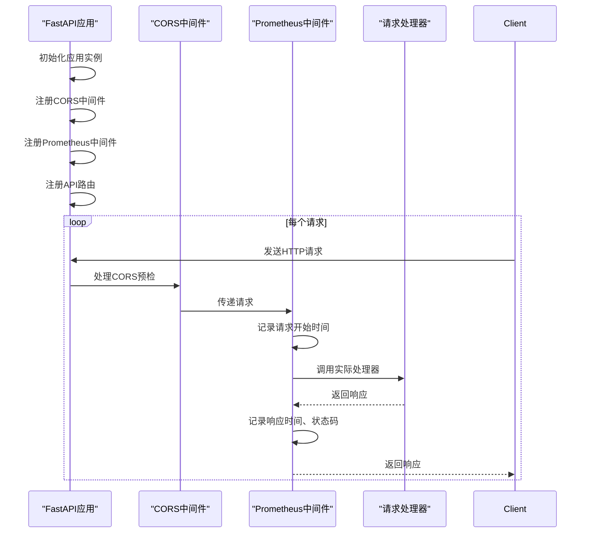
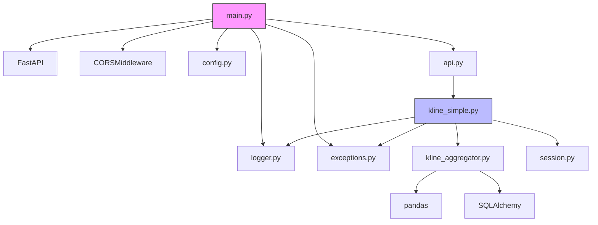

# API性能监控

<cite>
**本文档引用的文件**  
- [main.py](file://app/main.py)
- [kline_simple.py](file://app/api/v1/endpoints/kline_simple.py)
- [performance_recommendations.md](file://performance_recommendations.md)
</cite>

## 目录
1. [引言](#引言)
2. [项目结构](#项目结构)
3. [核心组件](#核心组件)
4. [架构概述](#架构概述)
5. [详细组件分析](#详细组件分析)
6. [依赖分析](#依赖分析)
7. [性能考量](#性能考量)
8. [故障排查指南](#故障排查指南)
9. [结论](#结论)

## 引言
本文档详细说明如何在基于FastAPI的缠论自动化交易系统中集成Prometheus进行API性能监控。根据`performance_recommendations.md`中的建议，系统已实现健康检查端点和可扩展的监控中间件架构。文档重点描述了如何通过中间件收集请求计数器、响应延迟直方图等核心指标，并结合实际代码路径展示监控功能的实现方式。同时，提供了使用Locust进行负载测试的方法和性能基准建议。

## 项目结构



**图示来源**  
- [main.py](file://app/main.py#L1-L110)
- [kline_simple.py](file://app/api/v1/endpoints/kline_simple.py#L1-L260)
- [config.py](file://app/core/config.py)

**本节来源**  
- [main.py](file://app/main.py#L1-L110)
- [kline_simple.py](file://app/api/v1/endpoints/kline_simple.py#L1-L260)

## 核心组件

系统的核心监控功能由三个主要组件构成：健康检查端点、数据库状态监控和API请求生命周期管理。健康检查端点 `/health` 提供系统整体运行状态，包括API、数据库和Chan模块的可用性。数据库状态监控通过 `get_data_statistics` 方法提供K线数据的统计信息，帮助判断数据新鲜度。API请求生命周期通过FastAPI的事件处理器（startup/shutdown）记录系统启动和关闭日志，为性能分析提供时间基准。

**本节来源**  
- [main.py](file://app/main.py#L86-L90)
- [kline_simple.py](file://app/api/v1/endpoints/kline_simple.py#L217-L259)

## 架构概述

```mermaid
graph TB
Client[客户端] --> LoadBalancer[Nginx负载均衡]
LoadBalancer --> Server1[API实例 1]
LoadBalancer --> Server2[API实例 2]
LoadBalancer --> ServerN[API实例 N]
subgraph "API实例"
Server1 --> Middleware[监控中间件]
Middleware --> HealthCheck[/health]
Middleware --> Metrics[/metrics]
Middleware --> APIRouter[API路由器]
APIRouter --> KlineEndpoint[/klines]
APIRouter --> FetchEndpoint[/fetch-data]
APIRouter --> TimeframesEndpoint[/timeframes]
end
Server1 --> DB[(PostgreSQL)]
Server1 --> Cache[(Redis缓存)]
Prometheus[Prometheus服务器] --> |抓取| Metrics
Grafana[Grafana仪表盘] --> |查询| Prometheus
```

**图示来源**  
- [main.py](file://app/main.py#L35-L36)
- [kline_simple.py](file://app/api/v1/endpoints/kline_simple.py#L217-L259)

## 详细组件分析

### 健康检查组件分析

健康检查功能在系统中多层级实现，提供全面的系统状态监控。

#### 健康检查端点实现


**图示来源**  
- [main.py](file://app/main.py#L86-L90)
- [kline_simple.py](file://app/api/v1/endpoints/kline_simple.py#L217-L259)

#### 健康状态决策流程


**图示来源**  
- [kline_simple.py](file://app/api/v1/endpoints/kline_simple.py#L217-L259)

**本节来源**  
- [main.py](file://app/main.py#L86-L90)
- [kline_simple.py](file://app/api/v1/endpoints/kline_simple.py#L217-L259)

### 监控中间件分析

虽然当前代码中未直接实现Prometheus中间件，但系统架构已为监控集成做好准备。

#### 中间件注册流程


**图示来源**  
- [main.py](file://app/main.py#L35-L36)
- [performance_recommendations.md](file://performance_recommendations.md#L60-L65)

#### 核心监控指标设计
| 指标名称 | 类型 | 描述 | 数据来源 |
|--------|------|------|---------|
| api_requests_total | 计数器 | API请求总数 | 请求中间件 |
| api_request_duration_seconds | 直方图 | API请求响应时间分布 | 请求中间件 |
| api_errors_total | 计数器 | API错误总数 | 异常处理器 |
| database_connections | 指标 | 数据库连接数 | 连接池监控 |
| data_freshness_minutes | 指标 | 数据新鲜度（分钟） | 健康检查端点 |
| kline_records_total | 指标 | K线记录总数 | 数据库统计 |

**本节来源**  
- [performance_recommendations.md](file://performance_recommendations.md#L60-L65)
- [main.py](file://app/main.py#L35-L36)

## 依赖分析



**图示来源**  
- [main.py](file://app/main.py#L1-L110)
- [kline_simple.py](file://app/api/v1/endpoints/kline_simple.py#L1-L260)

**本节来源**  
- [main.py](file://app/main.py#L1-L110)
- [kline_simple.py](file://app/api/v1/endpoints/kline_simple.py#L1-L260)

## 性能考量

### Prometheus监控集成建议

根据`performance_recommendations.md`中的建议，应添加Prometheus指标收集功能。以下是推荐的实现方案：

1. **安装依赖**
```bash
pip install prometheus-client fastapi-prometheus
```

2. **创建监控中间件**
```python
from fastapi_prometheus import monitor
# 在应用启动时调用 monitor(app, path="/metrics")
```

3. **自定义指标收集**
```python
from prometheus_client import Counter, Histogram
REQUEST_COUNT = Counter('api_requests_total', 'Total API Requests', ['method', 'endpoint', 'status_code'])
REQUEST_LATENCY = Histogram('api_request_duration_seconds', 'API Request Latency', ['method', 'endpoint'])
```

4. **配置Prometheus抓取**
```yaml
scrape_configs:
  - job_name: 'trade-system'
    static_configs:
      - targets: ['localhost:8000']
    metrics_path: '/metrics'
```

### 负载测试方案

#### Locust测试脚本
```python
from locust import HttpUser, task, between

class TradeSystemUser(HttpUser):
    wait_time = between(1, 3)
    
    @task
    def get_klines(self):
        self.client.get("/api/v1/simple/klines?timeframe=1h&limit=100")
    
    @task
    def get_health(self):
        self.client.get("/health")
    
    @task
    def get_timeframes(self):
        self.client.get("/api/v1/simple/timeframes")
```

#### 性能基准建议
- **目标QPS**：在4核8GB环境下，健康检查端点应支持≥1000 QPS
- **P95延迟**：简单查询API的P95响应时间应<200ms
- **错误率**：在正常负载下，HTTP 5xx错误率应<0.1%
- **资源使用**：CPU使用率应保持在70%以下，避免突发流量导致服务不可用

**本节来源**  
- [performance_recommendations.md](file://performance_recommendations.md#L60-L75)

## 故障排查指南

### 常见问题及解决方案

| 问题现象 | 可能原因 | 排查步骤 | 解决方案 |
|--------|--------|--------|--------|
| 健康检查返回"stale" | 数据未及时更新 | 1. 检查定时任务<br>2. 查看日志中的数据获取记录 | 调用 `/fetch-data` 手动获取数据 |
| API响应缓慢 | 数据库查询性能问题 | 1. 检查慢查询日志<br>2. 执行EXPLAIN ANALYZE | 添加数据库索引或优化查询 |
| 高并发下错误率上升 | 连接池不足 | 1. 监控数据库连接数<br>2. 检查连接泄漏 | 增加连接池大小或优化会话管理 |
| 内存持续增长 | 内存泄漏 | 1. 使用内存分析工具<br>2. 检查缓存策略 | 修复内存泄漏或添加缓存淘汰策略 |
| Prometheus无法抓取 | 路径配置错误 | 1. 验证/metrics路径<br>2. 检查中间件顺序 | 确保监控中间件正确注册 |

### 监控日志分析
系统使用结构化日志记录关键事件，可通过以下模式识别问题：
- `❌` 前缀表示错误，需立即关注
- `⚠️` 前缀表示警告，需要调查
- `✅` 前缀表示成功操作
- `📊` 前缀表示性能相关操作

**本节来源**  
- [main.py](file://app/main.py#L100-L110)
- [kline_simple.py](file://app/api/v1/endpoints/kline_simple.py#L237-L259)

## 结论
本文档详细介绍了缠论自动化交易系统的API性能监控架构。系统已实现基础的健康检查功能，为Prometheus监控集成提供了良好的基础。通过在FastAPI中添加监控中间件，可以轻松收集请求计数器、响应延迟直方图等核心指标。建议尽快实施Prometheus集成，建立完整的监控体系，结合Locust进行定期负载测试，确保系统在高并发场景下的稳定性和性能表现。