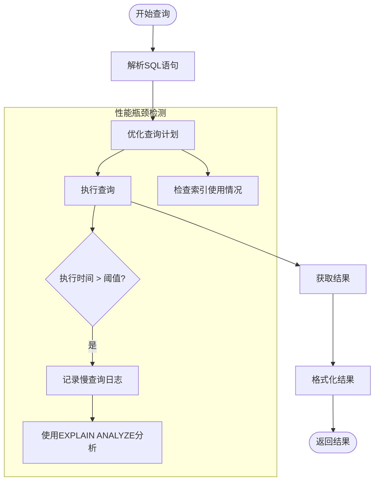
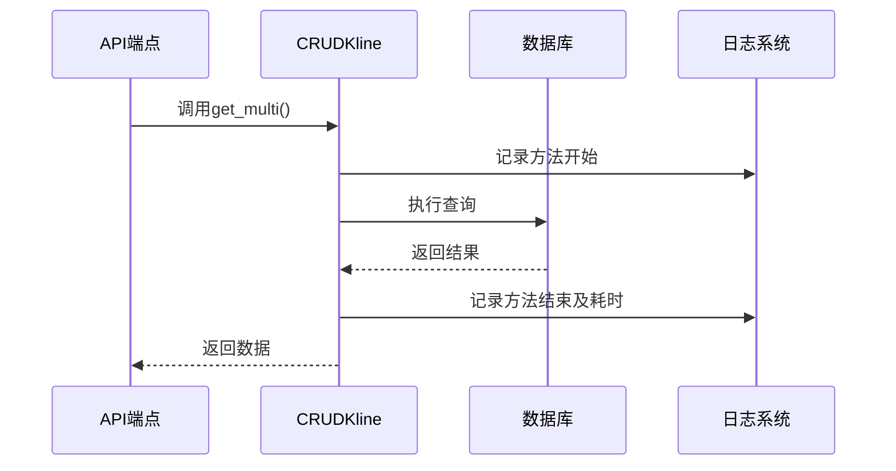

# 数据库性能监控

<cite>
**本文档引用的文件**  
- [performance_recommendations.md](file://performance_recommendations.md)
- [app/db/session.py](file://app/db/session.py)
- [app/crud/kline.py](file://app/crud/kline.py)
- [database_optimization.sql](file://database_optimization.sql)
</cite>

## 目录
1. [引言](#引言)
2. [数据库连接池监控](#数据库连接池监控)
3. [SQL查询性能分析](#sql查询性能分析)
4. [CRUD操作中的查询耗时监控](#crud操作中的查询耗时监控)
5. [数据库性能告警阈值建议](#数据库性能告警阈值建议)
6. [连接池监控代码示例](#连接池监控代码示例)
7. [结论](#结论)

## 引言
本文档旨在为交易系统中的数据库性能监控提供全面指导，重点关注数据库连接池状态和查询性能的监控。基于 `performance_recommendations.md` 中的优化建议，结合 `app/db/session.py` 的会话管理机制和 `app/crud/kline.py` 的数据访问模式，详细说明如何实现高效的数据库性能监控体系。文档涵盖连接池监控、慢查询分析、CRUD操作耗时追踪以及告警机制设置，帮助开发团队及时发现并解决数据库性能瓶颈。

## 数据库连接池监控

数据库连接池是系统性能的关键组件。通过监控连接池的使用情况，可以有效预防连接泄漏和资源耗尽问题。根据 `performance_recommendations.md` 的建议，当前系统已对连接池进行了优化配置：

- 连接池大小：10
- 最大溢出连接数：20
- 连接回收时间：1小时
- 连接超时时间：30秒

这些配置在 `app/db/session.py` 文件中通过 SQLAlchemy 的 `create_engine` 函数实现。通过 `pool_pre_ping=True` 配置，系统能够自动检测连接的有效性，确保从连接池获取的连接始终可用。

监控连接池的关键指标包括：
- **总连接数**：当前数据库引擎管理的连接总数
- **空闲连接数**：当前未被使用的连接数量
- **活跃连接数**：正在被使用的连接数量
- **等待连接数**：因连接池耗尽而等待新连接的请求数量

检测连接泄漏的方法包括定期检查连接数趋势，若发现连接数持续增长而不释放，则可能存在连接未正确关闭的情况。此外，通过日志记录（`db_logger`）可以跟踪每个会话的创建和关闭，辅助定位泄漏点。

**Section sources**
- [performance_recommendations.md](file://performance_recommendations.md#L20-L25)
- [app/db/session.py](file://app/db/session.py#L1-L43)

## SQL查询性能分析

SQL查询性能直接影响系统的响应速度和用户体验。使用 `EXPLAIN ANALYZE` 是优化慢查询的有效方法。该命令不仅显示查询执行计划，还实际执行查询并报告各阶段的耗时。

在本系统中，`database_optimization.sql` 文件提供了关键索引的创建建议，以提升查询性能：
- `idx_btc_usdt_open_time`：基于 `open_time` 的降序索引，优化时间范围查询
- `idx_btc_usdt_timestamp`：基于时间戳的索引，加速精确时间点查询
- `idx_btc_usdt_time_range`：复合索引，优化开收盘时间范围查询

对于复杂的聚合查询，如 `app/crud/kline.py` 中的 `get_kline_data` 方法，使用原生 SQL 配合 TimescaleDB 的 `time_bucket` 函数进行时间序列聚合，显著提升了大数据量下的查询效率。



**Diagram sources**
- [database_optimization.sql](file://database_optimization.sql#L3-L12)
- [app/crud/kline.py](file://app/crud/kline.py#L177-L203)

**Section sources**
- [database_optimization.sql](file://database_optimization.sql#L0-L37)
- [app/crud/kline.py](file://app/crud/kline.py#L177-L203)

## CRUD操作中的查询耗时监控

在 `app/crud/kline.py` 中，CRUD 操作已集成详细的日志记录，可用于监控查询耗时。通过对关键方法添加性能计时，可以精确追踪每个操作的执行时间。

例如，在 `get_multi` 方法中，通过 `app_logger.debug` 记录了查询的起始和结束信息，结合日志时间戳可以计算出实际耗时。对于批量操作如 `bulk_create`，监控其性能尤为重要，因为这类操作可能涉及大量数据处理。

实现查询耗时监控的具体方案包括：
1. 在方法入口记录开始时间
2. 在方法出口记录结束时间并计算差值
3. 将耗时信息写入应用日志或监控系统
4. 设置耗时阈值，超过阈值时触发告警

这种细粒度的监控有助于识别性能瓶颈，特别是在高并发场景下。



**Diagram sources**
- [app/crud/kline.py](file://app/crud/kline.py#L78-L107)

**Section sources**
- [app/crud/kline.py](file://app/crud/kline.py#L78-L107)

## 数据库性能告警阈值建议

为确保系统稳定运行，建议设置以下数据库性能告警阈值：

| 指标 | 告警阈值 | 严重阈值 | 建议操作 |
|------|----------|----------|----------|
| 连接池使用率 | 70% | 90% | 检查连接泄漏，考虑扩容 |
| 查询响应时间 | 500ms | 1s | 分析慢查询，优化索引 |
| 慢查询数量/分钟 | 5次 | 10次 | 立即分析查询计划 |
| 数据库CPU使用率 | 70% | 85% | 检查查询负载 |
| 数据库内存使用率 | 80% | 90% | 优化配置参数 |

这些阈值应结合 `performance_recommendations.md` 中建议的 Prometheus 指标收集系统实现。通过健康检查端点（如 `kline_simple.py` 中的实现），可以定期检测数据库状态并触发告警。

**Section sources**
- [performance_recommendations.md](file://performance_recommendations.md#L58-L60)
- [app/api/v1/endpoints/kline_simple.py](file://app/api/v1/endpoints/kline_simple.py#L237-L259)

## 连接池监控代码示例

以下代码示例展示了如何扩展现有的数据库会话管理以支持连接池监控：

```python
from sqlalchemy import event
from app.core.logger import db_logger

@event.listens_for(engine, "connect")
def connect(dbapi_connection, connection_record):
    db_logger.info(f"新连接建立: {dbapi_connection}")

@event.listens_for(engine, "close")
def close(dbapi_connection, connection_record):
    db_logger.info(f"连接关闭: {dbapi_connection}")

@event.listens_for(engine, "checkout")
def checkout(dbapi_connection, connection_record, checkout_record):
    if checkout_record.attempt_number > 1:
        db_logger.warning(f"连接获取重试: {checkout_record.attempt_number}")

# 获取连接池状态
def get_pool_status():
    pool = engine.pool
    return {
        "checked_out": pool.checkedout(),  # 活跃连接数
        "checked_in": pool.checkedin(),    # 空闲连接数
        "overflow": pool.overflow(),       # 溢出连接数
        "size": pool.size()                # 总连接数
    }
```

此代码通过 SQLAlchemy 的事件监听机制，监控连接的生命周期，并提供获取连接池状态的函数，便于集成到监控系统中。

**Section sources**
- [app/db/session.py](file://app/db/session.py#L1-L43)

## 结论

本文档详细阐述了交易系统中数据库性能监控的关键方面。通过实施连接池状态监控、SQL查询性能分析、CRUD操作耗时追踪和合理的告警机制，可以有效保障数据库的稳定性和性能。建议结合 Prometheus 等监控工具，将这些监控指标可视化，实现主动式性能管理。持续的性能优化是系统稳定运行的基础，应作为日常运维的重要组成部分。