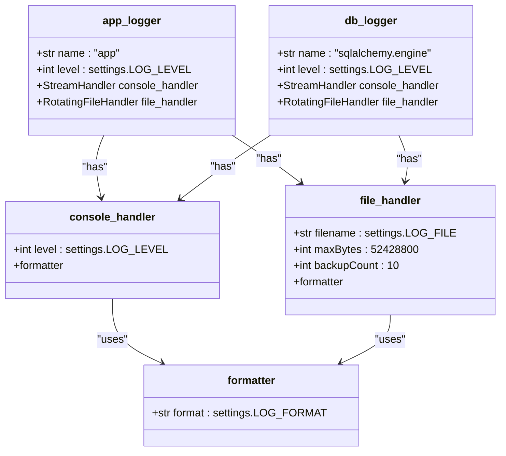
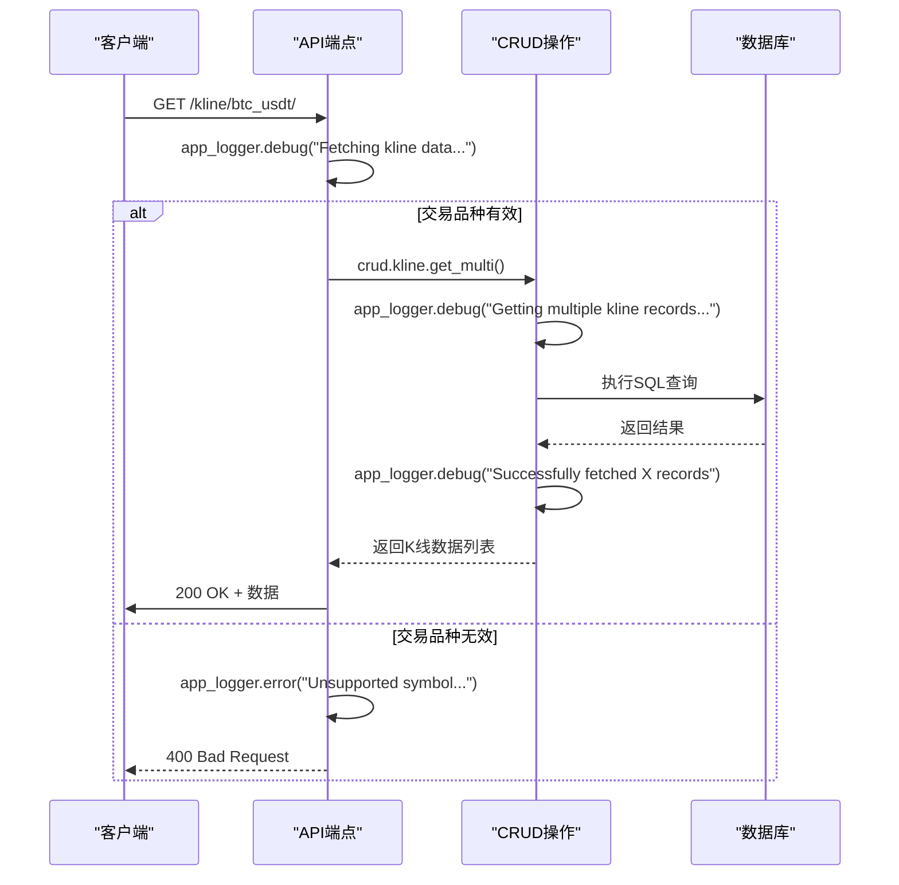

# 日志使用规范

<cite>
**本文档引用的文件**  
- [kline.py](file://app/api/v1/endpoints/kline.py)
- [logger.py](file://app/core/logger.py)
- [kline.py](file://app/crud/kline.py)
- [session.py](file://app/db/session.py)
- [config.py](file://app/core/config.py)
</cite>

## 目录
1. [引言](#引言)
2. [日志记录器配置](#日志记录器配置)
3. [日志级别应用规范](#日志级别应用规范)
4. [业务场景日志记录实践](#业务场景日志记录实践)
5. [异常处理与堆栈跟踪](#异常处理与堆栈跟踪)
6. [数据库操作日志监控](#数据库操作日志监控)
7. [敏感信息过滤与日志脱敏](#敏感信息过滤与日志脱敏)

## 引言
本文档基于 `app/api/v1/endpoints/kline.py` 中的实际用例，制定统一的日志使用规范。旨在指导开发人员在不同业务场景下如何正确使用 `app_logger` 记录调试信息、操作日志和错误信息，确保系统日志的一致性、可读性和安全性。

**Section sources**
- [kline.py](file://app/api/v1/endpoints/kline.py#L1-L194)

## 日志记录器配置
系统中定义了两个主要的日志记录器：`app_logger` 用于应用级别的日志记录，`db_logger` 用于数据库操作的监控。这两个记录器均配置了控制台和文件两种处理器，并采用轮转文件机制（`RotatingFileHandler`），单个日志文件最大为50MB，最多保留10个备份。

日志格式由 `LOG_FORMAT` 配置项统一定义，包含时间戳、记录器名称、日志级别和消息内容。日志级别由 `LOG_LEVEL` 配置项控制，默认为 `DEBUG`。



**Diagram sources**
- [logger.py](file://app/core/logger.py#L1-L44)
- [config.py](file://app/core/config.py#L35-L65)

**Section sources**
- [logger.py](file://app/core/logger.py#L1-L44)
- [config.py](file://app/core/config.py#L35-L65)

## 日志级别应用规范
日志级别是区分日志信息重要性的关键。本系统遵循标准的日志级别，其应用场景如下：

- **DEBUG**：用于记录详细的调试信息，仅在开发和问题排查阶段启用。例如，记录函数的入口参数、数据库查询的构建过程等。
- **INFO**：用于记录程序的正常运行状态和关键业务操作。例如，成功获取聚合K线数据、创建新的数据库会话等。
- **WARNING**：用于记录潜在的问题或非关键性错误，这些情况不会导致程序中断，但需要关注。例如，请求的资源未找到。
- **ERROR**：用于记录导致功能失败的错误。必须包含足够的上下文信息以便于排查。例如，数据库查询失败、外部API调用异常等。

**Section sources**
- [logger.py](file://app/core/logger.py#L1-L44)
- [kline.py](file://app/api/v1/endpoints/kline.py#L31-L93)

## 业务场景日志记录实践
在 `kline.py` 的端点实现中，展示了如何在不同业务场景下使用日志。

### 获取K线数据
在 `read_kline` 等端点中，使用 `DEBUG` 级别记录请求的详细参数（如交易品种、分页信息），并在成功获取数据后记录返回的记录数量。这有助于追踪每个请求的处理过程。

### 参数验证
当接收到不支持的交易品种时，使用 `ERROR` 级别记录该事件，并抛出自定义的 `InvalidParameterException`。这能快速定位非法输入。

### 资源未找到
当根据ID或时间戳查询不到K线数据时，使用 `WARNING` 级别进行记录。这表明请求本身是合法的，但目标资源不存在，属于正常业务逻辑的一部分。

### 操作成功记录
对于关键的成功操作，如成功创建数据库会话，使用 `INFO` 级别进行记录。这有助于监控系统的整体健康状况和关键流程的执行情况。



**Diagram sources**
- [kline.py](file://app/api/v1/endpoints/kline.py#L31-L36)
- [kline.py](file://app/crud/kline.py#L70-L100)

**Section sources**
- [kline.py](file://app/api/v1/endpoints/kline.py#L31-L93)
- [kline.py](file://app/crud/kline.py#L70-L120)

## 异常处理与堆栈跟踪
在异常处理中，正确使用 `exc_info=True` 参数是捕获完整堆栈跟踪的最佳实践。这能提供从异常抛出点到捕获点的完整调用栈，极大地方便了问题的根因分析。

在 `kline.py` 的 `get_btc_usdt_klines` 等端点中，当捕获到 `Exception` 时，使用 `app_logger.error()` 并设置 `exc_info=True`。这确保了即使在最外层的异常处理器中，也能看到原始的错误堆栈，而不仅仅是错误消息。

```mermaid
flowchart TD
Start([开始处理请求]) --> Try["try:\n 执行业务逻辑"]
Try --> Success["成功:\n 返回结果"]
Try --> Exception["except Exception as e:"]
Exception --> LogError["app_logger.error(\n f\"Error message: {str(e)}\",\n exc_info=True\n)"]
LogError --> ReRaise["raise HTTPException(...)"]
Success --> End([请求处理完成])
ReRaise --> End
```

**Diagram sources**
- [kline.py](file://app/api/v1/endpoints/kline.py#L120-L190)

**Section sources**
- [kline.py](file://app/api/v1/endpoints/kline.py#L120-L190)

## 数据库操作日志监控
`db_logger` 是一个专门用于监控SQLAlchemy引擎的记录器。它通过监听数据库会话的生命周期，在创建和关闭会话时分别记录 `DEBUG` 级别的日志。

在 `session.py` 的 `get_db()` 生成器函数中，`db_logger.debug()` 被用来标记数据库会话的创建和关闭。这使得可以精确地追踪每个数据库连接的生命周期，对于排查连接泄漏或性能瓶颈至关重要。

此外，通过配置 `echo=settings.DEBUG`，可以在调试模式下将所有执行的SQL语句输出到日志中，这对于开发阶段的SQL优化非常有帮助。

**Section sources**
- [session.py](file://app/db/session.py#L35-L43)
- [logger.py](file://app/core/logger.py#L40-L44)

## 敏感信息过滤与日志脱敏
日志安全是系统安全的重要组成部分。必须严格防止敏感信息（如用户密码、API密钥、个人身份信息）被记录到日志文件中。

虽然当前代码示例中未直接涉及敏感信息，但规范要求：
1.  **避免直接记录请求体**：特别是包含用户凭证的POST请求。
2.  **对结构化日志进行脱敏**：如果必须记录数据对象，应先对敏感字段进行掩码处理（如 `***`）。
3.  **使用专门的日志字段**：如 `app_logger.info()` 可以接受字典，将元数据与消息分离，便于后续的自动化处理和过滤。

**Section sources**
- [kline.py](file://app/api/v1/endpoints/kline.py#L31-L190)
- [test_kline_query.py](file://app/scripts/test_kline_query.py#L41-L69)